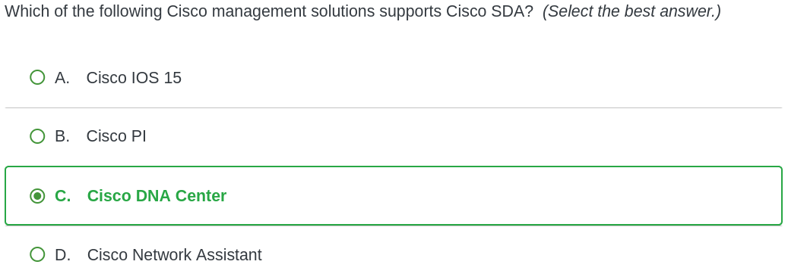

### Question 1

- The answer is A because standard ACLs have a number range of 1-99, or 1300-1999 as stated in [day 34](../Day%2034%20-%20Standard%20ACLs.md#^979b85), wheras extended ACLs have a range of 100-199 or 2000-2699
### Question 2

- D is the correct answer because the `ip arp inspection trust` command was never issued
- By default, a port becomes untrusted when DAI is enabled
### Question 4

- C is correct: RouterA forwards DHCP packets for NetworkA devices
- `ip helper-address` should point to the DHCP server’s IP (not the router, unless it's also the DHCP server)
- Multiple `ip helper-address` commands can be used for multiple DHCP servers
	- This also applies to networks using separate servers for DHCP, DNS, and TFTP
- Command should be configured on Fa0/0 to forward UDP broadcasts to NetworkB
### Question 5

- A is correct: In **transport mode**, IPSec encrypts only the IP packet's payload
- The original IP header remains unchanged
- **Tunnel mode** encrypts both header and payload
- Transport mode isn’t required for NAT traversal and is less NAT-compatible than tunnel mode
- Tunnel mode adds extra headers due to full packet encryption
### Question 6

- The CAM table is AKA the MAC address table, which records source MAC addresses
### Question 9

- HostA's subnet mask is /27 (27 network bits, 5 host bits)
- Subnet allows 2⁵ = 32 addresses
- Network divided into eight /27 subnets:
    - 10.10.2.0/27
    - 10.10.2.32/27
    - 10.10.2.64/27
    - 10.10.2.96/27
    - 10.10.2.128/27
    - 10.10.2.160/27
    - 10.10.2.192/27
    - 10.10.2.224/27
- HostA (10.10.2.101) is in the 10.10.2.96/27 subnet
- Default gateway (10.10.2.1) is outside HostA's subnet
- Using a broader subnet mask (e.g., /24 or /25) would enable HostA to reach devices beyond RouterA, including internet access
### Question 11

- A is correct: Layer 3 devices block broadcast traffic, creating separate broadcast domains
- This helps reduce broadcast storms, especially in large Layer 2 WANs during instability
- Adding more Layer 2 devices expands the broadcast domain, increasing the risk of broadcast storms
### Question 12

- C is correct: **Cisco DNA Center** supports Cisco Software-Defined Access (SDA)
- SDA builds LANs using policies and automation instead of traditional methods
- DNA Center uses a centralized controller and GUI to simplify network configuration
- Cisco IOS: CLI-based device configuration and management
- Cisco Network Assistant: Older desktop GUI tool for LAN management (pre-SDA)
- Cisco Prime Infrastructure: Browser-based GUI for traditional enterprise network management
### Question 13

- **B & D are correct**: Broadcast and point-to-point network types use a 10s hello timer and 40s dead timer by default
- Nonbroadcast, point-to-multipoint, and point-to-multipoint nonbroadcast types use a 30s hello timer and 120s dead timer
### Question 14

- **B is correct**: The virtual interface on a WLC supports mobility management for wireless clients
- A WLC can have up to four static interfaces:
    - **Management interface**: Used for in-band management
    - **AP-manager interface**: Contains the source IP address used by lightweight APs to communicate with the WLC
    - **Virtual interface**: Supports mobility by using a consistent IP address across multiple controllers when clients roam
    - **Service port interface**: Used for out-of-band maintenance
- **Dynamic interfaces**: User-defined, typically used for wireless client data; function similarly to VLANs
### Question 16

- **A is correct:** The `ntp master` command makes a Cisco router act as an NTP server using its software clock as the authoritative time source
- If NTP wasn't already enabled, this command also allows the router to respond to NTP queries on all active interfaces
- When an NTP device uses its software clock as the time source, it assigns the IP address **127.127.7.1** as both the reference clock and the NTP server address
- By default, a Cisco device using NTP syncs only its **software clock**, not the **hardware clock**
### Question 17

- **B is correct:** The **Frame Control (FC)** field in an 802.11 MAC frame indicates if the frame is a management frame
- The **Duration (DUR)** field is mainly used by control frames to indicate transmission timers
- The **Sequence (SEQ)** field is split into two parts: **fragment number** and **sequence number** of the frame
### Question 18

- **C is correct:** WPA3-Personal uses **Simultaneous Authentication of Equals (SAE)** and supports **Protected Management Frames (PMF)**
- **PMF** secures management frame communication between the access point and the client
- **SAE** allows mutual authentication between clients and access points
### Question 19

- **A & C are correct:** The `switchport access vlan 4` command moves the port to an unused VLAN
	- "No devices operate on VLAN 4"
- The `switchport mode access` command manually sets the port mode
- Neither command disables DTP
- By default, Cisco switch interfaces use DTP to auto-negotiate trunk or access mode
- Use `switchport nonegotiate` on manually configured ports to stop DTP negotiation attempts
- Manually setting trunk or access mode limits DTP, but `switchport nonegotiate` is still recommended
- Manually configured trunk ports will still send DTP frames
### Question 23

- **D is correct:** The network prefix identifies the network subnet that is reachable through the particular routing table entry
- The network prefix can be paired with a network mask, which represents the subnet mask for the associated subnet
- The four octets in the `200.120.45.192` prefix represent the network address of the subnet, which is `200.120.45.192`
- Therefore, the output in the routing table is the network address for the `200.120.45.192/28` network
- The `/28` CIDR notation represents the subnet mask of the network, which is `255.255.255.240`
- In binary:  
    `255.255.255.240` = `11111111.11111111.11111111.11110000`
- With 4 host bits, you get **2⁴ = 16** total IP addresses in this subnet
- Start at the **network address**: `200.120.45.192`
- Add 15 to get the **broadcast address**: `200.120.45.192 + 15 = 200.120.45.207`
    - The first address is reserved for the **network**, and the last is for the **broadcast**
- Therefore, the broadcast address for this network is `200.120.45.207` because it's the last IP in the 16-address block
### Question 24

- **B is correct:** The output shows that Router1 is in the `DROTHER` state
- A router in the `DROTHER` state can only form adjacencies with the **Designated Router (DR)** and **Backup Designated Router (BDR)**
- Router1 isn’t on a point-to-multipoint network, as the segment has a DR and BDR
- DR and BDR elections occur only on **multiaccess networks**, not on point-to-multipoint or point-to-point networks
- The BDR's priority might be above or below 50
- If Router1 starts after the DR and BDR, it can't become DR or BDR until the current ones fail or are powered off
- If Router1 starts simultaneously with the DR and BDR, the BDR must have a priority of at least 50
- If the BDR and Router1 share the same priority, the BDR wins due to a higher router ID (10.0.0.11 vs 10.0.0.4)
- Incorrect timer settings on Router1 would prevent it from establishing adjacencies with the DR and BDR
### Question 25

- **D is correct:** ACL 10 is applied as an **outbound ACL** on interface F0/1, so it's processed for outbound traffic
- Outbound ACLs are checked **after** the router receives and routes the packet to the outbound interface
- RouterA does **not** check ACL 10 when the packet enters F0/0, since ACL 10 isn't applied inbound on that interface
- Inbound ACLs are processed **after receiving** a packet but **before routing** it to the outbound interface
### Question 29

- **E is correct**
- In this scenario, the MAC address 00-33-66-99-BB-EE has an OUI of 00-33-66 and a NIC idetnfier of 99-BB-EE
- To create an EUI-64 interface ID, you split the MAC address in half, add FFFE to the middle, and invert the 7th (U/L) bit
- The hex value 00 in the first 8 bits of the OUI can be represented in binary as 0000 0000
- After inverting, this results in 0000 00**1**0
- When converted back to hex, this becomes 02
- That means the EUI-64 interface ID is now **02**33:66FF:FE99:BBEE
- This is then combined with the IPv6 prefix to create an IPv6 address
- Appending the prefix 2012::99 to this interface ID creates the global unicast IPv6 address of 2012::99:0233:66FF:FE99:BBEE
### Question 32

- **D is correct**
- The `ipv6 traffic-filter` command can be used in interface config mode to apply an ACL to an IPv6 interface
- The syntax for this command is `ipv6 traffic-filter (ipv6-acl) [in | out]`
- The `access-class` command can be used to apply an IPv4 ACL to a vty, AUX, or console line
- For IPv6, the `ipv6 access-class` command can be used
### Question 33

- **Correct answers: C & D**
- `default-information originate` injects a router's default external route into OSPF
- Issuing `default-information originate` or `redistribute (network)` makes the router an ASBR
- ASBR redistributes routes from other routing protocols into OSPF
- Using the command on RouterA makes it RouterB's gateway of last resort
- RouterB becomes RouterC's gateway of last resort via RouterA
- This command does **NOT** advertise all directly connected routes
- Use `redistribute connected` to advertise directly connected routes
- `summary-address (address mask)` summarizes redistributed routes in OSPF
### Question 36

- **B is correct**
- `switchport voice vlan` has four options:
	- *vlan-id*
	- `dot1p`
	- `untagged`
	- `none`
- `dot1p` sends voice traffic with 802.1p priority 5 using VLAN 0; requires VLAN ID but not a unique voice VLAN
- This can be seen below:

- `none` is the default mode; IP phone sends untagged voice and data traffic over the access VLAN

- `switchport voice vlan 10` sends voice traffic over VLAN 10 (a unique VLAN)

- `untagged` sends both voice and data as untagged over the native VLAN
- Both voice and data traffic use a special-case 802.1Q trunk:

### Question 38

- **Correct answers: B & C**
- Default `switchport port-security` settings (if not previously configured):
    - Sticky MAC learning disabled
    - Max 1 MAC address allowed
    - Violation mode set to _Shutdown_
    - Aging time set to 0
    - Static aging disabled
    - Aging type set to _absolute_
- F0/1 allows only 1 MAC address and uses `protect` mode
- Only the first host can access the network
- Traffic from the second host is discarded; port continues working for the first
- Port security supports both static and dynamically-learned MAC addresses by default
### Question 39

- **A is correct**
- EIGRP supports load balancing over equal-cost and unequal-cost paths
- OSPF only supports equal-cost load balancing