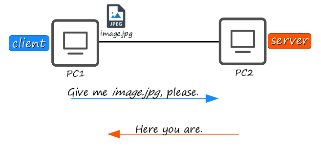

# Network Devices
### What is a network?
- A computer network is a digital communications network which allows nodes to share resources
### Client
- A device that accesses a service made available by a server
### Servers
- A device that provides functions or services for clients
### Servers & Clients

- The same device can be a client in some situations, and a server in other situations
### Switches
- Have many network interfaces/ports for end hosts to connect to (usually 24+)
- Provide connectivity to hosts within the same LAN (Local Area Network)
- Do not provide connectivity between LANs/over the internet
### Routers
- Have fewer network interfaces than switches
- Are used to provide connectivity **between** LANs
# Firewalls
### Firewalls
- Monitor and control network traffic based on configured rules
- Can be placed 'inside' or 'outside' the network
- Are known as NGFWs (Next-Generation Firewalls) when they include more modern and advanced filtering capabilities
### Network Firewalls
- Are hardware devices that filter traffic between networks
### Host-based Firewalls
- Are software applications that filter traffic entering and exiting a host machine, like a PC
