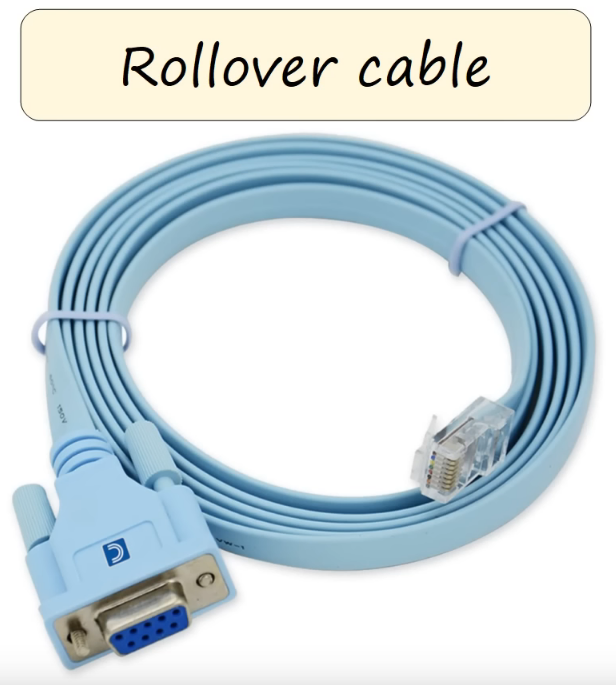

# Intro to the CLI
### What is a CLI?
- Command-line interface
- The interface you use to configure Cisco devices
### How to connect to a Cisco device? (Console port)
- When you first configure a device, you have to connect to the console port
- The following Cisco switch shows two ways of connecting to the console port:

- To connect, you'd use a **Rollover cable** which is essentially an RJ45 to DVI-D adapter, like the following:

- Since DVI-D ports are no longer in use on most modern motherboards, a DVI-D to USB A adapter would need to be used alongside this
- Like a UTP cable, there are 8 pins to be used in a **Rollover cable**
- The pins connect in the following order:

- Once you've connected the computer to the device, you need to use a terminal emulator like **PuTTy** to access the Cisco CLI
- The following image shows how to connect to Cisco's CLI using the **Serial** connection type within PuTTy, as well as the default settings used:

- The default settings worth remembering for the exam are the following:
	- **Speed of 9600 bits per second**
	- **8 data bits**
	- **1 stop bit**
	- **No parity**
	- **No flow control**
- Once connected to the device, the following screen will pop up:

### User EXEC Mode
- When first entering the CLI, you'll be put into the **User EXEC Mode**
- This is indicated by the ">" sign next to the host name of the device
- The default host name for this device is **Router**

- All devices have a host name, and for a Cisco router the default name is **Router**
- User EXEC mode is very limited, as it only allows users to view things but not write any changes
- It's also called **user mode** for short
### Privileged EXEC Mode
- If you enter the `enable` command in user EXEC mode, you will be placed into **privileged EXEC mode**, and then a "#" is displayed instead of a ">" sign next to the host name

- **Privileged EXEC mode** provides complete access to view the device's configuration, restart the device, etc.
- You cannot change the configuration just yet, but you can change the time on the device, save the configuration file, etc.
- Here's a comparison of the commands available in **User EXEC Mode vs Privileged EXEC Mode**:

- These screenshots have been captured using **Cisco's Packet Tracer Software** and may not actually display all the available commands that would show on a physical Cisco device, but it's good enough to get the point across
- As noted in the screenshots, you can use a "?" symbol to view the available commands that you currently have access to
- In Cisco CLI, you can save time entering complete commands by using `Tab` to complete the command
- However, you can save even more time by just typing the beginning of the command and pressing `Enter` as shown here:

- This only works because `enable` is the only command beginning with `en`
- Trying to only type `e` by itself would not work as there are other commands beginning with `e` such as `erase` or `exit`
- An easy way to view all commands beginning with a specific letter would be to type the letter followed by the "?" sign, so typing in `e?` would display all available commands beginning with `e`
### Global Configuration Mode
- In order to enter this mode, we would enter the command `configure terminal` in the CLI
- When in this mode, config is inserted after the hostname: `Router(config)#`
- Like before, you don't have to type in the whole word and can get away with using something like `conf t` instead
### Enable Password
- We can protect **User EXEC Mode** with a password so that when the `enable` command is entered, the user would be forced to enter the password before getting any further
- This is done with the command `enable password` when inside **Global Configuration Mode**
- Another good trick to remember is that while using "?" next to a command will give us all possible commands containing that word or letter, including a space in between will give us all possible options for that command
- So something like `password ?` will give us all possible options for the `password` command, as shown here:

- It's also worth mentioning that passwords **ARE** case-sensitive within Cisco CLI, so trying to use `ccna` the login wouldn't work in this case since `CCNA` was set
- The password also does **NOT** display as you type it, and would instead appear blank in the CLI even though your input is going through like normal
- If you enter the wrong password 3 times, you'll be denied access for having `bad secrets`

### Running-Config/Startup-Config
- There are two separate config files on the device at once
- **Running-config** = the current, active configuration file on the device
- As you enter commands in the CLI, you edit the active configuration
- **Startup-config** = the configuration file that will be loaded upon restart of the device
- When in **Global Configuration Mode**, entering the `show running-config` command will view the running config file
- The same can be done for the startup-config using `show startup-config`
- Unless a startup-config file has been saved, this won't display anything as we're only using the default-config file
- To create a new startup-config, there are three ways of doing so:
	- Enter the `write` command from **privileged EXEC mode**
	- `write memory` performs the same function
	- `copy running-config startup-config` will just copy all the current config files into the startup-config file, essentially performing the same function as the previous two commands
- If we now use `show startup-config`, it'll display the same information as the `show running-config` command
- By default, viewing the config file will display our password in plaintext
- This can be beefed up
### Service Password-Encryption
- When in **global configuration mode**, we use the command `service password-encryption` to encrypt all passwords in a mix of numbers and letters so that they cannot be easily read
- Entering `show running-config` will now show the encrypted password instead of the real thing, thus providing more security and preventing unwanted access to our config files

- The number 7 before our encrypted password indicates the type of encryption used on our plaintext password
- `7` represents Cisco's proprietary encryption algorithm
- While this is a step in the right direction, it still isn't very secure as type 7 cisco password crackers are readily available on the Internet
### Enable Secret
- The more secure method is to use the `enable secret` command instead of the `enable password` one

- The running config can be viewed once more using `do sh run`, with the `do` command providing a way to execute privileged exec commands in other configuration levels
- Now our config file will display the password using the new type 5 encryption method, with `5` representing `MD5` encryption
- If `enable password` was already used before entering `enable secret`, it won't be deleted from the config file but will simply be ignored to take advantage of the stronger encryption method
- Finally, the `service password-encryption` command has **NO** effect on the `enable secret` command
- The `enable secret` is always encrypted, whether or not `service password-encryption` is entered
- `enable secret` should always be used by default, rather than `enable password`
### Canceling Commands
- In order to cancel/delete a command that was already entered, we would enter it again but this time type in `no` at the beginning of the command
- For example, typing `no` in front of the `service password-encryption` command, future passwords will no longer be encrypted
- However, it's important to remember that passwords that are already encrypted will **NOT** be decrypted by disabling `service password-encryption`
- Any new passwords will be entered in plaintext
### Service Password-Encryption Summary
- If you enable `service password-encryption`:
	- Current passwords **will** be encrypted
	- Future passwords **will** be encrypted
	- The `enable secret` command will not be effected
- If you disable `service password-encryption`:
	- Current passwords **will NOT** be decrypted
	- Future passwords **will NOT** be encrypted
	- The `enable secret` command will not be effected
### Modes Review

### Command Review

