# Ethernet LAN Switching (Part 1)
### OSI Model - Physical Layer
- Defines physical characteristics of the medium used to transfer data between devices
- For example, voltage levels, maximum transmission distances, physical connectors, cable specs, etc.
- Digital bits are converted into electrical signals (for wired connections) or radio signals (for wireless connections)
- All the information in the [Day 02 - Interfaces & Cables](Day%2002%20-%20Interfaces%20&%20Cables.md)) lecture is related to the Physical Layer
### Data Link Layer
- Provides node-to-node connectivity and data transfer (PC to switch, switch to router, etc.)
- Defines how data is formatted for transmission over a physical medium (copper UTP cables)
- Detects and (possibly) correctly Physical Layer errors
- Uses Layer 2 addressing (MAC address), separate form Layer 3 addressing (IP address)
- Switches operate at Layer 2
### Local Area Networks (LANs)
- A network contained in a relatively small area
- Routers are used to connect separate LANs, as noted in the following diagram:
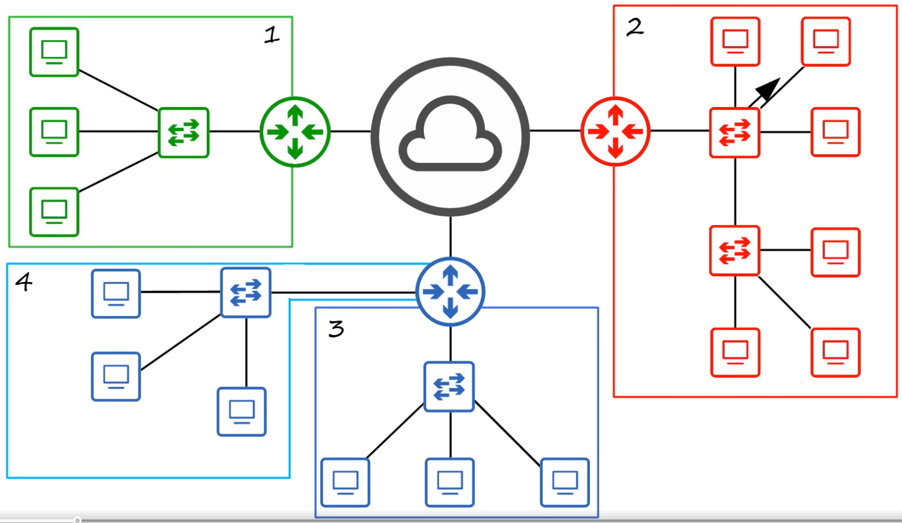
- Switches don't separate LANs, but adding more switches can be used to expand an existing LAN
- This means that, despite containing two switches, the red devices are all a part of one large LAN
- The blue devices are the same ones used in the red LAN, but instead of the switches being connected to each other, they're connected to different router interfaces
- That's why they're considered as being two separate LANs
### PDUs
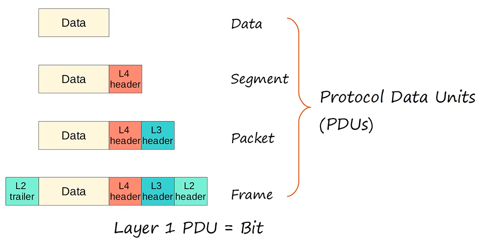
- This lesson will go over how switches receive and forward frames, specifically **Ethernet frames**, since it's the Layer 2 protocol used in virtually all LANs in existence today
### Ethernet Frame
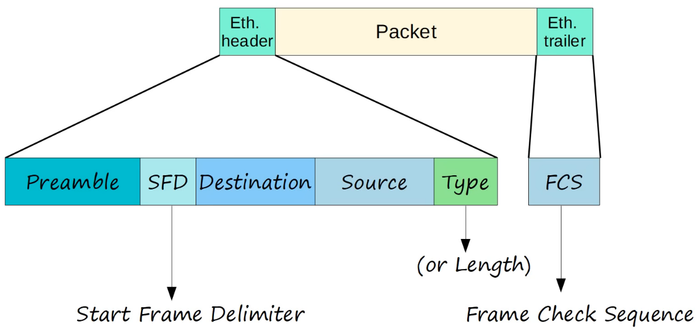
#### Ethernet Header
- **SFDs (Start Frame Delimiters)** are used for synchronization and to allow the receiving device to be prepared to receive the rest of the data in the frame
- Next is the **Destination**, which is the Layer 2 address to which the frame is being sent
- The **Source** is the Layer 2 address of the device which sent the frame
- Finally, the **Type** indicates the Layer 3 protocol used in the encapsulated Packet, which is almost always IPv4 or IPv6
- However, sometimes this is a length field, indicating the length of the encapsulated data, depending on the version of Ethernet
- The Ethernet trailer
#### Ethernet Trailer
- **FCS (Frame Check Sequence)** is used by the receiving device to detect any errors that might have occurred in transmission
### Preamble & SFD
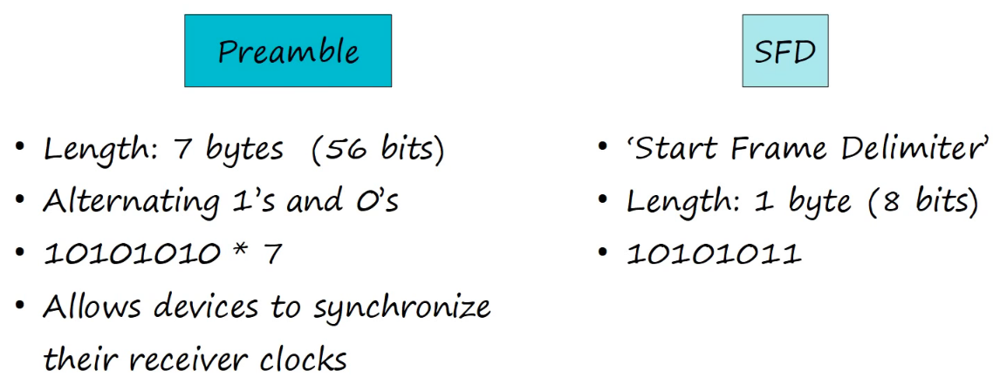
### Destination & Source
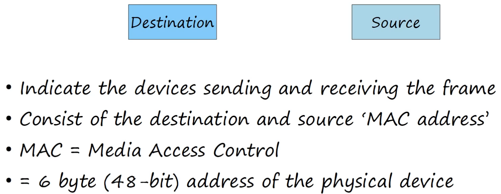
### Type/Length
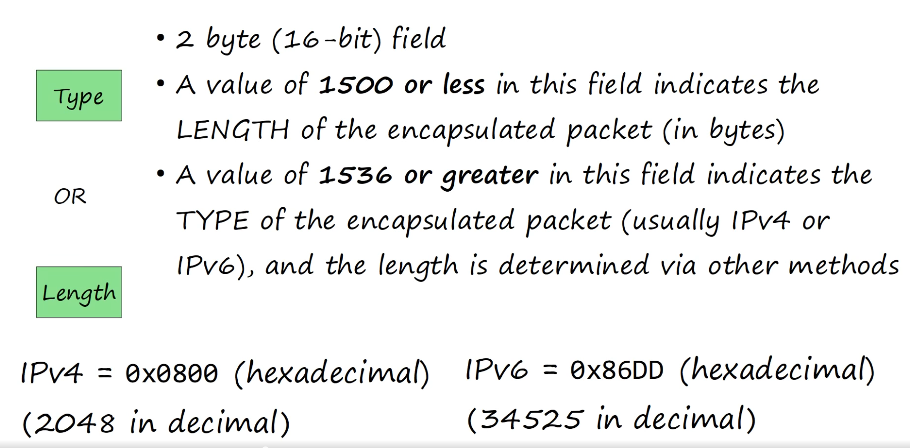
### Ethernet Header
- Preamble is **7 bytes long**
- SFD is **1 byte long**
- Destination & Source are **6 bytes long** as they're both MAC addresses
- Type is **2 bytes long**
### Frame Check Sequence (FCS)
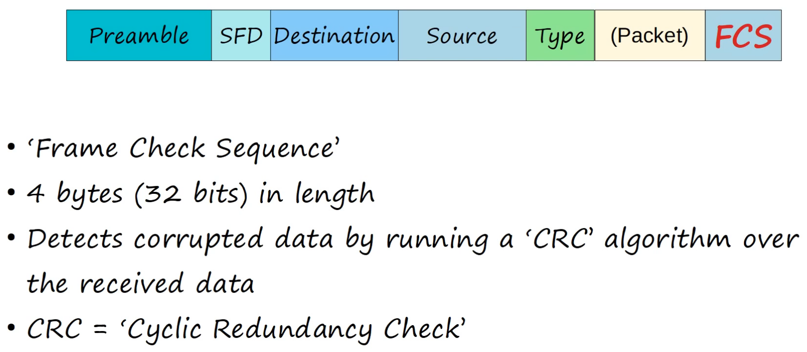
### Ethernet Frame
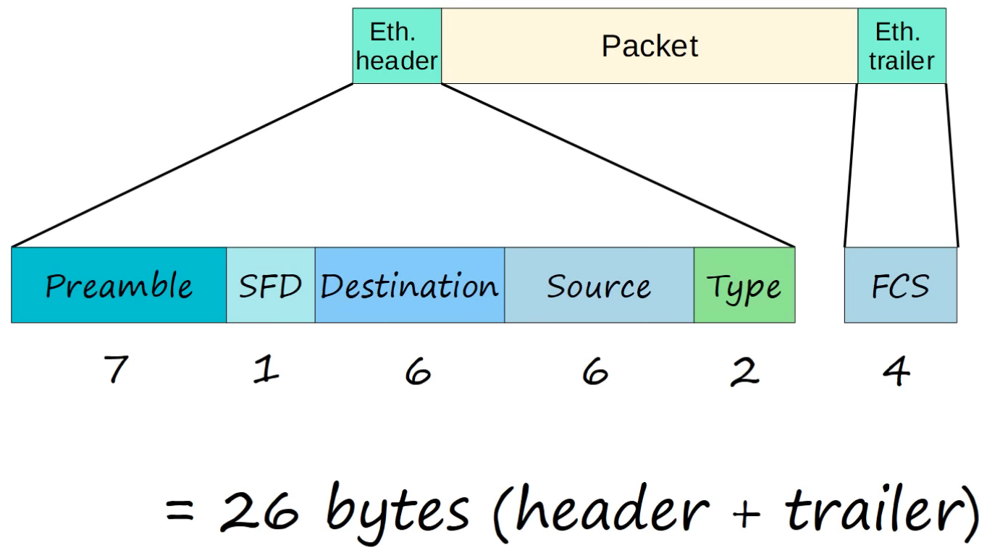
### MAC Address
- 6 byte (48 bit) physical address assigned to the device when it is made
- AKA **Burned-In Address (BIA)** because the address is "burned-in" to the device as it's made
- Is globally unique
- The first 3 bytes are the **OUI (Organizationally Unique Identifier)**, which is assigned to the company making the device
- The last 3 bytes are unique to the device itself
- Written as 12 **hexadecimal** characters
### Hexadecimal
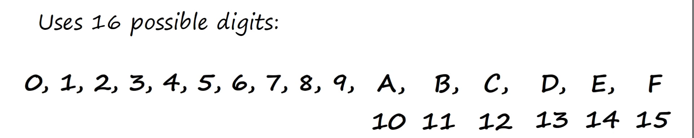
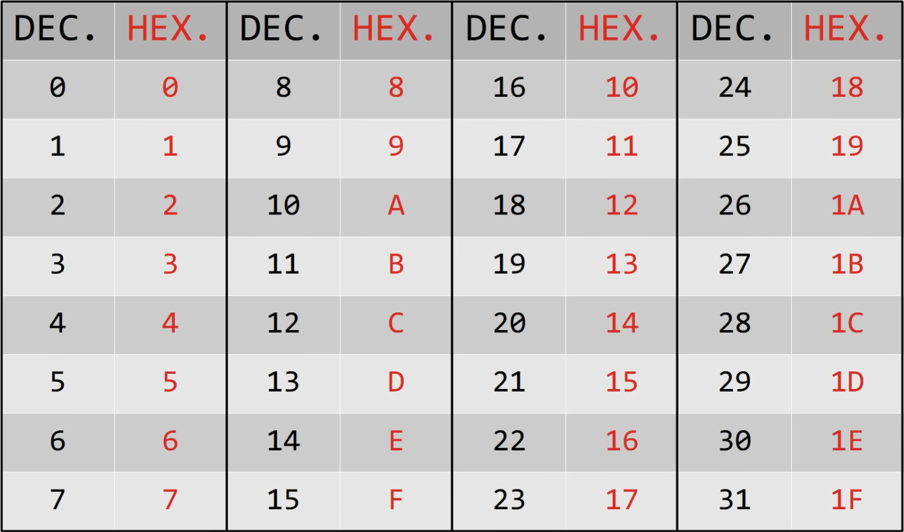
### MAC Addresses
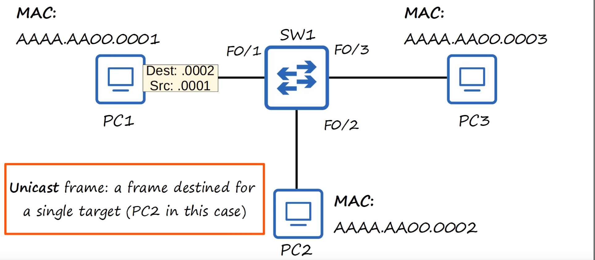
- Each MAC address is a series of 13 hexadecimal digits, separate by periods
- You may also see periods after every other digital (i.e. PC1's MAC Address is AA.AA.AA.00.00.01)
- The **OUI (Organizationally Unique Identifier)**, which is the first half of the MAC address, is AAAAAA for each device
- This indicates that each PC is from the same maker
- The second half the of the MAC address is different for each PC, as this identifies the device itself
- If PC1 wants to send data to PC2, this would represent a **Unicast Frame** as it is a frame destined for a single target
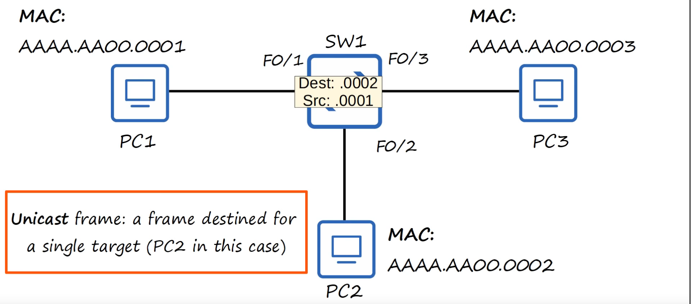
- PC1 sends the frame through its network interface card, which is connected to SW1, and SW1 receives the frame
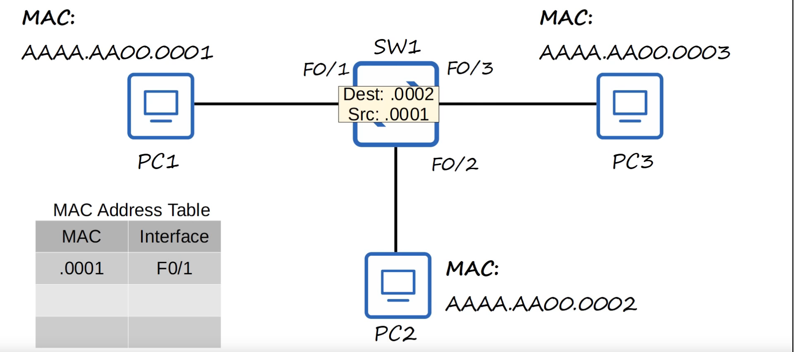
- After SW1 receives the frame, it looks at the source MAC address field of the frame and then uses that information to learn where PC1 is
- As indicated above, it adds the MAC address AAAA.AA00.0001 to its **MAC address table**, and it associates that MAC address with its F0/1 Interface
- This is known as a **dynamically learned** MAC address, or just **dynamic** MAC address, because it wasn't manually configured on the switch, the switch learned it itself
- Every switch will keep a MAC address table like this, and they fill the MAC address table dynamically by looking at the source MAC address of frames it receives
- Since SW1 received a frame from source MAC address AAAA.AA00.0001 on it's F0/1 interface, it knows that it can reach that MAC address on that interface, and adds it to the MAC address table
- This is a **very important** concept
- This is how switches dynamically learn where each device is on the network, by looking at the source MAC address of the frame
- There is one problem, the destination of the frame is AAAA.AA00.0002, but SW1 doesn't know where that is
- This is referred to as an **Unknown Unicast** frame, a frame for which the switch doesn't have an entry in its MAC address table
- Since the switch doesn't know how to reach the destination, it only has one option which is to **flood** the frame
- **Flood** means to forward the frame out of ALL of its interfaces, except the one it received the packet on
- This would look like the following:
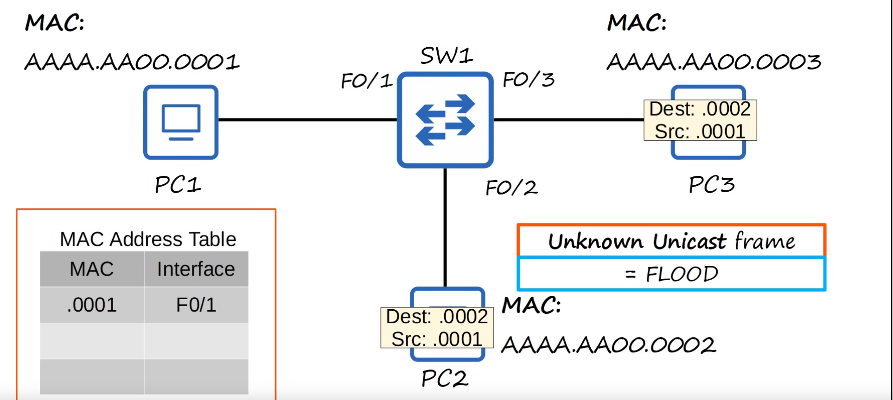
- SW1 copies the frame and sends it out its F0/2 and F0/3 interfaces
- It doesn't send it out of it's F0/1 Interface, because that's the interface it received the frame on
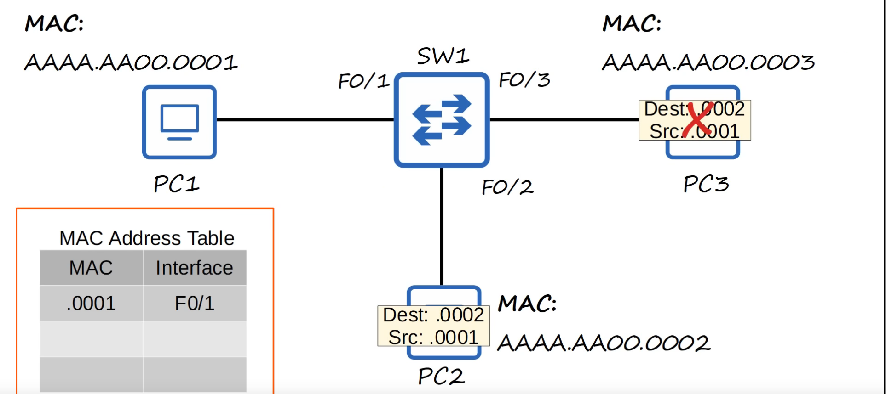
- PC3 then ignores the packet, because the destination MAC address doesn't match its own MAC address, resulting in PC3 dropping the packet
- PC2, however, receives the packet, and then processes it normally up the OSI stack
- Unless PC2 sends a reply of some sort, however, then the process stops there
- SW1 never receives a packet from PC2, so it can't learn PC2's MAC address and use it to populate the MAC address table
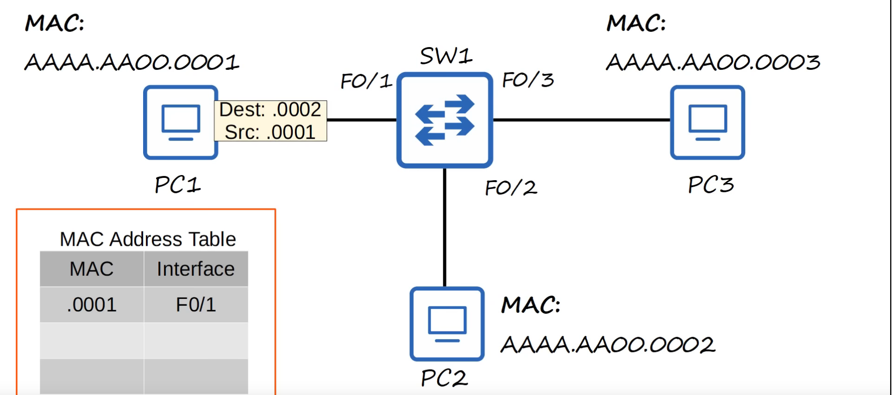
- Let's say PC1 sends another frame to PC2

- Once again, it's received by SW1, and it already knows PC1's MAC address, so it doesn't have to add it to the MAC address table again
- However, it still doesn't know where PC2 is, so it once again floods the frame

- PC3 drops the frame, and PC2 receives it and processes it normally
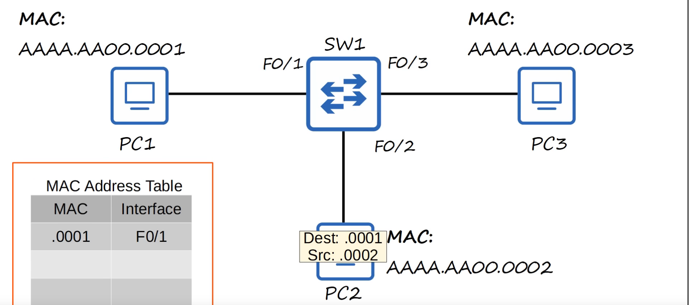
- Let's say PC2 then wants to send some data to PC1, maybe a reply to what PC1 sent to PC2
- Notice the destination and source address of the frame are reversed
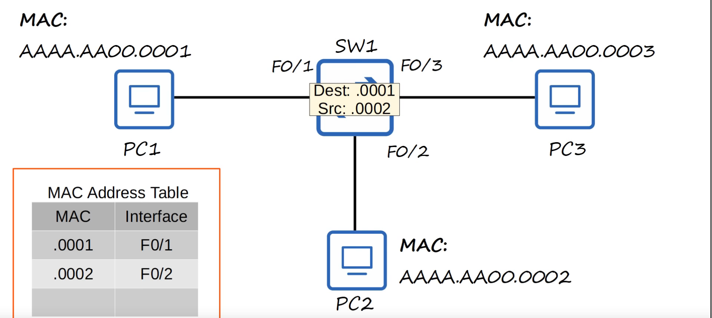
- PC2 sends the frame out of its network interface, and SW1 receives it
- SW1 looks at the source MAC address of the frame, and then adds it to its MAC address table, associating it with the F0/2 interface
- This time, however, it doesn't flood the frame
- This is known as a **known unicast** frame, because the destination is already in its MAC address table
- Whereas **unknown unicast** frames are flooded, **known unicast** frames are simply forwarded to the destination, like this:
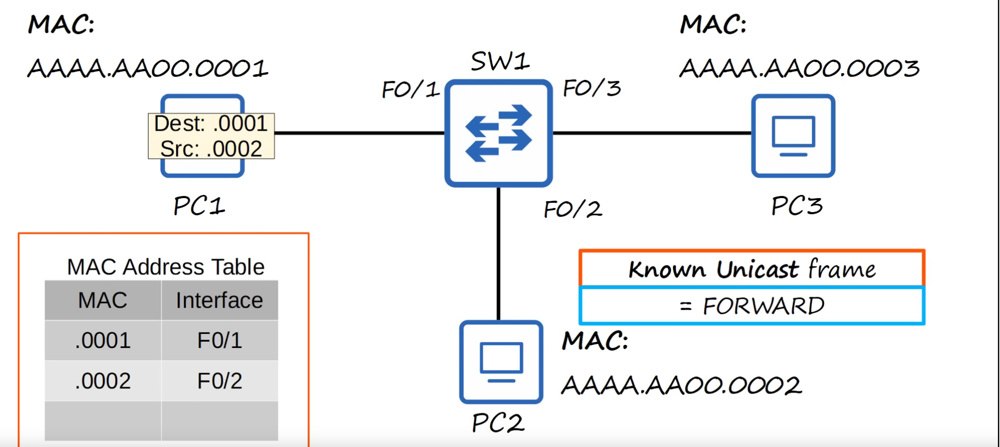
- PC1 then processes the frame up the OSI stack, through the de-encapsulation process, which we learned about in the [Day 03 - OSI Model & TCP-IP Suite](Day%2003%20-%20OSI%20Model%20&%20TCP-IP%20Suite.md) lecture
- On Cisco switches, these **dynamic MAC addresses** are removed from the MAC address table after 5 minutes of inactivity
- This means that if PC1 didn't send any traffic for over 5 minutes, SW1 would remove the MAC address to clean out the MAC address table
- If PC1 sent traffic again, SW1 would dynamically learn its MAC address again
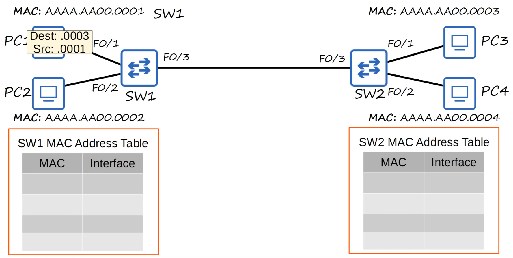
- Here's an example with two switches
-  PC1 wants to send some information to PC3 with a source packet of AAAA.AA00.0001, and the destination is AAAA.AA00.0003
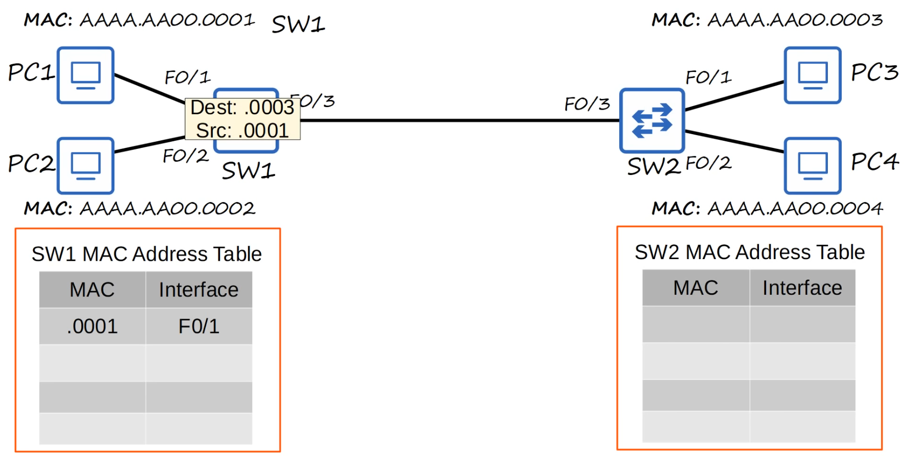
- PC1 sends the frame out of its network interface, and it arrives at SW1
- SW1 learns PC1's MAC address from the source address field of the frame, and associates it with the interface on which it was received, F0/1
- Once again, a MAC address learned in this way is called a **dynamically learned** or **dynamic** MAC address
- SW1 has learned that PC1 can be reached via its FO/1 interface, but it still doesn't know where PC3 is
- This is again referred to as an **unknown unicast** frame, meaning a **flood** must occur out of all of its ports (except the one it was received on) to reach PC3
- In this case, it will flood the frame out of F0/2 and F0/3
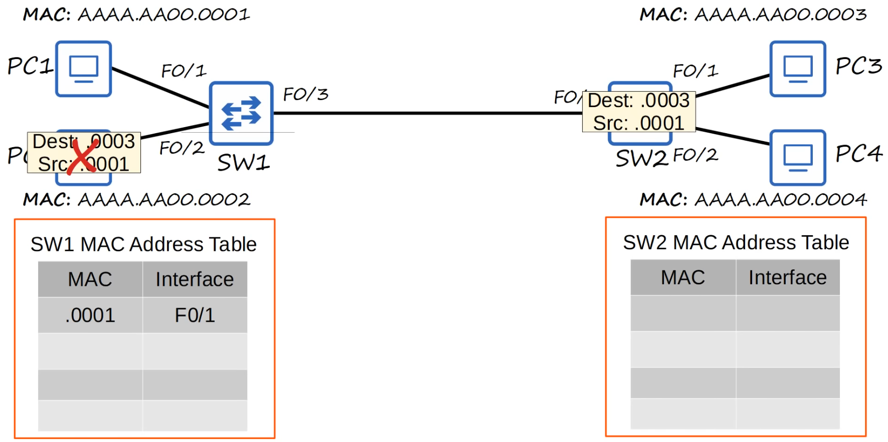
- PC2 drops the frame because the destination MAC address doesn't match its own MAC address
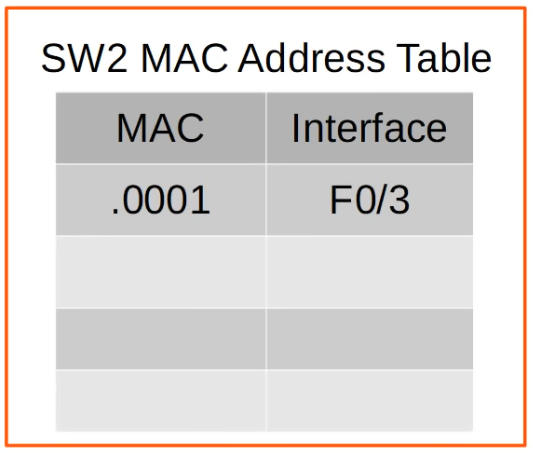
- SW2 will use the source MAC address field of the frame to dynamically learn PC1's MAC address and the interface it can use to reach PC1
- Unlike on SW1, PC1 isn't actually directly connected to the interface SW2 enters in its own MAC address table
- However, this is the interface which SW2 will use to reach PC1
- That's the meaning of the interface in the MAC address table, it doesn't mean the device is directly connected to this interface
- SW2 received a **unicast frame**, that is a frame destined for a single device, but it doesn't know how to reach that device, because it's not in its MAC address table
- This is called an **unknown unicast frame**, which means its **flooding time**
- Since it received the frame on F0/3, it'll only send out the frame through F0/1 and F0/2
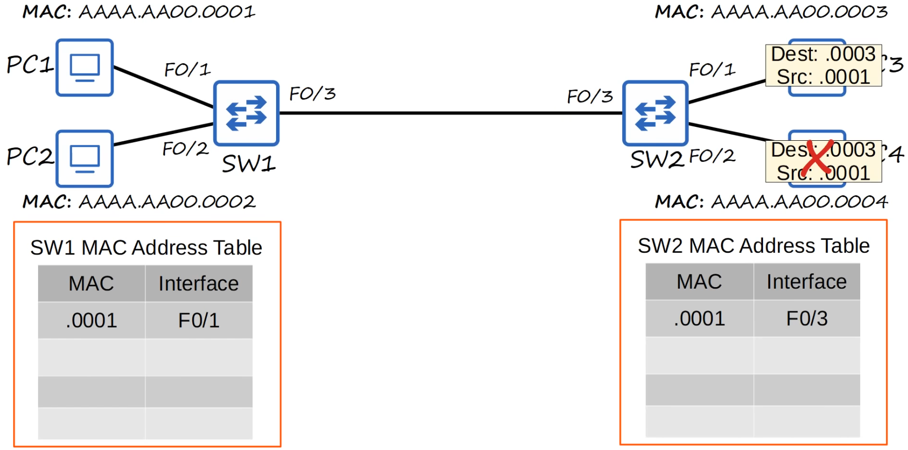
- PC4 drops the frame, and PC3 receives it, as it matches the destination MAC address
- If PC3 were to send a reply back to PC1, it would reverse the destination and source MAC address and do the whole process again
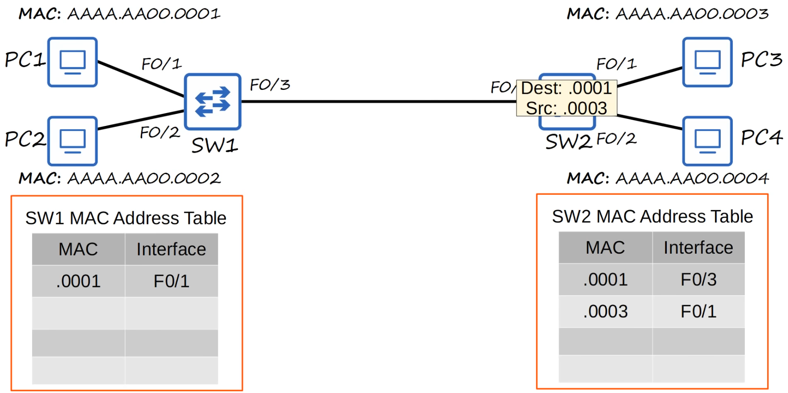
- SW1 receives the frame and adds PC3's MAC address to its MAC address table
- Just to be clear, the switch uses the **source MAC address field** to fille its MAC address table because if it receives a frame from that source on the interface, it knows that it can reach that MAC address via that interface
- SW2 already has an entry for the destination MAC address in its MAC address table meaning it can send out a **known unicast** frame and not have to do any flooding
- It's forwarded normally out of F0/3 as this is the interface saved for the destination MAC address
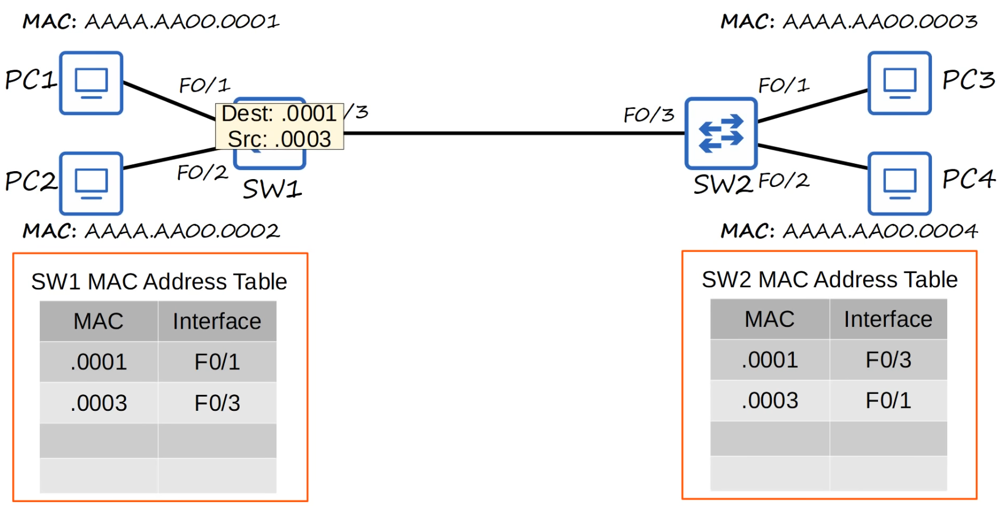
- The frame is received by SW1, which adds an entry for PC3's MAC address in its MAC address table, with interface F0/3, since that's where it received the frame
- Since SW1 already has an entry for the destination MAC address saved, it completes the process by forwarding the frame to PC1