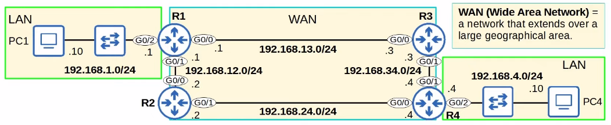
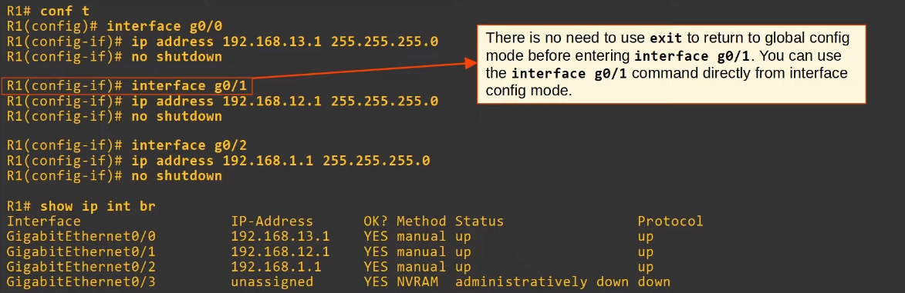
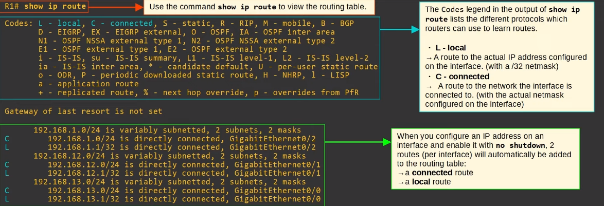
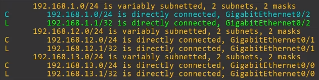
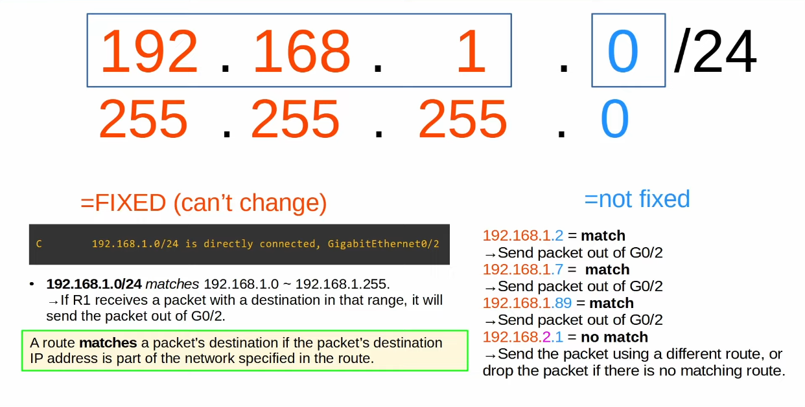
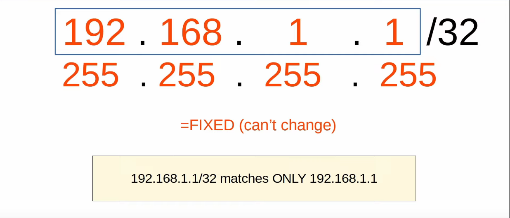
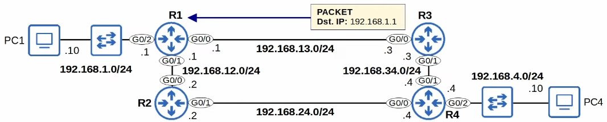
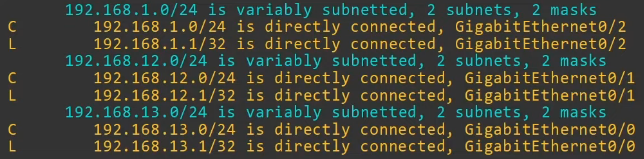
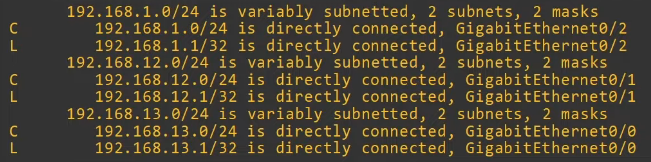
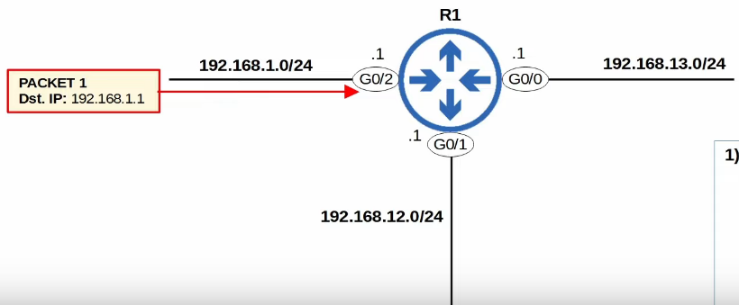

# Routing Fundamentals
### Things We'll Cover
- What is routing?
- The routing table on a Cisco router
	- **Connected** and **Local** routes
- Routing fundamentals (route selection)
### What is Routing?
- **Routing** is the process that routers use to determine the path that IP packets should take over a network to reach their destination
	- Routers store routes to all of their known destinations in a **routing table**
	- When routers receive packets, they look in the **routing table** to find the best route to forward that packet
- There are two main routing methods (methods that routers use to learn routes):
- **Dynamic Routing**: Routers use *dynamic routing protocols* (i.e. OSPF) to share routing information with each other automatically and build their routing tables
	- This will be covered later in the course
- **Static Routing**: A network engineer/admin manually configures routes on the router
	- This will be covered in the next lecture
- A **route** tells the router: *to send a packet to destination X, you should send the packet to **next-hop** Y*
	- **next-hop** = the next router in the path to the destination
	- or, if the destination is directly connected to the router, send the packet directly to the destination
	- or, if the destination is the router's own IP address, receive the packet for yourself (don't forward it)
- 
- There are four routers connected together, and they represent a **WAN**
- **WAN (Wide Area Network)** = a network that extends over a large geographical area
- For example, each of these four routers could be in different cities or even different countries
- Connected to R1 and R4, there are two **LANs**
- In the next lecture, we will configure **static routes** on the routers to allow PC1 and PC4 to communicate with each other
	- This lecture will focus on two types of routes automatically added to a router's routing table
### R1 Pre-Configurations (IP Addresses)

### Routing Table (`show ip route`)

### Connected and Local Routes

- A **connected** route is a route to the network
- R1 G0/2 IP = 192.168.1.1/24
- Network Address = 192.168.1.0/24
- It provides a route to all hosts in that network (i.e. 192.168.1.10, .100, .232, etc.)
- R1 knows: "If I need to send a packet to any host in the 192.168.1.0/24 network, I should send it out of G0/2"
- A **local** route is a route to the exact IP address configured on the interface
- A /32 netmask is used to specify the exact IP address of the interface
	- /32 means all 32 bits are 'fixed', they can't change
- Even though R1's G0/2 is configured as 192.168.1.1/24, the connected route is to 192.168.1.1/32
- R1 knows: "If I receive a packet destined for this IP address, the message is for me"

### Route Selection

- A packet destined for 192.168.1.1 is matched by both routes:
	- 192.168.1.0/24
	- 192.168.1.1/32
- Which route will R1 use for a packet destined for 192.168.1.1?
	- It will choose the **most specific** matching route
- The route to 192.168.1.0D/24 includes 256 different IP addresses (192.168.1.0-192.168.1.255)
- The route to 192.168.1.1/32 includes only 1 IP address (192.168.1.1)
	- This route is more **specific**
- When R1 receives a packet destined for 192.168.1.1, it will select the route to 192.168.1.1/32
	- R1 will receive the packet for itself, rather than forward it out of G0/2
- **Local** route = keep the packet, don't forward
- **Most specific** matching route = the **matching route** with the **longest prefix length**

- These three lines are not routes. They mean the following:
- `192.168.1.0/24 is variably subnetted, 2 subnets, 2 masks`
	- In the routing table, there are two routes to *subnets* that fit within the 192.168.1.0/24 Class C network, with two different netmasks (/24 and /32)
- `192.168.12.0/24 is variably subnetted, 2 subnets, 2 masks`
	- In the routing table, there are two routes to *subnets* that fit within the 192.168.12.0/24 Class C network, with two different netmasks (/24 and /32)
- `192.168.13.0/24 is variably subnetted, 2 subnets, 2 masks`
	- In the routing table, there are two routes to *subnets* that fit within the 192.168.13.0/24 Class C network, with two different netmasks (/24 and /32)
- We will be covering **subnetting** soon, but for now, just remember that these three lines are not routes
### Route Selection Practice

1. Destination IP: 192.168.1.1
	1. When R1 checks it's routing table, it'll see that the **most specific** match is `192.168.1.1/32`
	2. It's a local route, so R1 will receive the packet for itself
2. Destination IP: 192.168.13.3
	1. The only matching route is the connection to `192.168.13.0/24`
	2. R1 will send the packet to the destination, which is connected to the G0/0 interface
3. Destination IP: 192.168.1.244
	1. The only matching route is the connection to `192.168.1.0/24`
	2. It's a connected route, so R1 will send the packet to the destination, which is connected to the G0/2 interface
4. Destination IP: 192.168.12.1
	1. There are two matching routes, but the most specific one is the local route of `192.168.12.1/32`
	2. This means that R1 will receive the packet for itself
5. Destination IP: 192.168.4.10
	1. Since there are no matching routes in the routing table, R1 will have to drop this packet
### Summary
- Routers store information about destinations they know in their **routing table**
	- When they receive packets, they look in the routing table to find the best route to forward the packet
- Each **route** in the routing table is an instruction:
	- To reach destinations in network X, send the packet to **next-hop** Y (the next router in the path to the destination)
	- If the destination is directly connected (**Connected** route), send the packet to the destination
	- If the destination is your own IP address (**Local** route), receive the packet for yourself
- When you configure an IP address on an interface and enable the interface, two routes are automatically added to the routing table:
	- **Connected** route (code **C** in the routing table): A route to the network connected to the interface
		- i.e. if the interface's IP is 192.168.1.1/24, the route will be to 192.168.1.0/24
		- Tells the router: "To send a packet to a destination in this network, send it out of the interface specified in the route"
	- **Local** route (code **L** in the routing table): A route to the exact IP address configured on the interface
		- i.e. if the interface's IP is 192.168.1.1/24, the route will be to 192.168.1.1/32
		- Tells the router: "Packets to this destination are for you. You should receive them for yourself (not forward them)"
- A route **matches** a destination if the packet's destination IP address is part of the network specified in the route
	- i.e. a packet to 192.168.1.60 is matched by a route to 192.168.1.0/24, but not by a route to 192.168.0.0/24
- If a router receives a packet and it doesn't have a route that matches the packet's destination, it will **drop** the packet
	- This is different from switches, which **flood** frames if they don't have a MAC table entry for the destination
- If a router receives a packet and it has multiple routes that match the packet's destination, it will use the **most specific** matching route to forward the packet
	- **Most specific** matching route = the matching route with the longest prefix length
	- This is different from switches, which look for an **exact** match in the MAC address table to forward frames