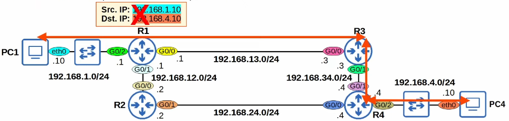

# Static Routing
### Things We'll Cover
- Review: **Connected** and **Local** routes
- Intro to Static Routes
- Static Route configuration
- Default Routes
### R2 Connected & Local Routes

### Routing Packets: Default Gateway

- End hosts like PC1 and PC4 can send packets directly to destinations in their connected network
	- PC1 is connected to 192.168.1.0/24, PC4 is connected to 192.168.4.0/24
- To send packets to destinations outside their local network, they must send the packets to their **default gateway**

- The **default gateway** configuration is also called a **default route**
	- It is a route to 0.0.0.0/0 = all netmask bits set to 0
	- Includes all addresses from 0.0.0.0 to 255.255.255.255
- The **default route** is the *least specific* route possible, because it includes all IP addresses
	- 0.0.0.0/0 = 4,294,IP addresses
- A /32 route (i.e. Local route) is the *most specific* route possible, because it specifies only one IP address
	- 192.168.1.1/32 = 1 IP address
- End hosts usually have no need for any more specific routes
	- They just need to know: to send packets outside of my local network, I should send them to my default gateway

### Routing Packets: Static Routes
- When R1 receives the frame from PC1, it will de-encapsulate it (remove L2 header/trailer) and look at the inside packet
- It will check the routing table for the most-specific matching route:

- R1 has no matching routes in its routing table
	- It will drop the packet
- To properly forward the packet, R1 needs a route to the destination network (192.168.4.0/24)
	- Routers are instructions: *To send a packet to destinations in network 192.168.4.0/24, forward the packet to next hop Y*
- There are two possible path packets from PC1 to PC4 can take:
	- PC1 -> R1 -> R3 -> R4 -> PC4
	- PC1 -> R1 -> R2 -> R4 -> PC4

- In this video, we will use the path via R3, not the path via R2
- It is possible to configure the routers to:
	- load-balance between path 1 and 2
	- Use path 1 as the main path and path 2 as a backup path
- These techniques will be talked about more later in the course
### Static Route Configuration
- Each router in the path needs two routes: a route to 192.168.1.0/24 and a route to 192.168.4.0/24
	- This ensures **two-way reachability** (PC1 can send packets to PC4, and vice versa)
- Routers don't need routes to all networks in the path to the destination
	- R1 doesn't need a route to 192.168.34.0/24
	- R4 doesn't need a route to 192.168.13.0/24
- R1 already has a **connected route** to 192.168.1.0/24
- R4 already has a **connected route** to 192.168.4.0/24
	- The other routes must be manually configured (using **static routes**)

- To allow PC1 and PC4 to communicate with each other over the network, let's configure these **static routes** on R1, R3, and R4
### Static Route Configuration (R1)
- The command to configure an IP route is `ip route ip-address netmask next-hop`

### PC1 to PC4

- If the ping is successful, that means there is two-way reachability
	- PC1 can reach PC4, and vice versa
### Static Route Configuration w/`exit-interface`
- We use either of the following:
	- `ip route ip-address netmask exit-interface`
	- `ip route ip-address netmask exit-interface next-hop`

- Static routes in which you specify only the `exit-interface` rely on a feature called **Proxy ARP** to function
- This is usually not a problem, but generally you can stick to `next-hop` or `exit-interface next-hop`
- Neither is better than the other, use whichever you prefer
### Default Route
- A **default route** is a route to 0.0.0.0/0
	- 0.0.0.0/0 is the *lease specific* route possible; it includes every possible destination IP address
- If the router doesn't have any more specific routes that match a packet's destination IP address, the router will forward the packet using the **default route**
- A default route is often used to direct traffic to the Internet
	- More specific routes are used for destinations in the internal corporate network
	- Traffic to destinations outside of the internal network is sent to the internet

- To configure a default route, the structure is the same as a regular `ip route` command, but the IP address and subnet mask should both be set to `0.0.0.0`

