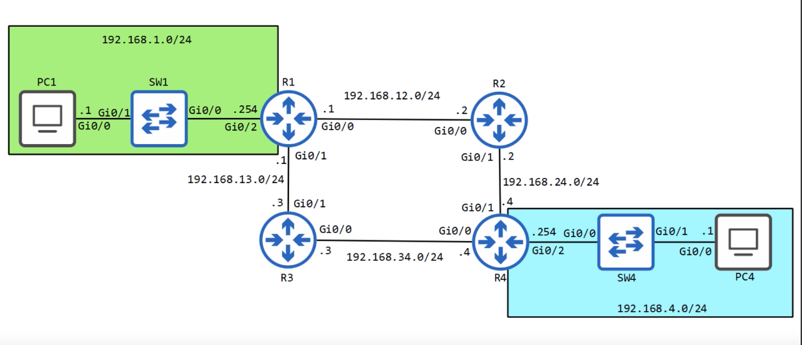
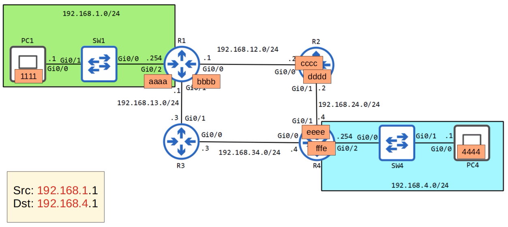
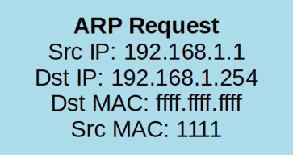
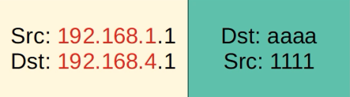
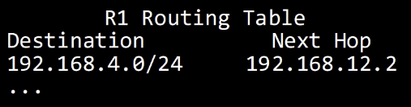
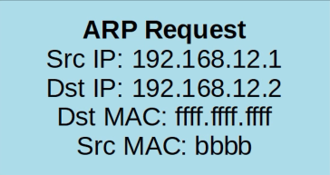
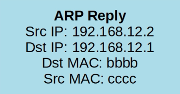
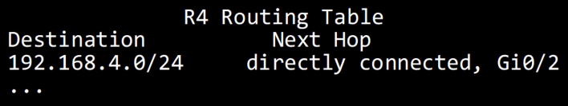

# The Life of a Packet
### Things We'll Cover
- The entire process of sending a packet to a remote destination
- Including ARP, encapsulation, de-encapsulation, etc.
### Network Topology

- We'll follow a packet being sent from PC1 -> PC4 using the R2 path

- Each router's interface has a unique MAC address associated with it
- In this example, PC1 has not sent any traffic yet, so it needs to use ARP (Address Resolution Protocol)

- PC1 makes this ARP Request packet
- The source is PC1's IP address and the destination is R1's G0/2 interface, which is the default gateway configured on PC1
- Since PC1 doesn't know the MAC address of R1, it uses the broadcast address of FFFF as the destination MAC
- When R1 notices the destination IP is its own, it sends back an ARP Reply frame containing its MAC address

### PC1 -> R1

- Now that PC1 knows the MAC address of its default gateway, it encapsulates the packet with this Ethernet header
- The original packet is not changed, the destination address remains PC4's IP address, NOT R1's IP address
- Only at Layer 2 is the destination set to R1's MAC address
### R1 -> R2
- R1 receives the packet and removes the Ethernet header

- It looks up the destination in its routing table
- The most specific match is this entry for the 192.168.4.0/24 network, which specifies the next hop of 192.168.12.2 = R2's IP address
- R1 will have to encapsulate this packet with an Ethernet frame with the appropriate MAC address for 192.168.12.2
- Since it doesn't know R2's MAC address, it must send out an ARP Request
### ARP

- The source IP will be R1's, and the destination will be R2's

- R2 receives the broadcast, and sends back its MAC address
### R2 -> R4
- The same exact process repeats
- Once ARP has completed, it sends the packet to R4

- It looks up the IP for PC4 in its routing table and finds the most specific match of 192.168.4.0/24, which is directly connected to its G0/2 interface
- Once again, it doesn't know PC4's MAC address so it has to use ARP again to retrieve it
- Once the process is done, it adds PC4's MAC address to the original packet and PC4 receives it
### PC4 -> PC1
- If PC4 sends a reply back to PC1, since ARP has already been done, there won't be any need for frames to be flooded
- The packet will simply be forwarded from device to device, being de-encapsulated and then re-encapsulated as it is received by and then forwarded by each router