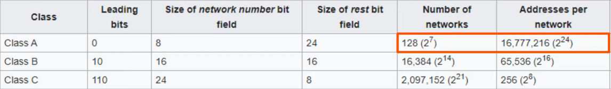

# Subnetting (Part 1)
### Things We'll Cover
- CIDR (Classless Inter-Domain Routing)
	- Throws away IPv4 Classes (A-E) and lets us be more flexible with our IPv4 networks
- The process of subnetting
### IPv4 Address Classes

- However, only class A-C can be assigned to a device as an IP address as classes D and E have special purposes

- How do companies get assigned IP addresses for them to use?
- In the past, the **IANA (Internet Assigned Numbers Authority)** assigned IPv4 addresses/networks to companies based on their size
- For example, a very large company might receive a Class A or Class B network, while a small company might receive a Class C network
- However, this led to many wasted IP addresses

- Since point networks don't require a large address block, we can get away with using a Class C network as we don't have to worry about a bunch of hosts being connected
- However, that still has it's cons as it leaves many unused addresses for such a small/specific network

### Example
- Company X needs IP addressing for 5000 end hosts
- A class C network does not provide enough addresses, so a Class B network must be assigned
- This will result in about 60,000 addresses being wasted
### CIDR (Classless Inter-Domain Routing)
- When the internet was first created, the creators didn't predict that the internet would become as large as it is today
- This resulted in wasted address space like the examples above
- The IETF (Internet Engineering Task Force) introduced CIDR in 1993 to replace the 'classful' addressing system 
- With CIDR, the requirements of...
	- Class A = /8
	- Class B = /16
	- Class C = /24
- ...were removed
- This allowed larger networks to be split into smaller networks, allowing greater efficiency
- These smaller networks are called 'subnetworks' or 'subnets'

- All '1s' in the subnet mask indicate that the same bit in the address is the network portion
- In this case, the network portion is blue, and the host portion is red
### CIDR Practice

- Using the formula above, how many usable addresses are there in each network?
	- 203.0.113.0/25 = 2^7 - 2 = 126
		- Host bits = 32 (total bits) - 25 (network bits) =7
	- 203.0.113.0/26 = 62
	- 203.0.113.0/27 = 30
	- 203.0.113.0/28 = 14
	- 203.0.113.0/29 = 6
	- 203.0.113.0/30 = 2
	- **203.0.113.0/31** = 0
	- **203.0.113.0/32** = 2^1 = 1 - 2 = -1
- The last two are bold as they're a bit special compared to the ones above
- Let's check our answers below:
### CIDR (/25)

- Remember, we only need 2 usable addresses, meaning 124 of them will be wasted
- While that's better than using a regular Class C /24 address (that would waste 252) addresses, it's still wasteful
### CIDR (/26)

- We would be wasting 60 addresses
- This is better, but we can keep going
### CIDR (/27)

### CIDR (/28)

### CIDR (/29)

### CIDR (/30)

- Finally, we now have only 2 usable addresses which is exactly what we need
- There are 4 total addresses:
	- The Network Address
	- The Broadcast Address
	- R1's Address
	- R2's Address

- This is the magic of subnetting
- Instead of using 203.0.113.0/24 and wasting 252 addresses, we can use /30 and waste no addresses
- Or, perhaps there is another way to make this even more efficient
### CIDR (/31)

- You used to not be able to use /31 addresses because of this
- However, since we're dealing with a point-to-point network there's actually a way for it to be used

- The reason is that point-to-point networks don't require a network or broadcast address
- This allows us to break the rules and take assign both usable addresses
- It's worth noting that if I attempt to set this up on a Cisco router, we will get a warning to ensure that we are using a point-to-point network

- This time, we've saved even more addresses, using only 2 addresses instead of 4 for this point-to-point connection
- Some still use /30 for point-to-point connections at times, but /31 masks are more efficient and is the recommended way to go
### CIDR (/32)

- If we try to calculate the amount of usable addresses using our formula, it clearly doesn't work in this case based on the results above
- This means that we won't be able to use a /32 mask and probably never will to configure an actual interface
- However, there are still some uses for a /32 mask 
- For example, when you want to create a static route to a specific host instead of a network, you can use a /32 mask to specify that exact host
### CIDR Notation
- The way of writing a prefix with a slash followed by the prefix length is called CIDR notation, because it was introduced with the CIDR system

- As a reminder, subnetting is **the process of dividing a larger network into smaller ones called subnets**
### Subnetting Review

- Even though only 45 hosts are required for each network, we have to take into account the **network and broadcast addresses** bringing our total number of required hosts to 47
- /24 indicates a Class C network, which has 256 available addresses 
- A Class C network would be able to accommodate all 188 addresses needed for this scenario, but we can optimize further by subnetting

- In the above /26 prefix network, we find that we have a subnet close enough to the 47 required addresses from the previous example
- Even though we can't always make subnets have the exact number of addresses required, this is for the better as its good to have extra room for growth in the network