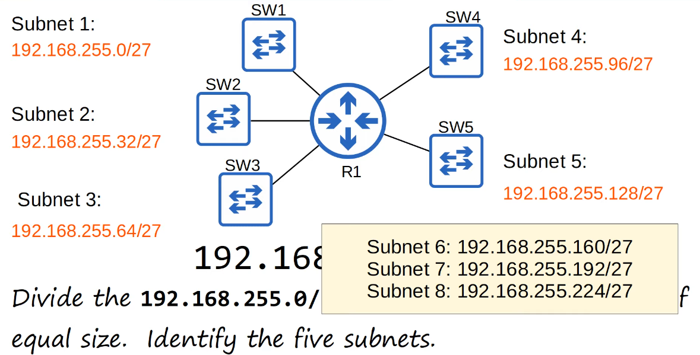
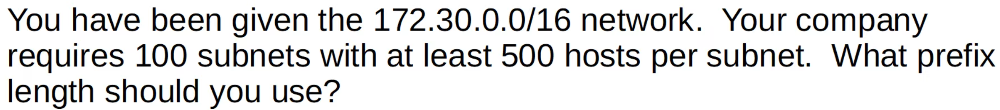
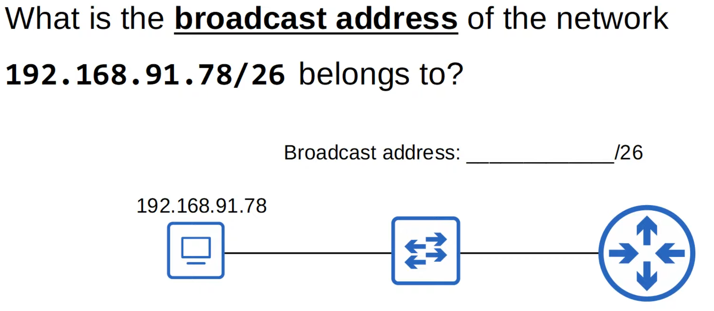
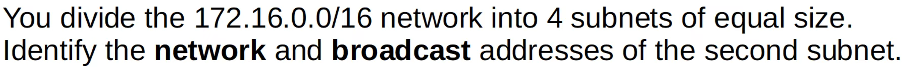

# Subnetting (Part 2)
### Things We'll Cover
- Subnetting practice questions (Class C networks)
- Subnetting Class B networks
### Quiz From Part 1

- We know that the range for subnet 1 should be 192.168.1.0-192.168.1.63 (64 total addresses including the network and broadcast)
- Going off of the hint, the broadcast address for subnet 1 is 192.168.1.63
- This means that subnet 2 will begin with 192.168.1.64
- After doing the same for the other subnets, we end up with the following answers
	- Subnet 1 = 192.168.1.0
	- Subnet 2 = 192.168.1.64
	- Subnet 3 = 192.168.1.128
	- Subnet 4 = 192.168.1.192
- Let's fact-check:

- Notice that each new subnet adds 64 to the fourth octet
### Subnetting Trick

- When writing our the fourth octet in binary notation, notice that the last bit of the network portion is 64
- This means that to find the next subnet, we just have to add 64
- This same concept applies to all other subnets (/27 would mean adding 32 to each subnet)
### Subnetting Example

- In this case, the number of hosts for each subnet hasn't been specified
- Let's just make each subnet as large as they can be
- All we'd have to do is start with /24, and keep increasing the prefix length based on the total amount of allowed subnets for each borrowed bits
### /24

### /25

- We can see that adding a borrowed bit to our fourth octet essentially doubled that number of subnets we can use
- This is due to the formula shown above
- We still need 8 subnets, so using a /25 prefix length is still not enough
### /27

- Even though 8 is 3 more subnets than we need for the previous example, it's the best we can do as /26 would only allow us to create 4 subnets
- We can't always make the numbers match exactly to our needs, but that's ok to allow room for growth

- As shown here, the last bit of our network portion for a /27 subnet is 32
- This should be enough to calculate all 5 subnets:
	- Sub 1: 192.168.255.0/27
	- Sub 2: 192.168.255.32/27
	- Sub 3: 192.168.255.64/27
	- Sub 4: 192.168.255.96/27
	- Sub 5: 192.168.255.128/27

- If needed in the future, we still have 3 remaining subnets we can use
- Another possible question we can see on the exam is to identify the subnet an IP address belongs to
### Identify the Subnet

- The purple bits are "borrowed" and added to the network portion of our IP
- To figure out the network address, we simply need to change the remaining host bits to 0s
- As indicated by the hint in the first quiz question, the network address represents our subnet ID which in this case is 192.168.5.32

- We would repeat the same steps as the last problem
- I believe it's easier to simply focus on the host bits, which in this case would be **11011** 011
- The first 5 bits in bold represent our "borrowed" bits for the /29 subnet
- This means that we're allowed to change the last three to 0s, would turn our fourth octet to 216 (219 - (0 + 2 + 1))
- Subnet ID: **192.168.29.216**

### Subnets/Hosts (Class C)

- These numbers are worth memorizing in order to calculate subnets quicker
- For the number of subnets, each additional bit doubles our amount of total subnets
- The same concept applies for the numbers of hosts (except we have to subtract 2 for the network and broadcast addresses), the more host bits we have means the larger number of hosts for each subnet
- However, increasing the number of "borrowed" bits reduces our number of host bits
- As one gets larger, the other gets smaller and vice versa
- In the above chart, take note of /31
- The number of hosts is 0 due to there only being a single host bit (2^1 - 2) and the two addresses have to be allocated towards the network and broadcast address
- However, /31 can be used for a point-to-point connection as they don't require a network or broadcast address
- /32 technically uses all bits for the network address, allowing no hosts
- But, you can assign a /32 mask to identify a specific host when writing routes and such
### Subnetting Class B Networks

### Example 1

- We know that we require a subnet that can accommodate at least 80 subnets
- Since this is a Class B network, we know that we have 16 total bits that can be "borrowed" towards our subnet
- If we use 2^x with x being the total borrowed bits used, we can continue substituting a value for x until we find a number that will work
- Going down the list, we see that 2^6 (6 "borrowed" bits) = 64
- This means that our next best option is 2^7 = 128 subnets
- We would now add 7 to our prefix of /16, resulting in our desired prefix length of **/23**
- Fact check:

- Remember, when entering subnets using the Cisco CLI, we can't use CIDR notation like /17 in this case
- We would have to manually enter the actual subnet mask
- We repeat this process until we reach our desired subnet

- Our answer is correct! We would use a prefix length of /23

- Here are our first five subnets out of the 80 total we're allowed
- As noted previously, we would simply add the value of our last borrowed bit to each subnet (which in this case is 2, indicated by 00000010)
### Example 2

- We would repeat the same process as we did for example 1
- Since we know 7 "borrowed" bits results in 128 subnets, let's keep adding on to that
	- 8 borrowed bits = 256
	- 9 borrowed bits = 512
- This means that we will require 9 "borrowed" bits resulting in a prefix length of **/25**

### Example 3

- We know from before that using 8 "borrowed" bits gives us 256 subnets
- Despite the wording looking to mislead us, all subnets always contain the same number of hosts per subnet
- The prefix length we'd use is **/24**

### Identify the Subnet

- I find it easier to only focus on the host octets, which in this case would be the 3rd and fourth octet
- 217 has a binary value of 11011001
- 192 has a binary value of 11000000
- With our prefix length being /21, we know that the amount of "borrowed" bits used is 5 (/21 - /16 = 5)
- This means that the bits that are bold are our "borrowed" bits and must stay, while the rest of the host bits can be changed to 0s:
	- **11011** 000.00000000 = 216.0
- Thus, our subnet ID should be **172.25.216.0/21**
- Fact check:

### Subnets/Hosts (Class B)

- It's not necessary to memorize these numbers
- Just know the patterns:
	- For each "borrowed" bit, the number of subnets doubles
	- For each host bit, the number of addresses in each subnet doubles, however, you have to subtract 2 to identify the number of **usable** addresses
### Quiz
#### Question 1

- Answer: **/23**
- This is because using 7 borrowed bits provides us with 128 subnets, as well as 510 usable addresses (2^9 - 2)
#### Question 2

- Writing out the third octet in binary, we get 01101111
- Since we have a prefix length of /20, we know that we have 4 "borrowed" bits
- By turning the remaining host bits into 0s, we get the following values:
	- **0110**0000.00000000 = 96.0
- Our subnet ID is **172.21.96.0/20**
#### Question 3

- In this case, our broadcast address is the final IP address of this subnet range
- As we have two borrowed bits for /26, we know that the value of our last "borrowed" bit of our network portion is 64
- Since our fourth octet value of 78 is larger than 64, we would add 64 once again and end up with the following broadcast address: **192.168.91.128/26**
#### Question 4

- In order to have 4 subnets, we would need to borrow 2 bits (2^2 = 4)
- With that information, we know that the value of the 2nd bit in our network portion is 64
- As subnet 1 has a network address of 0 and broadcast address of 63, subnet 2 should have a network address of **172.16.64.0/18** and a broadcast address of **172.16.127.0/18**
#### Question 5

- To figure out the amount of subnets we can make, we should first determine the amount of host bits that would allow 1000 usable addresses
- We can calculate that 2^10 - 2 = 1022 usable addresses
- If 10 bits are reserved as host bits, this leaves the remaining 6 bits in the 3rd octet for our subnets
- Thus, our answer is **2^6 = 64 subnets**
- **172.30.252.0/22**