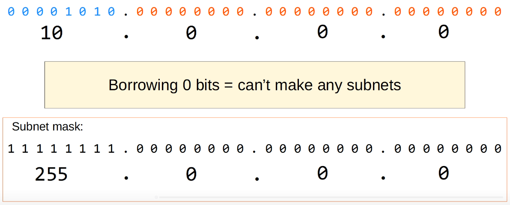

# Subnetting (Part 3 - VLSM)
### Things We'll Cover
- Answers to Day 14's Quiz Questions
- Subnetting Class A networks
- VLSM (Variable-Length Subnet Masks)
- Extra subnetting practice resources
### Subnetting Class A Networks

### Practice Question 1
You have been given the 10.0.0.0/8 network. You must create 2000 subnets which will be distributed to various enterprises.
- What prefix length must you use?
- How many host addresses (usable addresses) will be in each subnet?
#### /8 Network:

- First, we must figure out what power 2 must be to get at least 2000
- Since I know 2^10 gets a little over 1000, I think 2^11 would get over 2000
- Another trick to remember is that each bit that we borrow doubles the amount of subnets we can make (2, 4, 8, 16, 32, 64, etc.)

- We would now add 11 to our prefix length of /8 which results in a /19 network
#### /19 Network

- So the answers to our original practice question are the following:
	- What prefix length must you use? **/19**
	- How many host addresses (usable addresses) will be in each subnet? **8190**
### Practice Question 2

1. Network Address:
	1. 10.217.182.223 written out in binary is **00001010.110**11001.10110110.11011111
	2. To figure out the network address, we must convert all of our host bits to 0s
	4. Since this is a /11 prefix, that would mean we'd get **00001010.110**0000.00000000.00000000
	5. This turns into **10.192.0.0/11**
2. Broadcast Address:
	1. We'd repeat the same steps as before except this time we convert all of our host bits to 1s
	2. **00001010.110**11111.11111111.11111111 translates to **10.223.255.255/11**
3. First Usable Address:
	1. This would be one more than our network address, so **10.192.0.1**
4. Last Usable Address:
	1. One less than our broadcast address, so **10.223.255.254**
5. Number of Host Addresses:
	1. 32-11 = 21 host bits
	2. To calculate the number of hosts, we'd use the formula 2^21 - 2 = **2,097,150 hosts per subnet**
### Variable-Length Subnet Masks
- Until now, we have practiced subnetting using **FLSM (Fixed-Length Subnet Masks)**
- This means that all the subnets use the same prefix length (i.e. subnetting a class C network into 4 subnets using /26)
- **VLSM (Variable-Length Subnet Masks)** is the process of creating subnets of different sizes, to make your use of network addresses more efficient
- VLSM is more complicated than FLSM, but it's easy if you follow the steps corrects
### VLSM

- We must divide this network into 5 subnets to provide IP addresses for all hosts in the enterprise network
- If we tried this with FLSM, we'd need to borrow 3 bits to make enough subnets
- That would leave 5 host bits left, which only allows for 30 usable addresses
- This is not enough addresses for Tokyo LAN A or Toronto LAN B
- However, if we use VLSM we can assign different subnet sizes to each LAN, which will allow us to make sure each LAN has enough addresses available
### VLSM - Steps
1. Assign the largest subnet at the start of the address space
2. Assign the second-largest subnet after it
3. Repeat the process until all subnets have been 
### VLSM
- If we look back at our example network, we'd do these steps in the following order:

#### Tokyo LAN A
1. Network Address:
	 1. First, we would figure out how many host bits we'd need to support 110 hosts
	 2. That would be 8 as 2^7 - 2 = 126
	 3. That means that we would only borrow 1 bit and have a prefix length of /25
	 4. So, our network address should be the following: **11000000.10101000.00000001.0**0000000 = **192.168.1.0/25**
2. Broadcast Address:
	1. We'd now convert all the host bits to 1s and get **192.168.1.127/25**
3. First Usable Address: **192.168.1.1**
4. Last Usable Address: **192.168.1.126**
5. Total Number of Host Addresses: **126**

#### Toronto LAN B
1. Network Address: **192.168.1.128/26** (we'd use /26 as it's the next one available after /25 was used in the last problem)
2. Broadcast Address: **192.168.1.191/26**
3. First Usable Address: **192.168.1.129/26**
4. Last Usable Address: **192.168.1.190/26**
5. Total Number of Usable Host Addresses: **62** (2^6 - 2 = 62)

#### Toronto LAN A
1. Network Address: **192.168.1.192/27**
2. Broadcast Address: **192.168.1.223/27**
3. First Usable Address: **192.168.1.193/27**
4. Last Usable Address: **192.168.1.222/27**
5. Total Number of Usable Host Addresses: **30** (2^5 - 2 = 30)

#### Tokyo LAN A
1. Network Address: **192.168.1.224/28**
	1. One common misconception would be to use /29 as it allows for 8 total addresses
	2. We still have to take into account the network and broadcast address, so we really only have 6 usable host addresses
	3. This doesn't work for this network's needs, whereas /28 does
2. Broadcast Address: **192168.1.239/28**
3. First Usable Address: **192.168.1.225/28*
4. Last Usable Address: **192.168.1.238/28**
5. Total Number of Usable Host Addresses: **14** (2^4 - 2 = 14)

### Point-to-Point Connection
- While it IS possible to use a /31 prefix length for a subnet requiring only two hosts, this is not a recommended answer for the CCNA test
- Instead, /30 allows for two hosts and would be the preferred answer
1. Network Address: **192.168.1.240/30**
2. Broadcast Address: **192.168.1.243/30**
3. First Usable Address: **192.168.1.241/30**
4. Last Usable Address: **192.168.1.242/30**
5. Total Number of Usable Host Addresses: **2** (2^2 - 2 = 2)

- Here's our final subnetted network using VLSM, leaving us with a little bit of address space left
- Notice that each subnet uses a different prefix length
- If we tried using the same prefix length for each subnet, there wouldn't be enough address space, but with VLSM, we were able to do it and leave some extra space at the end
### VLSM - Steps (Reminder)
1. Assign the largest subnet at the start of the address space
2. Assign the second-largest subnet after it
3. Repeat the process until all subnets have been assigned
### Additional Practice
- https://www.subnettingquestions.com
- https://subnetting.org
- https://subnettingpractice.com
### subnettingquestions.com

- Subnets: **2^6 = 64**
- Hosts Per Subnet: **2^2 = 4**
### subnetting.org

### subnettingpractice.com

- This website has many more challenging questions than the ones we've done so far, as seen above
### Homework
Do at least ONE practice question from EACH Of those practice websites every day for at least one week