# VLANs (Part 2)
### Thing's We'll Cover
- What is a trunk port?
- What is the purpose of trunk ports?
- 802.1Q Encapsulation
- How to configure trunk ports
- 'Router on a Stick' (ROAS)
### VLANs
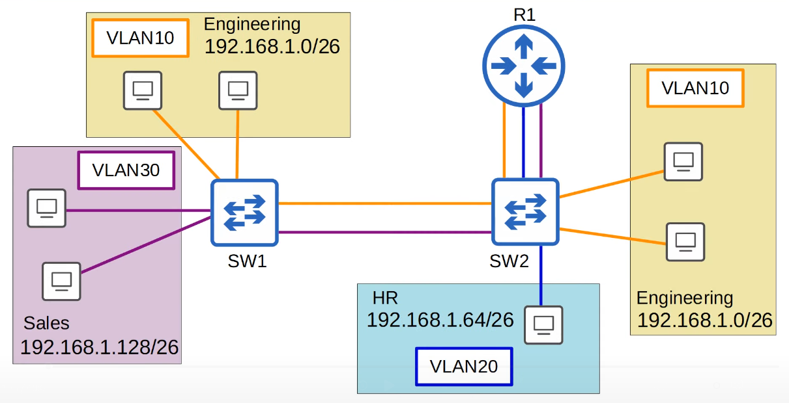
- This is the network topology we'll use for this video
- Note that VLAN10 is split between two switches
- This is very common, as departments in a company aren't always split up exactly by location
- You might have some engineers on one floor of the building, and some on a different floor
- We're still using only access ports
- There are two links between SW1 and SW2, one for VLAN10, and one for VLAN30
- There must be a link in VLAN10 between the two switches because VLAN10 PCs are connected to both SW1 and SW2
- Also, it's because the PCs connected to SW1 need to be able to reach R1 via SW2
- As for the link in VLAN30, it's necessary because PCs in VLAN30 also need to be able to reach R1 via SW2
- There is no link in VLAN20 between SW1 and SW2
- This is because there are no PCs in VLAN20 connected to SW1
- PCs in VLAN20 can still reach PCs connected to SW1, R1 will perform inter-VLAN routing
- So, let's say the PC in VLAN20 wants to send traffic to one of the VLAN10 PCs connected to SW1
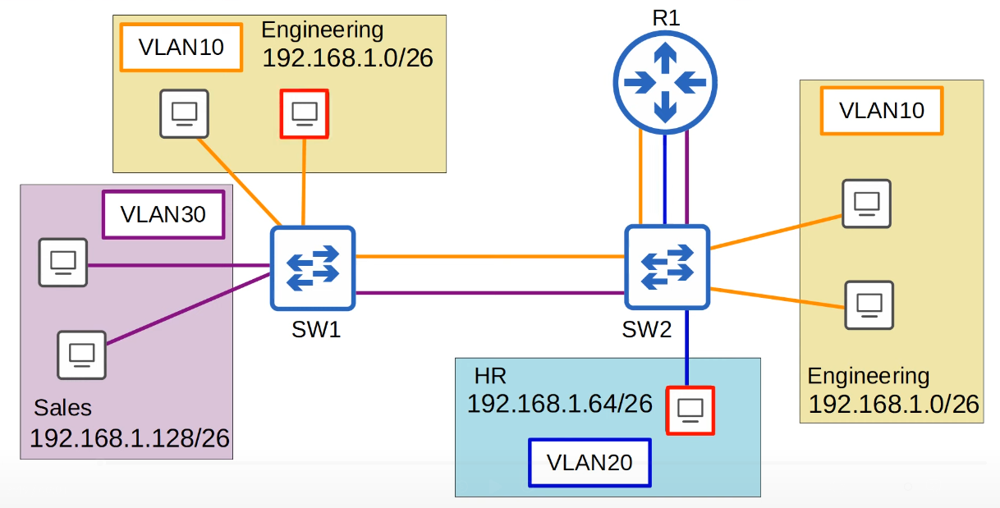
- It will send the frame with a destination MAC address of R1, its default gateway
- R1 then forwards it back to SW2
- Note that this traffic arrived at SW2 on the VLAN10 interface
- The traffic is now in VLAN10, so it forwards it to SW1 on the VLAN10 connection between them, and then SW1 forwards the traffic to the destination PC
- Here's what the whole process looks like:
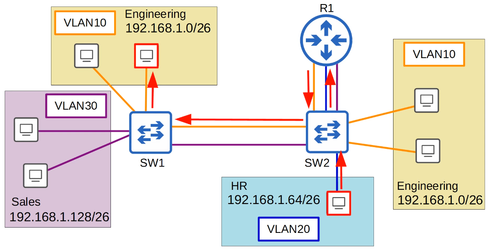
- So, even though there isn't a VLAN20 connection between SW2 and SW1, the PC in VLAN20 can still send traffic to the PC IN VLAN10, because the router performs **inter-VLAN routing**
### Trunk Ports
- In a small network with few VLANs, it's possible to use a separate interface for each VLAN when connecting switches to switches, and switches to routers
- However, when the number of VLANs increases, this is not viable
- It will result in wasted interfaces, and often routers won't have enough interfaces for each VLAN
- You can use **trunk ports** to carry traffic from multiple VLANs over a simple interface
- Once again, these are different from **access ports**, which belong to a single VLAN only
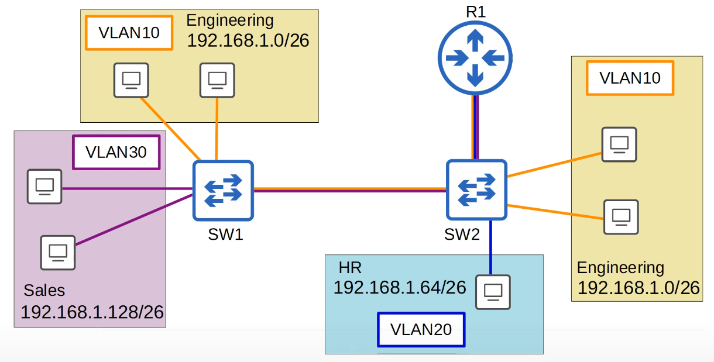
- Now the separate connections for each VLAN have been replaced with a single connection between SW1 and SW2, and SW2 and R1
- Let's say this PC in VLAN10 wants to send some data to this other PC in VLAN10:
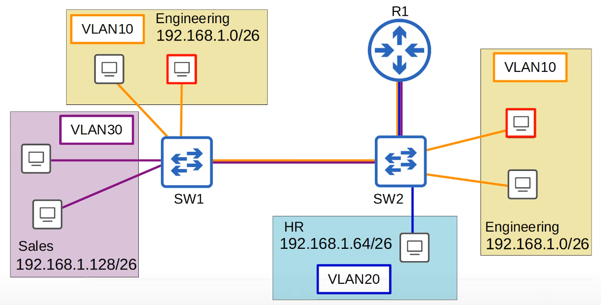
- It sends the traffic to SW2, which then sends it to SW1
- How does SW1 know which VLAN the traffic belongs to?
- Both VLANs 10 and 30 are allowed on the interface the traffic was received on, but how does SW1 know which VLAN it belongs to?
- The answer is **VLAN tagging**
- Switches will 'tag' all frames that they send over a trunk link
- This allows the receiving switch to know which VLAN the frame belongs to
- Another name for a trunk port is a **tagged port**
- Another name for an access port is an **'untagged' port**
- Frames sent over access ports aren't 'tagged', they don't need to be because the interface belongs to a single VLAN
- If a frame arrives on a switchport in VLAN10, the switch knows the frame is in VLAN10
### VLAN Tagging
- There are two main trunking protocols:
	- ISL (Inter-Switch Link)
	- IEEE 802.1Q (dot1q)
- ISL Is an old Cisco proprietary protocol created before the industry standard IEEE 802.1Q
- IEEE 802.1Q is an industry standard protocol created by the IEEE (Insitute of Electrical and Electronic Engineers)
- You will probably NEVER use ISL in the real world
- Even modern CISCO equipment doesn't support it
- For the CCNA, you only need to learn 802.1Q
### Ethernet Frame
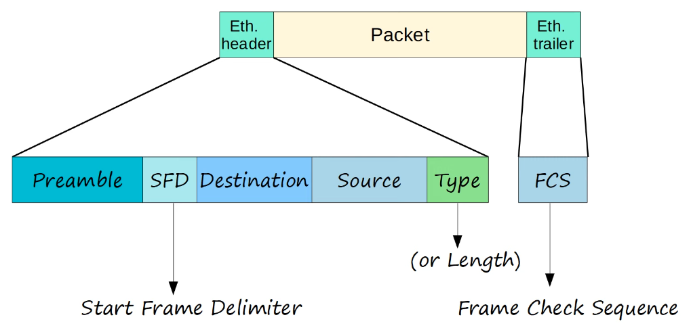
- The dot1q tag is inserted between two frames of the Ethernet header
- Dot1q inserts a 4-byte/32-bit field between two fields of this Ethernet header:

- As you can see here, the dot1q tag is inserted between the Source MAC address and the type/length field
### 802.1Q Tag
- The 802.1Q tag is inserted between the **Source** and **Type/Length** fields of the Ethernet frame
- The tag is 4 bytes (32 bits) in length
- Consists of two main fields:
	- Tag Protocol Identifier (TPID)
	- Tag Control Information (TCI)
- The TCI consists of three sub-fields
- 802.1Q tag format diagram:
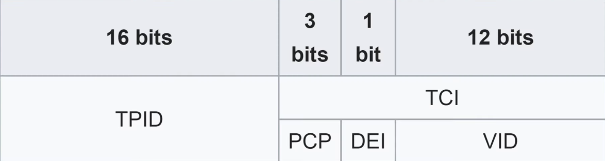
- It can be divided into two halves, the TPID and TCI fields
- The TCI can be divided into three sub-fields:
	- PCP
	- DEI
	- VID
### TPID (Tag Protocol Identifier)
- 16 bits (2 bytes) in length
- Always set to a value of 0x8100
- This indicates that the frame is 802.1Q tagged
### PCP (Priority Code Point)
- 3 bits in length
- Used for Class of Service (CoS), which prioritizes important traffic in congested networks
### DEI (Drop Eligible Indicator)
- 1 bit in length
- Used to indicate frames that can be dropped if the network is congested
### VID (VLAN ID)
- 12 bits in length
- Identifies the VLAN the frame belongs to (the most important field of the dot1q tag)
- 12 bits in length = 4096 total VLANs (2^12), range of 0-4095
- VLANs 0 and 4095 are reserved and can't be used
- Therefore, the actual range of VLANs is 1-4094
- Cisco's ISL also has a VLAN range of 1-4094
### VLAN Ranges
- The range of VLANs (1 - 4094) is divided into two sections:
	- Normal VLANs: 1 - 1005
	- Extended VLANs: 1006-4094
- Some older devices cannot use the extended VLAN range, however, it's safe to expect that modern switches will support the extended VLAN range
### Trunk Ports
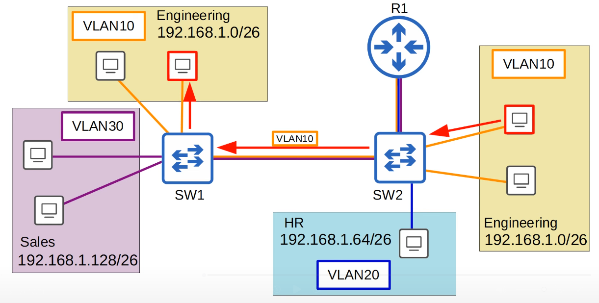
- The right PC in VLAN10 wants to send traffic to the other PC in VLAN10
- The traffic goes to SW2, which then forwards it to SW1, with a tag indicating that the traffic belongs to VLAN10
- SW1 receives the frame, and because the destination is also in VLAN10, it will forward the traffic to the destination
- Remember, a standard layer 2 switch like this will only forward traffic in the same VLAN, it will NOT forward traffic between VLANs
### Native VLAN
- 802.1Q has a feature called the **native VLAN** (ISL doesn't have this feature)
- The native VLAN is VLAN 1 by default on all trunk ports, however, this can be manually configured on each trunk port
- It's important to remember that this has to be configured on each trunk port separately, it's not a global configuration on the switch
- The switch doesn't add an 802.1Q tag to frames in the native VLAN
- When a switch receives an untagged frame on a trunk port, it assumes the frame belongs to the native VLAN
- **It's very important that the native VLAN matches!**
- Switches will still forward traffic if there's a native VLAN mismatch, but problems may occur
### Native VLAN Example
- Let's say VLAN10 has been configured as the native VLAN on the trunk link between SW1 and SW2

- Let's follow the same path as the previous example (VLAN10 PC to other VLAN10 PC)
- It will still send the traffic to SW1, but since it's in the native VLAN (VLAN10), it doesn't need to be tagged
- The untagged frame arrives at SW1, which assumes that the traffic belongs to VLAN10, so it forwards it to the destination
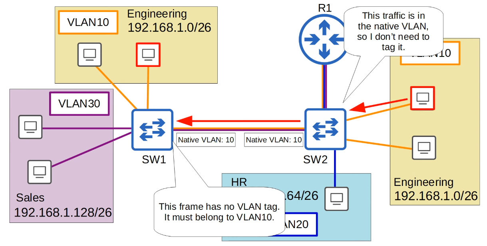
- This time, let's look at if there's a native VLAN mismatch configuration:
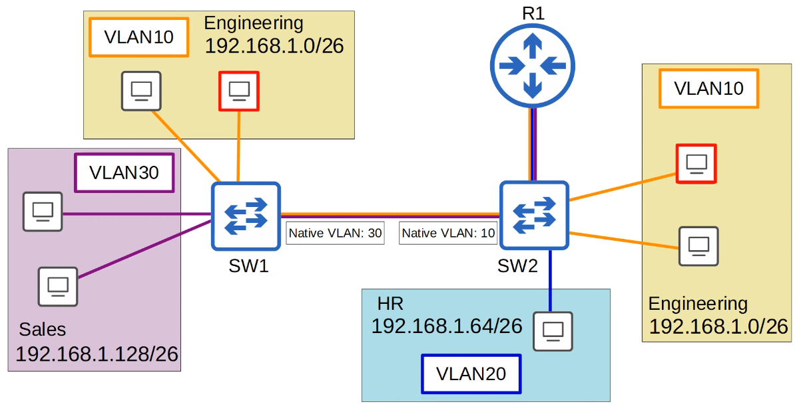
- On SW2's interface, VLAN10 has been configured as the native VLAN
- However, on SW1's interface, VLAN30 has been configured as the native VLAN
- Up to the point the traffic reaches SW1, it's the same
- However, when SW1 receives the frame, this is what it'll think:
	- This frame has no VLAN tag, therefore, it must belong to VLAN30
	- But, the destination is in VLAN10, not VLAN30
	- So, I won't forward the frame
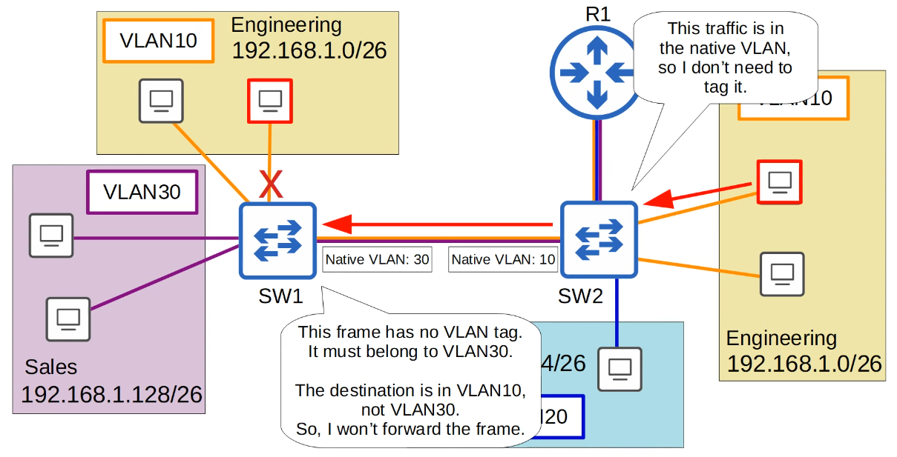
- This is why it's important that the native VLAN configuration matches between switches
### Trunk Configuration
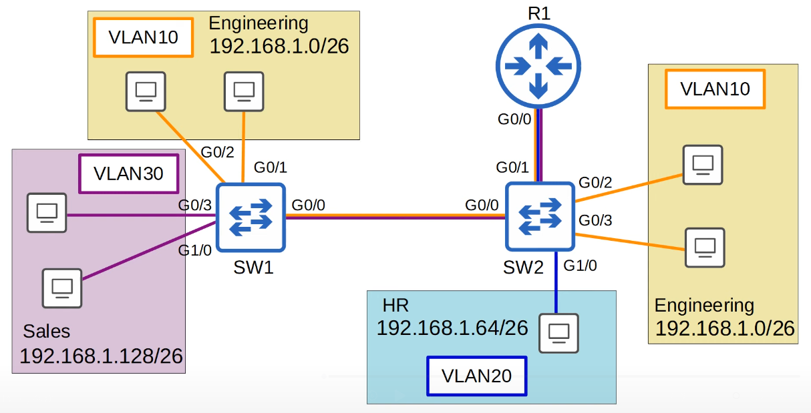
- We'll be configuring G0/0 on SW1, and G0/0 & G0/1 on SW2 as trunk ports
- Let's go on SW1 first:
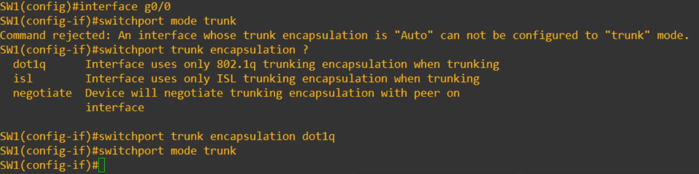
- Let's look at the most basic trunk configuration, manually configuring the interface as a trunk
- After entering interface config mode, use the `switchport mode trunk` command to manually configure the interface as a trunk
- However, in this case, we got an error message: `Command rejected: An interface whose trunk encapsulation is "Auto" can not be configured to "trunk" mode`
- This is a bit of tricky error
- Many modern switches do not support Cisco's ISL at all, they only support 802.1Q (dot1q)
- However, switches that do support both (like the one being used in this example) have a trunk encapsulation of 'Auto' by default
- To manually configure the interface as a trunk port, you must first set the encapsulation to 802.1Q or ISL
- On switches that only support 802.1Q, this isn't necessary
- After you set the encapsulation type, you can then configure the interface as a trunk
- To set the encapsulation type, you use the `switchport trunk encapsulation` command
- After running `switchport trunk encapsulation dot1q`, the `switchport mode trunk` command is accepted
- On switches that only support dot1q, you will only need the switchport mode trunk command
- But, on some switches, you will need to set the encapsulation first
- To confirm these changes, we can use the `show interfaces trunk` command:
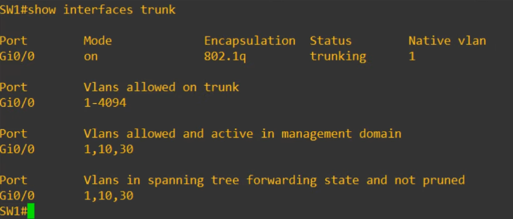
- `Mode on` means that the interface was manually configured as a trunk
- By default, all VLANs 1-4094 are allowed on the trunk
- However, for security purposes, we might want to limit which VLANs can be forwarded on the trunk
- Here is the command to configure the VLANs allowed on a trunk:
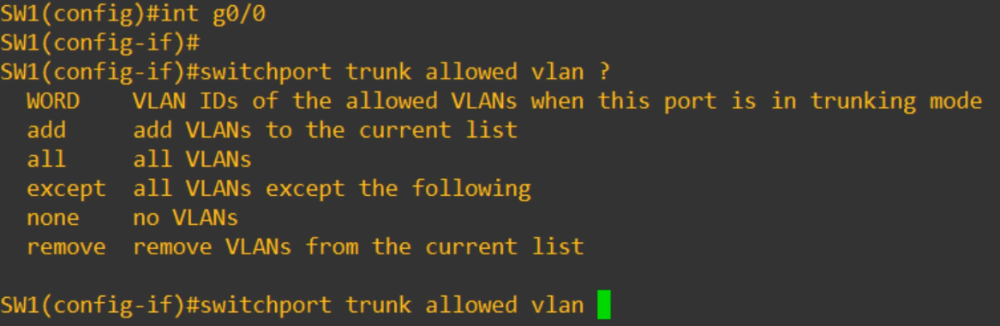
- The command is `switchport trunk allowed vlan`, and it contains a few options:
	- `WORD` allows you to simply configure the list of VLANs allowed
	- `add` allows you to add to the existing VLAN list
	- `remove` simply removes VLANs from the current list
	- `all` is pretty self-explanatory
	- `except` allows all VLANs except for whatever is whitelisted
	- `none` is also self-explanatory

- Since VLAN20 hasn't actually been created on this switch, it still isn't displayed in the VLANs allowed and active in management domain section
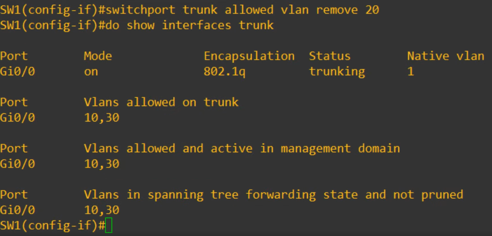
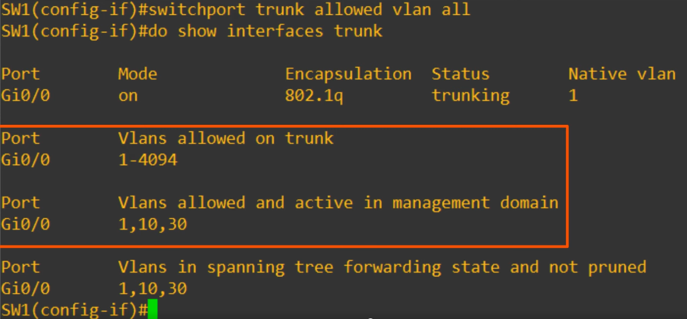
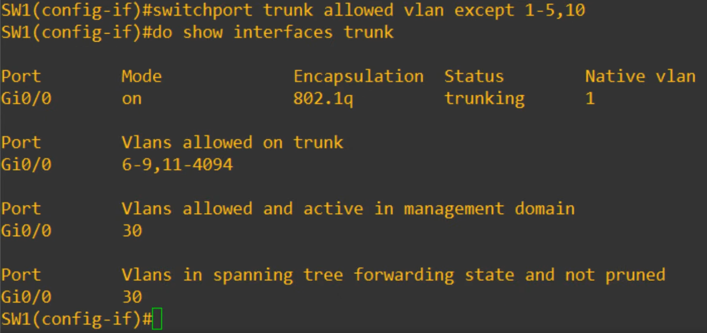
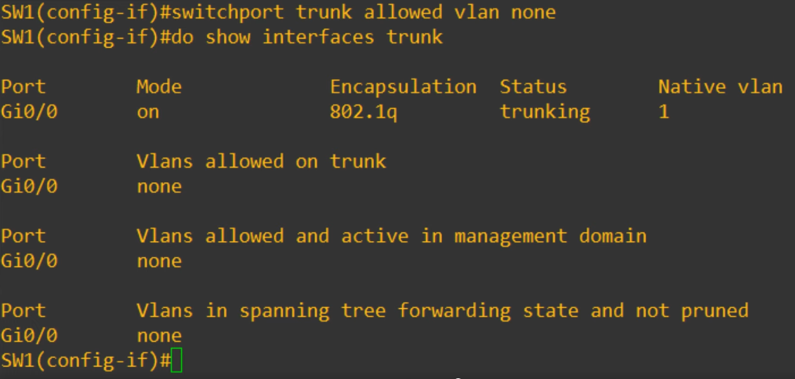
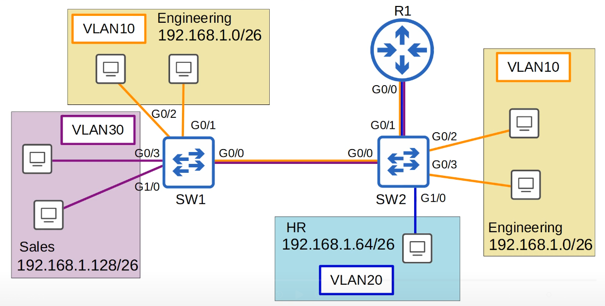
- SW1 has hosts in VLAN10 and VLAN30 connected to it
- No hosts in VLAN20 are connected, so there's no need to allow VLAN20 on the trunk between SW1 and SW2
- So, let's set the allowed VLANs to 20 and 30:
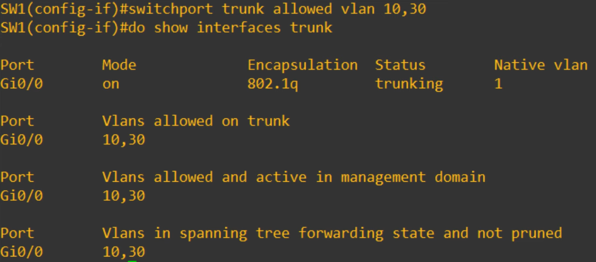
- The reason to do this is for security purposes, so that only traffic in the necessary VLANs can use that connection
- Also, for network performance purposes, this avoids unnecessary traffic, because broadcasts and such in other VLANs won't be sent over the trunk
- For security purposes, it is best to change the native VLAN to an **unused VLAN**
- Network security will be explained more in-depth later in the course
- **Make sure the native VLAN matches between switches**
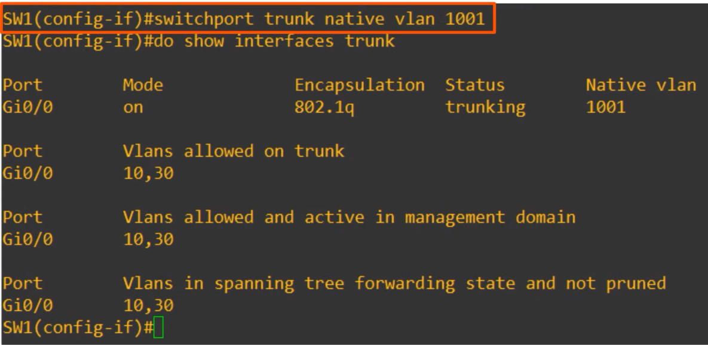
- The command to change the native VLAN is `switport trunk native vlan` followed by the VLAN number
- We can see these changes reflected when running the `do show interfaces trunk` command
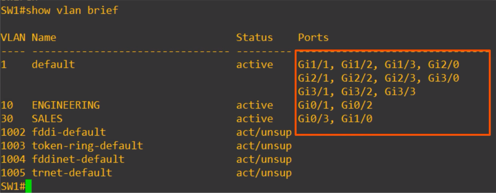
- Notice that `G0/0` is not listed anywhere 
- Not in VLAN10 or VLAN30, even though those are the VLANs allowed on the trunk
- This is because the `show vlan brief` command shows the access ports assigned to each VLAN, NOT the trunk ports that allow each VLAN
- Instead, we can use the `show interfaces trunk` command to confirm trunk ports
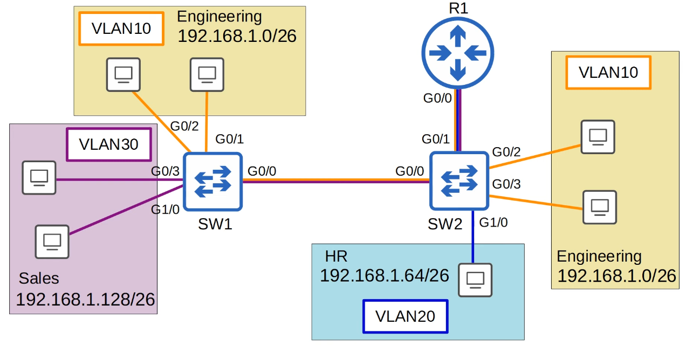
- Now it's time to configure SW2
- As seen in the diagram, on SW2's G0/0 interface, we must allow VLANs 10 and 30
- On the G0/1 interface, however, we must allow VLAN 20 as well
- Here are the configurations for SW2's G0/0 interface:
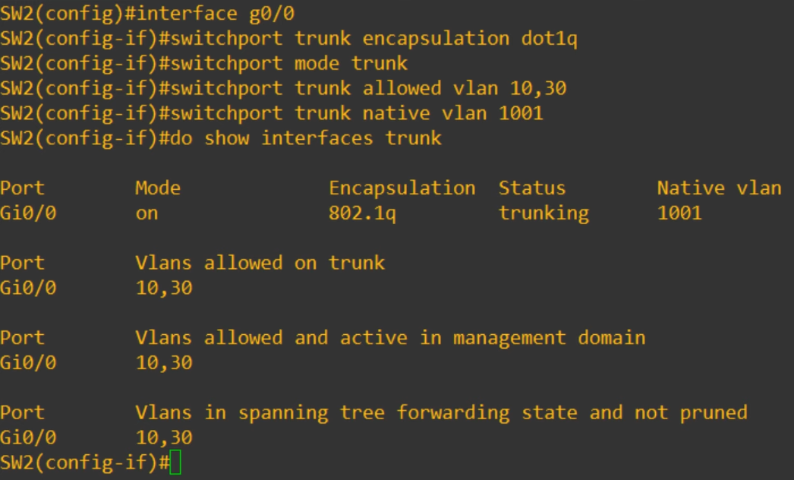
- These are the same commands as before when configuring SW1
- Here are the configurations for SW2'S G0/1 interface:
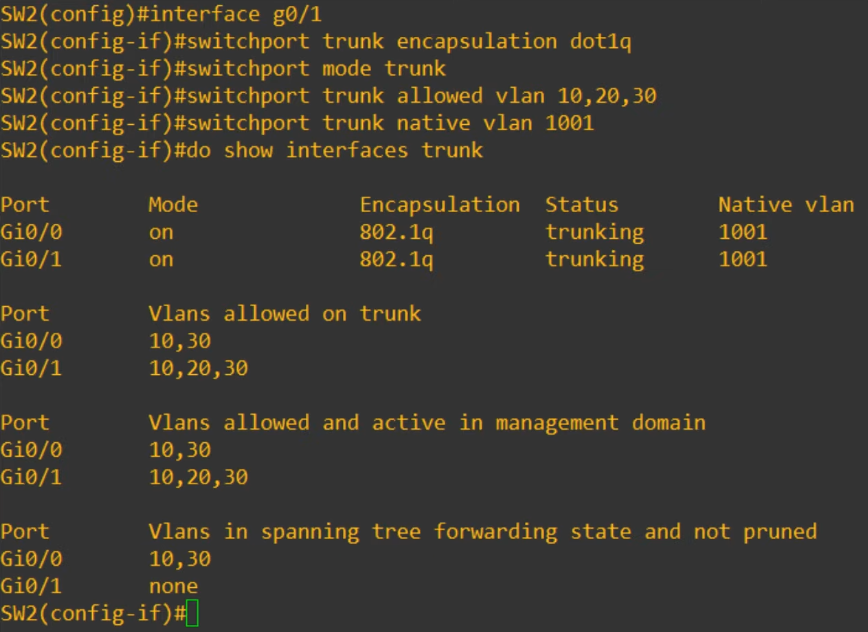
- This is almost identical to G0/0, except we now allow VLAN20 in addition to VLAN10 and 30
- Now, both G0/0 and G0/1 are displayed in the output of the `show interfaces trunk` command
### Router Configuration
- In the previous lecture, we used three separate interfaces for the connection from SW2 to RR1, and assigned a separate IP address to each one on R1
- Each one served as the default gateway address for the PCs in each VLAN
- However, now we are using only one physical connection between the two devices
- We must use **sub-interfaces** on R1
### Router on a Stick (ROAS)
- ROAS is the name of this method of inter-VLAN routing, as there is only a single physical interface connecting the router and the switch
- It looks like a 'stick' on the network topology diagram
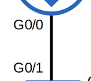
- In this case that one physical interface being used on R1 to connect to SW2 is G0/0
- It's connected to G0/1 on SW2
- But, we can divide this one physical interface into three separate sub-interfaces
- This will allow us to perform inter-VLAN routing with only one physical interface
- So, it would look like this:
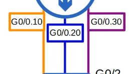
* These three logical sub-interfaces are really one physical interface, G0/0 which is connected to SW2's G0/1 interface, but they can operate like three separate interfaces
* Before looking at router configurations, note that we don't need to do any additional configurations on SW2
* We already configured G0/1 as a trunk, and made sure that VLANs 10, 20, and 30 are allowed
* That's all you need to do on the switch, configure the interface like a regular trunk
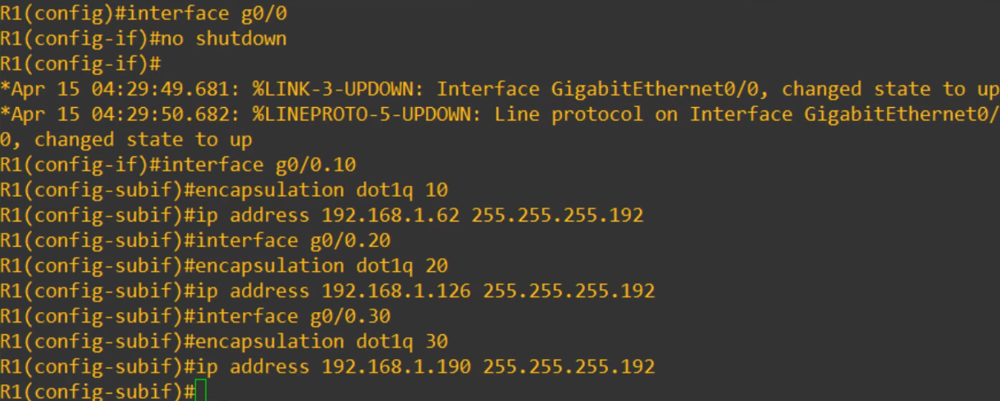
- First, we have to make sure the interface is enabled using the `no shutdown` command
- Next up is the first subinterface
- The way to enter the subinterface config mode is by using the .x option at the end: `interface g0/0.10`
- The subinterface number **does not** have to match the VLAN number
- However, it is **highly recommended** that they do match, to make it easier to understand
- The next command after that is `encapsulation dot1q`, followed by the VLAN number (10 in this case)
- This tells the router to treat any arriving frames tagged with the specific VLAN number as if they arrived on this sub interface
- If a frame arrives tagged with VLAN10, R1 will behave as if it arrived on interface G0/0.10
- It will also tag all frames leaving this subinterface with VLAN10 using dot1q
- Finally, after running the `encapsulation` command, we simply assign the IP address to the subinterface
- In this example, we used the last usable address of the subnet
- The same steps are repeated for the other two subinterfaces
- Here's what we can see if we confirm using the `show ip interface brief` command:
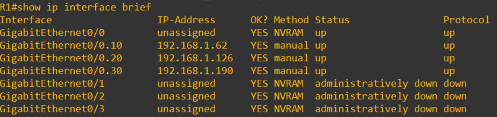
- We can see that each of the subinterfaces appear, as well as the physical interface
- Although, the physical interface itself has no IP address assigned to it
- Here is the routing table:
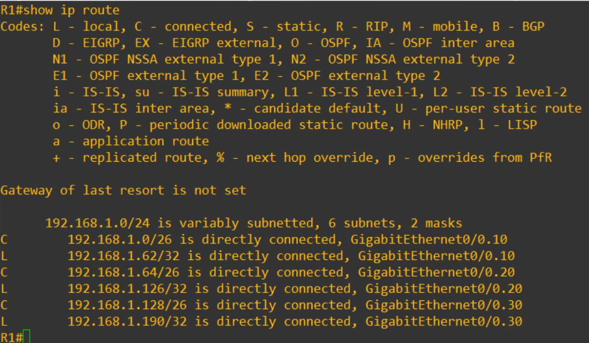
- Notice that the connected and local routes are added, just like when IP addresses are added to regular physical interfaces
- When R1 sends frames out of these subinterfaces, it adds the VLAN tag configured on the subinterface
- For example, if a packet arrives destined for the 192.168.1.64/26 subnet, it will send the packet out of it's G0/0 interface tagged with VLAN20
### ROAS Summary
- ROAS Is used to route between multiple VLANs using a single interface on the router and switch
- The switch interface is configured as a regular trunk
- The router interface is configured using **subinterfaces**
- You configure the VLAN tag and IP address on each subinterface
- The router will behave as if frames arriving with a certain VLAN tag have arrived on the subinterface configured with that VLAN tag
- The router will tag frames sent out of each subinterface with the VLAN tag configured on the subinterface
- Now that we've configured the router, let's return to this diagram to see how inter-VLAN routing works with these subinterfaces:
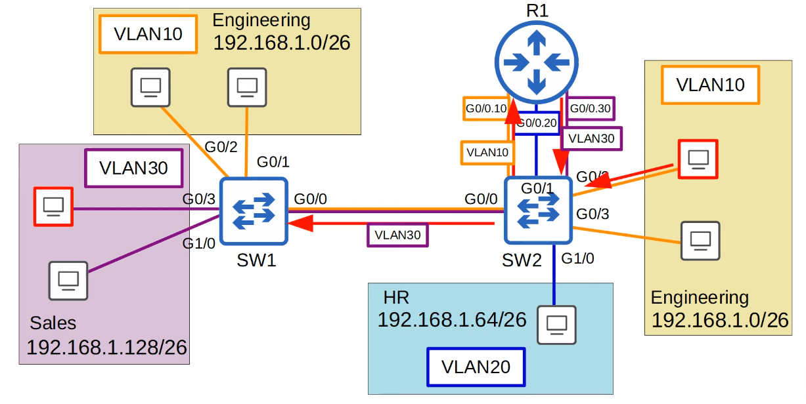
### Things We Covered
- **What is a trunk port?**
	- A switch interface that carries traffic over multiple VLANs
- **What is the purpose of trunk ports?**
	- Allows switches to forward traffic from multiple VLANs over a single physical interface, instead of having to use a separate physical interface for every single VLAN
- **802.1Q Encapsulation**
	- A tag inserted into the Ethernet frame and is used to identify which VLAN the frame belongs to when sent over a trunk port
- **How to configure trunk ports**
	- Including the encapsulation type, allowed VLANs, and native VLAN
- **'Router on a Stick' (ROAS)**
	- Involves configuring multiple subinterfaces on a single physical interface, which again allows for traffic from multiple VLANs and subnets to be routed without having to use a separate physical interface for each one (trunk port on a router)
### Quiz Question 1
You want to configure SW1 to send VLAN10 frames untagged over it's G0/1 interface, a trunk. Which command is appropriate?
	a. `encapsulation dot1q 10`
	b. `switchport trunk allowed vlan 10`
	c. `switchport trunk allowed vlan add 10`
	d. `switchport trunk native vlan 10`
**Answer: D** (I answered B incorrectly)
- Answer A is used on a router subinterface to specify which VLAN it belongs to
- B and C are used to modify the VLANs allowed on the trunk
- **D** is used to specify the native VLAN, and traffic in the native VLAN is sent untagged over the trunk
### Quiz Question 2
After modifying the VLANs allowed on a trunk interface, you want to return it to the default state. Which command will do this?
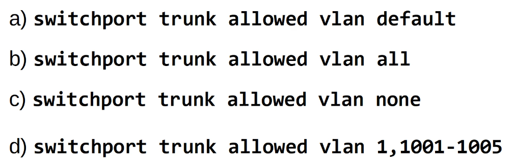
**Answer: B** (I chose A incorrectly)
- By default, ALL VLANs are allowed on a trunk port, so running `switchport trunk allowed vlan all` will return it to the default state
- Answer D lists the VLANs that exist on a Cisco switch by default, but that's different from the VLANs allowed on a trunk by default
### Quiz Question 3
You try to configure an interface on a Cisco switch as a trunk port with the command `switchport mode trunk`, but the command is rejected. Which command might fix this issue?
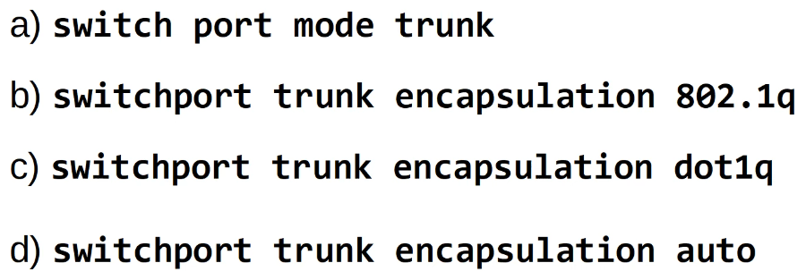
**Answer: C**
- On Cisco switches that support both 802.1Q and ISL encapsulations for trunk ports, if you want to manually configure the interface as a trunk youb have to manually specify the encapsulation type with `switchport trunk encapsulation dot1q`
### Quiz Question 4
Which field of the 802.1Q tag identifies the VLAN ID of the frame?

**Answer: B**
- VID = VLAN ID
### Quiz Question 5
You configured `switchport trunk allowed vlan add 10` on an interface, but VLAN10 doesn't appear in the `vlans allowed and active in management domain` section of the `show interfaces trunk` command output. What might be the reason?
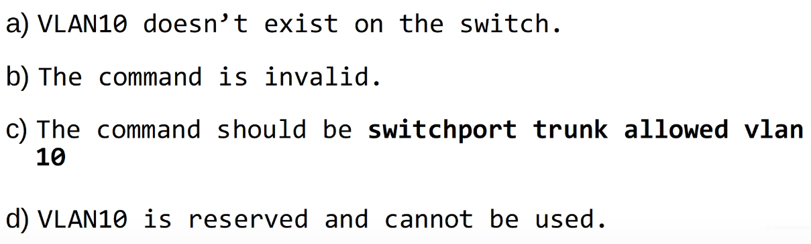
**Answer: A** (I answered C incorrectly)
- If a VLAN doesn't exist on the switch, even if it is allowed on the trunk, it won't appear in the `vlans allowed and active in management domain` section of the show interfaces trunk command output