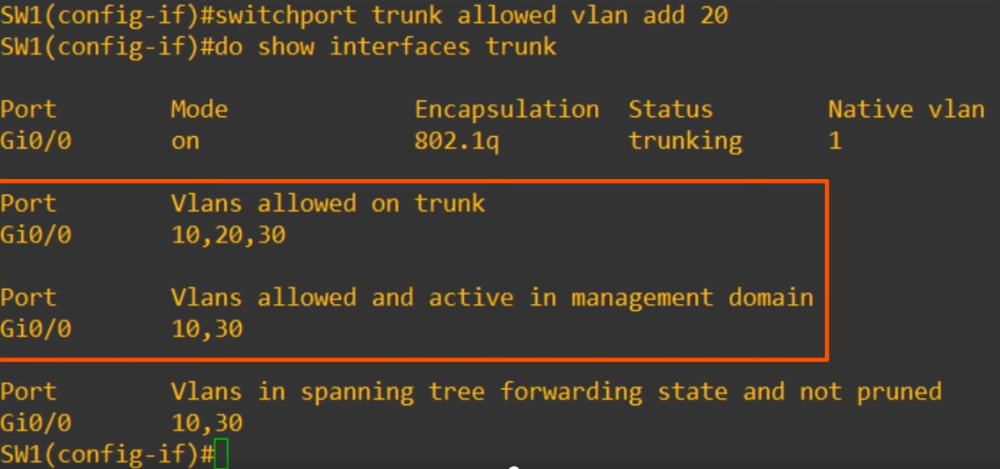

# VLANs (Part 2)
### Thing's We'll Cover
- What is a trunk port?
- What is the purpose of trunk ports?
- 802.1Q Encapsulation
- How to configure trunk ports
- 'Router on a Stick' (ROAS)
### VLANs

- This is the network topology we'll use for this video
- Note that VLAN10 is split between two switches
- This is very common, as departments in a company aren't always split up exactly by location
- You might have some engineers on one floor fo the building, and some on a different floor
- We're still using only access ports
- There are two links between SW1 and SW2, one for VLAN10, and one for VLAN30
- There must be a link in VLAN10 between the two switches because VLAN10 PCs are connected to both SW1 and SW2
- Also, it's because the PCs connected to SW1 need to be able to reach R1 via SW2
- As for the link in VLAN30, it's necessary because PCs in VLAN30 also need to be able to reach R1 via SW2
- There is no link in VLAN20 between SW1 and SW2
- This is because there are no PCs in VLAN20 connected to SW1
- PCs in VLAN20 can still reach PCs connected to SW1, R1 will perform inter-VLAN routing
- So, let's say the PC in VLAN20 wants to send traffic to one of the VLAN10 PCs connected to SW1

- It will send the frame with a destination MAC address of R1, its default gateway
- R1 then forwards it back to SW2
- Note that this traffic arrived at SW2 on the VLAN10 interface
- The traffic is now in VLAN10, so it forwards it to SW1 on the VLAN10 connection between them, and then SW1 forwards the traffic to the destination PC
- Here's what the whole process looks like:

- So, even though there isn't a VLAN20 connection between SW2 and SW1, the PC in VLAN20 can still send traffic to the PC IN VLAN10, because the router performs **inter-VLAN routing**
### Trunk Ports
- In a small network with few VLANs, it's possible to use a separate interface for each VLAN when connecting switches to switches, and switches to routers
- However, when the number of VLANs increases, this is not viable
- It will result in wasted interfaces, and often routers won't have enough interfaces for each VLAN
- You can use **trunk ports** to carry traffic from multiple VLANs over a simple interface
- Once again, these are different from **access ports**, which belong to a single VLAN only

- Now the separate connections for each VLAN have been replaced with a single connection between SW1 and SW2, and SW2 and R1
- Let's say this PC in VLAN10 wants to send some data to this other PC in VLAN10:

- It sends the traffic to SW2, which then sends it to SW1
- How does SW1 know which VLAN the traffic belongs to?
- Both VLANs 10 and 30 are allowed on the interface the traffic was received on, but how does SW1 know which VLAN it belongs to?
- The answer is **VLAN tagging**
- Switches will 'tag' all frames that they send over a trunk link
- This allows the receiving switch to know which VLAN the frame belongs to
- Another name for a trunk port is a **'tagged port**
- Another name for an access port is an **'untagged' port**
- Frames sent over access ports aren't 'tagged', they don't need to be because the interface belongs to a single VLAN
- If a frame arrives on a switchport in VLAN10, the switch knows the frame is in VLAN10
### VLAN Tagging
- There are two main trunking protocols:
	- ISL (Inter-Switch Link)
	- IEEE 802.1Q (dot1q)
- ISL Is an old Cisco proprietary protocol created before the industry standard IEEE 802.1Q
- IEEE 802.1Q is an industry standard protocol created by the IEEE (Insitute of Electrical and Electronic Engineers)
- You will probably NEVER use ISL in the real world
- Even modern CISCO equpment doesn't support it
- For the CCNA, you only need to learn 802.1Q
### Ethernet Frame

- The dot1q tag is inserted between two frames of the ethernet header
- Dot1q inserts a 4-byte/32-bit field between two fields of this Ethernet header:

- As you can see here, the dot1q tag is inserted betwen the Source MAC address and the type/length field
### 802.1Q Tag
- The 802.1Q tag is inserted between the **Source** and **Type/Length** fields of the Ethernet frame
- The tag is 4 bytes (32 bits) in length
- Consists of two main fields:
	- Tag Protocol Identifier (TPID)
	- Tag Control Information (TCI)
- The TCI consists of three sub-fields
- 802.1Q tag format diagram:

- It can be divided into two halves, the TPID and TCI fields
- The TCI can be divided into three sub-fields:
	- PCP
	- DEI
	- VID
### TPID (Tag Protocol Identifier)
- 16 bits (2 bytes) in length
- Always set to a value of 0x8100
- This indicates that the frame is 802.1Q tagged
### PCP (Priority Code Point)
- 3 bits in length
- Used for Class of Service (CoS), which prioritizes important traffic in congested networks
### DEI (Drop Eligible Indicator)
- 1 bit in length
- Used to indicate frames that can be dropped if the network is congested
### VID (VLAN ID)
- 12 bits in length
- Identifies the VLAN the frame belongs to (the most important field of the dot1q tag)
- 12 bits in length = 4096 total VLANs (2^12), range of 0-4095
- VLANs 0 and 4095 are reserved and can't be used
- Therefore, the actual range of VLANs is 1-4094
- Cisco's ISL also has a VLAN range of 1-4094
### VLAN Ranges
- The range of VLANs (1 - 4094) is divided into two sections:
	- Normal VLANs: 1 - 1005
	- Extended VLANs: 1006-4094
- Some older devices cannot use the extended VLAN range, however, it's safe to expect that modern switches will support the extended VLAN range
### Trunk Ports

- The right PC in VLAN10 wants to send traffic to the other PC in VLAN10
- The traffic goes to SW2, which then forwards it to SW1, with a tag indicating that the traffic belongs to VLAN10
- SW1 receives the frame, and because the destination is also in VLAN10, it will forward the traffic to the destination
- Remember, a standard layer 2 switch like this will only forward traffic in the same VLAN, it will NOT forward traffic between VLANs
### Native VLAN
- 802.1Q has a feature called the **native VLAN** (ISL doesn't have this feature)
- The native VLAN is VLAN 1 by default on all trunk ports, however, this can be manually configured on each trunk port
- It's important to remember that this has to be configured on each trunk port separately, it's not a global configuration on the switch
- The switch doesn't add an 802.1Q tag to frames in the native VLAN
- When a switch reveives an untagged frame on a trunk port, it assumes the frame belongs to the native VLAN
- **It's very important that the native VLAN matches!**
- Switches will still forward traffic if there's a native VLAN mismatch, but problems may occur
### Native VLAN Example
- Let's say VLAN10 has been configured as the native VLAN on the trunk link between SW1 and SW2

- Let's follow the same path as the previous example (VLAN10 PC to other VLAN10 PC)
- It will still send the traffic to SW1, but since it's in the native VLAN (VLAN10), it doesn't need to be tagged
- The untagged frame arrives at SW1, which assumes that the traffic belongs to VLAN10, so it forwards it to the destination

- This time, let's look at if there's a native VLAN mismatch configuration:

- On SW2's interface, VLAN10 has been configured as the native VLAN
- However, on SW1's interface, VLAN30 has been configured as the native VLAN
- Up to the point the traffic reaches SW1, it's the same
- However, when SW1 receives the frame, this is what it'll think:
	- This frame has no VLAN tag, therefore, it must belong to VLAN30
	- But, the destination is in VLAN10, not VLAN30
	- So, I won't forward the frame

- This is why it's important that the native VLAN configuration matches between switches
### Trunk Configuration

- We'll be configuring G0/0 on SW1, and G0/0 & G0/1 on SW2 as trunk ports
- Let's go on SW1 first:

- Let's look at the most basic trunk configuration, manually configuring the interface as a trunk
- After entering interface config mode, use the `switchport mode trunk` command to manually configure the interface as a trunk
- However, in this case, we got an error message: `Command rejected: An interface whose trunk encapsulation is "Auto" can not be configured to "trunk" mode`
- This is a bit of tricky error
- Many modern switches do not support Cisco's ISL at all, they only support 802.1Q (dot1q)
- However, switches that do support both (like the one being used in this example) have a trunk encapsulation of 'Auto' by default
- To manually configure the interface as a trunk port, you mnust first set the encapsulation to 802.1Q or ISL
- On switches that only support 802.1Q, this isn't necessary
- After you set the encapsulation type, you can then configure the interface as a trunk
- To set the encapsulation type, you use the `switchport trunk encapsulation` command
- After running `switchport trunk encapsulation dot1q`, the `switchport mode trunk` command is accepted
- On switches that only support dot1q, you will only need the switchport mode trunk command
- But, on some switches, you will need to set the encapsulation first
- To confirm these changes, we can use the `show interfaces trunk` command:

- `Mode on` means that the interface was manually configured as a trunk
- By default, all VLANs 1-4094 are allowed on the trunk
- However, for security purposes, we might want to limit which VLANs can be forwarded on the trunk
- Here is the command to configure the VLANs allowed on a trunk:

- The command is `switchport trunk allowed vlan`, and it contains a few options:
	- `WORD` allows you to simply configure the list of VLANs allowed
	- `add` allows you to add to the existing VLAN list
	- `remove` simply removes VLANs from the current list
	- `all` is pretty self explanatory
	- `except` allows all VLANs excpet for whatever is whitelisted
	- `none` is also self explanatory

- Since VLAN20 hasn't actually been created on this switch, it still isn't displayed in the VLANs allowed and active in management domain section

- SW1 has hosts in VLAN10 and VLAN30 connected to it
- No hsots in VLAN20 are connected, so there's no need to allow VLAN20 on the trunk between SW1 and SW2
- So, let's set the allowed VLANs to 20 and 30:

- The reason to do this is for security purposes, so that only traffic in the necessary VLANs can use that connection
- Also, for network performance purposes, this avoids unnecessary traffic, because broadcasts and such in other VLANs won't be sent over the trunk
- For security purpoises, it is best to change the native VLAN to an **unused VLAN**
- Network security will be explained more in-depth later in the course
- **Make sure the native VLAN matches betwen switches**