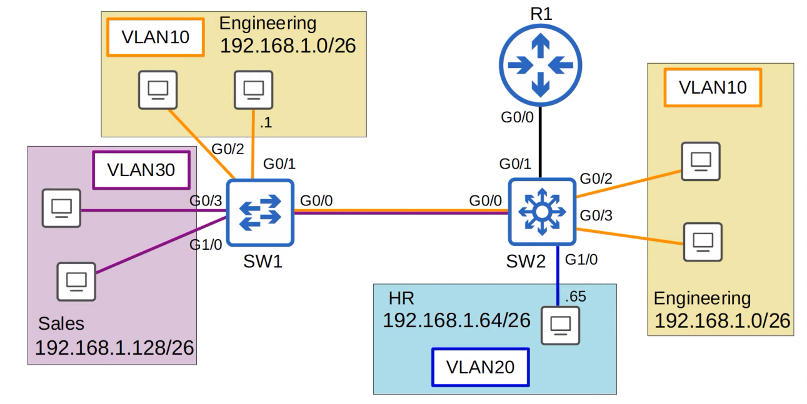

# VLANs (Part 3)
### Things We'll Cover
- Native VLAN on a router
- Wireshark Analysis
- Layer 3 Switching/Multilayer Switching
### Native VLAN on a Router (ROAS)

- The best practice is to set the native VLAN to an unused one for both security and performance purposes
- The native VLAN feature does have one benefit
- Because frames in the native VLAN aren't tagged, it's more efficient
- Each frame is smaller, so it allows the device to send more frames per second
- In the previous lecture, the native VLAN was set to 1001 on the G0/0 interface of both SW1 and SW2
- Just for this demonstration, let's set them back to a used VLAN, VLAN 10, on all trunks

- There are **2 methods** of configuring the native VLAN on a router:
	- Use the command `encapsulation dot1q [vlan-id] native` on the router subinterface
		- This tells the router that this subinterface belongs to the native VLAN, and it will function just like the native VLAN on a switch
		- It'll assume untagged frames belong to the native VLAN, and frames sent in the native VLAN will not be tagged
		- 
	- Configure the IP address for the native VLAN on the router's physical interface (the `encapsulation dot1q [vlan-id]` command is not necessary)

- This PC in VLAN 20 has an IP address of 192.168.1.65
- The other PC in VLAN 10 has an IP address of 192.168.1.1
- We'll use Wireshark to monitor the connection between R1 and SW2
- We'll first look at the capture of the ICMP echo request message as it goes from SW2 to R1
- It'll be in VLAN 20, and it's being sent to R1 for inter-VLAN routing
### Wireshark Capture - 1st Method (SW2 → R1)

- Let's look at the Ethernet header captured in the packet, specifically the `Type` field
- We see the value as `802.1Q Virtual LAN (0x8100)`
- As stated in the previous lecture, the dot1q field is inserted after the source MAC address field
- That is where the `Type` field usually goes
- This here is the `TPID` field of the dot1q tag
- Under the Ethernet header are the rest of the fields of the 802.1Q tag

- First is the **PCP (Priority Code Point)**
	- It has a value of 0, so no special priority is given to this frame
- Under it is the **DEI (Drop Eligible Indicator)**
	- Again, a value of 0, so it won't be dropped during times of network congestion
- Next is the most important field, the **VLAN ID**, which is 20 as expected
	- The PC that sent the ping is in VLAN 20, and it's not the native VLAN, which is why this frame is tagged
- Finally, under that is the normal **Type** field of the Ethernet header, indicating that an IPv4 packet is encapsulated
	- It normally comes after the Source MAC Address field, but now the dot1q tag is between them

- Next, let's look at the ICMP echo request going from R1 back to SW2
- It'll now be in VLAN 10, because the destination is in VLAN 10
- VLAN 10 is configured as the native VLAN on both R1 and SW2, so let's see what's different

- Here's the exact same ICMP echo request, the exact same layer 3 packet, as it is sent from R1 to SW2

- It's been encapsulated with a new Ethernet header, but this Ethernet header doesn't have a dot1q tag
- This is the native VLAN function at work
- Both R1 and SW2 understand that untagged frames belong to VLAN 10, so there is no need to tag each frame with dot1q

- That ICMP echo request will continue to the destination, untagged all the way because VLAN 10 is configured as the native VLAN on all devices
- When this PC in VLAN 10 sends the ICMP echo reply, it'll be untagged until it reaches R1
- R1 will then tag it in VLAN 20, and send it back to the PC that sent the request
### Second Method of Configuring the Native VLAN on a Router
- Configure the IP address for the native VLAN on the router's physical interface (the `encapsulation dot1q [vlan-id]` command is not necessary)

- `no interface g0/0.10`: Deletes the subinterface
- `interface g0/0`: Enter config mode from g0/0
- `ip address 192.168.1.62 255.255.255.192`: Configuring the appropriate IP address on the interface
- To help visualize this, here's the output of the `show running-config` command for g0/0 and its subinterfaces:

- First off, these commands here on the physical interface are there by default:
```
duplex auto
speed auto
media-type rj45
```
- The physical interface is configured normally with an IP address:
```
interface GigabitEthernet0/0
 ip address 192.168.1.62 255.255.255.192
```
- This will be used for the native VLAN, VLAN 10
- The other subinterfaces are just like we configured them in the previous lecture, with the encapsulation dot1q command and their own IP address:
```
interface GigabitEthernet0/0.20
 encapsulation dot1Q 20
 ip address 192.168.1.126 255.255.255.192
!
interface GigabitEthernet0/0.30
 encapsulation dot1Q 30
 ip address 192.168.1.190 255.255.255.192
 ```
 - This will function just like the first option we saw
 - SW2 will send VLAN 10 packet sin untagged frames to R1, and R1 will send them in untagged frames as well
 - As stated before, it's recommended that you just change the native VLAN to an unused VLAN for security purposes
 - But, if you want to use the native VLAN, it's important to know how to do it on a router
### Layer 3 (Multilayer) Switches

- Here is the topology once again, with one router and two switches
- Both switches can be categorized as **Layer 2** switches

- We now have  a new icon representing a **layer 3 switch**, also known as a **multilayer switch**
- From now on, either term will be used (layer 3 switch or multilayer switch)

- These are the official Cisco icons for these two types of switches
- First, let's review exactly what a multilayer switch does
- A multilayer switch is capable of both *switching* and *routing*
- It is 'Layer 3 aware'
	- A regular Layer 2 switch is NOT Layer 3 aware
	- It doesn't think at all about IP addresses or anything above Layer 2, only L2 info like MAC addresses
- You can assign IP addresses to its interfaces, like a router
	- Previously, we haven't assigned any IP addresses to switches, only routers
	- With an L3 switch, you can configure 'routed ports', which function like an interface on a router
- You can create virtual interfaces for each VLAN, and assign IP addresses to those interfaces
	- These are not separate physical interfaces, but virtual interfaces in the software of the switch that can be used to route traffic at L3
- You can configure routes on it, like static routes, just like a router
- It can be used for inter-VLAN routing
	- So far, we've looked at two methods of inter-VLAN routing
	- The first one introduced in [Day 16 - VLANs (Part 1)](Day%2016%20-%20VLANs%20(Part%201).md) was using one connection for each VLAN between the router and switch
		- This works, but if you have many VLANs you probably won't have enough interfaces on your router
	- The second method was ROAS (Router on a Stick), which uses a single trunk connection which carries traffic from all VLANs between the switch and router for inter-VLAN routing
		- This is efficient in terms of the number of interfaces, just one, but in a busy network, all the traffic going to the router and back to the switch can cause network congestion
	- So, in large networks, a multilayer switch is the preferred method of inter-VLAN routing
- Here's the topology with SW2 replaced with a multilayer switch, as well as the trunk link between SW2 and R1 being replaced with a point-to-point L3 link:

- We will no longer run VLANs on this topology
- When we used ROAS for inter-vlan routing, traffic being routed between VLANs was sent to R1 first, and then sent back to SW2, and then forwarded to the destination
- For example, if the PC in VLAN20 wants to ping the PC in VLAN10 (192.168.1.1), the traffic would follow the following path:

- However, SW2 is a multilayer switch meaning it doesn't have to send the traffic to R1 for inter-VLAN routing
- It can do that with something called 'Switch Virtual Interfaces'
### Inter-VLAN Routing via SVI
- SVIs (Switch Virtual Interfaces) are the virtual interfaces you can assign IP addresses to in a multilayer switch
- Configure each PC to use the SVI (NOT the router) as their gateway address
	- When using ROAS, the router was used as the PC's gateway
	- This time, we'll use the switch's SVIs instead
	- To send traffic to different subnets/VLANs, the PCs will send traffic to the switch, and the switch will route the traffic

- These are the same IP addresses that were configured on R1 when doing ROAS, the last usable IP address in each subnet
- These are already configured on each PC as their gateway addresses, so there's no need to change the PC configurations
- Here's the new path the traffic between these two PCs take this time:

- First, the frame arrives at SW2
- The destination is in the 192.168.1.0/26 subnet
- SW2 now has its own routing table, so it looks up the destination in the routing table, and sees that the destination is connected to its VLAN10 SVI
- The traffic is now routed to VLAN10
- If SW2 doesn't have the destination MAC address in its MAC address table, it will flood the frame to all VLAN10 interfaces
- Let's assume it's already learned the MAC address, so it forwards it to SW1 over its trunk interface, tagged as VLAN10
- SW1 then forwards it to the destination
- Now, what if the hosts want to reach destinations outside of the LAN?

- A cloud has been connected to R1 to represent the Internet
- Because SW2 is their default gateway, any packets destined outside their subnet will be sent to SW2
- But, our previous ROAS configurations for the connection between SW2 and R1 will no longer work
- In addition to configuring SVIs on multilayer switches, we can also configure their physical interfaces to operate like a router interface, rather than a switchport

- We can assign the subnet 192.168.1.192/30 for this point-to-point link between SW2 and R1, with SW2's G0/1 interface having an IP address of 192.168.1.193, and R1's G0/0 interface having an IP address of 192.168.1.194

- Then we configure a default route on SW2 pointing towards R1, so all traffic destined outside of the LAN will be sent to R1
- Here's how to configure the point-to-point link between SW2 and R1:

- First, we have to remove R1's ROAS configurations and configure that new IP address on G0/0
- We do so by deleting each subinterface using to the `no interface [subinterface]` command
- The command `default interface [interface]` reverts the interface to its default settings
- We can reflect these changes using the `show ip interface brief` command
- Notice that the status of the subinterfaces has been changed to `deleted`
- Although we've successfully deleted the subinterfaces, they'll remain here with a `deleted` status unless we reload the router
- That's not a problem, so it's fine to leave them there

- We then must enter interface config mode for `G0/0` and configure the new IP address with a /30 subnet mask
- We can again reflect these changes using `show ip interface brief`
- Now it's time to switch over to the multilayer switch:

- First, we reset the G0/1 interface using the `default interface [interface]` command since it was previously configured as a trunk for ROAS
- Next up is a **very important command**: `ip routing`
	- This command enables Layer 3 routing on the switch, allowing it to build its own routing table like a router
	- **DO NOT FORGET** or else your inter-VLAN routing will not work
- Next is another **important command**: `no switchport`
	- This configures the interface as a 'routed port' (Layer 3 port, not a Layer 2/switchport)
- We can now configure an IP address on the interface like a regular router interface using the `ip address [ip address] [netmask]` command
- When running `show ip interface brief`, we can now see that the IP address we configured is assigned to G0/1 just like a router interface
- Last up is the default route pointing to R1:

- As a reminder, the command to set a default route is `ip route 0.0.0.0 0.0.0.0 [next-hop]`
- In this case, our next hop is R1: `192.168.1.194`
- We can then use `show ip route` to confirm these changes
- We can now see that SW2 has a routing table, with a default route pointing to R1, and connected and local routes for the routed interface we configured
- One additional command we can use to confirm is `show interfaces status`:

- Instead of the VLAN column displaying a VLAN number for G0/1, it now displays `routed`
- Now it's time to configure the SVIs on SW2:

- SVI configurations are very simple, as shown above
- SVIs are `shutdown` by default, so remember to use `no shutdown` to enable them
- Despite them being simple to set up, problems may still occur:

- As indicated above, problems occur when attempting to create an SVI for a VLAN that doesn't exist on the switch
- In this case, that would be `vlan40`
- When looking at the SVI using `do show ip interface brief`, we see that it's in the `down/down` state
- Here are the conditions required for a VLAN to be in the `up/up` state:
	1. The VLAN must exist on the switch
		- When you assign an access port to a VLAN, if the VLAN doesn't yet exist on the switch, the switch will automatically create the VLAN
		- However, if you create an SVI for a VLAN that doesn't exist yet, the switch **WILL NOT** automatically create the VLAN
	2. The switch must have at least one access port in the VLAN in an up/up state, **AND/OR** one trunk port that allows the VLAN that is in an up/up state
		- For instance, in the topology we're currently using for this lecture, SW2 has hosts connected in VLAN10 and VLAN20, so their SVIs can go up
		- There are no connected hosts in VLAN30, however it has a trunk port, G0/0, which allows VLAN30 over it, so VLAN30's SVI is up as well
	3. The VLAN must not be shutdown (you can use the `shutdown` command to disable a VLAN)
		- This is NOT the SVI, but the VLAN itself
		- If the `shutdown` command is used, the VLAN can't become `up/up`
	4. The SVI must not be shutdown (SVIs are disabled by default)
		-  Make sure to use the `no shutdown` command after creating an SVI
- We can confirm these changes using the `show ip route` command:

- We can see that connected and local routes have been added to the routing table for the created SVIs, all shown as directly connected to the SVI for each VLAN
- Now that these configurations have been made, here's what will happen if one of the PCs wants to send traffic outside the LAN:

- If one of the PCs wants to reach a destination in the LAN, but in a different subnet and VLAN, SW2 will do the inter-VLAN routing without having to send the traffic to R1:

### Things We Covered
- Native VLAN on a router
	- Usually, it's best to just set the native VLAN to an unused VLAN, but if you want to use the native VLAN feature, you should know how to configure it on a router
- Wireshark analysis
	- We looked at some wireshark captures, both a dot1q-tagged frame, and one that was untagged because it was in the native VLAN
- Layer 3 Switching/Multilayer Switching
	- By configuring **SVIs (Switch Virtual Interfaces)**, on a multilayer switch, you can route between subnets and VLANs without having to send the traffic to a router
	- It's like having a mini router within the switch
### Quiz Question 1
Which TWO answers are valid options to configure the native VLAN on a router in a ROAS configuration? (select the two best answers, each answer is a complete solution)

- **Answers: B & C*
	- B uses the `encapsulation dot1q native` command on the subinterface
	- C simply configures the IP address on the physical interface, rather than the subinterface
	- In that case, you don't need the `encapsulation dot1q` command
### Quiz Question 2
You create an SVI for VLAN225 on SW1, assign an IP address, and enable it with `no shutdown`, but the interface remains down/down. Which TWO options might be causing this? (select two)

- **Answers: A & D**
	- In order for an SVI to be up/up, the VLAN must exist on the switch, and it must have either an access interface in the VLAN that is up/up, or a trunk interface that allows the VLAN that is up/up
	- You don't need to issue the `switchport mode trunk` or `switchport access vlan` commands
### Quiz Question 3
Which command is used to configure a switch interface as a routed port?

- **Answer: A**
	- This configures the interface as a routed port, and allows you to configure an IP address on the interface
	- C (the answer I thought was right), is used to enable IP routing on the switch, but it doesn't set an individual interface as a routed port
### Boson ExSim Practice Question

- **Answer: B**
	- Since we issued the `switchport trunk native vlan 44` command, traffic in the native VLAN (vlan 44) will not be tagged when it is sent over a trunk interface

