# DTP/VTP
### Disclaimer
- DTP and VTP were removed from the CCNA exam topics list for the new exam (200-301)
- However, it's important to know their function, and you may still get questions about them on the exam even though they're not on the topics list
### Things We'll Cover
- DTP (Dynamic Trunking Protocol)
- VTP (VLAN Trunking Protocol)
### DTP (Dynamic Trunking Protocol)
- DTP is a Cisco proprietary protocol that allows Cisco switches to dynamically determine their interface status (`access` or `trunk`) without manual configuration
- DTP is enabled by default on all Cisco switch interfaces
- So far, we've been manually configuring switchports using these commands:
	- `switchport mode access`
	- `switchport mode trunk`
- If we use DTP, we don't need to enter these commands
- For security purposes, manual configuration is recommended
- DTP should be disabled on all switchports
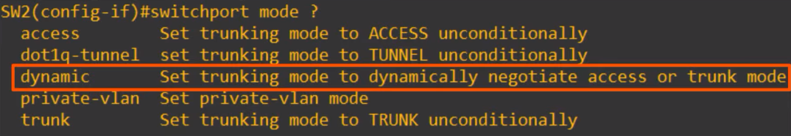
- `dynamic` is how we would manually enable DTP
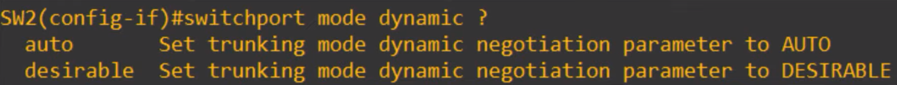
- A switchport in `dynamic desirable` mode will actively try to form a trunk with other Cisco switches
- It'll form a trunk if connected to another switchport in the following modes:
	- `switchport mode trunk`
	- `switchport mode dynamic desirable`
	- `switchport mode dynamic auto`
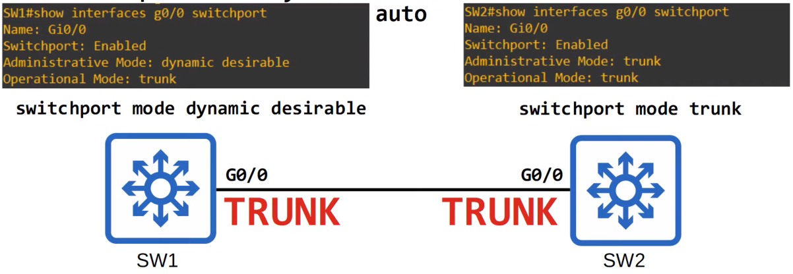
- `Switchport` is enabled because this is a Layer 2 port
- If we wanted to configure a routed port with the `no switchport` command, this would display differently
- `Administrative Mode` is dynamic desirable, as this is what's been actually configured on the interface
- `Operational Mode` displays whether it's a trunk or access port
- Because SW2's interface is trunk, SW1's interface became a trunk as well, thanks to DTP negotiation
- On SW2, you can see that both the `Administrative Mode` and `Operational Mode` are `trunk`
- What will happen if both interfaces are configured in dynamic desirable mode?
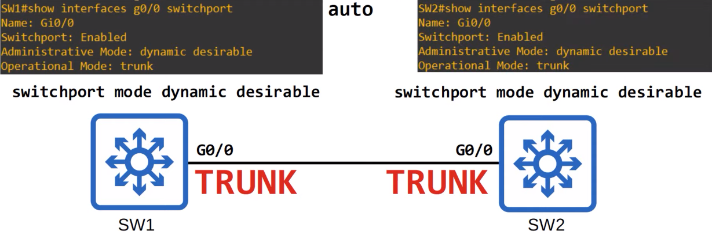
- Even though both interfaces have an `Administrative Mode` of `dynamic desirable`, the `Operational Mode` is still `trunk` due to both switches actively using DTP to try and form a trunk
- Even if manually configured as a trunk, an interface still sends out DTP frames
- Let's look at another interface combination:
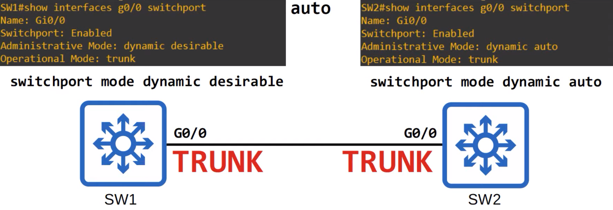
- A switchport in `dynamic auto` mode does not actively try to form a trunk, it's more passive
- It will tell SW1 'if you want to form a trunk, I'll do it, but I'm not going to actively try to form a trunk with you'
- However, because SW1 is in `dynamic desirable` mode, once again, a trunk will be formed
- Last example:
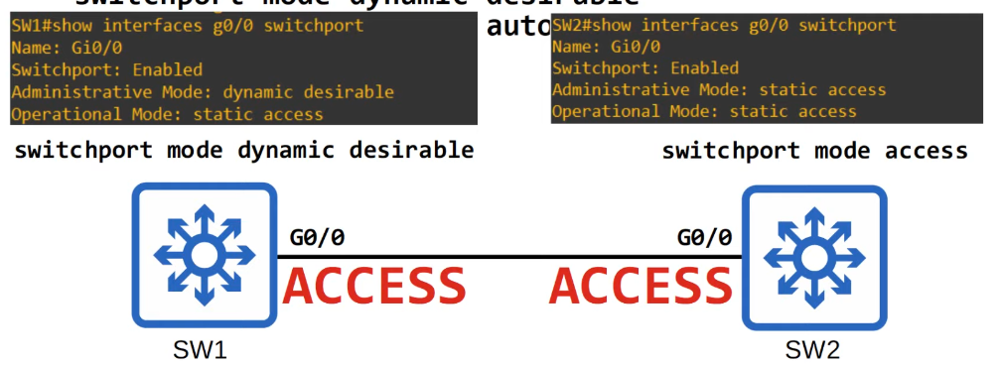
- SW2's interface is now manually configured as an access port with the `switchport mode access` command
- SW1 is actively trying to form a trunk, but since SW2 is manually configured in access mode, the trunk will not form, and both will operate as access ports in the default VLAN (VLAN1)
- The output of the `show interfaces` command now shows an operational mode of `static access`
- `static access` means an access port that belongs to a single VLAN that doesn't change (unless you configure a different VLAN)
- There are also `dynamic access` ports, in which a server automatically assigns the VLAN depending on the MAC address of the connected device **(this is out of the scope of the CCNA)**
- Now, on SW2's G0/0 interface, both the administrative and operational modes are `static access`
- Now, let's look at `dynamic auto` mode
- A switchport in `dynamic auto` mode will NOT actively try to form a trunk with other Cisco switches, however, it will form a trunk if the switch connected to it is actively trying to form a trunk
- It will form a trunk with a switchport in the following modes:
	- `switchport mode trunk`
	- `switchport mode dynamic desirable`
- Example:
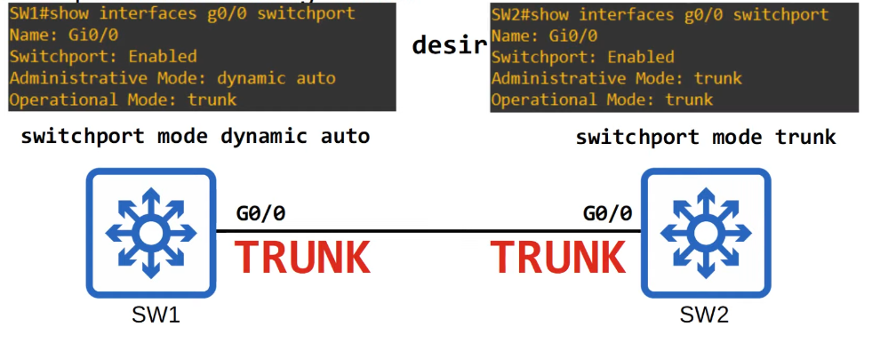
- What if both interfaces are in `dynamic auto` mode?
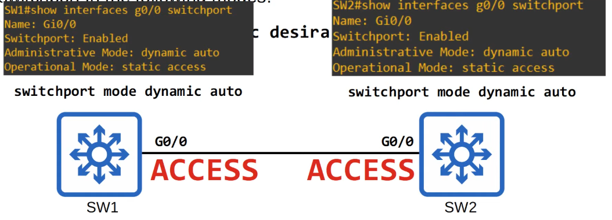
- What about `dynamic auto` and `access` mode?
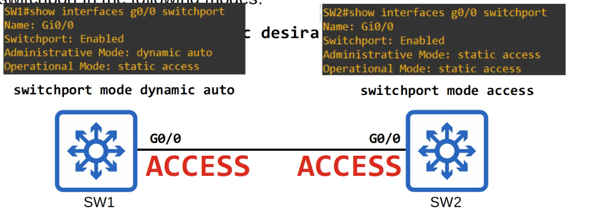
- What happens if a manually configured `trunk` port is connected to a manually configured `access` port?
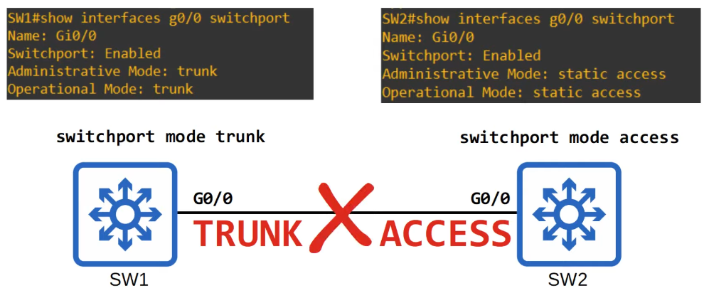
- This configuration would result in an error, and traffic won't pass between these switches
- The following chart summarizes the resulting operational mode given two administrative modes:
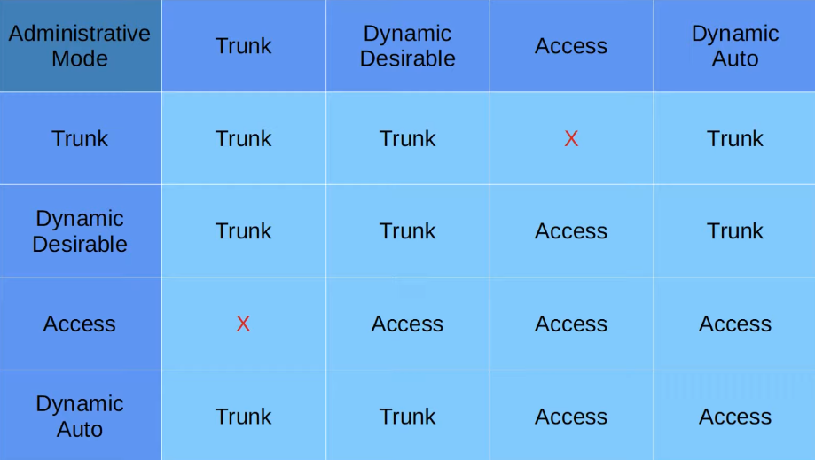
- **DTP will not form a trunk with a router, PC, etc.**
- **The switchport will be in `access` mode**
- If you want to configure ROAS, you must manually configure the interface connected to the router as a trunk, you cannot put it in dynamic desirable mode and expect it to become a trunk 
- On older switches, `switchport mode dynamic desirable` is the default administrative mode
- On newer switches, `switchport mode dynamic auto` is the default adminstrative mode
- You can disable DTP negotiation on an interface with this command: `switchport nonegotiate`
- Configuring an access port with `switchport mode access` also disables DTP negotiation on an interface
- It is recommended that you disable DTP on all switchports and manually configure them as access or trunk ports
- Switches that support both `802.1Q` and `ISL` trunk encapsulations can use DTP to negotiate the encapsulation they will use
- This negotatiaon is enabled by default, as the default trunk encapsulation mode is: `switchport trunk encapsulation negotiate`
- `ISL` is favored over `802.1Q`, so if both switches support ISL it will be selected
- DTP frames are sent in VLAN1 when using `ISL`, or in the native VLAN when using `802.1Q` (the default native VLAN is VLAN1, however)
- To show the negotatioan of trunking encapsulation, here is some output from the `show interfaces switchport` command:
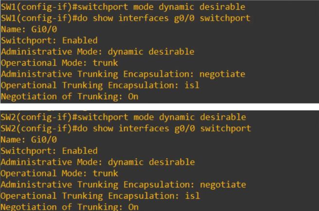
- The interfaces on both switches were set to `dynamic desirable` mode so that they would form a trunk
- Notice that the default trunking encapsulation mode of `negotiate` results in an operational trunking encapsulation of `isl`
- The negotiation of trunking field shows whether `DTP` is enabled, whether the interface is sending DTP frames or not
- If the interface is in dynamic desirable, dynamic auto, or trunk mode, this will be on
- If it's in access mode, or if you used the `switchport nonegotiate` command, it will be off
### VTP (VLAN Trunking Protocol)
- 