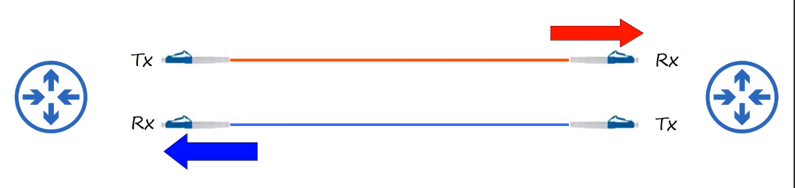

# Interfaces & Cables
### Ethernet
- A collection of network protocols/standards
- For the purpose of this lesson, we'll focus on types of cabling by Ethernet standards
### Bits & Bytes
- A bit is made up of either 0 or 1
- This is what allows a computer to carry out tasks
- A byte is equal to 8 bits
- Speed is measured in **bits per second** (Kbps, Mbps, Gbps, etc.), not bytes per second
- 1 kilobit (Kb) = 1,000 bits
- 1 megabit (Mb) = 1,000,000 bits
- 1 gigabit (Gb) = 1,000,000,000 bits
- 1 terabit (Tb) = 1,000,000,000,000 bits
### Ethernet Standards
- Defined in the IEEE 802.3 standard in 1983
- IEEE = Institute of Electrical and Electronics Engineers

- BASE = baseband signaling
- T = twisted pair cabling
### UTP Cables
- Unshielded Twisted Pair
- Twisted Pair protects against EMI (Electromagnetic Interference)
- 10BASE-1 & 100BASE-T use 2 pairs (4 wires)
- 1000BASE-T & 10GBASE-T use 4 pairs (8 wires)
### 10BASE-T & 100BASE-T

- PCs and Routers transmit data on pins 1 and 2, and receive data on pins 3 and 6
- Switches receive data on pins 1 and 2, and transmit data on pins 3 and 6
- It's called a **straight-through cable** because all pin numbers on one end connect to the same pin numbers on the other end (pin 1 to pin 1, pin 3 to pin 3, etc.)

- If two of the same devices are looking to connect to each other, a straight-through cable wouldn't work because these devices use the same pins to receive and transmit data
- This is where a **crossover cable** must be used because a pin on one end of the cable doesn't connect straight to the same pin on the other end
- The wires are 'crossed over' each other, hence the name **crossover cable**

- **Auto MDI-X** allows devices to automatically detect which pins their neighbor is transmitting data on, and then adjust which pins they use to transmit and receive data\
### 1000BASE-T & 10GBASE-T

- Each pair is **bidirectional**, meaning each pair isn't dedicated specifically to transmitting or receiving data
### Fiber-Optic Connections
- An SFP (Small Form-Factor Pluggable) Transceiver allows the connection of a **fiber optic cable**
- A **fiber optic cable**, rather than an electrical signal over copper wiring, sends light over glass fibers

### Multimode Fiber

- Core diameter is wider than single-mode fiber
- Allows multiple angles (modes) of light waves to enter the fiberglass core
- Allows longer cables than UTP, but shorter cables than single-mode fiber
- Cheaper than single-mode fiber (due to cheaper LED-based SFP transmitters)
### Single-Mode Fiber

- Core diameter is narrower than multimode fiber
- Light enters at a single angle (mode) from a laser-based transmitter
- Allows longer cables than both UTP and multimode fiber
- More expensive than multimode fiber (due to more expensive laser-based SFP transmitters)
### Fiber-Optic Cable Standards

### UTP vs Fiber-Optic Cabling
