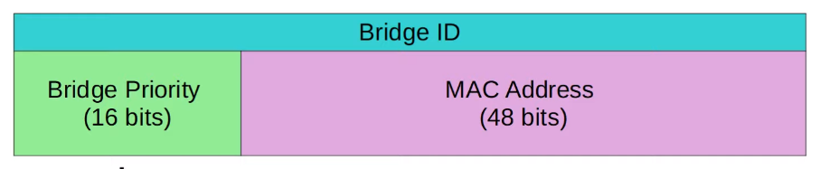
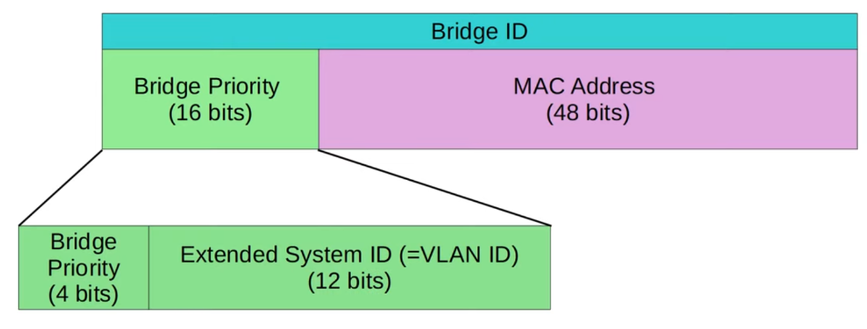
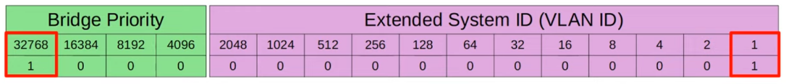
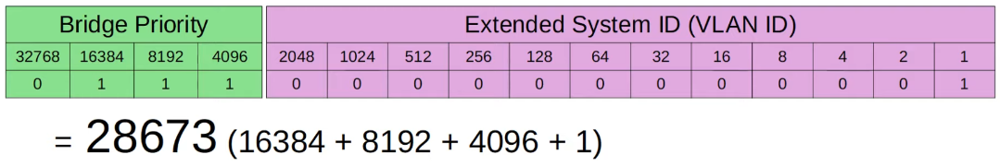
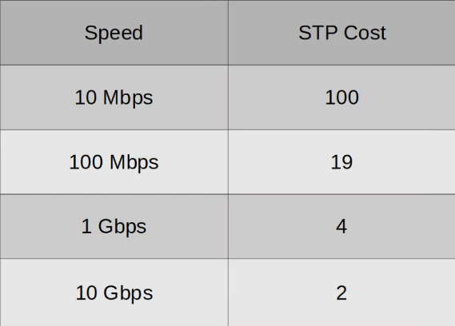
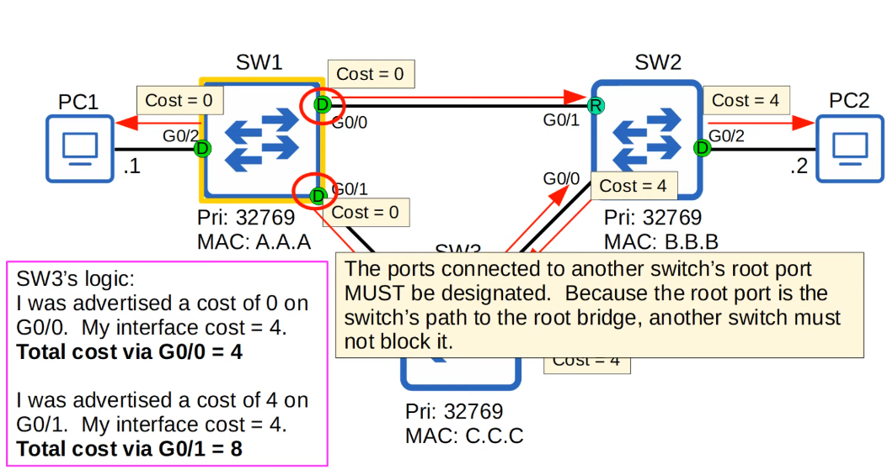

# Spanning Tree Protocol (Part 1)
### Things We'll Cover
- Redundancy in networks
- STP (Spanning Tee Protocol)
### Network Redundancy
- Redundancy is an essential part of network design
- Modern networks are expected to run 24/7/365. Even a short downtime can be disastrous for a business
- If one network component fails, you must ensure that other components will take over with little or no downtime
- As much as possible, you must implement redundancy at every possible point in the network
- Most PCs only have a single network interface card (NIC), so they can only be plugged into a single switch
- However, important servers typically have multiple NICs, so they can be plugged into multiple switches for redundancy
### Broadcast Storms
- The Ethernet header doesn't have a TTL field
- These broadcast frames will loop around the network indefinitely
- If enough of these looped broadcasts accumulate in the network, the network will be too congested for legitimate traffic to use the network
- This is called a **broadcast storm**
- Network congestion isn't the only problem
- Each time a frame arrives on a switchport, the switch uses the source MAC address field to 'learn' the MAC address and update its MAC address table
- When frames with the same source MAC address repeatedly arrive on different interfaces, the switch is continuously updating the interface in its MAC address table
- This is known as **MAC Address Flapping**
### Spanning Tree Protocol
- 'Classic Spanning Tree Protocol' is IEEE 802.1D
- Switches from ALL vendors run STP by default
- STP prevents Layer 2 loops by placing redundant ports in a blocking state, essentially disabling the interface
- These interfaces act as backups that can enter a forwarding state if an active (=currently forwarding) interface fails
- Interfaces in a forwarding state behave normally, they send and receive all normal traffic
- Interfaces in a blocking state only send or receive STP messages (called BPDUs - Bridge Protocol Data Units)
	- Spanning Tree Protocol still uses the term 'bridge'
	- However, when we use the term 'bridge', we really mean 'switch'
	- Bridges aren't used in modern networks
- By selecting which ports are **forwarding** and which ports are **blocking**, STP creates a single path to/from each point in the network
- This prevents L2 loops
- There is a set process that STP uses to determine which ports should be forwarding and which should be blocking
- STP-enabled switches send/receive Hello BPDUs out of all interfaces, the default time is 2 seconds (the switch will send a Hello BPDU out of every interface, once every 2 seconds)
- If a switch receives a Hello BPDU onan interface, it knows that interface is connected to another switch (routers, PCs, etc. don't use STP, so they don't send Hello BPDUs)
- Switches use one field in the STP BPDU, the **Bridge ID** field, to elect a **root bridge** for the network
- the switch with the lowest **Bridge ID** becomes the **root bridge**
- ALL ports on the **root bridge** are put in a forwarding state, and other switches in the topology must have a path to reach the root bridge
#### Classic Bridge ID

- The default bridge priority is 32768 on all switches, so by default the MAC address is used as the tie-breaker (lowest MAC address becomes the root bridge)
	- The Bridge Priority is compared first
	- If they tie, the MAC address is then compared
#### Updated Bridge ID

- Cisco switches use a version of STP called **PVST** (Per-VLAN Spanning Tree)
- PVST runs a separate STP 'instance' in each VLAN, so in each VLAN different interfaces can be forwarding/blocking

- In the default VLAN of 1, the default bridge priority is actually **32769** (32768 + 1)
- The **bridge priority + extended system ID** is a single field of the bridge ID, however, the extended system ID Is set and cannot be changed (because it is determined by the VLAN ID)
- Therefore, you can only change the total bridge priority (bridge priority + extended system ID) in units of 4096, the value of the least significant bit of the bridge priority

- The STP bridge priority can only be changed in units of 4096
- The valid values you can configure are:
	- 0
	- 4096
	- 8192
	- 12288
	- 16384
	- 20480
	- 24576
	- 28672
	- 32768
	- 36864
	- 40960
	- 45056
	- 49152
	- 53248
	- 57344
	- 61440
- The Extended System ID will then be added to this number to make the total bridge priority
### Spanning Tree Protocol
- All interfaces on the root bridge are **designated ports**
- Designated ports are in a forwarding state
- When a switch is powered on, it assumes it's the root bridge
- It'll only give up its position if it receives a 'superior' BPDU (lower bridge ID)
- Once the topology has converged and all switches agree on the root bridge, only the root bridge sends BPDUs
- Other switches in the network will forward these BPDUs, but will not generate their own original BPDUs
#### Steps
1. The switch with the lowest bridge ID is elected as the root bridge. All ports on the root bridge are **designated ports** (forwarding state)
2. Each remaining switch will select ONE Of its interfaces to be its **root port**. The interface with the lowest *root cost* will be the root port. Root ports are also in a forwarding state.
**IMPORTANT TO REMEMBER FOR EXAM:**

- An important command to be able to view spanning tree configurations is `show spanning-tree`
- STP Port ID = port priority (default 128) + port number
- The NEIGHBOR switch's port ID is used to break the tie, not the local switch's port ID
- Every collision domain has a single STP designated port:
	1. The switch with the lowest root cost will make its port designated
	2. If the root cost is the same, the switch with the lowest bridge ID will make its port designated
	3. The other switch will make its port non-designated (blocking)
### STP Process Summary
1. One switch is elected as the root bridge. All ports on the root bridge are **designated ports** (forwarding state). Root bridge selection:
	1. Lowest Bridge ID
2. Each remaining switch will select ONE Of its interfaces to be its **root port** (forwarding state). Ports across from the root port are always **designated** ports. Root port selection:
	1. Lowest root cost
	2. Lowest neighbor bridge ID
	3. Lowest neighbor port ID
3. Each remaining collision domain will select ONE interface to be a **designated port** (forwarding state). The other port in the collision domain will be **non-designated** (blocking). Designated port selection:
	1. Interface on switch with the lowest root cost
	2. Interface on switch with the lowest bridge ID