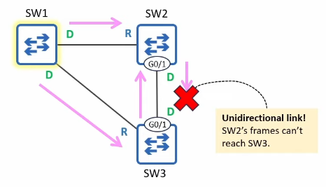

# Loop Guard
### Unidirectional Links
- A **unidirectional link** is a network link where data transmission occurs in only one direction
	- i.e. SW1 can send frames to SW2, but not vice versa
- Unidirectional links are typically caused by Layer 1 (Physical) issues
	- Damaged cables
	- Faulty connectors or transceivers (i.e. SFP modules)
- Unidirectional links are more common with fiber-optic cables than copper UTP
	- Fiber optic connections typically use two separate fibers
		- If one fiber is damaged, it can disrupt data flow in one direction while the other remains unaffected
	- More vulnerable to physical damage than copper UTP cables
- For a fiber-optic interface to be **up/up**, both fibers must be connected and functional
- If there is a physical problem with either fiber, the devices **should** be able to detect it and disable their interfaces
- If the devices fail to detect the physical problem, it could result in a **unidirectional link**
### Loop Guard - The Problem

- BPDUs originate from the Root Bridge and are forwarded out of designated ports
- SW3 G0/1 is a **non-designated** blocking port because it receives superior BPDUs from SW2
	- i.e. SW2 has a superior root cost or bridge ID
- If the SW2-SW3 link becomes unidirectional and SW2's BPDUs can't reach SW3, what will happen?
	- SW3 G0/1 will become a **designated** port and start forwarding BPDUs
- Because SW3's BPDUs are inferior to SW2's, SW2 simply ignores SW3's BPDUs
	- SW2 G0/1 and SW3 G0/1 are both in the forwarding state (this is a loop)
### Loop Guard - The Solution
- When a **Loop Guard**-enabled port's Max Age timer counts down to 0, it doesn't become a designated port and start transitioning to forwarding
	- Instead, it enters the **Broken** (Loop Inconsistent) state
	- Like the **Broken** (Root Inconsistent) state triggered by a Root Guard violation, this blocks the port
		- *Note: In both cases, the port remains **up/up**, but STP blocks it*
- If the broken port starts receiving BPDUs again, it'll be re-enabled automatically
- Loop Guard can be enabled in two ways:
	- Per-port: `SW1(config-if)# spanning-tree guard loop`
	- Default: `SW1(config)# spanning-tree loopguard default`
		- This enables Loop Guard on all ports
		- Use `SW1(config-if)# spanning-tree guard none` to disable it on specific ports if needed
- **Loop Guard** should be enabled on Root and Non-Designated ports (ports that are supposed to receive BPDUs)
### Loop Guard & Root Guard
- **Loop Guard** and **Root Guard** are mutually exclusive
	- They can't be enabled on the same port at the same time
	- **Root Guard** is meant to prevent Designated ports from becoming Root Ports
	- **Loop Guard** is meant to prevent Non-Designated or Root ports from becoming Designated ports
- If Loop Guard is configured on a port (`spanning-tree guard loop`) and you then configure Root Guard (`spanning-tree guard root)`, Loop Guard will be disabled on the port (and vice versa)
- If Loop guard is enabled by default (`spanning-tree loopguard default`) and you then configure Root Guard on a port, Loop Guard will be disabled on the port
	- The more specific configuration (interface vs global) takes effect