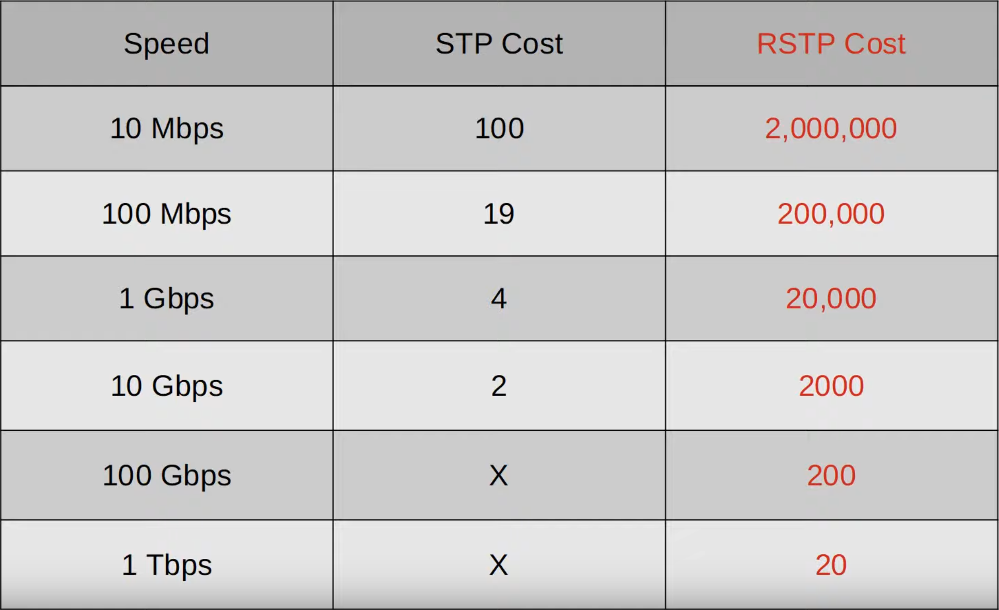
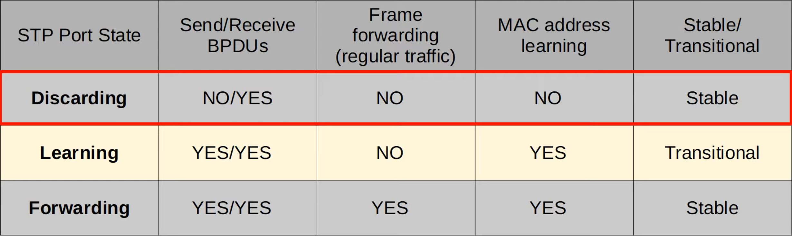

# Rapid STP
### Things We'll Cover
- Comparison of STP versions (standard vs Cisco)
- Rapid PVST+
### Spanning Tree Versions
#### Industry Standards (IEEE)
**Spanning Tree Protocol (802.1D)**
- The original STP
- All VLANs share one STP instance
- Therefore, cannot load balance
**Rapid Spanning Tree Protocol (802.1w)**
- Much faster at converging/adapting to network changes than 802.1D
- All VLANs share one STP instance
- Therefore, cannot load balance
- **WILL BE COVERED ON THE EXAM**
**Multiple Spanning Tree Protocol (802.1s)**
- Uses modified RSP mechanics
- Can group multiple VLANs into different instances (i.e. VLANs 1-5 in instance 1, VLANs 6-10 in instance 2) to perform load balancing
#### Cisco Versions
**Per-VLAN Spanning Tree Plus (PVST+)**
- Cisco's upgrade to 802.1D
- Each VLAN has its own STP instance
- Can load balance by blocking different ports in each VLAN
**Rapid Per-VLAN Spanning Tree Plus (Rapid PVST+)**
- Cisco's upgrade to 802.1w
- Each VLAN has its own STP instance
- Can load balance by blocking different ports in each VLAN
- **WILL BE COVERED ON THE EXAM**
### Rapid Spanning Tree Protocol
**Similarities between STP and RSTP:**
- RSTP serves the same purpose as STP, blocking specific ports to prevent Layer 2 loops
- RSTP elects a root bridge, root ports and designated ports with the same rules as STP
**Differences:**

### Rapid Spanning Tree Port States

- If a port is administratively disabled (`shutdown` command) = discarding state
- If a port is enabled but blocking traffic to prevent Layer 2 loops = discarding state
### Rapid Spanning Tree Port Roles
-  The **root port** role remains unchanged in RSTP
	- The port that is closest to the root bridge becomes the root port for the switch
	- The root bridge is the only switch that doesn't have a root port
- The **designated port** role remains unchanged in RSTP
	- The port on a segment (collision domain) that sends the best BPDU is that segment's designated port (only one per segment)
- The **non-designated port** role is split into two separate roles in RSTP:
	- The **alternate port** role
	- The **backup port** role
### RSTP: Alternate Port Role
- The **alternate** port role is a discarding port that receives a superior BPDU from another switch
- This is the same as what you've learned about **blocking** ports in classic STP
- Functions as a backup to the root port
- If the root port fails, the switch can immediately move its best alternate port to forwarding
	- This immediate move to forwarding state functions like a classic STP optional feature called **UplinkFast**
	- Because it's built into RSTP, you don't need to activate UplinkFast when using RSTP/Rapid PVST+
### RSTP: BackboneFast Functionality
- One more STP optional feature that was built into RSTP is **BackboneFast**
- This allows SW3 to expire the max age timers on its interface and rapidly forward the superior BPDUs to SW2
- This functionality is built into RSTP, so it doesn't need to be configured
### RSTP: Backup Port Role
- The **backup** port role is a discarding port that receives a superior BPDU from **another interface on the same switch**
- This only happens when two interfaces are connected to the same collision domain (via a hub)
- Hubs aren't used in modern networks, so you probably won't encounter an RSTP backup port
- Function as a backup for a designated port
- The interface with the lowest port ID will be selected as the designated port, and the other will be the backup port
### Rapid Spanning Tree Protocol
- To manually enable RPVST on a switch, we'd use the command `spanning-tree mode rapid-pvst`
- Since this is the default on Cisco switches, this command probably won't have to be used
- Rapid STP **is** compatible with Classic STP
- The interface(s) on the Rapid STP-enabled switch connected to the Classic STP-enabled switch will operate in Classic STP mode (timers, blocking -> listening -> learning -> forwarding process, etc.)
### Rapid Spanning Tree BPDU
**Classic STP:** 
- Has a Protocol Version of 0
- BPDU Flag only uses the 1st and 8th bit of the BPDU flags
- Only the root bridge originates BPDUs, and other switches just forward the BPDUs they've received
**Rapid STP:**
- Has a Protocol Version of 2
- Has a BPDU Type of 2
- BPDU Flag uses all 8 bits
- ALL switches originate and send their own BPDUs from their designated ports
### Rapid STP
- All switches running Rapid STP send their own BPDUs every hello time (2 seconds)
- Switches 'age' the BPDU information much more quickly:
	- In Classic STP, a switch waits 10 hello intervals (20 seconds)
	- In Rapid STP, a switch considers a neighbor lost if it misses 3 BPDUs (6 seconds)
	- It will then 'flush' all MAC addresses learned on that interface
### RSTP Link Types
- **Edge:**
	- A port that's connected to an end host
	- Moves directly to forwarding, without negotiation
	- They function like a classic STP port with PortFast enabled
- **Point-to-point:**
	- A direct connection between two switches
	- They function in full-duplex
	- You don't need to configure the interface as point-to-point (it should be detected)
	- However, to manually configure it you'd use the command `spanning-tree link-type point-to-point`
- **Shared:**
	- A connection to a hub
	- Must operate in half-duplex mode
	- You don't need to configure the interface as shared (it should be detected)
	- To manually configure it, use: `spanning-tree link-type shared` 