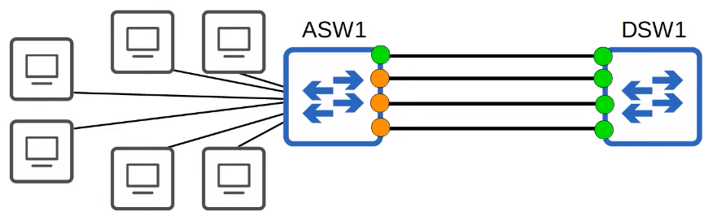
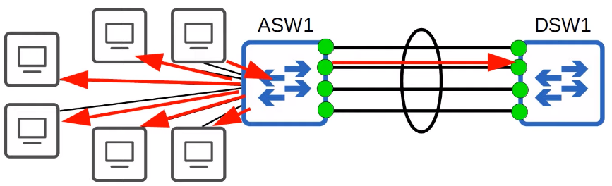
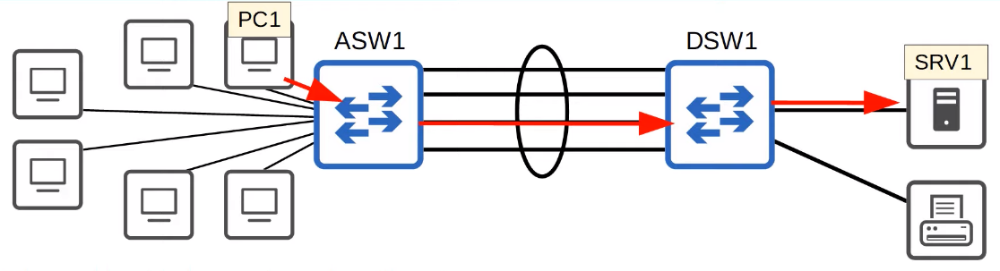
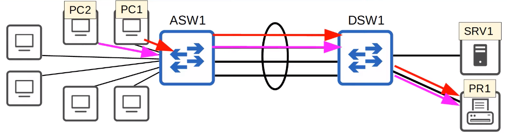

# EtherChannel
### Things We'll Cover
- What is EtherChannel? What problems does it solve?
- Configuring L2/L3 EtherChannels
### EtherChannel
- **ASW** = Access Layer Switch, a switch that end hosts connect to
- **DSW** = Distribution Layer Switch, a switch that access layer switches connect to
- When the bandwidth of the interfaces connect to end hosts is greater than the bandwidth of the connection to the distribution switch(es), this is called **oversubscription**
- Some oversubscription is acceptable, but too much will cause congestion

- If you connect two switches together with multiple links, all except one will be disabled by spanning tree
- If all of ASW1's interfaces were forwarding, L2 loops would be formed between ASW1 and DSW1, leading to broadcast storms
- Other links will be unused unless the active link fails
	- In that case, one of the inactive links will start forwarding

- EtherChannel groups multiple interfaces together to act as a single interface
- STP will treat this group as a single interface
- Traffic using the EtherChannel will be load balanced among the physical interfaces in the group
- An algorithm is used to determine which traffic will use which physical interface
- Some other names for an EtherChannel are:
	- Port Channel
	- LAG (Link Aggregation Group)
### EtherChannel Load-Balancing

- Etherchannel load balances based on 'flows'
- A flow is a communication between two nodes in the network
- Frames in the same flow will be forwarded using the same physical interface
- If frames in the same flow were forwarded using different physical interfaces, some frames may arrive at the destination out of order, which can cause problems

- You can change the inputs used in the interface selection calculation
- Inputs that can be used:
	- Source MAC
	- Destination MAC
	- Source & Destination MAC
	- Source IP
	- Destination IP
	- Source & Destination IP
- To check the etherchannel load balancing method, we can use the command `show etherchannel load-balance`
- To change the load balance method, enter global config mode and use the command `port-channel load-balance [method]`
- Some methods include:
	- `dst-ip`
	- `dst-mac`
	- `src-dst-ip`
	- `src-dst-mac`
	- `src-ip`
	- `src-mac`
### EtherChannel Configuration
- There are three methods of EtherChannel configuration on Cisco switches:
	- PAgP (Port Aggregation Protocol)
		- Cisco proprietary protocol
		- Dynamically negotiates the creation/maintenance of the EtherChannel (like DTP does for trunks)
	- LACP (Link Aggregation Control Protocol)
		- Industry standard protocol (IEEE 802.3ad)
		- Does the same thing as PAGP, but since it's a standard protocol, it'll work across all makes of switches
		- **THIS IS THE PREFERRED METHOD**
	- Static EtherChannel
		- A protocol isn't used to determine if an EtherChannel should be formed
		- Interfaces are statically configured to form an EtherChannel
- Up to 8 interfaces can be formed into a single EtherChannel (LACP allows up to 16, but only 8 will be active, the other 8 will be in standby mode, waiting for an active interface to fail)
### PAgP Configuration
- First use the `interface range` command to configure all the member interfaces at once
- Then use `channel-group [number] mode [mode]`
- Some different modes include:
	- `active - Enable LACP unconditionally`
	- `auto - Enable PAgP only if a PAgP device is connected`
	- `desirable - Enable PAgP unconditionally`
	- `on - Enable Etherchannel only`
	- `passive- Enable LACP only if a LACP device is detected`
- `auto + auto` = no EtherChannel
- `desirable + auto` = EtherChannel
- `desirable + desirable` = EtherChannel
- The `channel-group` number has to match for member interfaces on the same switch
- However, it **doesn't** have to match the channel-group number on the other switch
	- **channel-group 1** on ASW1 can form an EtherChannel with **channel-group 2** on DSW1
### LACP Configuration
- Steps are the same, except all we have to change is the mode name
- `passive + passive` = no EtherChannel
- `active + passive` = EtherChannel
- `active + active` = EtherChannel
### Static EtherChannel Configuration
- The only mode name for this is `on`
- `on` mode only works with `on` mode (`on + desirable` or `on + active` won't work)
### Manually Configure the Negotiation Protocol
- Not really needed, but it's possible to just choose which EtherChannel protocol you'd prefer by using `channel-protocol lacp` or `channel-protocol pagp`
### EtherChannel Configuration
- After creating the etherchannel, we can access it using `interface port-channel [number]`
- We can then apply commands as if we were working with a single interface such as `switchport mode`
- Member interfaces must have matching configurations:
	- Same duplex (full/half)
	- Same speed
	- Same switchport mode (access/trunk)
	- Same allowed VLANs/native VLAN (for trunk interfaces)
- If an interfaces configurations don't match the others, it'll be excluded from the EtherChannel
- To verify changes made to an etherchannel, the command to use is `show etherchannel summary`
- Another command you can use is `show etherchannel port-channel`
### Layer 3 EtherChannel
- Specify the range of interfaces you wish to configure using the `int range` command
- Before using the `channel-group` command, use the `no switchport` command to make them layer 3 routed interfaces
- Then, configure the IP address on the port channel interface:
	- `int po1`
	- `ip address 10.0.0.1 255.255.255.252`
### Commands
- `SW(config)# port-channel load-balance [mode]`
	- Configures the EtherChannel load-balancing method on the switch
- `SW# show etherchannel load-balance`
	- Displays info about the load-balancing settings
- `SW(config-if)# channel-group [number] mode {desirable|auto|active|passive|on}`
	- Configures an interface to be part of an EtherChannel
- `SW# show etherchannel summary`
	- Displays a summary of EtherChannels on the switch
- `SW# show etherchannel port-channel`
	- Displays information about the virtual port-channel interfaces on the switchl