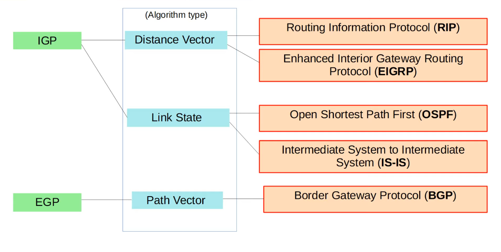
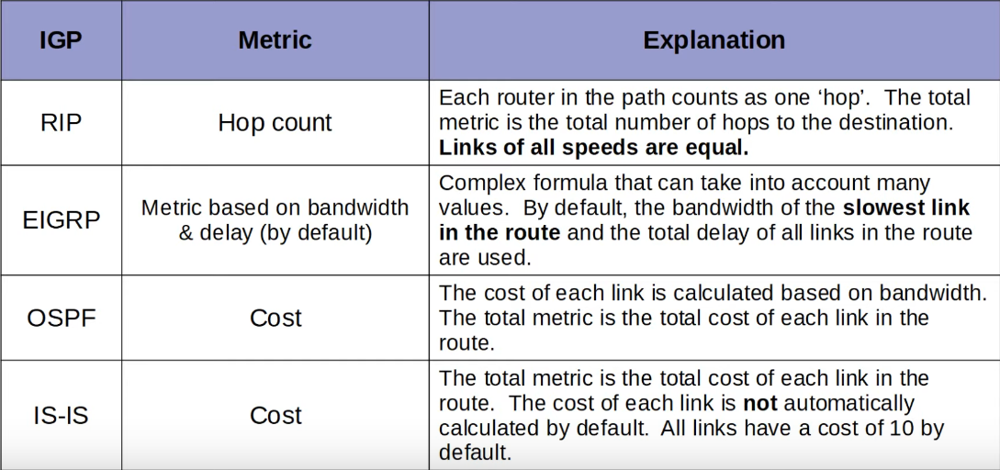
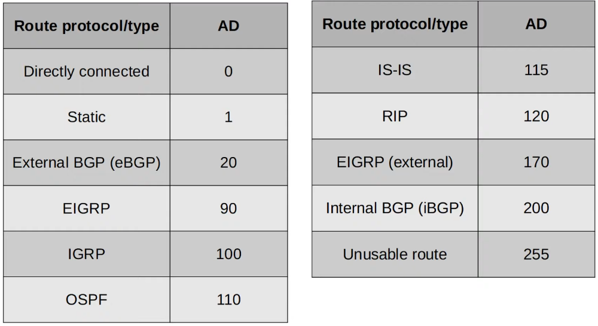

# Dynamic Routing
### Things We'll Cover
- Intro to dynamic routing protocols
- Types of dynamic routing protocols
- Dynamic routing protocol metrics
- Administrative distance
### Dynamic Routing
- Routers can use dynamic routing protocols to advertise information about the routes they know to other routes
- They form adjacencies/neighbor relationships/neighborships with adjacent routers to exchange this information
- If multiple routes to a destination are learned, the router determines which route is superior and adds it to the routing table
- It uses the 'metric' of the route to decide which is superior (lower metric = superior)
### Types of Dynamic Routing Protocols
- Dynamic routing protocols can be divided into two main categories:
	- **IGP (Interior Gateway Protocol)**
	- **EGP (Exterior Gateway Protocol)**
- IGP = Used to share routes within a single autonomous system (AS), which is a single organization
- EGP = Used to share routes between different autonomous systems

### Distance Vector Routing Protocols
- Distance vector protocols were invited before link state protocols
- Early examples are **RIPv1** and Cisco's proprietary protocol **IGRP** (which was updated to **EIGRP**)
- Distance vector protocols operate by sending the following to their directly connected neighbors:
	- Their known destination networks
	- Their metric to reach their known destination networks
- This method of sharing route information is often called 'routing by rumor'
- This is because the router doesn't know about the network beyond its neighbors, it only knows the information that its nieghbors tell it
- Called 'distance vector' because the routers only learn the 'distance' (metric) and 'vector' (direction, the next-hop router) of each route
### Link State Routing Protocol
- When using a **link state** routing protocol, every router creates a 'connectivity map' of the network
- To allow this, each router advertises information about its interfaces (connected networks) to its neighbors
- These advertisements are passes along to other routers, until all routers in the network develop the same map of the network
- Each router independently uses this map to calculate the best routes to each destination
- Link state protocols use more resources (CPU) on the router, because more information is shared
- However, link state protocols tend to be faster in reacting to changes in the network than distance vector protocols
### Dynamic Routing Protocol Metrics
- A router's route table contains the best route to each destination network it knows about
- If a router using a dynamic routing protocol learns about two different routes to the same destination, how does it determine which is 'best'?
- It uses the **metric** value of the routes to determine which is best
- A lower metric = better
- Each routing protocol uses a different metric to determine which route is best
- If a route learns two (or more) routes via the **same routing protocol** to the **same destination** (same network address & subnet mask) with the **same metric**, both will be added to the routing table
- Traffic will be load-balanced over both routes
- This is referred to as **ECMP (Equal cost Multi-Path)**

### Administrative Distance
- In most cases a company will only use a single IGP - usually OSPF or EIGRP
- However, in some rare cases, they might use two
- For instance, if two companies connect their networks to share information, two different routing protocols might be in use
- Metric is used to compare routers **learned via the same routing protocol**
- Different routing protocols use totally different metrics, so they can't be compared
- For example, an OSPF route to 192.168.4.0/24 might have a metric of 30, while an EIGRP route to the same destination might have a metric of 33280. Which route is better? Which route should the router put in the route table?
- The **administrative distance (AD)** is used to determine which routing protocol is preferred
- A lower AD Is preferred, and indicates that the routing protocl is considered more 'trustworthy' (more likely to select good routes)

- If the AD is 255, the router doesn't believe the source of that route and doesn't install the route in the routing table
- You can change the AD of a routing protocol
- You can also change the AD of a static route using the command: `ip route [ip-address] [netmask] [next-hop] <1-255>` with `<1-255>` representing the distance metric for this route
### Floating Static Routes
- By changing the AD of a static route, you can make it less preferred than routes learned by a dynamic routing protocol to the same destination (make sure the AD Is higher than the routing protocol's AD)
- This is called a 'floating static route'
- The route will be inactive (not in the routing table) unless the route learned by the dynamic routing protocol is removed (for example, the remote router stops advertising it for some reason, or an interface failure causes an adjacency with a neighbor to be lost)