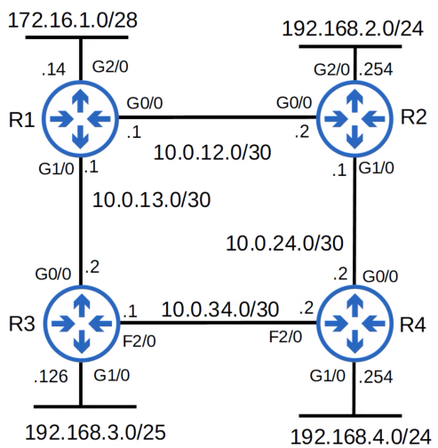
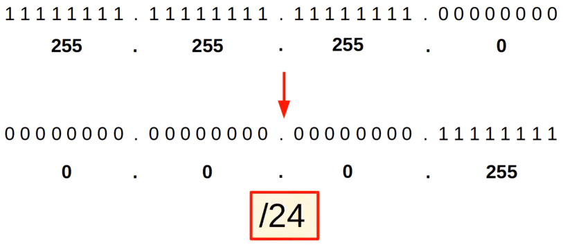
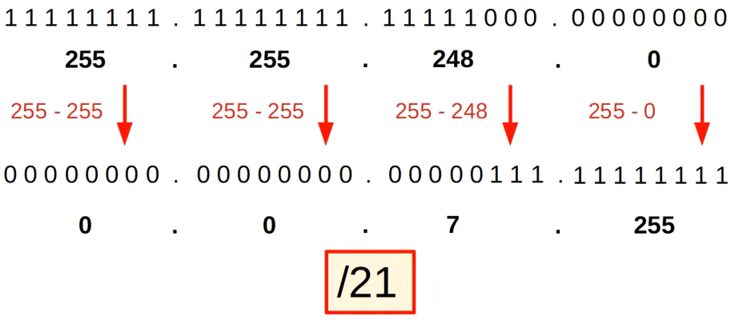
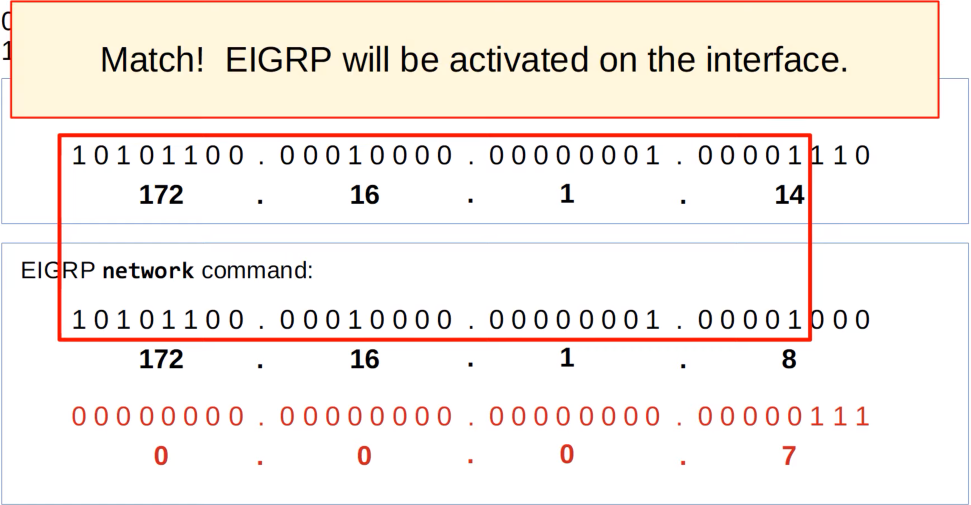

# RIP & EIGRP
### Things We'll Cover
- Routing Information Protocol (RIP)
- Enhanced Interior Gateway Routing Protocol (EIGRP)
### RIP
- **Routing Information Protocol** (industry standard)
- Distance vector IGP (uses routing-by-rumor logic to learn/share routes)
- Uses hop count as its metric. One router = one hop (bandwidth is irrelevant)
- The max hop count is **15** (anything more than that is considered unreachable)
- Has three versions:
	- **RIPv1** and **RIPv2**, used for IPv4
	- **RIPng** (RIP Next Generation), used for IPv6
- Uses two message types:
	- **Request**: To ask RIP-enabled neighbor routers to send their routing table
	- **Response**: To send the local router's routing table to neighboring routers
- By default, RIP-enabled routers will share their routing table every 30 seconds
### RIPv1 & RIPv2
- **RIPv1**:
	- Only advertises classful addresses (Class A, B & C)
	- Doesn't support VLSM or CIDR
	- Doesn't include subnet mask information in advertisements (response messages):
		- 10.1.1.0/24 will become 10.0.0.0 (Class A address, so assumed to be /8)
		- 172.16.192.0/18 will become 172.16.0.0 (Class B address, so assumed to be /16)
		- 192.168.1.4/30 will become 192.168.1.0 (Class C address, so assumed to be /24)
	- Messages are broadcast to 255.255.255.255
- **RIPv2**:
	- Supports VLSM & CIDR
	- Includes subnet mask information in advertisements
	- Messages are **multicast** to 224.0.0.9
		- **Broadcast** messages are delivered to all devices on the local network
		- **Multicast** messages are delivered only to devices that have joined that specific multicast group
### RIP Configuration
- First, enter the RIP config mode using the command `router rip`
- Then, change the version to version 2 using the command `version 2`
- Then, use the command `no auto-summary` as we don't want to automatically convert the networks the router advertises to classful networks
- The `network` command is classful, it will automatically convert to classful networks
- For example, even if you enter the command `network 10.0.12.0`, it'll be converted to `network 10.0.0.0` (a class A network)
- There is no need to enter the network mask
### The Network Command
- The `network` command tells the router to:
	- Look for interfaces with an IP address that's in the specified range
	- Activate RIP on the interfaces that fall in the range
	- Form adjacencies with connected RIP neighbors
	- Advertise **the network prefix of the interface** (NOT the prefix in the `network` command)
- The OSPF and EIGRP `network` commands operate in the same way
- So, when entering the command `network 10.0.0.0`, because the `network` command is classful, 10.0.0.0 is assumed to be 10.0.0.0/8

- R1 will look for any interfaces with an IP address that matches 10.0.0.0/8 (because it's /8 it only needs to match the first 8 bits)
- 10.0.12.1 and 10.0.13.1 both match, so RIP is activated on G0/0 and G1/0
- R1 forms adjacencies with its neighbors R2 & R3
- R1 advertises 10.0.12.0/30 and 10.0.13.0/30 (NOT 10.0.0.0/8) to its RIP neighbors
- The `network` command doesn't tell the router which networks to advertise
- It tells the router which interfaces to activate RIP on, and then the router will advertise the network prefix of those interfaces
- Now, say we enter the command `network 172.16.0.0`
- Because this command is classful, this is assumed to be 172.16.0.0/16
- R1 will look for any interfaces with an IP address that matches 172.16.0.0/16
- 172.16.1.14 matches, so R1 will activate RIP on G2/0
- There are no RIP neighbors connected to G2/0, so no new adjacencies are formed
- R1 advertises 172.16.1.0/28 (NOT 172.16.0.0/16) to its RIP neighbors
- Although there aren't any RIP neighbors connected to G2/0, R1 will continuously send RIP advertisements out of G2/0
- This is unnecessary traffic, so G2/0 should be configured as a **passive interface**
### The Passive-Interface Command
- From RIP configuration mode, we can enter the command `passive-interface g2/0`
- This command tells the router to stop sending RIP ads out of the specified interface (g2/0)
- However, the router will continue to advertise the network prefix of the interface (172.16.1.0/28) to its RIP neighbors (R2 & R3)
- You should always use this command on interfaces which don't have any RIP neighbors
- EIGRP & OSPF both have the same passive interface functionality, using the same command
### The Default-Information Originate command
- `default-information originate` is used to share the default automatically with all other RIP neighbors instead of having to manually configure default routes on each device
### show ip protocols
- This command can be used for RIP, EIGRP & OSPF to check various stats
### EIGRP
- **Enhanced Interior Gateway Routing Protocol**
- Was Cisco proprietary, but Cisco has now published it openly, so other vendors can implement it on their equipment
- Considered an 'advanced'/'hybrid' distance vector routing protocol
- Much faster than RIP in reacting to changes in the network
- Doesn't have the 15 'hop-count' limit of RIP
- Sends messages using multicast address 224.0.0.10
- Is the only IGP that can perform **unequal**-cost load balancing (by default it performs ECMP load-balancing over 4 paths like RIP)
### EIGRP Configuration

- Enter EIGRP config mode using `router eigrp [as-number]`
	- The AS (autonomous system) number must match between routers, or they will not form an adjacency and share route information
- Next, use `no auto-summary`
	- Auto-summary might be enabled or disabled by default, depending on the router/IOS version
	- If it's enabled, disable it
- Then use the same `passive-interface` command like we did for RIP
- Next use the `network` command to activate EIGRP on the G0/0 and G1/0 interfaces
	- This command will assume a classful address if you don't specify a mask
- To specify a mask, the process is a bit different from what we've been used to so far (`network 172.16.1.0 0.0.0.15` instead of `255.255.255.240`)
	- EIGRP uses a *wildcard* mask instead of a regular subnet mask
### Wildcard Masks
- A wildcard mask is basically an 'inverted' subnet mask
- All 1s in the subnet mask are 0 in the equivalent wildcard mask
- All 0s in the subnet mask are 1 in the equivalent wildcard mask

- A shortcut is to subtract each octet of the subnet mask from 255

- '0' in the wildcard mask = must match
- '1' in the wildcard mask = don't have to match

### show ip protocols
- To change the router-id, we can using the command `eigrp router-id [A.B.C.D]`
- This doesn't actually have to be an IP address, it just needs to be in the proper format
- The order of priority for determining the Router ID is:
	1. Manual configuration
	2. Higest IP address on a loopback interface
	3. Highest IP address on a physical interface