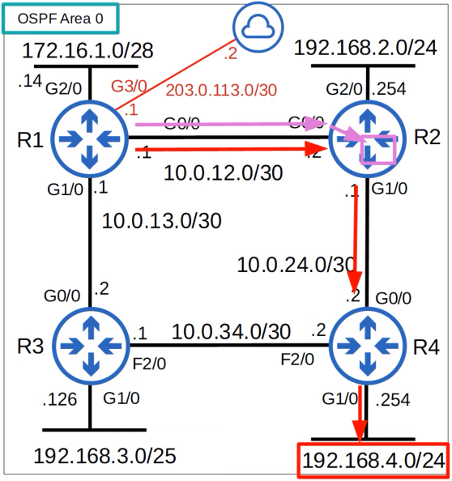
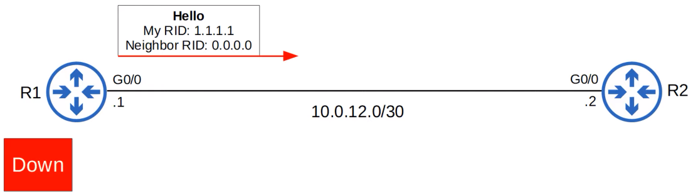
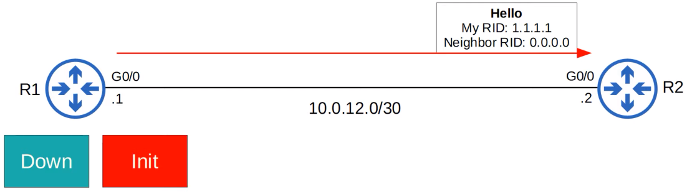
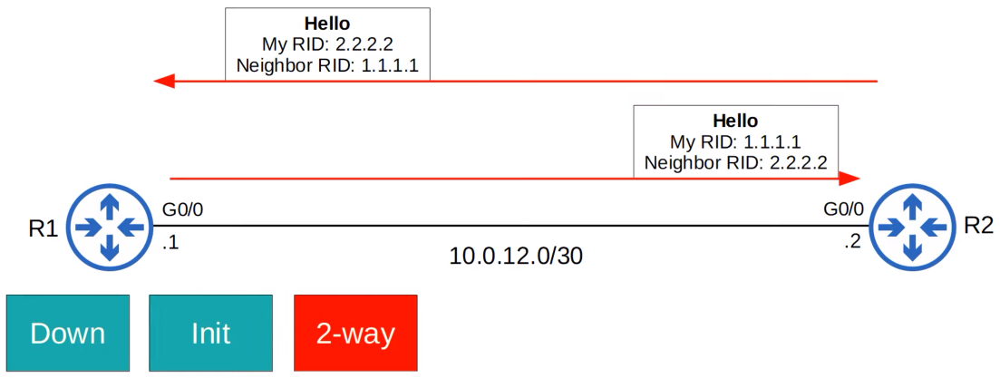
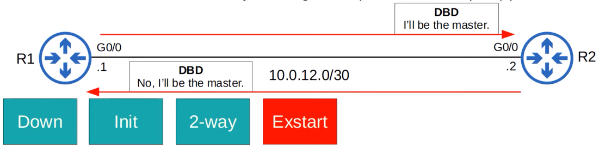
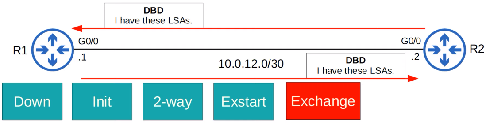
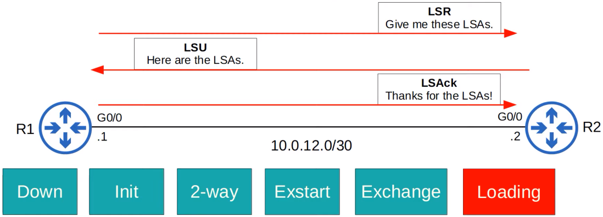
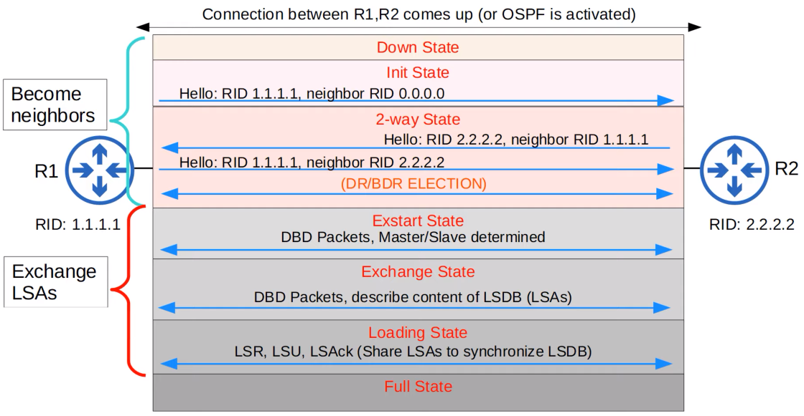
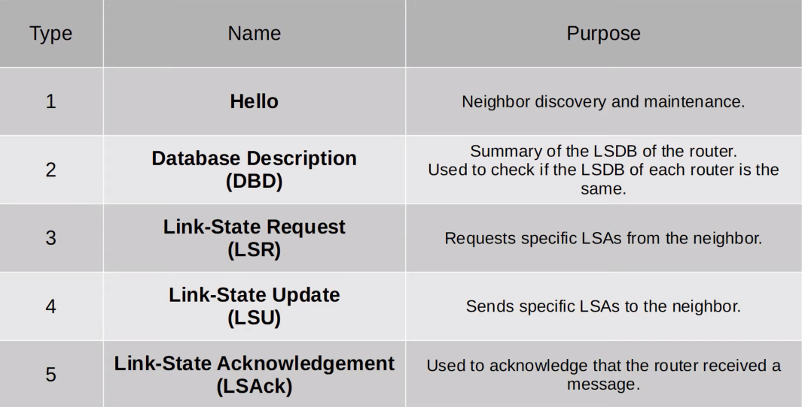

# OSPF - Part 2
### Things We'll Cover
- OSPF metric (cost)
- Becoming OSPF neighbors
- More OSPF configuration
### OSPF Cost
- OSPF's metric is called **cost**
- It's automatically calculated based on the bandwidth (speed) of the interface
- It's calculated by dividing a **reference bandwidth** value by the interface's bandwidth
- The default reference bandwidth is 100mbps
	- **Reference**: 100 mbps / **Interface**: 10 mbps = cost of **10**
	- **Reference**: 100 mbps / **Interface**: 100 mbps = cost of **1**
	- **Reference**: 100 mbps / **Interface**: 10000 mbps = cost of **1**
	- **Reference**: 100 mbps / **Interface**: 10000 mbps = cost of **1**
- All values less than 1 will be converted to 1
- Therefore, FastEthernet, Gigabit Ethernet, 10Gig Ethernet, etc. are equal and all have a cost of 1 by default
- You can change the reference bandwidth with this command: `R1(config-router)# auto-cost reference-bandwidth [megabits-per-second]`
- You should configure a reference bandwidth greater than the fastest links in your network (to allow for future upgrades)
- You should configure the same reference bandwidth of all OSPF routers in the network
- The OSPF cost to a destination is the total cost of the 'outgoing/exit interfaces'

- For example, R1's cost to reach 192.168.4.0/24 is: 100 (R1 G0/0) + 100 (R2 G1/0) + 100 (R4 G1/0) = 300
- Loopback interfaces have a cost of 1
- What is R1's cost to reach 2.2.2.2. (R2's loopback0 interface)?
- 100 (R1 G1/0) + 1 (R2 L0) = 101
- It's also possible to change the OSPF cost of an interface using the command: `R1(config-ig)# ip ospf cost [cost]`
- One more option to change the OSPF cost of an interface is to change the bandwidth of the interface with the **bandwidth** command
- The formula to calculate OSPF cost is **reference bandwidth** / **interface bandwidth**
- Although the bandwidth matches the interface speed by default, changing the interface bandwidth *doesn't actually change the speed at which the interface operates*
- The bandwidth is just a value that is used to calculate OSPF cost, EIGRP metric, etc.
- To change the speed at which the interface operates, use the `speed` command
- Because the bandwidth value is used in other calculations, it's not recommended to change this value to alter the interface's OSPF cost
- It's recommended that you change the reference bandwidth, and then use the `ip ospf cost` command to change the cost of individual interfaces if you want
- In summary, there are three ways to modify the OSPF cost:
	1. Change the **reference bandwidth**: `R1(config-router)# auto-cost reference-bandwidth [megabits-per-second]`
	2. Manual configuration: `R1(config-if)# ip ospf cost [cost]`
	3. Change the **interface bandwidth**: `R1(config-if)# bandwidth [kilobits-per-second]`
- A convenient way to check the cost of an interface is by using the command `show ip ospf interface brief`
### OSPF Neighbors
- Making sure that routers successfully become OSPF neighbors is the main task in configuring and troubleshooting OSPF
- Once routers become neighbors, they automatically do the work of sharing network information, calculating routes, etc.
- When OSPF is activated on an interface, the router starts sending OSPF **hello** messages out of the interface at regular intervals (determined by the **hello timer**)
	- These are used to introduce the router to potential OSPF neighbors
- The default hello timer is **10 seconds** on an Ethernet connection
- Hello messages are multicast to **224.0.0.5** (multicast address for all OSPF routers)
- OSPF messages are encapsulated in an IP header, with a value of 89 in the Protocol field
### OSPF Neighbors - Down State

- OSPF is activated on R1's G0/0 interface
- It sends an OSPF hello message to 224.0.0.5
- It doesn't know about any OSPF neighbors yet, so the current neighbor state is **Down**
### OSPF Neighbors - Init State

- When R2 receives the Hello packet, it will add an entry for R1 to its OSPF neighbor table
- In R2's neighbor table, the relationship with R1 is now in the **Init** state
- **Init** state = Hello packet received, but own router ID is not in the Hello packet
### OSPF Neighbors - 2-way State

- R2 will send a Hello packet containing the RID of both routers
- R1 will insert R2 into its OSPF neighbor in the **2-way** state
- R1 will send another Hello message, this time containing R2's RID
- Now both routers are in the **2-way** state
- The 2-way state means the router has received a Hello packet with its own RID in it
- If both routers reach the 2-way state, it means that all the conditions have been met for them to become OSPF neighbors
- They are now ready to share LSAs to build a common LSDB
- In some network types, a **DR (Designated Router)** and **BDR (Backup Designated Router)** will be elected at this point
### OSPF Neigbors - Exstart State

- The two routers will now prepare to exchange info about their LSDB
- Before that, they have to choose which one will start the exchange
- They do this in the **Exstart** state
- The router with the higher RID will become the **Master** and initiate the exchange
- The router with the lower RID will become the **Slave**
- To decide the Master and Slave, they exchange DBD (Database Description) packets
### OSPF Neighbors - Exchange State

- In the **Exchange** state, the routers exchange DBDs which contain a list of the LSAs in their LSDB
- These DBDs don't include detailed info about the LSAs, just basic info
- The routers compare the info in the DBD they received to the info in their own LSDB to determine which LSAs they must receive from their neighbor
### OSPF Neighbors - Loading State

- In the **Loading** state, routers send Link State Request (LSR) messages to request that their neighbors send them any LSAs they don't have
- LSAs are sent in Link State Update (LSU) messages
- The routers send LSAck messages to acknowledge that they received the LSAs
### OSPF Neighbors - Full State
- In the **Full** state, the routers have a full OSPF adjacency and identical LSDBs
- They continue to send and listen for Hello packets (every 10 seconds by default) to maintain the neighbor adjacency
- Every time a Hello packet is received, the 'Dead' timer (40 seconds by default) is reset
- If the Dead timer counts down to - and no Hello message is received, the neighbor is removed
- The routers will continue to share LSAs as the network changes to make sure each router has a complete and accurate map of the network (LSDB)
### OSPF Neigbhors

### OSPF

### OSPF Configuration
- You can activate OSPF directionaly on an interface with the following command:
	- `R1(config-if)# ip ospf [process-id] area [area]`
- Configure ALL interfaces as OSPF passive interfaces:
	- `R1(config-router)# passive-interface default`
- Then, configure specific interfaces as active:
	- `R1(config-router)# no passive-interface [int-id]`