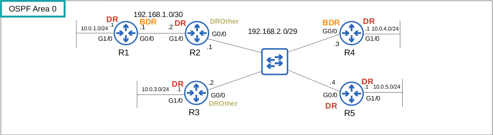
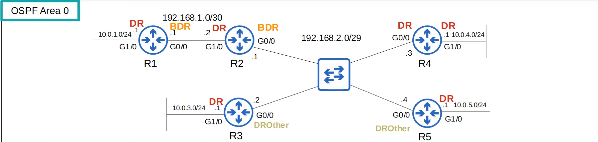
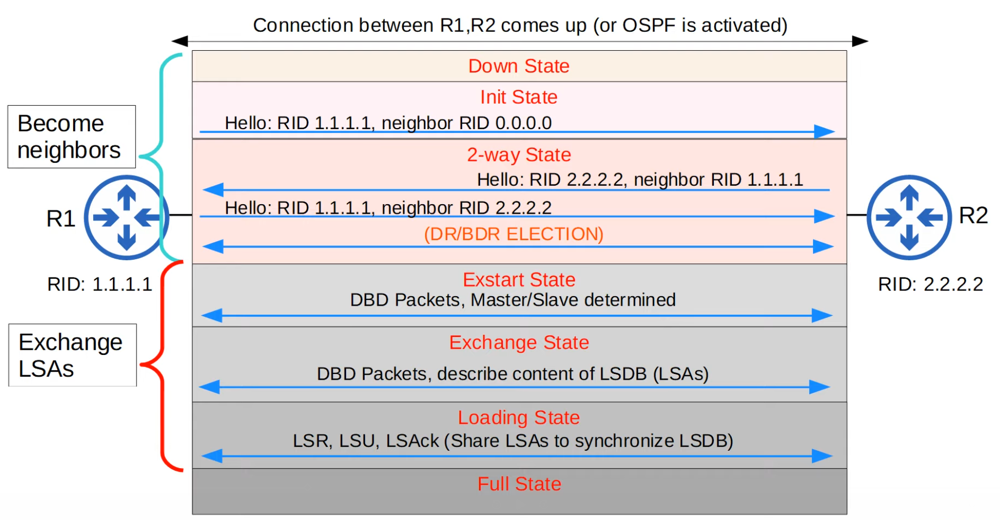
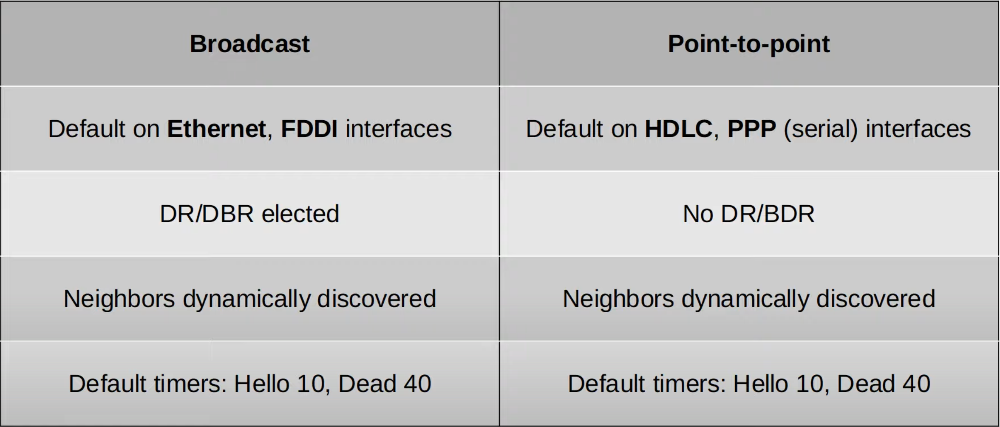
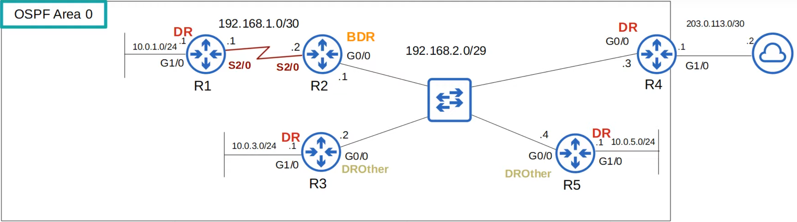

# OSPF Part 3
### Things We'll Cover
- OSPF Network Types
- OSPF neighbor/adjacency requirements
- OSPF LSA types
### Loopback Interfaces
- A loopback interface is a virtual interface in the router
- It's always up/up (unless you manually shut it down)
- It's not dependent on a physical interface
- So, it provides a consistent IP address that can be used to reach/identify the router
### OSPF Network Types
- The OSPF 'network type' refers to the type of connection between OSPF neighbors (Ethernet, etc.)
- There are three main OSPF network types:
	- **Broadcast**: Enabled by default on **Ethernet** and **FDDI** (Fiber Distributed Data Interfaces) interfaces
	- **Point-to-Point**: Enabled by default on **PPP** (Point-to-Point Protocol) and **HDLC** (High-Level Data Link Control) interfaces
	- **Non-Broadcast**: Enabled by default on **Frame Relay** and **X.25** interfaces
### OSPF Broadcast Network Type

- Enabled on **Ethernet** and **FDDI** interfaces by default
- Routers *dynamically discover* neighbors by sending/listening for OSPF Hello messages using multicast address 224.0.0.5
- A **DR** (designated router) and **BDR** (backup designated router) must be elected on each subnet (only DR if there are no OSPF neighbors, i.e. R1's G1/0 interface)
- Routers which aren't the DR or BDR become a **DROther**
- The DR/BDR election order of priority:
	1. Highest **OSPF interface priority**
	2. Highest OSPF Router ID
- 'First place' becomes the DR for the subnet, 'second place' becomes the BDR
- The default OSPF Interface priority is 1 on all interfaces
- The command to change the OSPF priority of an interface is: `ip ospf priority <0-255>`
	- If you set the OSPF interface priority to 0, the router CANNOT be the DR/BDR for the subnet
- The DR/BDR election is 'non-preemptive'
- Once the DR/BDR are selected, they will keep their role until OSPF is reset, the interface fails/is shut down, etc.
- So, if we change the OSPF priority of R2 to 255 and run `clear ip ospf process`, we can see the topology has changed a bit:

- **R4 became the DR, not R2. R2 became the BDR**
	- When the DR goes down, the BDR becomes the new DR
	- Then, an election is held for the next BDR
- **R3 is a DROther, and is stable in the 2-way state**
	- DROthers (R3 and R5 in this subnet) will only move to the FULL state with the DR and BDR
	- The neighbor state with other DROthers will be 2-way
- In the broadcast network type, routers will only form a full OSPF adjacency with the DR and BDR of the segment
- Therefore, routers only exchange LSAs with the DR and BDR. DROthers will not exchange LSAs with each other.
- All routers will still have the same LSDB, but this reduces the amount of LSAs flooding the network
- **Messages to the DR/BDR are multicast using address *224.0.0.6***
### OSPF Neighbors

- The DR and BDR will form a FULL adjacency with ALL routers in the subnet
- DROthers will form a FULL adjacency only with the DR/BDR
### OSPF Point-to-Point Network Type
- Enabled on **serial** interfaces using the **PPP** or **HDLC** encapsulations by default
- Routers *dynamically discover* neighbors by sending/listening for OSPF Hello messages using multicast address 224.0.0.5
- A DR and BDR are **not** elected
- These encapsulations are used for 'point-to-point' connections
- Therefore there is no point in electing a DR & BDR
- The two routers will form a Full adjacency with each other
### Serial Interface
- One side of a serial connection functions as DCE (Data Communications Equipment)
- The other side functions as DTE (Data Terminal Equipment)
- The DCE side needs to specify the *clock rate* (speed) of the connection
- This can be done using the command: `clock rate [bits-per-second]`
- Ethernet interface use the `speed` command to configure the interface's operating speed
- Serial interfaces use the `clock rate` command
- The default encapsulation on a serial interface is HDLC
- To change it to PPP, use the command `encapsulation PPP`
- If you change the encapsulation, it must match on both ends or the interface will go down
- To see which side is the DTE and which is the DCE, use the command `show controllers [interface-id]`
### Configure the OSPF Network Type
- You can configure the OSPF network type on an interface with `ip ospf network [type]`
	- broadcast
	- non-broadcast
	- point-to-multipoint
	- point-to-point
- For example, if two routers are directly connected with an Ethernet link, there is no need for a DR/BDR
- You can configure the point-to-point network type in this case
- NOTE: Not all network types work an all link types (for example, a serial link cannot use the broadcast network type)

- **Non-broadcast** network type default timers = Hello 30, Dead 120
### OSPF Neighbor Requirements
1. Area number must match
2. Interfaces must be in the same subnet
3. OSPF process must not be `shutdown`
4. OSPF Router IDs must be unique
5. Hello & Dead timers must match
6. Authentication settings must match
7. IP MTU settings must match
8. OSPF Network Type must match
	- 7 & 8 can still become OSPF neighbors, but OSPF doesn't work properly
### OSPF LSA Types

- The topology has changed a bit to add an internet interface to R4
- The OSPF LSDB is made up of LSAs
- There are 11 types of LSA, but there are only 3 worth remembering for the CCNA:
	- **Type 1 (Router LSA)**
		- Every OSPF router generates this type of LSA
		- It identifies the router using its router ID
		- It also lists networks attached to the router's OSPF-activated interfaces
	- **Type 2 (Network LSA)**
		- Generate by the DR of each 'multi-access' network (i.e. the **broadcast** network type)
		- Lists the routers which are attached to the multi-access network
	- **Type 5 (AS External LSA)**
		- Generated by ASBRs to describe routes to the destination outside of the AS (OSPF domain)
