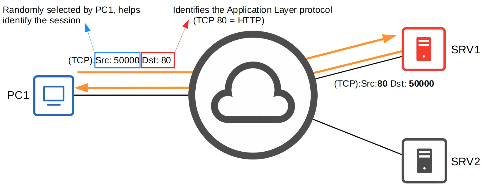
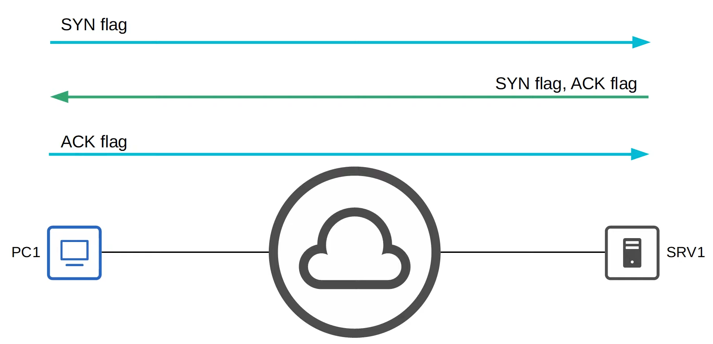
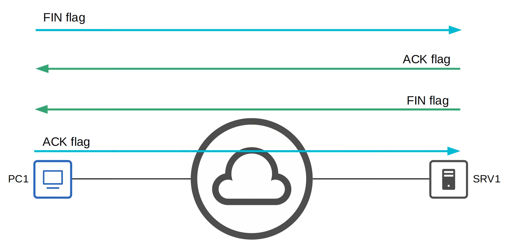
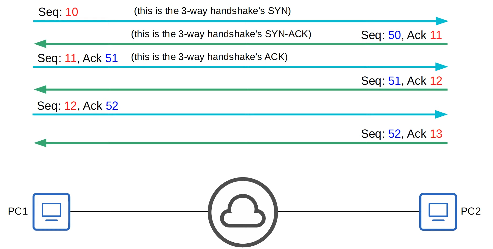
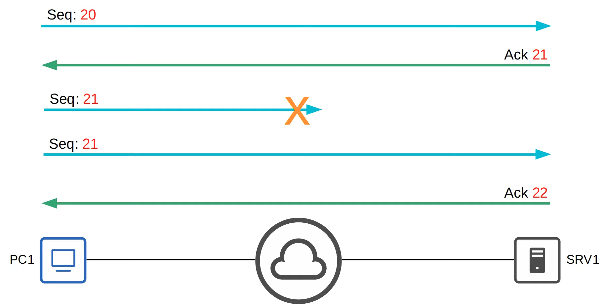
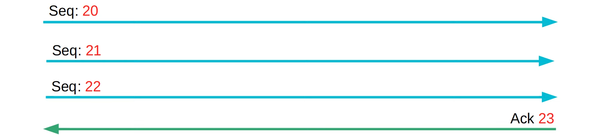
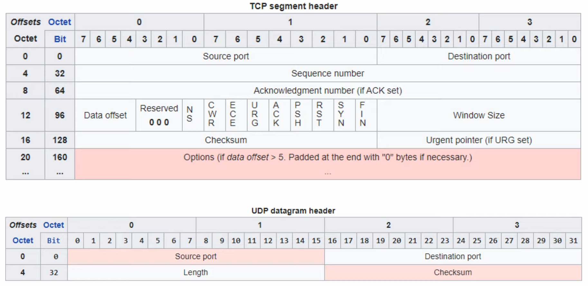
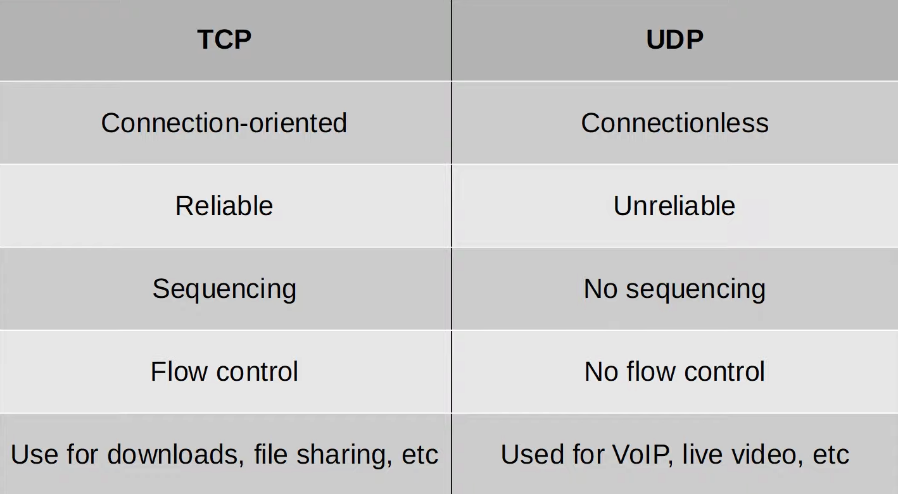
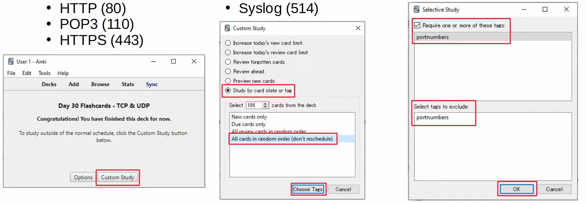

# TCP & UDP
### Things We'll Cover
- Basics of Layer 4
- TCP (Transmission Control Protocol)
- UDP (User Datagram Protocol)
### Functions of Layer 4 (Transport Layer)
- Provides transparent transfer of data between end hosts
- Provides (or doesn't provide) various services to applications (TCP only):
	- Reliable data transfer
	- Error recovery
	- Data sequencing
	- Flow control
- Provides L4 addressing (**port** numbers - this applies to both TCP & UDP)
	- NOT the physical interfaces/ports on network devices
	- Provides session multiplexing
	- The following ranges have been designated by IANA (Internet Assigned Numbers Authority)
		- **Well-known** port numbers: 0-1023
		- **Registered** port numbers: 1024-49151
		- **Ephemeral/private/dynamic** port numbers: 49152-65535
### Port Numbers / Session Multiplexing
- A **session** is an exchange of data between two or more communicating devices

- The server sends back a message using the PC's destination port as the server's source port and vice versa
- This is done to tell PC1 that this communication is part of the same session
### TCP (Transmission Control Protocol)
- **Is connection-oriented:**
	- Before actually sending data to the destination host, the two hosts communicate to establish a connection
	- Once the connection is established, the data exchange begins
- **Provides reliable communication:**
	- The destination host must acknowledge that it received each TCP segment
	- If a segment isn't acknowledged, it's sent again
- **Provides sequencing:**
	- Sequence numbers in the TCP header allow destination hosts to put segments in the correct order even if they arrive out of order
- **Provides flow control:**
	- The destination host can tell the source host to increase/decrease the rate that data is sent
### Establishing Connections: Three-Way Handshake

### Terminating Connections: Four-Way Handshake

### TCP: Sequencing/Acknowledgement

- Hosts set a random initial sequence number
- **Forward acknowledgement** is used to indicate the sequence number of the next segment the host expects to receive
### TCP Retransmission

### TCP Flow Control: Window Size
- Acknowledging every single segment, no matter what size, is inefficient
- The TCP header's **Window Size** field allows more data to be sent before an acknowledgement is required
- A 'sliding window' can be used to dynamically adjust how large the window size is

- **NOTE:** In all of these examples, very simple sequence numbers were used
- In real situations, the sequence numbers get much larger and don't increase by 1 with each message
- For the CCNA, it's enough to understand the concepts of TCP without worrying about exact numbers
### UDP (User Datagram Protocol)
- Is **not** connection-oriented:
	- The sending host does not establish a connection with the destination host before sending data
	- The data is simply sent
- **Does not** provide reliable communication
	- When UDP is used, acknowledgements are not sent for received segments
	- If a segment is lost, UDP has no mechanism to re-transmit it
	- Segments are sent 'best-effort'
- **Does not** provide sequencing
	- There is no sequence number field in the UDP header
	- If segments arrive out of order, UDP has no mechanism to put them back in order
- **Does not** provide flow control
	- UDP has no mechanism like TCP's window size to control the flow of data
### Comparing TCP & UDP

- TCP provides more features than UDP, but at the cost of **additional overhead**
- For applications that require reliable communications (i.e. downloading a file), TCP is preferred
- For applications like real-time voice and video, UDP is preferred
- There are some applications that use UDP, but provide reliability etc. within the application itself
- Some applications use both TCP & UDP, depending on the situation

### Port Numbers
### TCP
- FTP Data (20)
- FTP Control (21)
- SSH (22)
- Telnet (23)
- SMTP (25)
- HTTP (80)
- POP3 (110)
- HTTPS (443)
### UDP
- DHCP Server (67)
- DHCP Client (68)
- TFTP (69)
- SNMP Agent (161)
- SNMP Manager (162)
- Syslog (514)
### TCP & UDP
- DNS (53)
### Using Anki to Study Port Numbers (Custom Study)

