# IPv6 Part 1
### Things We'll Cover
- Hexadecimal (Review)
- Why IPv6?
- Basics of IPv6
- Configuring IPv6 addresses
### What about IPv5?
- 'Internet Stream Protocol' was developed in the late 1970s, but never actually introduced for public use
- It was never called 'IPv5', but it used a value of 5 in the Version field of the IP header
- So, when the successor to IPv4 was being developed, it was named IPv6
### Hexadecimal
- Binary / Base2 / 0b
	- 0, 1
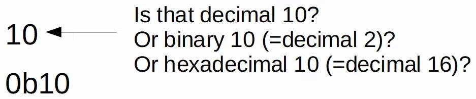
- Decimal / Base 10 / 0d
	- 0, 1, 2, 3, 4, 5, 6, 7, 8, 9
- Hexadecimal / Base 16 / 0x
	- 0, 1, 2, 3, 4, 5, 6, 7, 8, 9, A, B, C, D, E, F
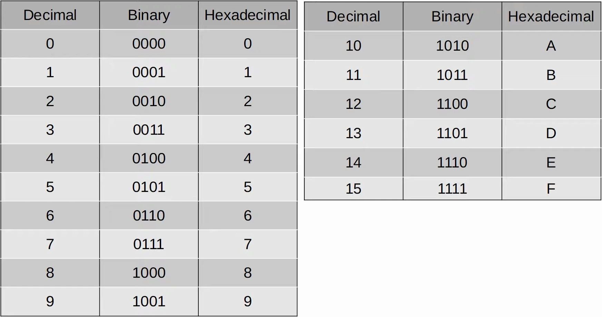
### Binary -> Hexadecimal 1
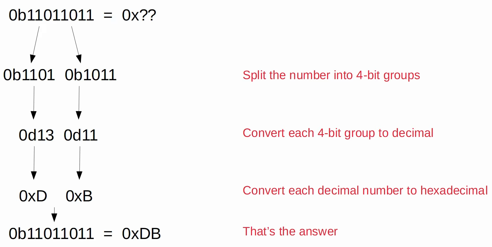
### Hexadecimal -> Binary 1
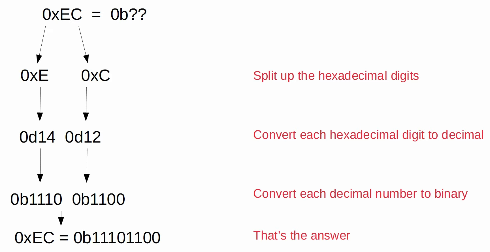
### Why IPv6
- The main reason is that **there simply aren't enough IPv4 addresses available**
- There are 4,294,967,296 (2^32) IPv4 addresses available
- When IPv4 was being designed 30 years ago, the creators had no idea the Internet would be as large as it is today
- VLSM, private IPv4 addresses, and NAT have been used to conserve the use of IPv4 address space
- Those are short-term solutions
- The long-term solution is IPv6
- IPv4 address assignments are controlled by IANA (Internet Assigned Numbers Authority)
- IANA distributes IPv4 address space to various RIRs (Regional Internet Registries), which then assign them to companies that need them
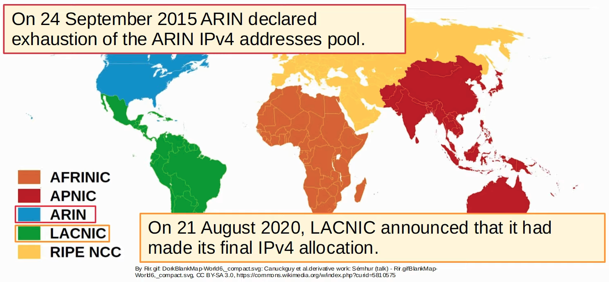
### IPv6
- An IPv6 is **128 bits**
- Every additional bit **doubles** the number of possible addresses
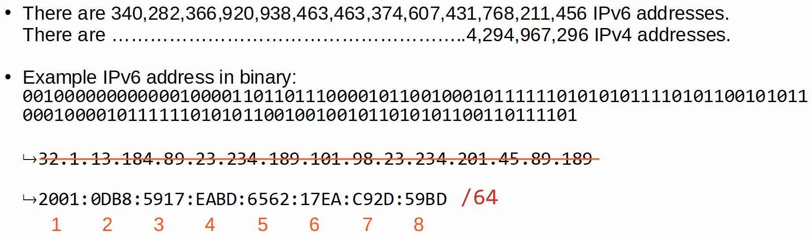
### Shortening (Abbreviating) IPv6 Addresses
- **Leading 0s** can be removed
	- `2001:0DB8:000A:001B:20A1:0020:0080:34BD`
	- = `2001:DB8:A:1B:20A1:20:80:34DB`
- **Consecutive quartets of all 0s** can be replaced with a double colon (::)
	- `2001:0DB8:0000:0000:0000:0000:0080:34BD`
	- = `2001:0DB8::0080:34BD`
	- Combine both methods = `2001:DB8:80:34BD`
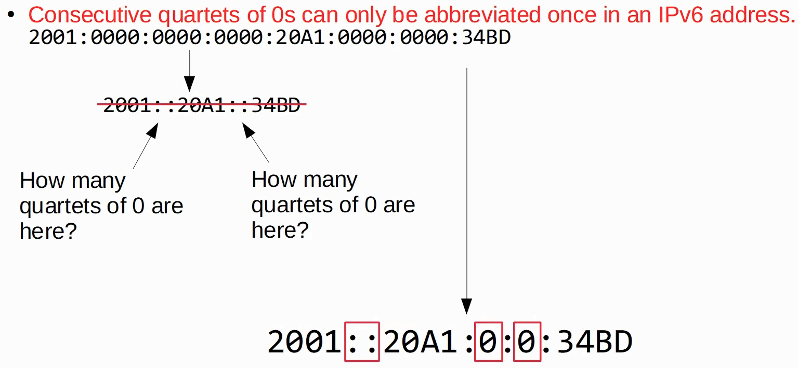
# Expanding Shortened IPv6 Addresses
- Put leading 0s where needed (all quartets should have 4 hexadecimal characters)
	- `FE80::2:0:0:FBE8`
	- = `FE80::0002:0000:0000:F8E`
- If a double colon is used, replace it with all-0 quartets
- Make sure there are 8 quartets in total
	- `FE80::002:0000:000:F8E8` - 5 quartets (8 quartets, but only 5 are written)
	- = `FE80:0000:0000:0000:0002:0000:0000:FBE8` - 8 quartets
### Finding the IPv6 Prefix (Global Unicast Address)
- Typically, an enterprise requesting IPv6 addresses from their ISP will receive a /48 block
- Typically, IPv6 use a /64 prefix length
- That means an enterprise has 16 bits to use to make subnets
- The remaining 64 bits can be used for hosts
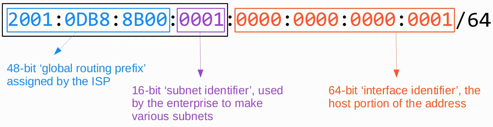
### Finding the IPv6 Prefix
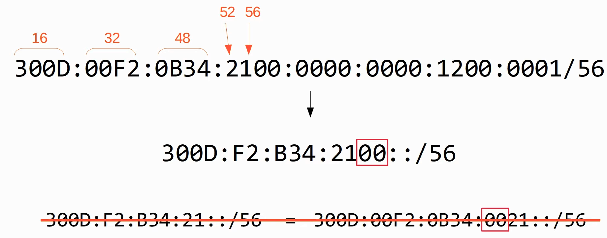
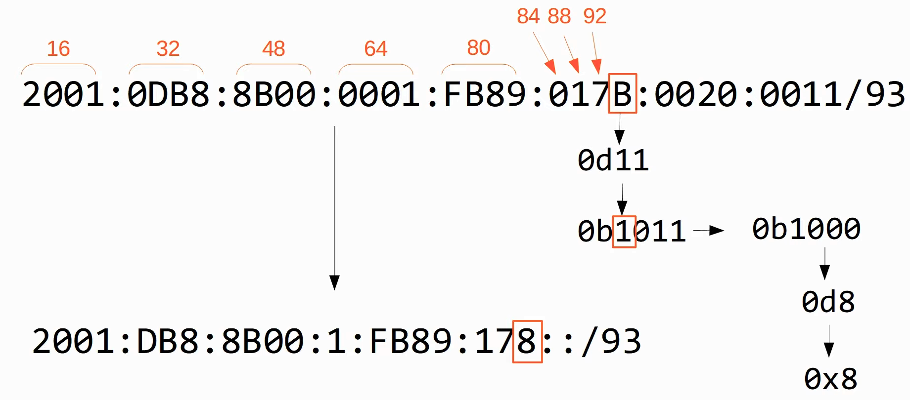
### Configuring IPv6 Addresses
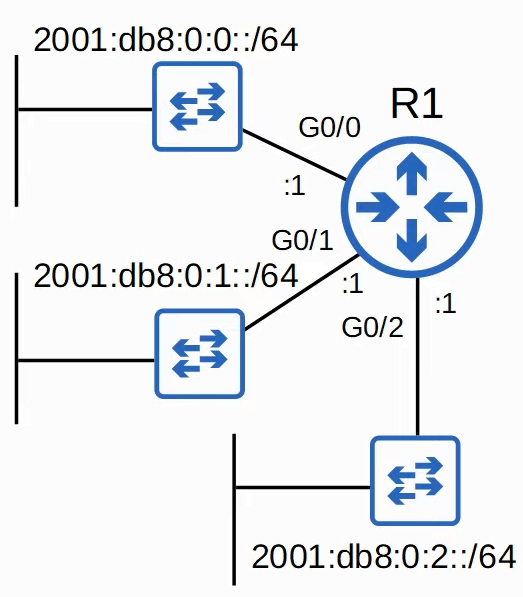
1. `ipv6 unicast-routing`: Allows the router to perform IPv6 routing
2. `int [interface-id]`
3. `ipv6 address [ipv6-address]/[prefix]`
4. `no shutdown`
5. `show ipv6 brief`: Confirm changes