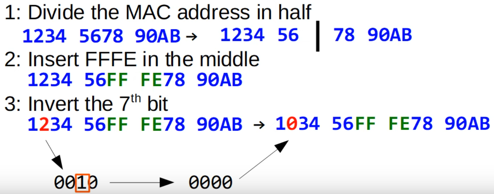
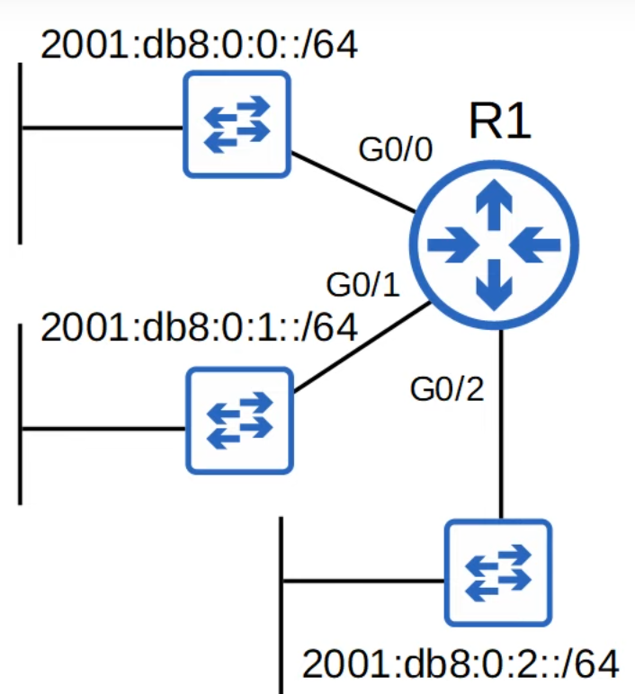
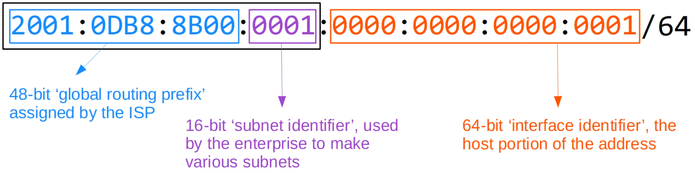
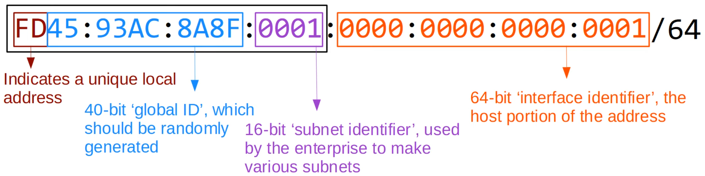
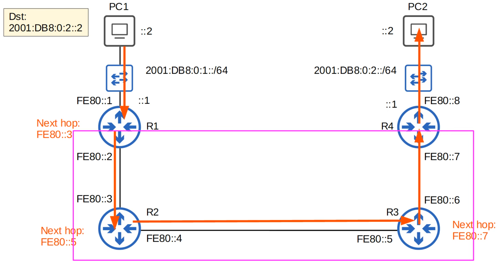
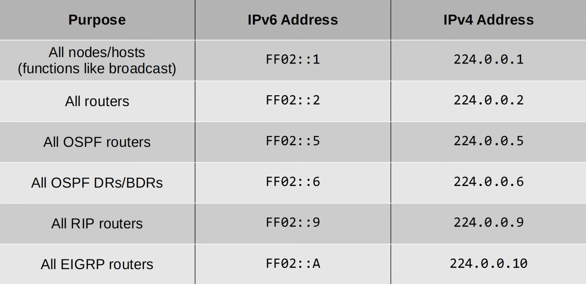
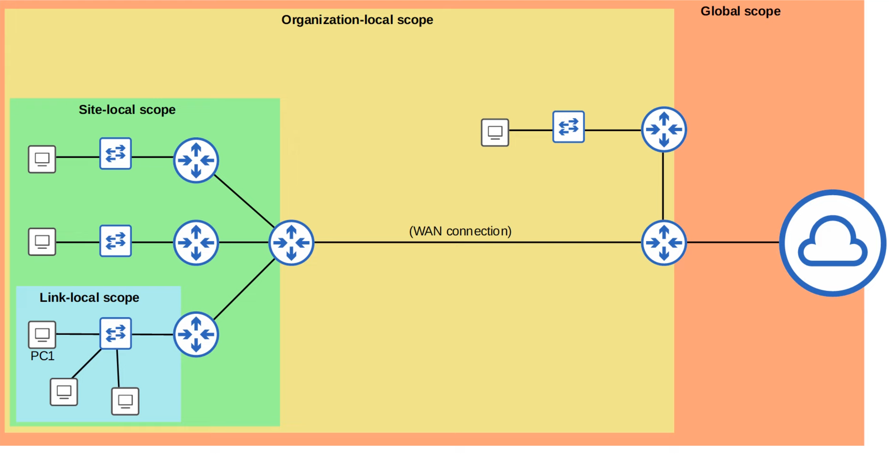
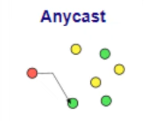

# IPv6 Part 2
### Things We'll Cover
- IPv6 Address Configuration (Continued)
	- Modified EUI-64
- IPv6 Address Types:
	- Global Unicast
	- Unique Local
	- Link Local
	- Multicast
	- Etc.
### Configuring IPv6 Address (EDU-64)
- **EUI** stands for **Extended Unique Identifier**
- (Modified) EUI-64 is a method of converting a MAC address (48 bits) into a 64-bit interface identifier
- This interface identifier can then become the 'host portion' of a /64 IPv6 address
- How to convert the MAC address:

- To configure an interface using EUI-64, we'd use the following commands:
	- `R1(config-if)#ipv6 address [ipv6-address/64] eui-64`
	- `no shutdown`
### Why insert the 7th bit?
- MAC addresses can be divided into two types:
	- **UAA** (Universally Administered Address)
		- Uniquely assigned to the device by the manufacturer
	- **LAA** (Locally Administered Address)
		- Manually assigned by an admin (with the `mac-address` command on the interface) or protocol
		- Doesn't have to be globally unique
- You can identify a UAA or LAA by the 7th bit of the MAC address, called the U/L bit (Universal/Local bit):
	- U/L bit set to **0 = UAA**
	- U/L bit set to **1 = LAA**
- In the context of IPv6 addresses/EUI-64, the meaning of the U/L bit is reversed:
	- U/L bit set to **0** = The mac address the EUI-64 interface ID was made from was an **LAA**
	- U/L bit set to **1** = The mac address the EUI-64 interface ID was made from was a **UAA**
### Global Unicast Addresses
- **Global unicast** IPv6 addresses are public addresses which can be used over the internet
- Must register to use them
- Because they're public addresses, it's expected that they're globally unique
- Originally defined as the `2000::/3` block (`2000::` to `3FFF:FFFF:FFFF:FFFF:FFFF:FFFF:FFFF:FFFF`)
- Now defined as all addresses which aren't reserved for other purposes

### Unique Local Addresses
- **Unique local** IPv6 addresses are *private* addresses which **cannot be used over the Internet**
- You don't need to register to use them
- They can be used freely within internal networks and don't need to be globally unique
	- The global ID should be unique so that addresses don't overlap when companies merge
- Can't be routed over the Internet
- Uses the address block `FC00::/7` (`FC00::` to `FDFF:FFFF:FFFF:FFFF:FFFF:FFFF:FFFF:FFFF`)
- However, a later update requires the 8th bit to be set to 1, so the first two digits must be FD

### Link Local Addresses
- **Link-local** IPv6 addresses are automatically generated on IPv6-enabled interfaces
- Use command `R1(config-if)# ipv6 enable` on an interface to enable IPv6 on it
- Uses the address block `FE80::/10` (`FE80::` to `FEBF:FFFF:FFFF:FFFF:FFFF:FFFF:FFFF:FFFF`)
- However, the standard states that the 54 bits after FE80/10 should be all 0, so you won't see link local addresses beginning with FE9, FEA, or FEB. Only FE8
- The interface ID is generated using EUI-64 rules
- *Link-local* means that these addresses are used for communication within a single link (subnet)
	- Routers **will not** route packets with a link-local destination IPv6 address
- Common uses of link-local addresses:
	- Routing protocol peerings (OSPFv3 uses link-local addresses for neighbor adjacencies)
	- next-hop addresses for static routes
	- *Neighbor Discovery Protocol* (NDP, IPv6's replacement for ARP) uses link-local addresses to function

### Multicast Addresses
- **Unicast** addresses are one-to-one
	- One source to done destination
- **Broadcast** addresses are one-to-all
	- One source to all destinations (within the subnet)
- **Multicast** addresses are one-to-many
	- One source to multiple destinations (that have joined the specific *multicast* group)
- IPv6 uses range `FF00::/8` for multicast (`FF00::` to `FFFF:FFFF:FFFF:FFFF:FFFF:FFFF:FFFF:FFFF`)
- **IPv6 doesn't use broadcast** (there is no 'broadcast address' in IPv6)

### Multicast Address Scopes
- IPv6 defines multiple multicast 'scopes' which indicate how far the packet should be forwarded
- The addresses in the previous slide all use the 'link-local' scope (FF02), which stays in the local subnet
- IPv6 multicast scopes:
	- **Interface-local** (FF01): The packet doesn't leave the local device
		- Can be used to send traffic to a service within the local device
	- **Link-local** (FF02): The packet remains in the local subnet
		- Routers will not route the packet between subnets
	- **Site-local** (FF05): The packet can be forwarded by routers
		- Should be limited to a single physical location (not forwarded over a WAN)
	- **Organization-local** (FF08): Wider in scope than site-local (an entire company/organization)
	- **Global** (FF0E): No boundaries
		- Possible to be routed over the Internet

### Anycast Addresses
- **Anycast** is a new feature of IPv6
- Anycast is 'one-to-one-of-many'

- Multicast routers are configured with the same IPv6 address
	- They use a routing protocol to advertise the address
	- When hosts send packets to that destination address,r outers will forward it to the nearest router configured with that IP address (based on routing metric)
- There is no specific address range for anycast addresses
- Use a regular unicast address (global unicast, unique local) and specify it as an anycast address: `R1(config-if)# ipv6 address 2001:db8:1:1::99/128 anycast`
### Other IPv6 Addresses
- `::` = The *unspecified* IPv6 address
	- Can be used when a device doesn't yet know its IPv6 address
	- IPv6 default routes are configured to `::/0`
	- IPv4 equivalent: `0.0.0.0`
- `::1` = The loopback address
	- Used to test the protocol stack on the local device
	- Messages sent to this address are processed within the local device, but not sent to other devices
	- IPv4 equivalent: `127.0.0.0/8` address range