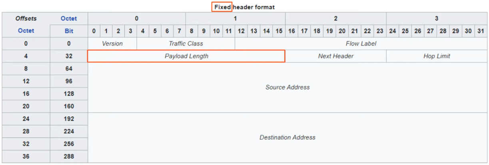
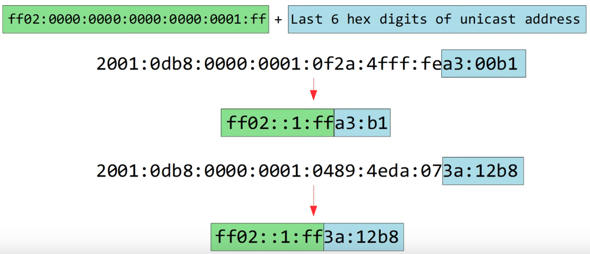
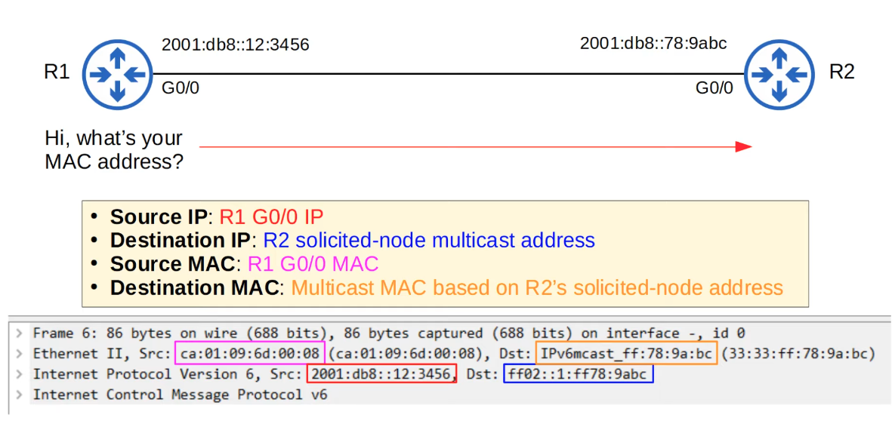
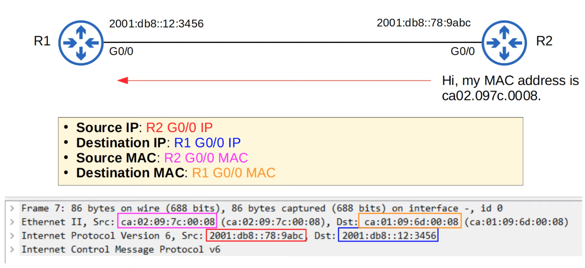
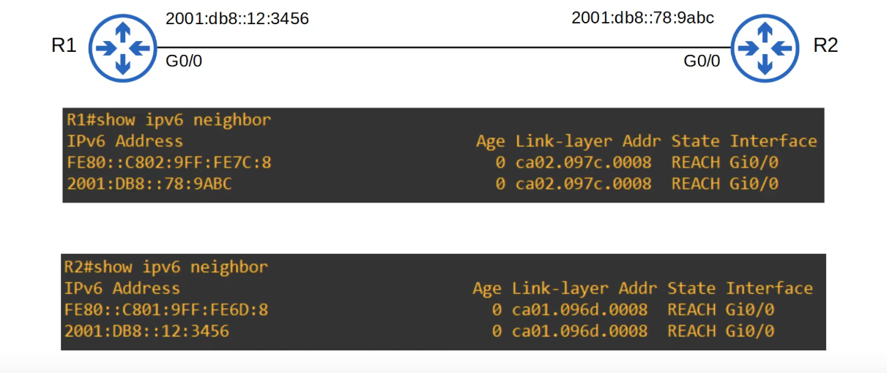
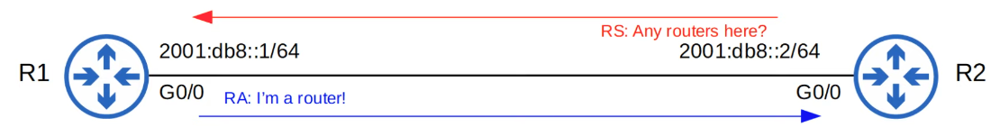
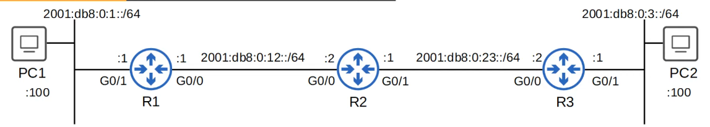
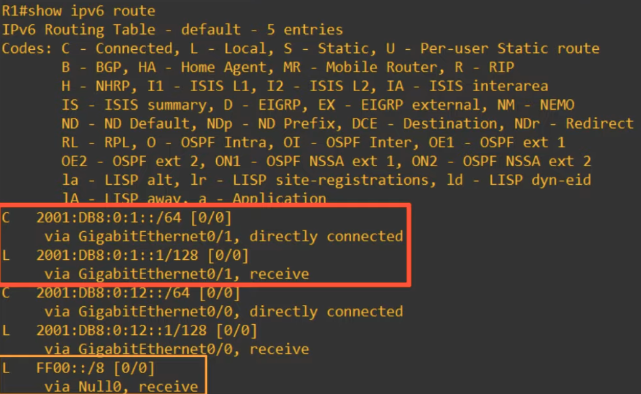

# IPv6 Part 3
### Things We'll Cover
- A correction
- IPv6 header
- Neighbor Discovery Protocol (NDP)
- SLAAC
- IPv6 Static Routing
### IPv6 Address Representation
- An **RFC (Request for Comments)** is a publication from the **ISOC (Internet Society)** and associated organizations like the **IETF (Internet Engineering Task Force)**, and are the official documents of Internet specifications, protocols, procedures, etc.
- RFC 5952 is **'A Recommendation for IPv6 Address Text Representation'**
- Before this RFC, IPv6 address representation was more flexible, you could:
	- Remove leading 0s, or leave them
	- Replace all 0-quartets with `::` or leave them
	- Use upper-case `0xA, B, C, D, E, F` or lower-case `0xa, b, c, d, e, f`
- RFC 5952 suggests standardizing IPv6 address representation
- Leading 0s **MUST** be removed
	- `2001:0db8:0000:0001:0fta:4fff:fea3:00b1`
	- -> `2001:db8:0:1:f2a:4fff:fea3:b1`
- `::` **MUST** be used to shorten the longest string of all-0 quartets (if there is only one all-0 quartet, don't use `::`)
	- `2001:0000:0000:0000:0f2a:0000:0000:00b1`
	- ->`2001::f2a:0:0:b1`
- If there are two equal-length choices for the `::`, use `::` to shorten the one on the left
	- `2001:0db8:0000:0000:0f2a:0000:0000:00b1`
	- -> `2001:db8::f2a:0:0:b1`
- Hex characters a, b, c, d, e, and f **MUST** be written using lower-case, **NOT** upper-case
### IPv6 Header

### Version Field
- Length: 4 bits
- Indicates the version of IP that's used
- Fixed value of 6 (0b0110) to indicate IPv6
### Traffic Class Field
- Length: 8 bits
- Used for QoS (Quality of Service) to indicate high-priority traffic
- For instance, IP phone traffic, live video calls, etc. will have a Traffic Class value which gives them priority over other traffic
### Flow Label Field
- Length: 20 bits
- Used to identify specific traffic 'flows' (communications between a specific source and destination)
### Payload Length Field
- Length: 16 bits
- Indicates the length of the payload (the encapsulated L4 segment) in **bytes**
- The length of the IPv6 header itself isn't included, because it's always 40 bytes
### Next Header Field
- Length: 8 bits
- Indicates the type of the 'next header' (header of the encapsulated segment), for example TCP or UDP
- Same function as the IPv4 header's 'Protocol' field
### Hop Limit Field
- Length: 8 bits
- The value in this field is reduced by 1 by each router that forwards it
- If it reaches 0, the packet is discarded
- Same function as IPv4 header's TTL field
### Source/Destination Fields
- Length: 128 bits each
- These fields contain the IPv6 addresses of the packet's source and the packet's intended destination
### Solicited-Node Multicast Address
- An IPv6 solicited-node multicast address is calculated from a unicast address

### Neighbor Discovery Protocol
- NDP is a protocol used with IPv6
- Has various functions such as replacing ARP (no longer used in IPv6)
- NDP uses ICMPv6 and **solicited-node multicast addresses** to learn the MAC address of other hosts
	- ARP In IPv4 uses **broadcast messages**
- Two message types are used:
	1. **Neighbor Solicitation (NS)** = ICMPv6 Type 135
	2. **Neighbor Advertisement (NA)** = ICMPv6 Type 136
### Neighbor Solicitation (NS)

### Neighbor Advertisement (NA)

### IPv6 Neighbor Table
- `show ipv6 neighbor`

- `Age`: indicates how long ago R1 received traffic from these addresses (in minutes)
- `Link-layer Addr`: Shows R2's MAC address
- `Interface`: Shows the interface this entry was learned on
### Neighbor Discovery Protocol
- Another function of NDP allows hosts to automatically discover routers on the local network
- Two messages are used for this process:
	1. **Router Solicitation (RS)** = ICMPv6 Type 133
		- Sent to multicast address `FF02::2` (all routers)
		- Asks all routers on the local link to identify themselves
		- Sent when an interface is enabled/host is connected to the network
	2. **Router Advertisement (RA)** = ICMPv6 Type 134
		- Sent to multicast address `FF02::1` (all nodes)
		- The router announces its presence, as well as other information about the link
		- These messages are sent in response to RS messages
		- They're also sent periodically, even if the router hasn't received an RS

### SLAAC
- **Stateless Address Auto-Configuration**
- Hosts use the RS/RA messages to learn the IPv6 prefix of the local link (i.e. `2001:db8::/64`), and then automatically generates an IPv6 address
- Using the `ipv6 address [prefix/prefix-length] eui-64` command, you need to manually enter the prefix
- Using the `ipv6 address autoconfig` command, you don't need to enter the prefix
	- The device uses NDP to learn the prefix used on the local link
- The device will use EUI-64 to generate the interface ID, or it will be randomly generated (depending on the device/maker)
### Duplicate Address Detection (DAD)
- DAD allows hosts to check if other devices on the local link are using the same IPv6 address
- Any time an IPv6-enabled interface initializes (`no shutdown` command), or an IPv6 address is configured on an interface (by any method: manual, SLAAC, etc.) it performs DAD
- DAD Uses two messages you learned earlier: NS and NA
- The host will send an NS to its own IPv6 address
	- If it doesn't get a reply, it knows the address is unique
	- If it gets a reply, it means another host on the network is already using the address
### IPv6 Static Routing
- IPv6 routing works the same as IPv4 routing
- However, the two processes are separate on the router, and the two routing tables are separate as well
- IPv4 routing is enabled by default
- IPv6 routing is disabled by default, and must be enabled with `ipv6 unicast-routing`
- If IPv6 routing is disabled, the router will be able to send receive IPv6 traffic, but will not *route* IPv6 traffic (won't forward it between networks)

- A connected *network route* is automatically added for each connected network
- A local *host route* is automatically added for each address configured on the router
- Routes for link-local addresses are not added to the routing table
- IPv6 static route command: `ipv6 route destination/prefix-length{next-hop | exit-interface [next-hop]} [ad]`
	- Curly brackets represent a **required choice**
	- Square brackets represent an **optional choice**
- The following three static routes are **the same** for both IPv4 and IPv6
- **Directly attached** static route: Only the exit interface is specified
	- `ipv6 route destination/prefix-length exit-interface`
	- Example: `R1(config)# ipv6 route 2001:db8:0:3::/64 g0/0`
		- This command actually won't work in IPv6
		- In IPv6, you **CAN'T** use directly attached static routes if the interface is an Ethernet interface
- **Recursive** static route: Only the next hop is specified
	- `ipv6 route destination/prefix-length next-hop`
	- Example: `R1(config)# ipv6 route 2001:db8:0:3::/64 2001:db8:0:12::2`
- **Fully specified** static route: Both the exit interface and next hop are specified
	- `ipv6 route destination/prefix-length exit-interface next-hop`
	- Example: `R1(config)# ipv6 route 2001:db8:0:3::/64 g0/0 2001:db8:0:12::2`
- **Network Route:**
	- `R1(config)# ipv6 route 2001:db8:0:3::/64 2001:db8:0:12::2`
- **Host Route:**
	- `R2(config)# ipv6 route 2001:db8:0:1::100/128 2001:db8:00:12::1`
	- `R2(config)# ipv6 route 2001:db8:0:1::100/128 2001:db8:00:23::2`
- **Default Route:**
	- `R3(config)# ipv6 route ::/0 2001:db8:0:23::1`
- **Floating Static Route:**
	- Raise the AD higher than the main route
### Link-Local Next-Hops
- `ipv6 route address/prefix-length interface-id link-local-next-hop`