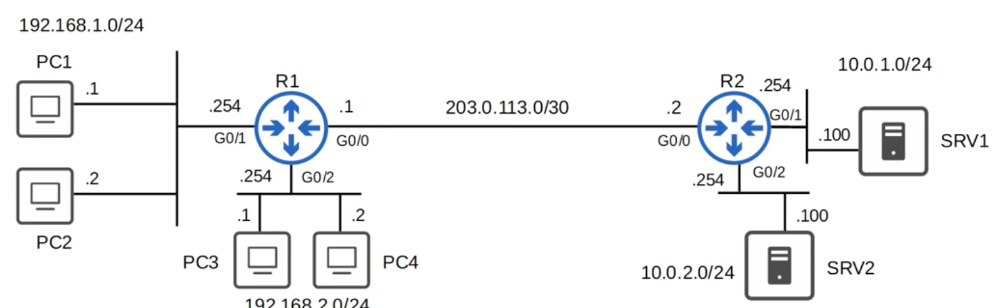
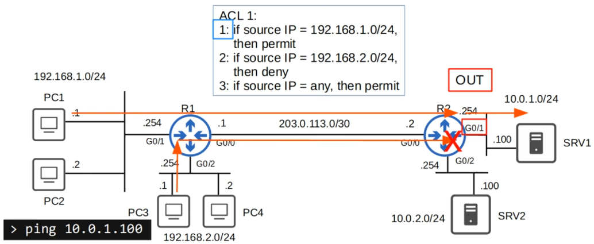
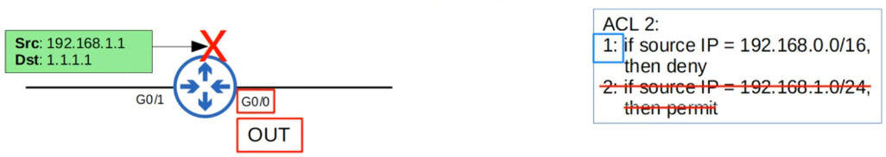
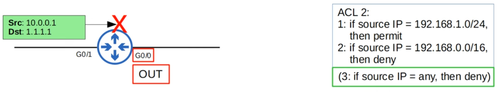
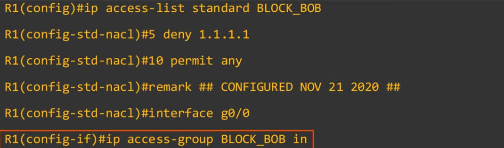

# Standard Access Control Lists
### Things We'll Cover
- What are ACLs?
- ACL logic
- ACL types
- Standard numbered ACLs
- Standard named ACLs
### What are ACLs?
- **ACLs (Access Control Lists)** have multiple uses
- ACLs function as a packet filter, instructing the router to permit or discard specific traffic
- They can filter traffic based on source/destination IP addresses, source/destination Layer 4 ports, etc.
- For the following examples, we'll be using this topology:

### How ACLs work
- **REQUIREMENT**:
	- Hosts in 192.168.1.0/24 can access the 10.0.1.0/24 network
	- Hosts in 192.168.2.0/24 **CANNOT** access the 10.0.1.0/24 network
- ACLs are configured globally on the router (global config mode)
- They are an ordered sequence of **ACEs (Access Control Entries)**
- ACL 1:
	1. if source IP = 192.168.1.0/24 then permit
	2. if source IP = 192.168.2.0/24 then deny
	3. if source IP = any, then permit
- Configuring an ACL in global config mode will not make the ACL take effect
- After creation, the ACL must be *applied* to an interface for it to be recognized
- ACLs are applied either inbound or outbound
- In the example topology provided above, we can apply the ACL to a bunch of different interfaces in order to meet the requirements
- However, the *best* option to meet the requirements while not being too restrictive with 192.168.2.0/24's traffic is to apply the ACL as an outbound rule to R2's G0/2 interface

- ACLs are made up of one or more ACEs
- When the router checks a packet against the ACL, it processes the ACEs in order, from **top to bottom**
- If the packet matches one of the ACEs in the ACL, the router takes the action and stops processing the ACL
	- All entries below the matching entry will be ignored

- Above is an example of an ACL that isn't set up properly due to the order mismatch of the ACEs
- **IMPORTANT:** A maximum of *one* ACL can be applied to a single interface **per direction**
	- **Inbound:** Max one ACL
	- **Outbound:** Max one ACL
- If you apply a second ACL to an interface in the same direction as another one, it'll replace the previous ACL
	- i.e. setting up two Inbound ACLs won't work
### Implicit Deny
- What happens if a packet doesn't match any of the entries in an ACL?

- There's an *implicit deny* at the end of all ACLs
- This tells the router to deny all traffic that doesn't match any of the configured entries in the ACL (deny all by default)
### ACL Types
- **Standard ACLs:** Match based on **Source IP address** *only*
	- *Standard Numbered ACLs*
	- *Standard Named ACLs*
- **Extended ACLs:** Match based on **Source/Destination IP, Source/Destination port, etc.**
	- *Extended Numbered ACLs*
	- *Extended Named ACLs*
### Standard Numbered ACLs
- Standard ACLs match traffic based only on the source IP address of the packet
- Numbered ACLs are identified with a number (i.e. ACL 1, ACL 2, etc.)
- Different types of ACLs have a different range of numbers that can be used
	- Standard ACLs can use **1-99** and **1300-1999**
- The basic command to configure a standard numbered ACL is: `R1(config)# access-list [number] {deny | permit} [ip] [wildcard-mask]`
- The following three examples all do the same thing, but the last two only work for /32 subnets (single host):
	- `R1(config)# access-list 1 deny 1.1.1.1 0.0.0.0`
	- `R1(config)# access-list 1 deny 1.1.1.1`
	- `R1(config)# access-list 1 deny host 1.1.1.1`
- The following two are able to permit all traffic (remember implicit deny):
	- `R1(config)# access-list 1 permit any`
	- `R1(config)# access-list 1 permit 0.0.0.0 255.255.255.255`
- Finally, you can also configure a *remark* for an ACL (think interface description)
	- `R1(config)# access-list 1 remark ## BLOCK BOB FROM ACCOUNTING ##`
		- The # symbol isn't necessary, just makes it easier to read
- To view the configured ACLs, use the command `show access-lists`
- To only view IP ACLs, use the command `show ip access-lists`
- To view the ACLs and the remarks, use the command `show running-config | include access-list`
- Finally, to apply the ACL to an interface, use the command `R1(config-if)# ip-access-group [number] {in | out}`
- **IMPORTANT:** Standard ACLs should be applied as close to the destination as possible
	- If you don't do that, you might block more traffic than you intended
- Check the [day 34 video](https://youtu.be/z023_eRUtSo?si=q0wSqDHpPkyoR417&t=1560) for an example on how this works
### Standard Named ACLs
- Still match traffic based only on the source IP of the packet
- Named ACLs are identified with a name instead of a number (i.e. BLOCK_BOB)
- They configured by entering 'standard named ACL config mode', and then configuring each entry within that mode
	- `R1(config)# ip access-list standard [acl-name]`
	- `R1(config-std-nacl)# [entry-number] {deny | permit} [ip] [wildcard-mask]`
		- The entry number is optional, if one isn't entered then it'll be auto assigned
- Here's an example of how this works:

- To view these configurations, we can once again use `R1# show access-lists` or `R1# show running-config | section access-list`
- To view an example of named ACLs, check out the [video](https://youtu.be/z023_eRUtSo?si=DwyHPtK6zJt_d02Q&t=2031)