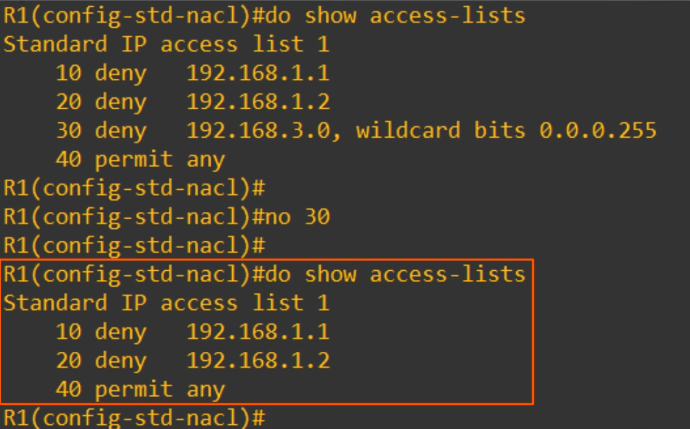
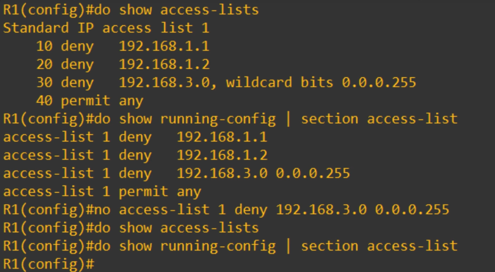
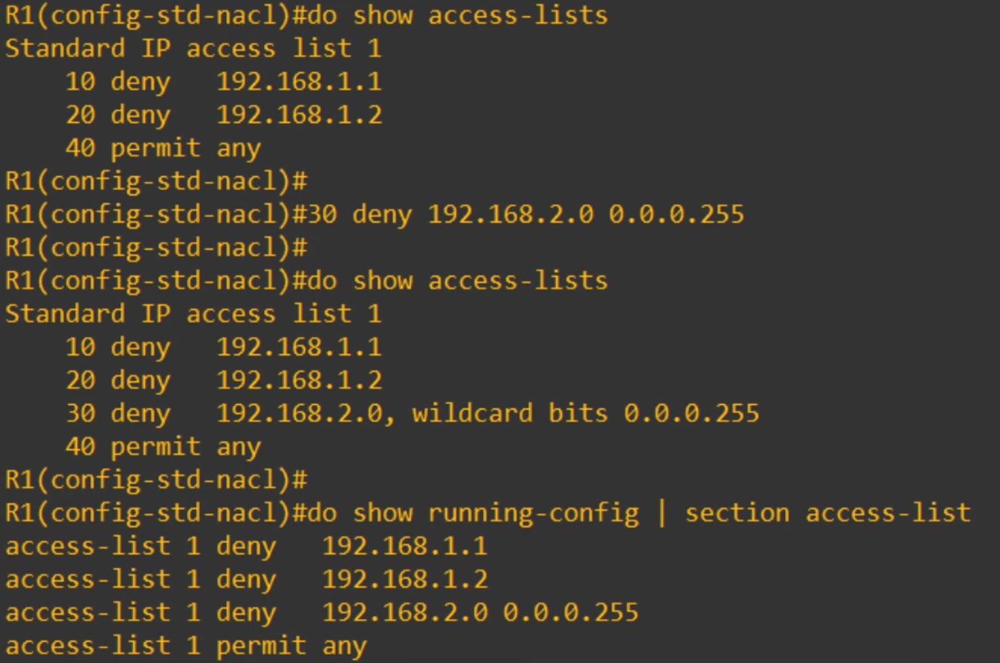
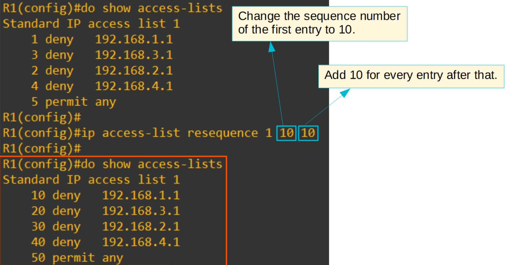
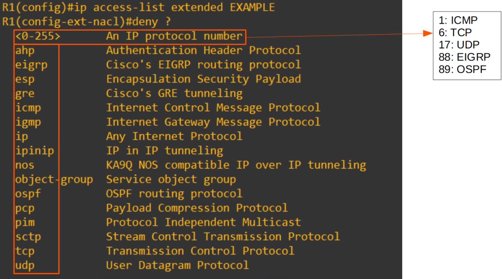
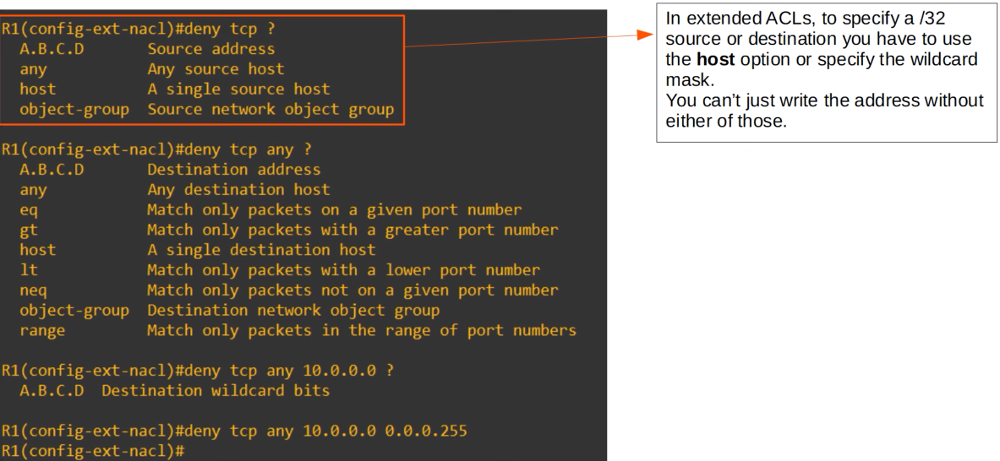
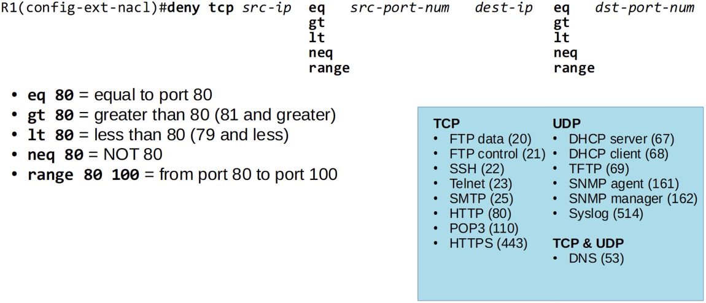

# Extended Access Control Lists
### Things We'll Cover
- Another way to configure numbered ACLs
- Editing ACLs
- Extended numbered and named ACLs
### Configuring Numbered ACLs w/Subcommands
- In [Day 34 - Standard ACLs](Day%2034%20-%20Standard%20ACLs.md), we learned that numbered ACLs are configured in global config mode:
	- `R1(config)# access-list 1 deny 192.168.1.1`
- We also learned that named ACLs are configured w/subcommands in a separate config mode:
	- `R1(config)# ip access-list standard BLOCK_PC1`
	- `R1(config-std-nacl1)# deny 192.168.1.1`
- However, in modern Cisco IOS you can also configure numbered ACLs in the exact same way as named ACLs:
	- `R1(config)# ip access-list standard 1`
	- `R1(config-std-nacl)# deny 192.168.1.1`
- This is just a different way of configuring numbered ACLs
- However, in the running-config, the ACL will display as if it was configured using the traditional method
### Advantages of Named ACL Config Mode
- You can easily delete individual entries in the ACL with `no [entry-number]`

- When configuring/editing numbered ACLs from global config mode, **you can't delete individual entries, you can only delete the entire ACL!**
- You can insert new entries in between other entries by specifying the sequence number

### Resequencing ACLs
- There is a `resequencing` function that helps edit ACLs
- The command is `ip access-list resequence [acl-id] [starting-seq-num] [increment]`

### Extended ACLs
- Function mostly the same as standard ACLs
- Can be numbered or named:
	- Numbered ACLs use the following ranges: **100-199, 2000-2699**
- Are processed from top to bottom
- However, they can match traffic based on more parameters, so they're more precise (and complex) than standard ACLs
- We'll focus on matching based on these main parameters: **L4 protocol/port & source/destination IP address**
- **Extended Numbered ACL Configuration:**
	- `R1(config)# access-list (number) [permit | deny] (protocol) (src-ip) (dest-ip)`
- **Named ACL Configuration:**
	- `R1(config)# ip access-list extended {name | number}`
	- `R1(config-ext-nacl)# [seq-num] [permit | deny] (protocol) (src-ip) (dest-ip)`
### Matching the Protocol

### Matching the Source/Destination IP Address

- The command on the very bottom denies all packets that encapsulate a TCP segment, from any source, to destination `10.0.0.0/24`
### Extended ACL Entry Practice (1)
1. Allow all traffic
	- `R1(config-ext-nacl)#permit ip any any`
2. Prevent 10.0.0.0/16 from sending UDP traffic to 192.168.1.1/32
	1. `R1(config-ext-nacl)#deny udp 10.0.0.0 0.0.255.255 host 192.168.1.1`
3. Prevent 172.16.1.1/32 from pinging hosts in 192.168.0.0/24
	-  `R1(config-ext-nacl)#deny icmp host 172.16.1.1 any 192.168.0.0 0.0.255.255`
### Matching the TCP/UDP Port Numbers
- When matching TCP/UDP, you can optionally specify the source and/or destination port numbers to match

- For example, using the command `R1(config-std-nacl)#deny tcp any host 1.1.1.1 eq 80` denies all packets destined for IP address 1.1.1.1/32, TCP port 80
- After the destination IP address and/or destination port numbers, there are many more options you can use to match **(not necessary for the CCNA)**
- Some examples include:
	- `ack`: match the TCP ACK flag
	- `fin`: match the TCP FIN flag
	- `syn`: match TCP SYN flag
	- `ttl`: match packets with a specific TTL value
	- `dscp`: match packets with a specific DSCP value
- **NOTE:** If you specify the protocol, source IP/port, destination IP/port, etc. a packet must match **ALL** of those values to match the ACL entry
- Even if it matches all except one of the parameters, it won't match the ACL entry
### Extended ACL Entry Practice (2)
4. Allow traffic from 10.0.0.0/16 to access the server at 2.2.2.2/32 using HTTPS
	1. `R1(config-ext-nacl)#permit tcp 10.0.0.0 0.0.255.255 host 2.2.2.2 eq 443`
5. Prevent all hosts using source UDP port numbers from 200000 to 30000 from accessing the server at 3.3.3.3/32
	1. `R1(config-ext-nacl)#deny udp any range 20000 30000 host 3.3.3.3`
6. Allow hosts in 172.16.1.0/24 using a TCP source greater than 999 to access all TCP ports on server 4.4.4.4/32 except port 23
	1. `R1(config-ext-nacl)#permit tcp 172.16.1.0 0.0.0.255 gt 9999 host 4.4.4.4 neq 23`
### Extended ACLs
- Unlike standard ACLs, extended ACLs should be applied as close to the **source** as possible, to limit how far the packets travel in the network before being denied
	- Standard ACLs are less specific, so if they're applied close to the source, there is a risk of blocking more traffic than intended
- Another method of viewing applied ACLs on an in interface is by using the  `show ip interface (interface-id)` command