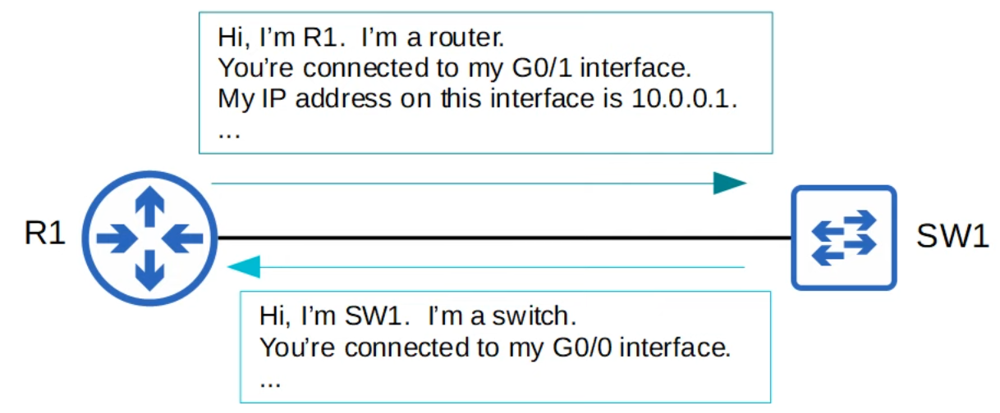

# CDP & LLDP
### Things We'll Cover
- Intro to L2 discovery protocols
- Cisco Discovery Protocol (CDP)
- Link Layer Discovery Protocol (LLDP)
### L2 Discovery Protocols
- Share info with and discover info about neighboring (connected) devices
- The shared info includes host name, IP address, device type, etc.
- CDP is a Cisco proprietary protocol
- LLDP is an industry standard protocol **(IEEE 802.1AB)**
- Because they share info about the devices in the network, they can be considered a security risk and are often not used
- It's up to the network engineer/admin to decide if they want to use them in the network or not

### Cisco Discovery Protocol
- It's enabled on Cisco devices by default
- CDP messages are periodically sent to multicast MAC address `0100.0ccc.cccc`
- When a device receives a CDP message, it processes and discards the message
	- It does NOT forward it to other devices
- By default:
	- CDP messages are sent once every **60 seconds**
	- The CDP holdtime is **180 seconds**
		- If a message isn't received from a neighbor for 180 seconds, the neighbor is removed from the CDP neighbor table
- CDPv2 messages are sent by default
### CDP `show` Commands Summary
- `show cdp`: 
	- Tells us the CDP timer, holdtime, and version
- `show cdp traffic`: 
	- Tells us how many CDP packets/advertisements the device has sent/received
- `show cdp interface`: 
	- Displays which interfaces CDP is enabled on
- `show cdp neighbors`: 
	- Lists CDP neighbors and some basic info about each neighbor
- `show cdp neighbors detail`: 
	- Shows additional info about each neighbor
- `show cdp entry (hostname)`: 
	- Shows the same info as the above command for a specific neighbor
### CDP Configuration Commands
- CDP is globally enabled and enabled on each interface by default
- To enable/disable CDP globally: `R1(config)# [no] cdp run`
- To enable/disable CDP on specific interfaces: `R1(config-if)# [no] cdp enable`
- Configure the CDP timer: `R1(config)# cdp timer (seconds)`
- Configure the CDP holdtime: `R1(config)# cdp holtime (seconds)`
- Enable/disable CDPv2: `R1(config)# [no] cdp advertise-v2`
### Link Layer Discovery Protocol
- An industry standard protocol **(IEE 802.1AB)**
- It's usually disabled on Cisco devices by default, so it must be manually enabled
- A device can run CDP and LLDP at the same time
- LLDP messages are periodically sent to multicast MAC address `0180.c200.000e`
- When a device receives an LLDP message, it processes and discards it
	- It does NOT forward it to other devices
- By default:
	- LLDP messages are sent once every **30 seconds**
	- LLDP holdtime is **120 seconds**
- LLDP has an additional timer called the *reinitialization delay*
	- If LLDP is enabled (globally or on an interface), this timer will delay the actual initialization of LLDP
	- **2 seconds** by default
### LLDP Configuration Commands
- Usually globally disabled and disabled on each interface by default
- To enable LLDP globally: `R1(config)# lldp run`
- To enable LLDP on specific interfaces:
	- (tx): `R1(config-if)# lldp transmit`
	- (rx): `R1(config-if)# lldp receive`
	- Make sure to enable **both** of these commands (not always needed, `lldp run` should be good enough in most Cisco devices)
- Configure the LLDP timer: `R1(config)# lldp timer (seconds)`
- Configure the LLDP holdtime: `R1(config)# lldp holdtime (seconds)`
- Configure the LLDP reinit timer: `R1(config)# lldp reinit (seconds)`
### LLDP `show` Commands Summary
- `R1# show lldp`
	- Shows basic information about LLDP (timers, version)
- `R1# show lldp traffic`
	- Displays how many LLDP messages have been sent/received
- `R1# show lldp interface`
	- Displays which interfaces LLDP tx/rx is enabled on
- `R1# show lldp neighbors`
	- Lists LLDP neighbors and some basic info about each neighbor
- `R1# show lldp neighbors detail`
	- Lists each LLDP neighbor with more detailed info
- `R1# show lldp entry name`
	- Displays the same info as above, but for the specified neighbor only