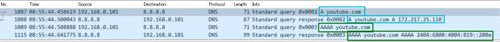
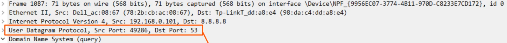

# Domain Name System
### Things We'll Cover
- The purpose/basic functions of DNS
- Configuring DNS in Cisco IOS
### The Purpose of DNS
- Used to resolve human-readable names to IP addresses
- Machines such as PCs don't use names, they use addresses (IPv4/IPv6)
- When you type 'youtube.com' into a web browser, your device will ask a DNS server for the IP address of youtube.com
- The DNS server(s) your device sees can be manually configured or learned via DHCP
### Windows CLI Commands
- `ipconfig /all` is used to view more info, such as DNS servers, than the standard `ipconfig` command
- `nslookup [domain]` tells the device to ask its DNS server for the IP address of the specified name
- `ipconfig /displaydns` views the DNS cache
- `ipconfig /flushdns` clears the DNS cache
- `ping [ip-address] -n [number]` specifies the number of pings
### Wireshark Capture

- DNS 'A' record = used to map names to IPv4 addresses
- DNS 'AAAA' record = used to map names to IPv6 addresses

- Standard DNS queries/responses typically use **UDP**
- **TCP** is used for DNS messages greater than 512 bytes
- In either case, port 53 is used
### DNS Cache
- Devices will save the DNS server's responses to a local DNS cache
- This means they don't have to query the server every single time they want to access a particular destination
### DNS in Cisco IOS
- For hosts in a network to use DNS, you don't need to configure DNS on the routers
- They will simply forward the DNS messages like any other packets
- However, a Cisco router can be configured as a DNS server, although it's rare
	- If an internal DNS server is used, it's usually a Windows or Linux server
- A Cisco router can also be configured as a DNS client
**Configuring a router to be a DNS server:**
- `R1(config)#`
	- `ip dns server`
		- Configure R1 to act as a DNS server
	- `ip host [hostname] [ip-address]`
		- Configure a list of hostname/IP address mappings
	- `ip name-server [dns-server-ip]`
		- Configures a DNS server that R1 will query if the requested record isn't in its host table
	- `ip domain lookup`
		- Enable R1 to perform DNS queries (**enabled by default**)
		- Old version of the command is `ip domain-lookup`
	- **Optional:** `ip domain name [domain]`
		- Configure the default domain name
		- This will be automatically appended to any hostnames without a specified domain
		- i.e. `ping pc1` will become `ping pc1.jeremeysitlab.com`
		- Old version of the command is `ip domain-name`
- `show hosts` views both the configured hosts, and the hosts learned and cached via DNS