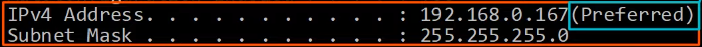

# Dynamic Host Configuration Protocol
### Things We'll Cover
- The purpose of DHCP
- Basic functions of DHCP
- Configuring DHCP in Cisco IOS
### The Purpose of DHCP
-  Used to allow hosts to automatically/dynamically learn various aspects of their network configuration, such as IP addresses, subnet mask, default gateway, DNS server, etc. without manual/static configuration
- It's an essential part of modern networks
- Typically used for 'client devices' such as workstations (PCs), phones, etc.
- Devices such as routers, servers, etc. are usually manually configured
- In small networks (i.e. home networks) the router typically acts as the DHCP server for hosts in the LAN
- In larger networks, the DHCP server is usually a dedicated Windows/Linux server
### The Basic Functions of DHCP
- When running the `ipconfig /all` command on a Windows PC that has DHCP enabled, we can notice the following:

- This means that this PC was previously assigned this IP address by the DHCP server, so it asked to receive the same address again this time

- DHCP servers 'lease' IP addresses to clients
- These leases usually aren't permanent, and the client must give up the address at the end of the lease
- `ipconfig /release` releases the DHCP learned IP address
- DHCP **servers** use UDP port **67**
- DHCP **clients** use UDP port **68**
- After releasing, use the command `ipconfig /renew` for the PC to receive an IP from the DHCP server
### DHCP D-O-R-A

### DHCP Relay
- Some network engineers might choose to configure each router to act as the DHCP server for its connected LANs
- However, large enterprises often choose to use a centralized DHCP server
- If the server is centralized, it won't receive the DHCP clients' broadcast DHCP messages (broadcast messages don't leave the local subnet)
- To fix this, you can configure a router to act as a **DHCP relay agent**
- The router will forward the clients' broadcast DHCP messages to the remote DHCP server as unicast messages

### DHCP Server Configuration in Cisco IOS
- `R1(config)#`
	- `ip dhcp excluded-address [low-address] [high-address]`
		- Specifies a range of addresses that **won't** be given to DHCP clients
	- `ip dhcp pool [pool-name]`
		- Create a DHCP pool
		- A DHCP pool is a subnet of addresses that can be assigned to DHCP clients, as well as other info such as DNS server and default gateway
		- Should create a separate pool for each network the router is acting as a DHCP server for
- `R1(dhcp-config)#`
	- `network [ip-address] {/prefix-length | subnet-mask}`
		- Specify the subnet of addresses to be assigned to clients (except the excluded addresses)
	- `dns-server [ip-address]`
		- Specify the DNS server that DHCP clients should use
	- `domain-name [domain]`
		- Specify the domain name of the network
	- `default-router [ip-address]`
		- Specify the default gateway
	- `lease {(days) (hours) (minutes) | infinite}`
		- Specify the lease time
- `R1#`
	- `show ip dhcp binding`
		- Shows all the DHCP clients that are currently assigned IP addresses
### DHCP Relay Agent Configuration in Cisco IOS
- `R1(config)# interface [interface-id]`
	- Configure the interface connected to the subnet of the client devices
- `R1(config-if)# ip helper-address [ip-address]`
	- Configure the IP address of the DHCP server as the 'helper' address
### DHCP Client Configuration in Cisco IOS
- `R1(config-if)# ip address dhcp`
	- Tell the router to use DHCP to learn its IP address