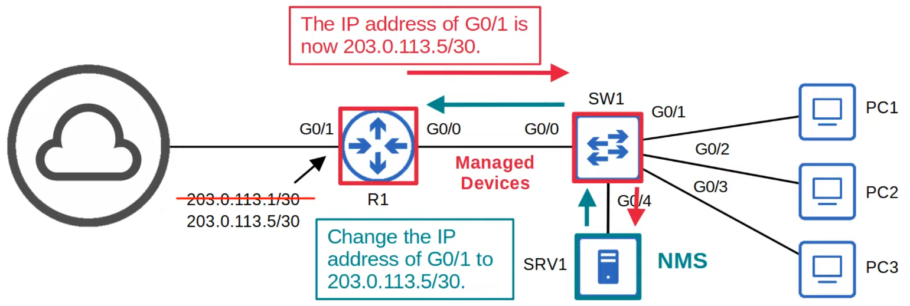
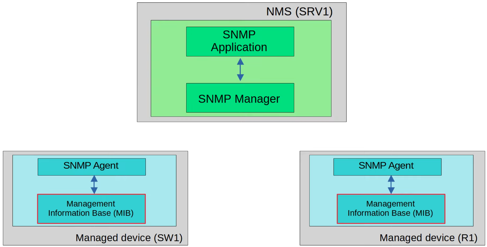
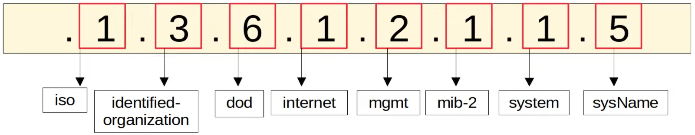
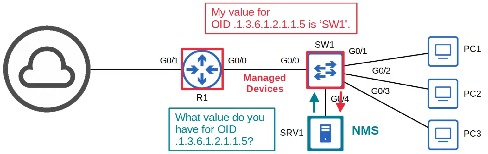
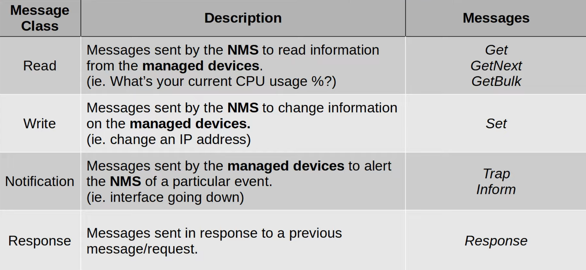

# Simple Network Management Protocol
### Things We'll Cover
- SNMP overview
- Versions
- Messages
- Configuration
### SNMP
- An industry-standard framework and protocol that was originally released in 1988
- SNMP can be used to monitor the status of devices, make configuration changes, etc.
- There are two main types of devices in SNMP:
	1. Managed Devices
		- Devices being managed using SNMP (i.e. routers, switches)
	2. Network Management Station/System (NMS)
		- Device(s) managing the managed devices
		- This is the SNMP 'server'
### SNMP Operations
- There are three main operations used in SNMP:
	1. Managed devices can notify the NMS of events
	2. The NMS can ask the managed devices for info about their current status
	3. The NMS can tell the managed devices to change aspects of their configuration

### SNMP Components

- The **SNMP Manager** is the software on the NMS that interacts with the managed devices
	- It receives notifications, sends requests for information, sends configuration changes, etc.
- The **SNMP Application** provides an interface for the network admin to interact with
	- Displays alerts, stats, charts, etc.
- The **SNMP Agent** is the SNMP software running on the managed devices that interact with the SNMP Manager on the NMS
	- It sends notifications to/receives messages from the NMS
- The **Management Information Base (MIB)** is the structure that contains the variables that are managed by SNMP
	- Each variable is identified with an Object ID (OID)
	- Example variables: Interface status, traffic throughput, CPU usage, temp, etc.
### SNMP OIDs
- SNMP Object IDs are organized in a hierarchical structure

- To explore some different OIDs, use the site [oid-info.com](https://oid-info.com)
### SNMP Versions
- Many versions of SNMP have been proposed/developed, however, only three major versions have achieved wide-spread use:
	- **SNMPv1**
		- The original version of SNMP
	- **SNMPv2c**
		- Allows the NMS to retrieve large amounts of info in a single request, much more efficient
		- 'c' refers to the 'community strings' used as passwords in SNMPv1, removed from SNMPv2, and then added back for SNMPv2c
	- **SNMPv3**
		- A much more secure version of SNMP that supports strong **encryption** and **authentication**
		- Whenever possible, this version should be used
### SNMP Messages

### SNMP 'Read' Messages
- **Get**
	- A request sent from the manager to the agent to retrieve the value of a variable (OID), or multiple variables
	- The agent will send a *Response* message with the current value of each variable
	- **This message is all you need to know for the CCNA**
- **GetNext**
	- A request sent from the manager to the agent to discover the available variables in the MIB
- **GetBulk**
	- A more efficient version of the **GetNext** message (introduced in SNMPv2)
### SNMP 'Write' Messages
- **Set**
	- A request sent from the manager to the agent to change the value of one or more variables
	- The agent will send a *Response* message with the new values
### SNMP 'Notification' Messages
- **Trap**
	- A notification sent from the agent to the manager
	- The manager doesn't send a *Response* message to acknowledge that it receives the Trap
	- These messages are 'unreliable'
- **Inform**
	- A notification message that is acknowledged with a *Response* message
	- Originally used for communications between managers, but later updates allow agents to send Inform messages to managers, too
### SNMP Ports
- SNMP Agent = UDP 161
- SNMP Manager = UDP 162
### SNMPv2c Configuration
- `R1(config)#`
	- `snmp-server {contact | location} (contact | location)`
		- Optional information
	- `snmp-server community (password) {ro | rw}`
		- **ro** = read only = no Set messages
		- **rw** = read/write = can use set messages
		- Default strings:
			- ro = public
			- rw = private
	- `snmp-server host (ip-address) version (snmp-version) (community-name)`
		- Specify the NMS, version, and community
	- `snmp-server enable traps (trap-type)`
		- Configure the Trap types to send to the NMS
### SNMP Security Info
- In SNMPv1 and SNMPv2c, there is no encryption
- The community and message contents are sent in plain-text
- This isn't secure, as the packets can be easily captured and read