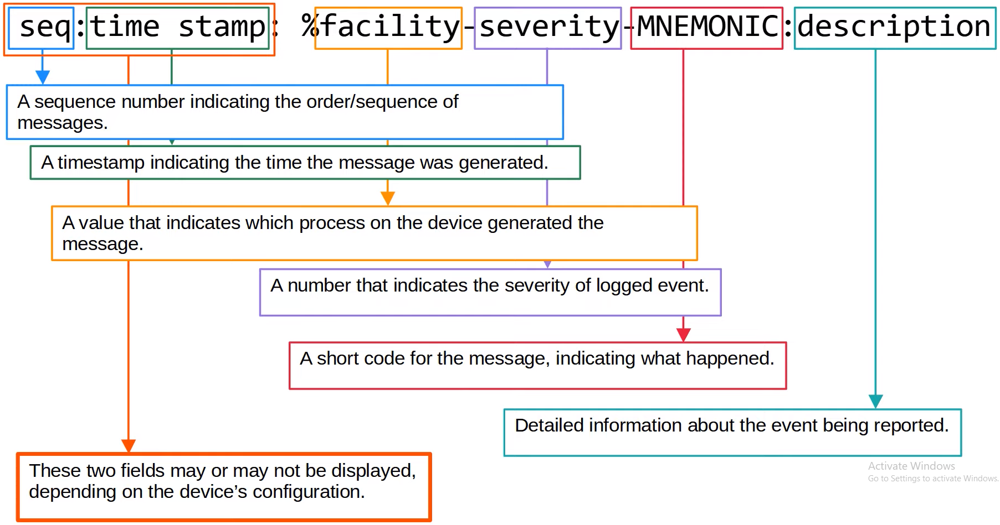
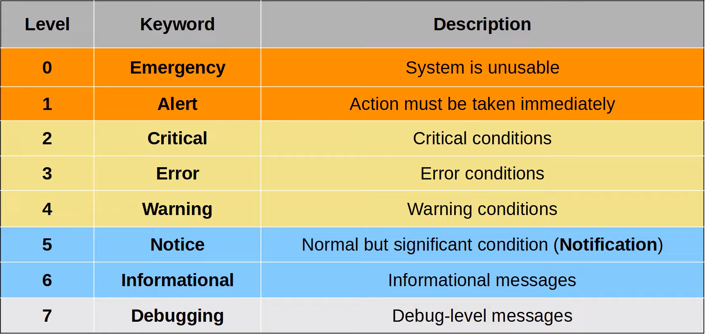
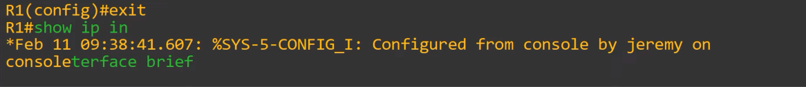

# Syslog
### Things We'll Cover
- Syslog overview
- Message format
- Facilities and severity levels
- Configuration
### Syslog
- An industry standard protocol for message logging
- On network devices, Syslog can be used to log events such as changes in interface status, changes in OSPF neighbor status, system restarts, etc.
- The messages can be displayed in the CLI, saved in the device's RAM, or sent to an external Syslog server
- Syslog and SNMP are both used for monitoring and troubleshooting of devices
- They're complementary, but their functionalities are different
### Syslog Message Format

### Syslog Severity Levels

- Don't assume all vendors have the same definition of severity (i.e. Cisco vs Juniper)
- **E**very **A**wesome **C**isco **E**ngineer **W**ill **N**eed **I**ce cream **D**aily
### Syslog Logging Locations
- **Console line:** Syslog messages will be displayed in the CLI when connected to the device via the console port
	- By default, all messages (level 0 - 7) are displayed
- **VTY lines:** Syslog messages will be displayed in the CLI when connected via Telnet/SSH
	- Disable by default
- **Buffer:** Syslog messages will be saved to RAM
	- By default, all messages (level 0 - 7) are displayed
	- You can view the messages with the `show logging` command
- **External server:** You can configure the device to send Syslog messages to an external server
	- Syslog servers will listen for messages on **UDP port 514**
### Syslog Configuration
`R1(config)#`
- `logging console (level)`
	- You can use the level **number** (6) or **keyword** (informational)
	- This will enable logging for the *informational* severity and higher
- `logging monitor (level)`
- `logging buffered [size] (level)`
	- Buffer size is in bytes
- `logging (server-ip)`
- `logging host (server-ip)`
	- These commands are the same
- `logging trap (level)`
	- This sets the logging level for the external server
### `terminal monitor`
- Even if `logging monitor (level)` is enabled, by default, Syslog messages won't be displayed when connected via Telnet/SSH
- For the messages to be displayed, you must use the `R1# terminal monitor` command
- This command must be used **every time you connect to the device via Telnet or SSH**
### `logging synchronous`
- By default, logging messages displayed in the CLI while you're in the middle of typing a command will result in something like this:

- To prevent this, you should use the `logging synchronous` command on the appropriate line
- This will cause a new line to be printed if your typing is interrupted by a message
### `service timestamps/service sequence-numbers`
- `R1(config)# service timestamps log {datetime | uptime}`
	- **datetime** = timestamps will display the date/time when the event occurred
	- **uptime** = timestamps will display how long the device had been running when the event occurred
### Syslog vs SNMP
- **Syslog** is used for message logging
	- Events that occur within the system are categorized based on facility/severity and logged
	- Used for system management, analysis, and troubleshooting
	- Messages are sent from the devices to the server
	- The server **can't** actively pull information from the devices (like SNMP **Get**) or modify variables (like SNMP **Set**)
- **SNMP** is used to retrieve and organize information about the SNMP managed devices
	- IP addresses, current interface status, temp, CPU usage, etc.
	- SNMP servers can use **Get** to query the clients and **Set** to modify variables on the clients