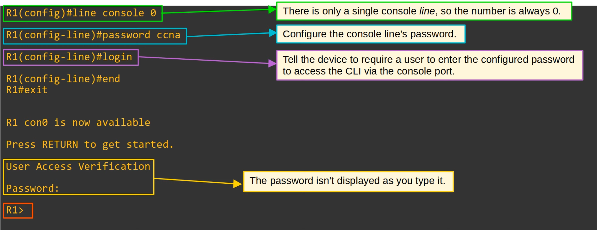
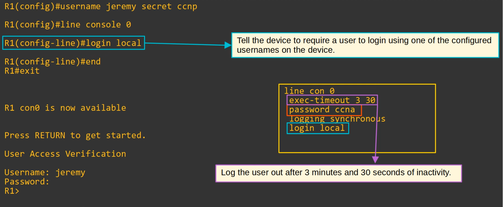
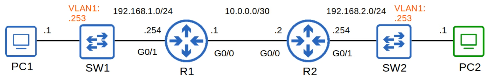
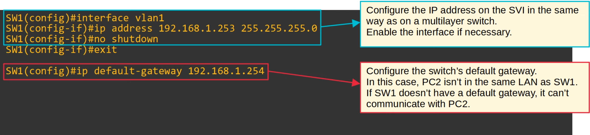
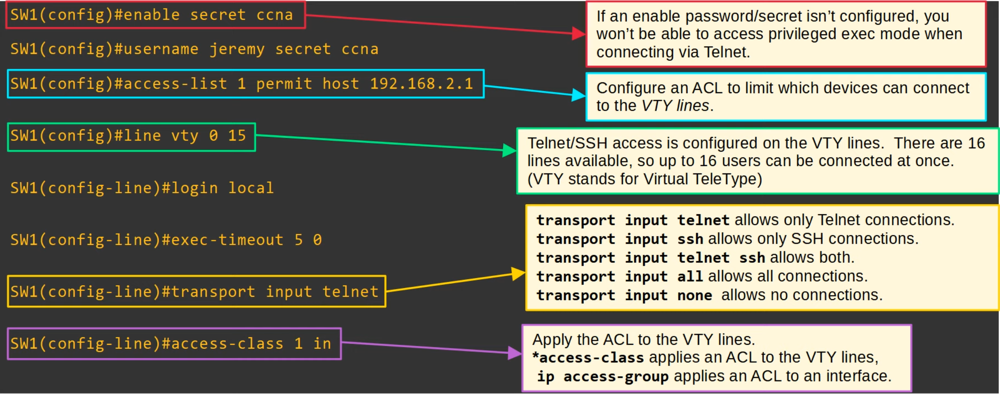
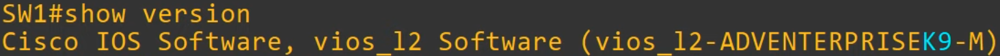
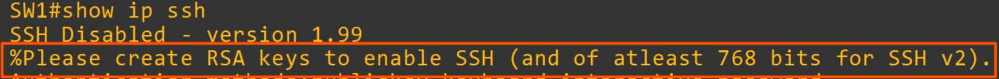
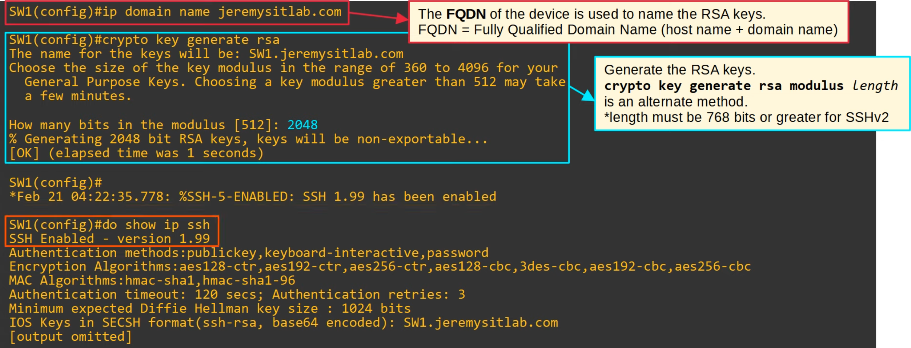
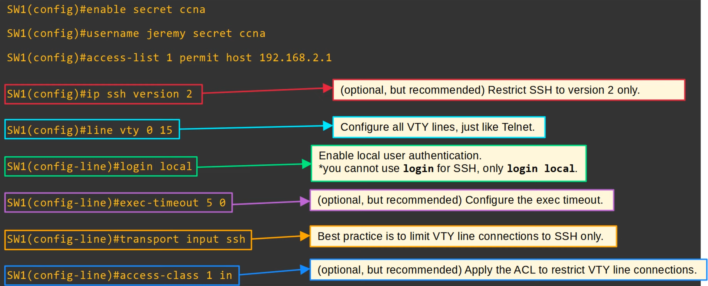

# Secure Shell
### Things We'll Cover
- Console port security
- L2 switch management IP
- Telnet
- SSH
### Console Port Security - `login`
- By default, no password is needed to access the CLI of a Cisco IOS device via the console port
- You can configure a password on the *console line*
	- A user will have to enter a password to access the CLI via the console port

### `login local`
- Alternatively, you can configure the console line to require users to login using one of the configured usernames on the device

### Layer 2 Switch - Management IP
- L2 switches don't perform packet routing and don't build a routing table (not routing aware)
- However, you can assign an IP address to an SVI to allow remote connections to the CLI of the switch (using Telnet or SSH)
- We will be using the following topology for the rest of the concepts:

### Telnet
- **Telnet (Teletype Network)** is a protocol used to remotely access the CLI of a remote host
- It was developed in 1969
- Has largely been replaced by SSH, which is more secure
- Sends data in plain text (no encryption!)
- The Telnet *server* (the device being connected to) listens for traffic on **TCP port 23**
### Telnet Configuration

### SSH (Secure Shell)
- Developed in 1995 to replace less secure protocols like Telnet
- SSHv2, a major revision of SSHv1, was released in 2006
- If a device supports both version 1 and 2, it's said to run 'version 1.99'
- Provides security features such as data encryption and authentication
### SSH Configuration: Check SSH Support

- IOS images that support SSH will have 'K9' in their name
- Cisco exports NPE (No Payload Encryption) IOS images to countries that have restrictions on encryption technologies
- NPE IOS images don't support cryptographic features such as SSH
- To view SSH status, use the command `show ip ssh`

### SSH Configuration: RSA Keys
- To enable and use SSH, you must generate an RSA public and private key pair
- The keys are used for data encryption/decryption, authentication, etc.

### SSH Configuration: VTY Lines

### SSH Configuration Summary
1. Configure host name
2. Configure DNS domain name
3. Generate RSA key pair
4. Configure enable PW, username/PW
5. Enable SSHv2 (only)
6. Configure VTY lines
- To connect from a PC, use the command `ssh -l username ip-address` OR `ssh username@ip-address`
- **You have to know how to configure SSH for the CCNA exam**
### Command Summary
- `SW1#`
	- `show version`
	- `show ip ssh`
	- `ip default-gateway (ip-address)`
	- `line con 0`
	- `line vty 0 15`
	- `crypto key generate rsa`
	- `ip ssh version 2`
	- `login [local]`
	- `transport input [protocols | all | none]`
	- `exec-timeout (minutes) (seconds)`
	- `access-class (acl) in`
- `PC`
	- `telnet (ip-address)`
	- `ssh -l username ip-address`
	- `ssh username@ip-address`