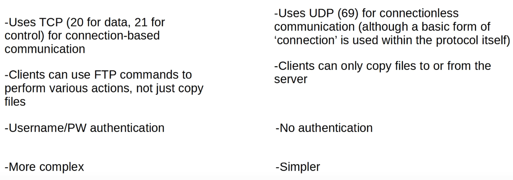

# FTP & TFTP
### Things We'll Cover
- The purpose of FTP/TFTP
- Functions & differences
- IOS file systems
- Using FTP/TFTP in IOS
### FTP & TFTP
- **FTP (File Transfer Protocol)** and **TFTP (Trivial File Transfer Protocol)** are industry standard protocols used to transfer files over a network
- They both use a client-server model
	- Clients can use FTP or TFTP to copy files to/from a server
- As a network engineer, the most common use for FTP/TFTP is in the process of upgrading the operating system of a network device
- You can use FTP/TFTP to download the newer version of IOS from a server, and then reboot the device with the new IOS image

### Trivial File Transfer Protocol
- First standardized in 1981
- Named 'trivial' because it's simple and has only basic features compared to FTP
	- Only allows a client to copy a file to/from a server
- Was released after FTP, but isn't a replacement for FTP
- It's another tool to use when lightweight simplicity is more important than functionality
- No authentication (username/password), so servers will respond to all TFTP requests
- No encryption, so all data is sent in plain text
- Best used in a controlled environment to transfer small files quickly
- TFTP servers listen on **UDP port 69**
- UDP is connectionless and doesn't provide reliability with retransmissions
- However, TFTP has similar built-in features within the protocol itself
### TFTP Reliability
- Every TFTP data message is acknowledged
	- If the client is transferring a file to the server, the server will send Ack messages
	- Vice versa for server-to-client
- Timers are used, and if an expected message isn't received in time, the waiting device will resend its previous message

### TFTP 'Connections'
- TFTP file transfers have three phases:
	1. **Connection:** TFTP client sends a request to the server, and the server responds back, initializing the connection
	2. **Data Transfer:** The client and server exchange TFTP messages, with one sending data and the other sending acks
	3. **Connection Termination:** After the last data message has been sent, a final ack is sent to terminate the connection
### TFTP TID
- When the client sends the first message to the server, the destination port is UDP 69 and the source is a random ephemeral port
- This random port is called a 'Transfer Identifier' (TID) and identifies the data transfer
- The server then also selects a random TID to use as the source port when it replies, **not 69**
- When the client sends the next message, the destination port will be the server's TID, **not 69**
### File Transfer Protocol
- First standardized in 1971
- Uses **TCP ports 20/21**
- Usernames and passwords are used for authentication, however, there is no encryption
- For greater security, FTP (FTP over SSL/TLS) can be used
- SSH File Transfer Protocol (SFTP) can also be used for greater security
- FTP is more complex than TFTP and allows not only file transfers, but clients can also navigate file directories, add and remove directories, list files, etc.
- The client sends *FTP commands* to the server to perform these functions
### FTP Control Connections
- FTP uses two types of connections:
	- An **FTP control** connection (**TCP 21**) is established and used to send FTP commands and replies
	- When files or data are to be transferred, separate **FTP data (TCP 20)** connections are established and terminated as needed

### Active Mode FTP Data Connections
- The default method of establishing FTP data connections is **active mode**, in which the server initiates the TCP connection
- In FTP **active mode**, the server initiates the connection

### Passive Mode FTP Data Connections
- In FTP **passive mode**, the client initiates the data connection
- This is often necessary when the client is behind a firewall, which could block the incoming connections from the server
- Firewalls usually don't permit 'outside' devices to initiate connections
- In this case, FTP **passive mode** is used and the client (behind the firewall) initiates the connections
### FTP vs TFTP

### IOS File Systems
- You can view the file systems of a Cisco IOS device with `show file systems`

### Upgrading Cisco IOS
- You can view the current version of IOS with `show version`
- You can view the contents of flash with `show flash`
### Copying Files (TFTP)
- Command is `copy (source) (destination)`

### Upgrading Cisco IOS
- From global config mode, use the command `boot system (filepath)`
	- If you don't use this command, the router will use the first IOS file it finds in flash
- After that, make sure to save the configuration using a command like `write memory` before rebooting the device
- Then, simply use the `reload` command to restart the device
- To delete the old IOS version, use the command `delete (filepath)`
### Copying Files (FTP)

### Command Review
- `R1#`
	- `show file systems`
	- `show version`
	- `show flash`
	- `copy (source) (destination)`
- `R1(config)#`
	- `boot system (filepath)`
	- `ip ftp username (username)`
	- `ip ftp password (password)`
