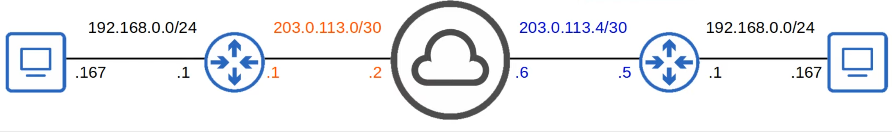
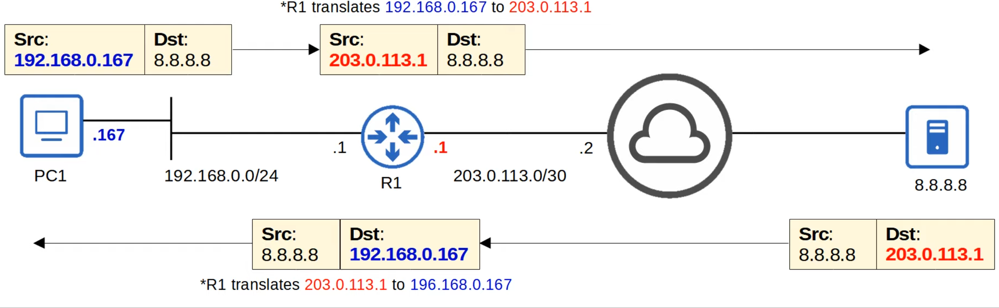
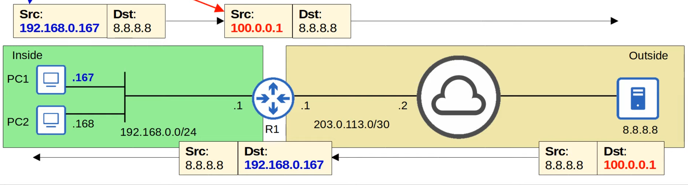

# Network Address Translation (Part 1)
### Things We'll Cover
- Private IPv4 Addresses
- Intro to NAT
- Static NAT
- Static NAT Configuration
### Private IPv4 Addresses (RFC 1918)
-  IPv4 doesn't provide enough addresses for all devices that need an IP address in the modern world
- The long-term solution is to switch to IPv6
- There are three main short-term solutions:
	1. CIDR
	2. Private IPv4 addresses
	3. NAT
- RFC 1918 specifies the following IPv4 address ranges as private:
	- 10.0.0.0/8 (10.0.0.0 to 10.255.255.255) -> Class A
	- 172.16.0.0/12 (172.16.0.0 to 172.31.255.255) -> Class B
	- 192.168.0.0/16 (192.168.0.0 to 192.168.255.255) -> Class C
- You are free to use these addresses in your networks, they don't have to be globally unique
- **Private IP addresses can't be used over the Internet!**
- Without NAT, there are two problems with only using private IP addresses:
	1. Duplicate addresses
	2. Private IP addresses can't be used over the Internet, so the PCs can't access the Internet

### Network Address Translation (NAT)
- Used to modify the source and/or destination IP addresses of packets
- There are various reasons to use NAT, but the most common reason is to allow hosts with private IP addresses to communicate with other hosts over the Internet
- For the CCNA, must understand **source NAT** and how to configure it on Cisco routers

### Static NAT
- Involves statically configuring one-to-one mappings of private IP addresses to public IP addresses
- An *inside local* IP address is mapped to an *inside global* IP address
	- **Inside Local** = The IP address of the *inside* host, from the perspective of the local network
		- The IP address actually configured on the inside host, usually a private address
	- **Inside Global** = The IP address of the *inside* host, from the perspective of *outside* hosts
		- The IP address of the inside host **after NAT**, usually a public address

- If PC2 wanted to communicate with server 8.8.8.8, it would need a different public IP than PC1's
- Since static NAT requires a one-to-one IP address mapping, it doesn't help preserve IP addresses
### Static NAT Configuration
- `R1(config-if)#`
	- `ip nat inside`: Define the 'inside' interface(s) connected to the internal network
	- `ip nat outside`: Define the 'outside' interface(s) connected to the external network
- `R1(config)#`
	- `ip nat inside source static (inside-local-ip) (inside-global-ip)`: Configure the one-to-one IP address mappings
- `R1#`
	- `show ip nat translations`: View the NAT translation table
		- **Outside Local** = The IP address of the *outside* host, form the perspective of the local network
		- **Outside Global** = The IP address of the *outside* host, from the perspective of the outside network
			- Unless **destination NAT** is used, these two addresses will be the same
	- `clear ip nat translation *`: Clear all the dynamic translations in the NAT translation table
	- `show ip nat statistics`