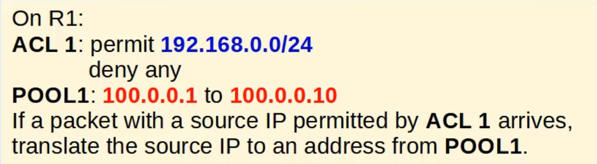
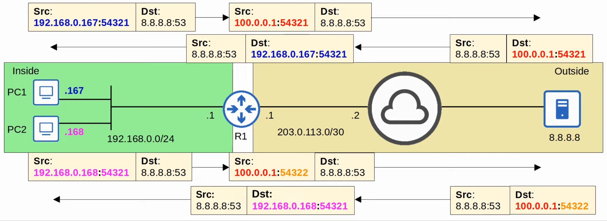
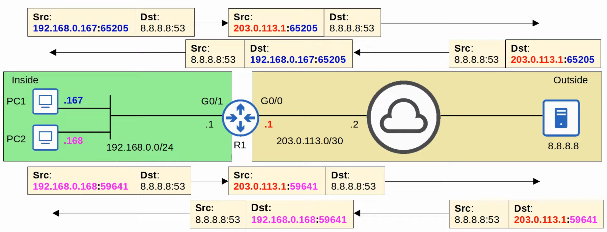

# Network Address Translation (Part 2)
### Things We'll Cover
- More about static NAT
- Dynamic NAT
- Dynamic PAT
### Static NAT
- Involves statically configuring one-to-one mappings of private IP addresses to public IP addresses
- When traffic from the internal host is sent to the outside network, the router will translate the source address
- However, this one-to-one mapping also allows external hosts to access the internal host via the inside global address
### Dynamic NAT
- The router dynamically maps *inside local* addresses to *inside global* addresses as needed
- An ACL is used to identify which traffic should be translated
	- If the source IP is **permitted** by the ACL, the source IP will be translated
	- If the source IP is **denied** by the ACL, it won't be translated
		- **the traffic will NOT be dropped**
- A NAT pool is used to define the available *inside global* addresses

- Although they are dynamically assigned, the mappings are still one-to-one (one *inside local* IP address per *inside global* IP address)
- If there aren't enough *inside global* IP addresses available (all are currently being used), it's called 'NAT pool exhaustion'
	- If a packet from another inside host arrives and needs NAT, but there are no available addresses, the router will drop the packet
	- The host will be unable to access outside networks until one of the *inside global* IP addresses becomes available
	- Dynamic NAT entries will time out automatically if not used, or you can clear them manually
### Dynamic NAT Configuration
1. `R1(config-if)#ip nat {inside | outside}`
	- Define the 'inside/outside' interface(s) connected to the internal/external network
2. `R1(config)#access-list 1 permit (ip-address) (wildcard-mask)`
	- Define the traffic that should be translated (**traffic permitted by this ACL will be translated**)
3. `R1(config)#ip nat pool (pool-name) (first-ip-address) (last-ip-address) prefix-length 24`
	- Define the pool of inside global IP addresses
	- Instead of `prefix-length 24`, you can use `netmask 255.255.255.0`
4. `R1(config)#ip nat inside source list (acl-number/name) pool (pool-name)`
	- Configure dynamic NAT by mapping the ACL to the pool
### PAT (NAT Overload)
- **PAT** (aka **NAT overload**) translated both the IP address and the port number (if necessary)
- By using a unique port number for each communication flow, a single public IP address can be used by many different internal hosts
	- port numbers are 16 bits = over 65,000 available port numbers
- The router will keep track of which *inside local* address is using which *inside global address* and port
- Because many inside hosts can share a single public IP, PAT Is very useful for preserving public IP addresses, and it's used in networks all over the world

### PAT Configuration (Pool)
- Same steps as NAT configuration, but tweak the final command
- `R1(config)#ip nat inside source list (acl-number/name) pool (pool-name) overload`
	- Configure PAT by mapping the ACL to the pool and using the `overload` keyword at the end
### PAT Configuration (Interface)
- No need for pool commands this time
- `R1(config)#ip nat inside source list (acl-numnber/name) interface (interface-id) overload`
	- Configure PAT by mapping the ACL to the interface and enabling `overload`

### Command Review
- `R1(config)#`
	- `ip nat pool (pool-name) (start-ip) (end-ip) prefix-length (prefix-length)`
	- `ip nat pool (pool-name) (start-ip) (end-ip) netmask (subnet-mask)`
	- `ip nat inside source list (access-list) pool (pool-name)`
	- `ip nat inside source list (access-list) pool (pool-name) overload`
	- `ip nat inside source list (access-list) interface (interface-id) overload`