# Quality of Service (Part 2)
### Things We'll Cover
- Classification/Marking
- Queuing/Congestion Management
- Shaping/Policing
### Classification
- The purpose of QoS is to give certain kinds of network traffic priority over others during congestion
- **Classification** organizes network traffic (packets) into traffic classes (categories)
- There are many methods of classifying traffic:
	- An ACL: Traffic which is permitted by the ACL will be given certain treatment, other traffic will not
	- **NBAR (Network Based Application Recognition)** performs a *deep packet inspection*, looking beyond the L3 & L4 information up to L7 to identify the specific kind of traffic
	- In the L2 & L3 headers, there are specific fields used for this purpose
- The **PCP (Priority Code Point)** field of the 802.1Q tag can be used to identify high/low priority traffic
	- **NOTE:** Only when there is a dot1q tag!
- The **DSCP (Differentiated Services Code Point)** field of the IP header can also be used to identify high/low priority traffic
### PCP/CoS
- Also known as CoS (Class of Service)
- 3 bits = 8 possible values (2^3 = 8)
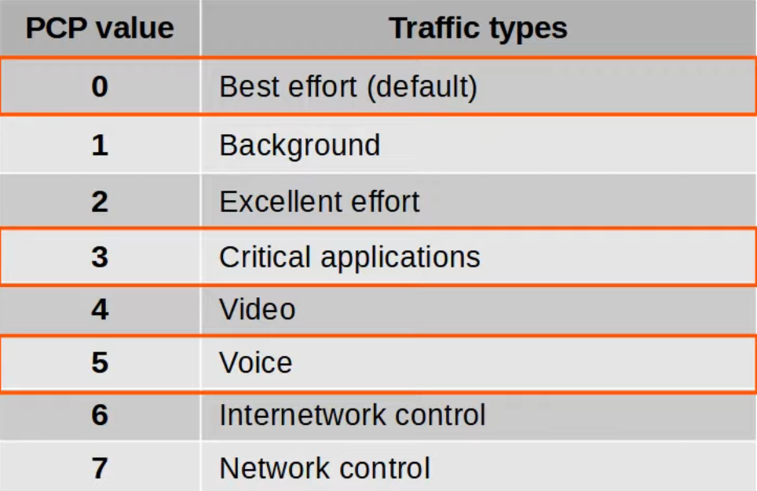
- 'Best effort' delivery means there's no guarantee that data is delivered or that it meets any QoS standard
	- This is regular traffic, not high-priority
- IP phones **mark** call signaling traffic (used to establish calls) as PCP3
- They **mark** the actual voice traffic as PCP5
- Because PCP is found in the dot1q header, it can only be used over the following connections:
	- trunk links
	- access links with a voice VLAN
- In the diagram below, traffic between R1 & R2, or between R2 and external destinations will not have a dot1q tag
- So, traffic over those links cannot be marked with a PCP value
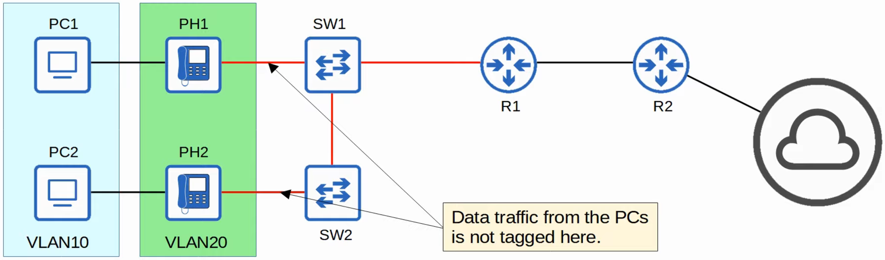
### The IP ToS Byte
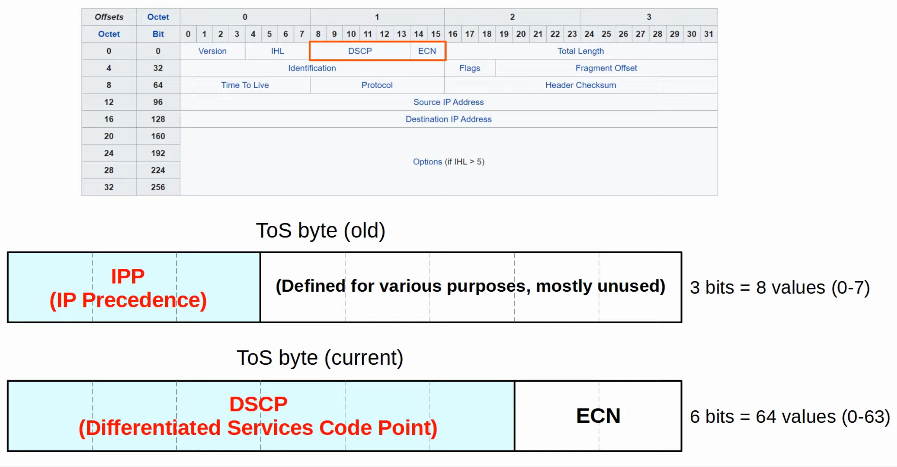
### IP Precedence
- Standard IPP markings are similar to PCP:
	- 6 & 7 are reserved for 'network control' traffic (i.e. OSPF messages between routers)
	- 5 = voice
	- 4 = video
	- 3 = video signaling
	- 0 = best effort
- With 6 & 7 reserved, 6 possible values remain
	- Although 6 values are sufficient for many networks, the QoS requirements of some networks demand more flexibility
### DSCP
- RFC 2474 (1998) defines the DSCP field, and other 'DiffServ' RFCs elaborate on its use
- With IPP updated to DSCP, new standard markings had to be decided upon
	- By having generally agreed upon standard markings for different kinds of traffic, QoS design & implementation is simplified, it works better between ISPs and enterprises, among other benefits
- Be aware of the following standard markings:
	- **Default Forwarding (DF):** Best effort traffic
	- **Expedited Forwarding (EF):** Low loss/latency/jitter traffic (usually voice)
	- **Assured Forwarding (AF):** A set of 12 standard values
	- **Class Selector (CS):** A set of 8 standard values, provided backwards compatibility with IPP
### DF/EF
**DF (Default Forwarding):**
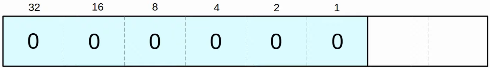
- Used for best-effort traffic
- The DSCP marking for DF is 0
**EF (Expedited Forwarding):**
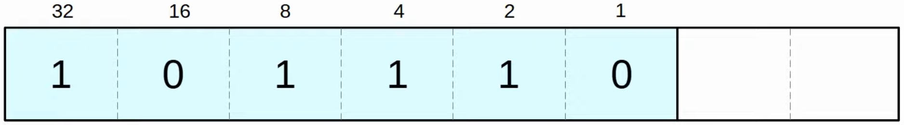
- Used for traffic that requires low loss/latency/jitter
- The DSCP marking for EF is 46
### AF
- **AF (Assured Forwarding)** defines four traffic classes
- All packets in a class have the same priority
- Within each class, there are three levels of *drop precedence*
	- Higher drop precedence = more likely to drop the packet during congestion
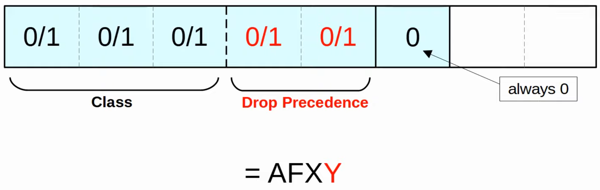
- Examples:
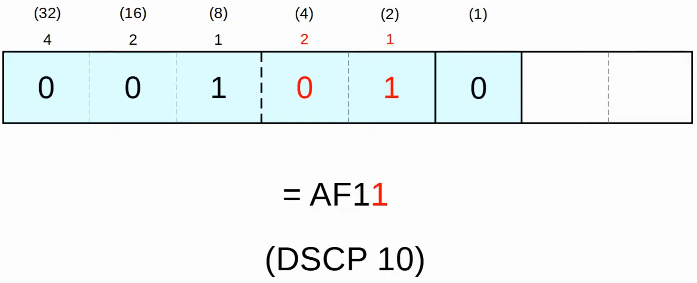
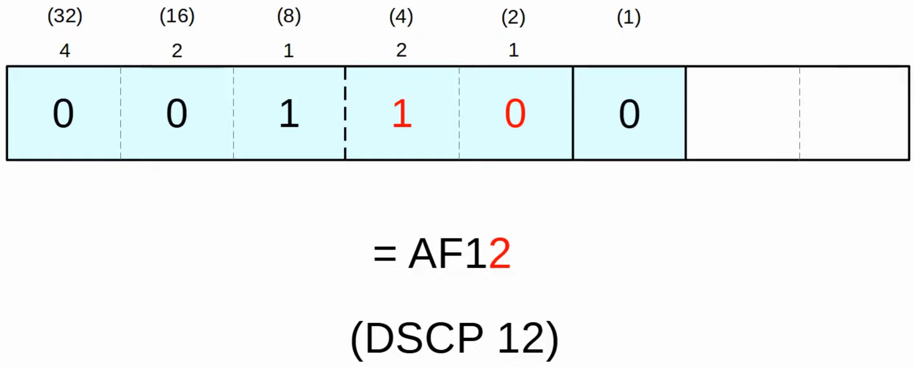
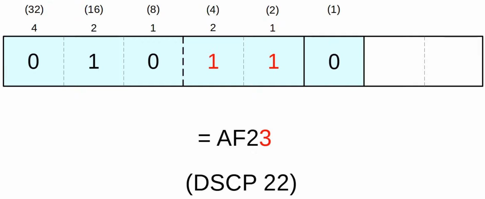
- To calculate quickly without having to write out the binary, use the following formula to convert from AF to DSCP: **8X + 2Y**
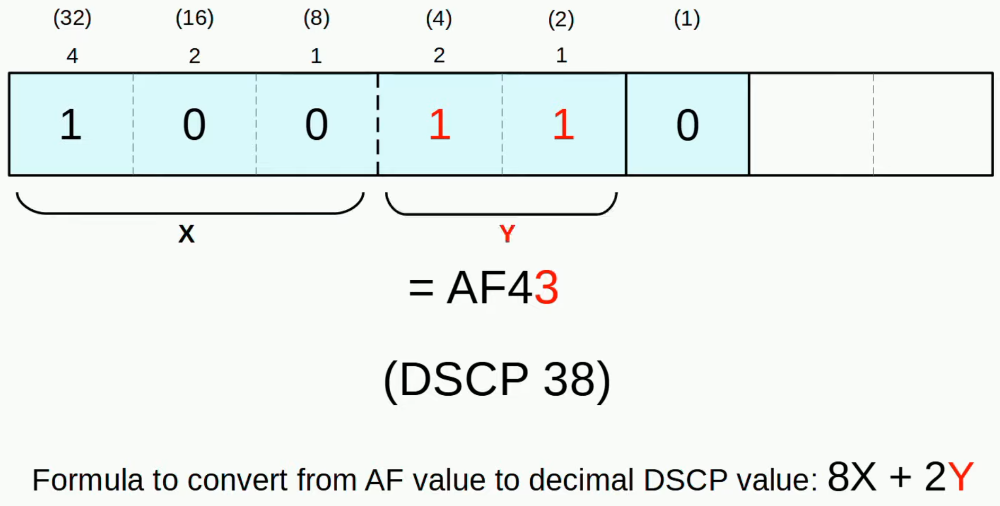
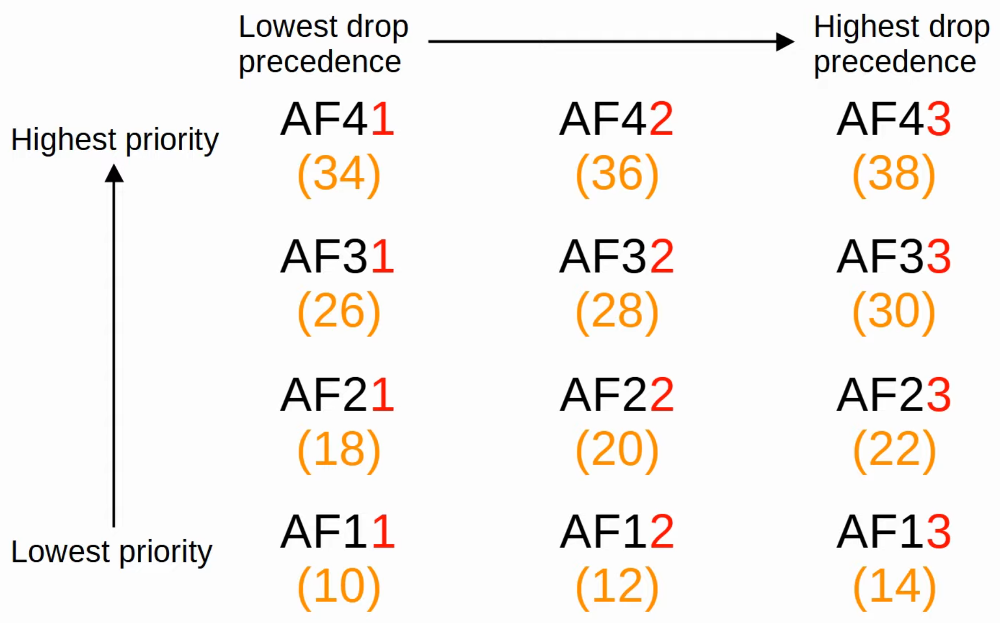
### CS (Class Selector)
- Defines 8 DSCP values for backward compatibility with IPP
- The 3 bits that were added for DSCP are set to 0, and the oirginal IPP bits are used to make 8 values
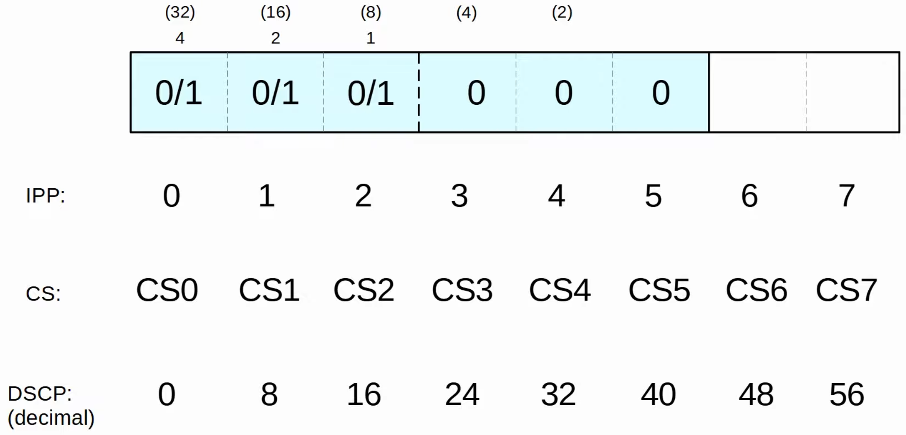
### RFC 4954
- Was developed with the help of Cisco to bring all of these values together and standardize their use
- The RFC offers many specific recommendations, but here are a few key ones:
	- Voice traffic: **EF**
	- Interactive video: **AF4x**
		- x = 1-3
	- Streaming video: **AF3x**
	- High priority data: **AF2x**
	- Best effort: **DF**
### Trust Boundaries
- The *trust boundary* of a network defines where devices trust/don't trust the QoS markings of received messages
- If the markings are trusted, the device will forward the message without changing the markings
- If the markings aren't trusted, the device will change the markings according to the configured policy
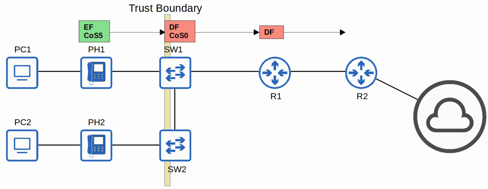
- If an IP phone is connected to the switch port, it's recommended to move the trust boundary to the IP phones
- This is done via configuration on the switch port connected to the IP phone
- If a user marks their PCs traffic with a high priority, the marking will be changed (not trusted)
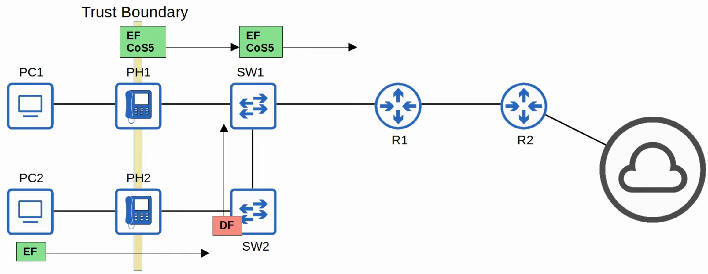
### Queuing/Congestion Management
- An essential part of QoS is the use of multiple queues
	- This is where classification plays a role
	- The device can match traffic based on various factors (i.e. the DSCP marking in the IP header) and then place it in the appropriate queue
- However, the device is only able to be forwarded out of an interface at once, so a *scheduler* is used to decide which queue traffic is forwarded from next
	- *Prioritization* allows the scheduler to give certain queues more priority than others
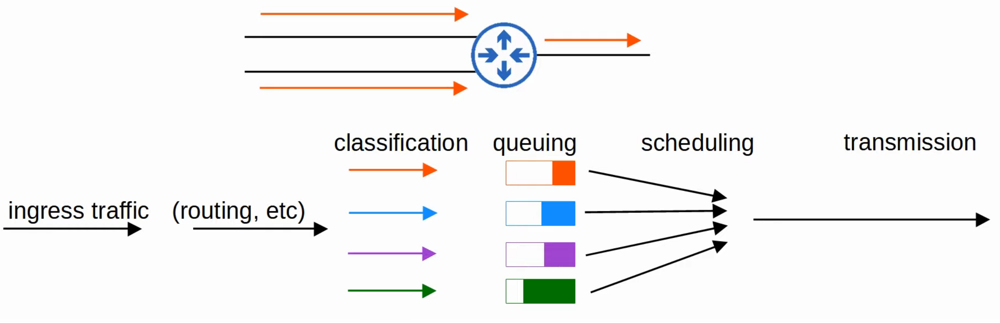
- A common scheduling method is *weighted round-robin*
	- **round-robin** = packets are taken from each queue in order, cyclically
	- **weighted** = more data is taken from high priority queues each time the scheduler reaches that queue
- **CBWFQ (Class-Based Weighted Fair Queuing)** is a popular method of scheduling, using a weighted round-robin scheduler while guaranteeing each queue a certain percentage of the interface's bandwidth during congestion
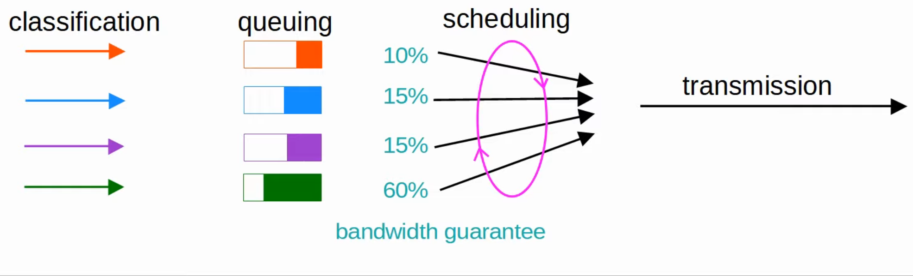
- Round-robin scheduling is **not ideal for voice/video traffic**
- Even if the traffic receives a guaranteed minimum amount of bandwidth, round-robin can add delay and jitter because even the high priority queues have to wait their turn in the scheduler
- **LLQ (Low Latency Queuing)** designated one (or more) queues as *strict priority queues*
	- This means that if there is traffic in the queue, the scheduler will **always** take the next packet from that queue until it's empty
- This is very effective for reducing the delay and jitter of voice/video traffic
- However, it has the downside of potentially starving other queues if there is always traffic in the designated strict priority queue
	- *Policing* can control the amount of traffic allowed in the strict priority queue so that it can't take all of the link's bandwidth
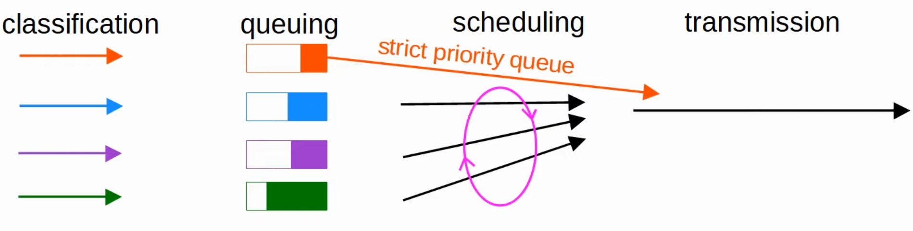
### Shaping and Policing
-  Both used to control the rate of traffic
- **Shaping** buffers traffic in a queue if the traffic rate goes over the configured rate
- **Policing** drops traffic if the traffic rate goes over the configured rate
	- Also has the option of re-marking the traffic instead of dropping it
	- 'Burst' traffic over the configured rate is allowed for a short period of time
	- This accommodates data applications which typically are 'bursty' in nature
	- Instead of a constant stream of data, they send data in bursts
	- The amount of burst traffic allowed is configurable
- In both cases, classification can be used to allow for different rates for different kinds of traffic
- Why would you want to limit the rate traffic is sent/received?
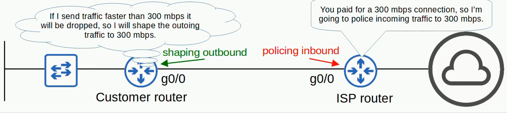
