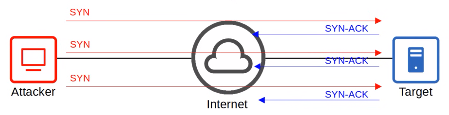
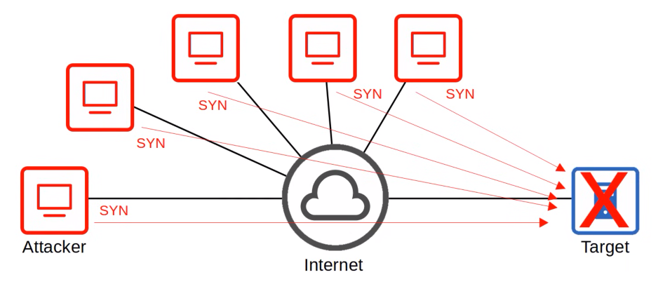
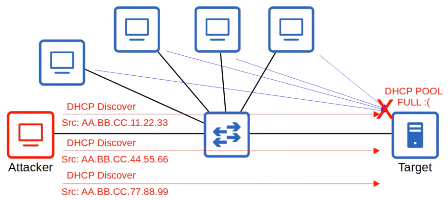
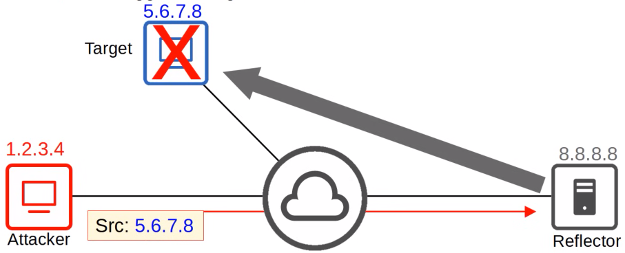
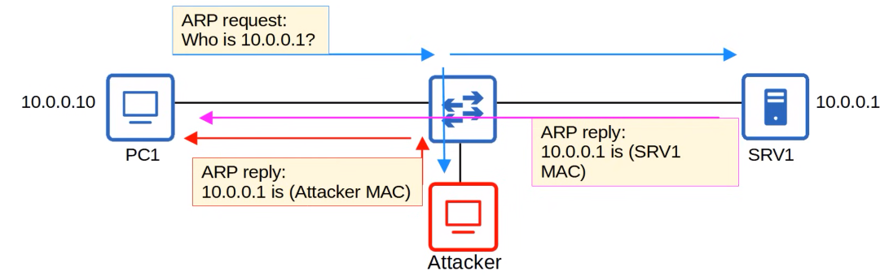
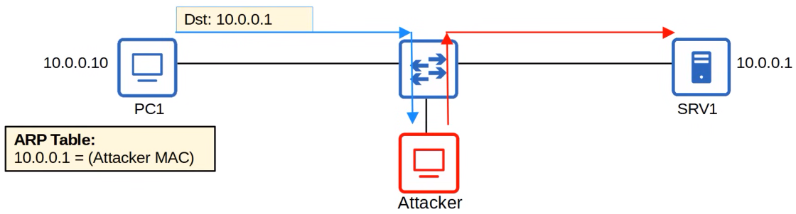

# Security Fundamentals
### Things We'll Cover
- Key security concepts
- Common attacks
- Passwords/MFA
- Authentication, Authorization, Accounting (AAA)
- Security program elements
### Vulnerability, Exploit, Threat, Mitigation
- A **vulnerability** is any potential weakness that can compromise the CIA of a system/info
	- A *potential weakness* isn't a problem on its own
	- Windows to a house can be seen as a *potential weakness*, but houses continue to have them
- An **exploit** is something that can potentially be used to exploit the vulnerability
	- Something that can *potentially* be used as an exploit isn't a problem on its own
	- A rock can break a window to a house, but rocks alone aren't a problem
- A **threat** is the potential of a **vulnerability** to be **exploited**
	- A hacker **exploiting** a **vulnerability** in your system is a **threat**
	- A robber can use a rock to break a window and access a house
- A **mitigation technique** is something that can protect against threats
	- Should be implemented everywhere a vulnerability can be exploited: client devices, servers, switches, routers, firewalls, etc.
	- Adding glass break sensors to your windows can potentially mitigate against a robber attempting to break them
- **No system is perfectly secure!**
	- No matter how good our security may seem, the chance of getting hacked is never zero
### Common Attacks
- DoS/DDoS
- Spoofing
- Reflection/amplification
- MITM
- Reconnaissance
- Malware
- Social engineering
- Password-related
### DoS Attacks
- Threaten the **availability** of a system
- One common DoS attack is the TCP SYN flood
	- TCP three-way handshake: SYN | SYN-ACK | ACK
	- The attacker sends countless TCP SYN messages to the target
	- The target sends a SYN-ACK message in response to each SYN it receives
	- The attacker never replies with the final ACK of the TCP three-way handshake
	- The incomplete connections fill up the target's TCP connection table
	- The attacker continues sending SYN messages
	- The target is no longer able to make legitimate TCP connections

### DDoS Attacks
- The attacker infects many target computers with malware and uses them all to initiate a DoS attack
- This group of infected computers is called a **botnet**

### Spoofing Attacks
- To **spoof** an address is to use a fake source address (IP or MAC)
- Numerous attacks involve spoofing, it's not a single kind of attack
- An example is a **DHCP exhaustion** attack
- an attacker uses spoofed MAC addresses to flood DHCP Discover messages
- The target server's DHCP pool becomes full, resulting in a DoS to other devices

### Reflection/Amplification Attacks
- In a **reflection** attack, the attacker sends traffic to a reflector, and spoofs the source address of its packets using the target's IP address
- The reflector (i.e. a DNS server) sends the reply to the target's IP address
- If the amount of traffic sent to the target is large enough, this can result in a DoS
- A reflection attack becomes an **amplification** attack when the amount of traffic sent by the attacker is small, but it triggers a large amount of traffic to be sent from the reflector to the target

- Check out the following Cloudflare articles:
	- [DNS Amplification DDoS Attack](https://www.cloudfare.com/learning/ddos/dns-amplification-ddos-attack/)
	- [NTP Amplification DDoS Attack](https://www.cloudflare.com/learning/ddos/ntp-amplification-ddos-attack/)
### MITM Attacks
- The attacker places themselves between the source and destination to eavesdrop on communications, or to modify traffic before it reaches the destination
- A common example is **ARP spoofing**, also known as **ARP poisoning**
- A host sends an ARP request, asking for the MAC address of another device
- The target of the request sends an ARP reply, informing the requester of its MAC address
- The attacker waits and sends another ARP reply after the legitimate replier
- If the attacker's ARP reply arrives last, it'll overwrite the legit ARP entry in PC1's ARP table

- In PC1's ARP table, the entry for 10.0.0.1 will have the attacker's MAC address
- When PC1 tries to send traffic to SRV1, it'll be forwarded to the attacker instead
- The attacker can inspect/modify the messages, and then forward them on to SRV1
- This compromises the **confidentiality** and **integrity** of communications between PC1 and SRV1

### Reconnaissance
- Not attacks themselves, but are used to gather information about a target which can be used for a future attack
- This is often publicly available information
	- i.e. `nslookup` to learn the IP address of a site
	- or a `WHOIS` query to learn email addresses, phone numbers, physical addresses, etc.
### Malware
- **Viruses** infect other software (a 'host program')
	- The virus spreads as the software is shared by users
	- They typically corrupt/modify files on the target computer
- **Worms** don't require a host program
	- They're standalone malware and are able to spread on their own, without user interaction
	- The spread of worms can congest the network, but the 'payload' of a worm can cause additional harm to target devices
- **Trojan Horses** are harmful software that's disguised as legit software
	- They're spread through user interaction such as opening email attachments, or downloading a file from the internet
### Controlling & Monitoring Users w/AAA
- Enterprises typically use a AAA server to provide AAA services
	- ISE (Identity Services Engine) is Cisco's AAA server
- AAA servers usually support the following two AAA protocols:
	- **RADIUS:** An open standard protocol that uses UDP ports 1812/1813
	- **TACACS+:** A Cisco proprietary protocol that uses TCP port 49
### Security Program Elements
- **User awareness** programs are designed to make employees aware of potential security threats and risks
- **User training** programs are more formal than user awareness programs
	- i.e. dedicated training sessions which educate users on security policies, creating strong passwords, etc.
- **Physical access control** protects equipment and data from potential attackers by only allowing authorized users into protected areas
	- i.e. network closets or data center floors