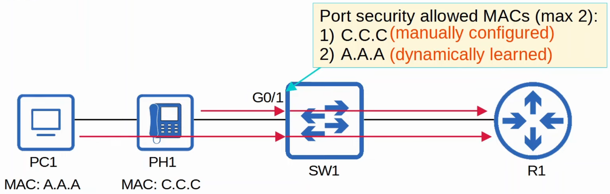
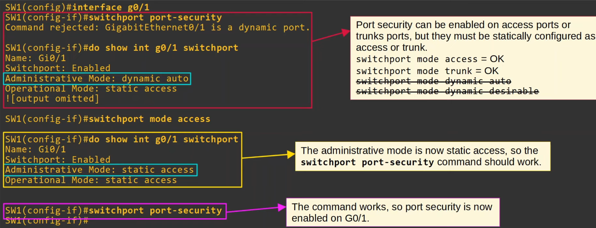
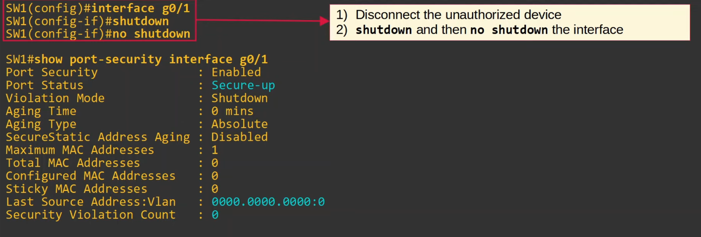
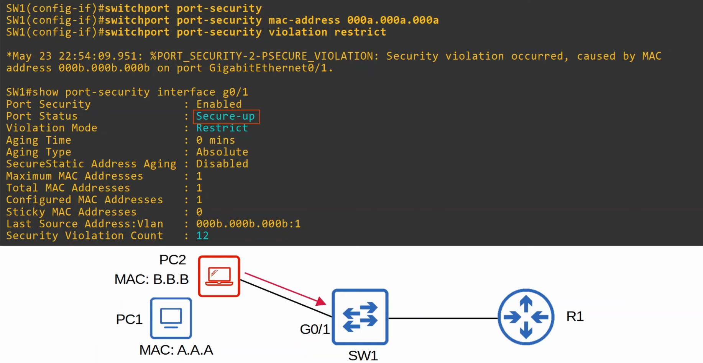
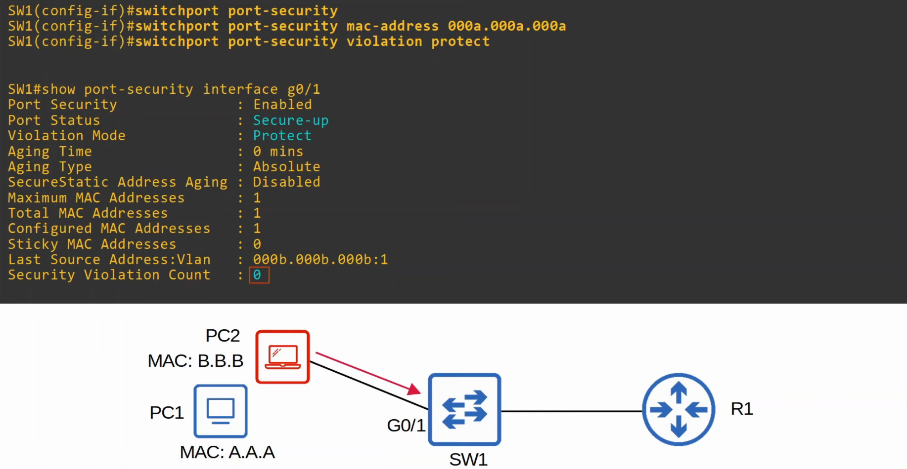

# Port Security
### Things We'll Cover
- Intro to port security
- Why use port security?
- Configuration
### Port Security
- Allows you to control which source MAC address(es) are allowed to enter the switchport
- If an unauthorized source MAC address enters the port, an action will be taken
	- The default action is to place the interface in an 'err-disabled' state
- When you enable port security on an interface w/the default settings, one MAC address is allowed
	- You can configure the allowed MAC address manually
	- If you don't configure it manually, the switch will allow the first source MAC address that enters the interface
- You can change the maximum number of MAC addresses allowed
- A combination of manually configured MAC address and dynamically learned addresses is possible

### Why port security?
- Allows network admins to control which devices are allowed to access the network
- However, MAC address spoofing is a simple task
	- It's easy to configure a device to send frames with a different source MAC address
- Rather than manually specifying the MAC addresses allowed on each port, port security's ability to limit the number of MAC addresses allowed on an interface is more useful
- Think of the DHCP starvation attack carried out in the Day 48 Lab video
	- the attacker spoofed thousands of fake MAC addresses
	- the DHCP server assigned IP addresses to these fake MAC addresses, exhausting the DHCP pool
	- the switch's MAC address table can also become full due to such an attack
- Limiting the number of MAC addresses on an interface can protect against those attacks
### Enabling Port Security

- In order to view port security information, use the command `show port-security interface (int-id)`
### Re-Enable an Interface
**Manually:**

**ErrDisable Recovery:**
- Can view if it's been enabled using the command `show errdisable recovery`
- By default, all err-disabled interfaces will be re-enabled every 5 minutes if err-disable recovery has been enabled for the cause of the interface's disablement
- To enable it, use the command `errdisable recovery cause (cause)`
- ErrDisable Recovery is useless if you don't remove the device that caused the interface to enter the err-disabled state
### Violation Modes
- There are three different violation modes that determine what the switch will do if an unauthorized frame enters an interface configured w/port security
	- **Shutdown**
		- Effectively shuts down the port by placing it in an err-disabled state
		- Generates a Syslog and/or SNMP message when the interface is disabled
		- The violation counter is set to 1 when the interface is disabled
	- **Restrict**
		- The switch discards traffic from unauthorized MAC addresses
		- The interface is NOT disabled
		- Generates a Syslog and/or SNMP message each time an unauthorized MAC is detected
		- The violation counter is incremented by 1 for each unauthorized frame
	- **Protect**
		- The switch discards traffic from unauthorized MAC addresses
		- The interface is NOT disabled
		- It does NOT generate Syslog/SNMP messages for unauthorized traffic
		- It does NOT increment the violation counter
### Violation Mode: Restrict

### Violation Mode: Protect

### Secure MAC Address Aging
- By default, secure MAC address will not 'age out' (Aging Time: 0 mins)
	- Can be configured with `switchport port-security aging time (minutes)`
- The default aging type is **Absolute**
	- **Absolute:** After the secure MAC address is learned, the aging timer starts and the MAC is removed after the timer expires, even if the switch continues receiving frames from that source MAC address
	- **Inactivity:** After the secure MAC address is learned, the aging timer starts but is reset every time a frame from that source MAC address is received on the interface
	- Aging type is configured with `switchport port-security aging type {absolute | inactivity}`
- Secure Static MAC aging (address configured with `switchport port-security mac-address x.x.x) is disabled by default
	- Can be enabled with `switchport port-security aging static`
### Sticky Secure MAC Addresses
- 'Sticky' secure MAC address learning can be enabled with the following command: `SW1(config-if)# switchport port-security mac-address sticky`
- When enabled, dynamically-learned secure MAC addresses will be added to the running config like this: `switchport port-security mac-address sticky (mac-address)`
- The 'sticky' secure MAC addresses will **never** age out
	- You need to save the running-config to the startup-config to make them truly permanent (or else they won't be kept if the switch restarts)
- When you issue the command, all current dynamically-learned secure MAC addresses will be converted to sticky secure MAC addresses
- If you issue the `no switchport port-security mac-address sticky` command, all current sticky secure MAC addresses will be converted to regular dynamically-learned secure MAC addresses
### MAC Address Table
- Secure MAC addresses will be added to the MAC address table like any other MAC address
	- Sticky and Static secure MAC addresses will have a type of STATIC
	- Dynamically-learned secure MAC addresses will have a type of DYNAMIC
	- You can view all secure MAC addresses with `show mac address-table secure`
### Command Review
- `SW1#`
	- `show mac address-table secure`
	- `show port-security`
	- `show port-security interface (interface)`
	- `show errdisable recovery`
- `SW1(config-if)#`
	- `errdisable recovery cause psecure-violation`
	- `errdisable recovery interval (seconds)`
	- `switchport port-security`
	- `switchport port-security mac-address (mac-address)`
	- `switchport port-security mac-address sticky`
	- `switchport port-security violation {shutdown | restrict | protect}`
	- `switchport port-security aging time (minutes)`
	- `switchport port-security aging type {absolute | inactivity}`
	- `switchport port-security aging static`