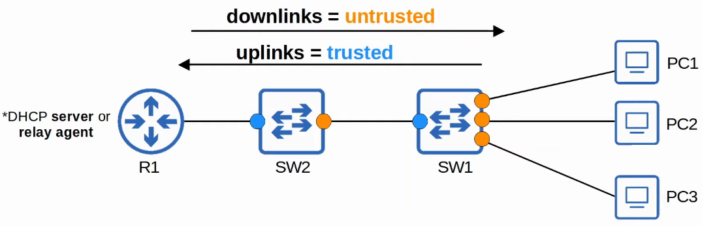
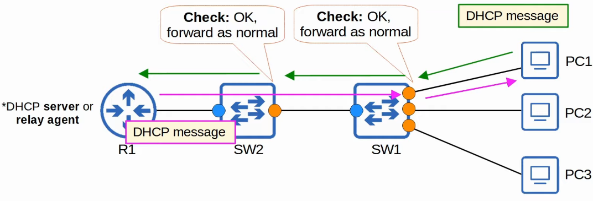
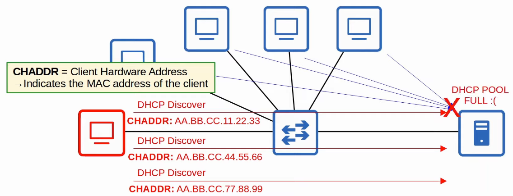
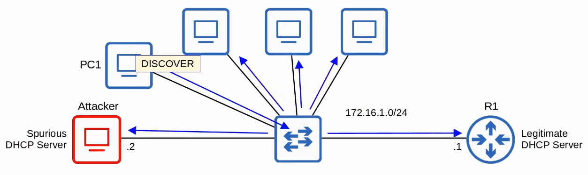
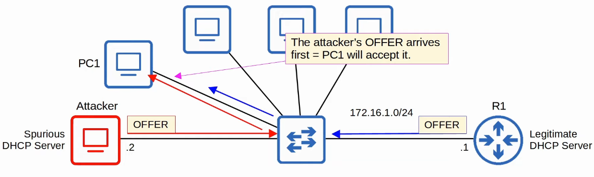
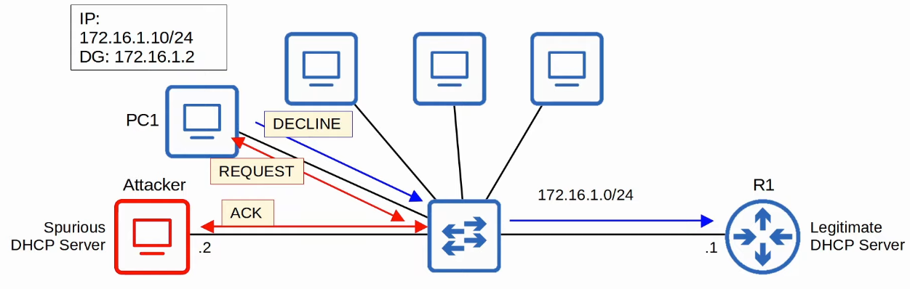
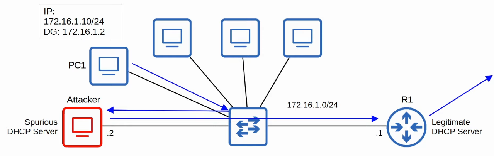
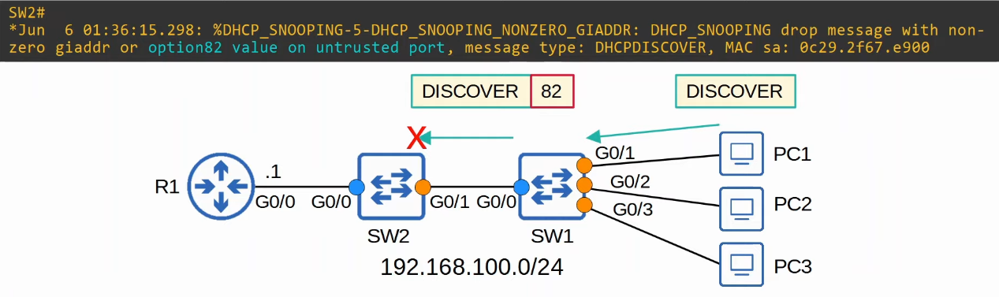
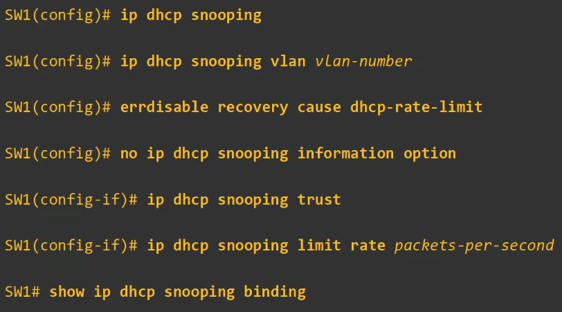

# DHCP Snooping
### Things We'll Cover
- What it is
- How it works
- What it prevents
- How to configure it
### DHCP Snooping
- A security feature of switches that's used to filter DHCP messages received on *untrusted* ports
- Only filters DHCP messages, non-DHCP messages aren't affected
- All ports are *untrusted* by default
	- Usually, **uplink** ports are configured as *trusted* ports, and **downlink** ports remain *untrusted*

### DHCP Starvation
- An attacker uses spoofed MAC addresses to flood DHCP Discover messages
- The target server's DHCP pool becomes full, resulting in a DoS to other devices

### DHCP Poisoning (MITM)
- A *spurious* (illegitimate) DHCP server replies to clients' DHCP discover messages and assigns them IP addresses, but makes the client use the spurious server's IP as the default gateway
	- Clients usually accept the first OFFER message they receive
- This will cause the client to send traffic to the attacker instead of the legit default gateway
- The attacker can then examine/modify the traffic before forwarding it to the legit default gateway

### DHCP Messages
- When DHCP snooping filters messages, it differentiates between **DHCP Server** messages and **DHCP Client** messages
- Messages sent by **DHCP Servers:**
	- OFFER
	- ACK
	- NAK = Opposite of ACK, used to decline a client's REQUEST
- Messages sent by **DHCP Clients:**
	- DISCOVER
	- REQUEST
	- RELEASE = Used to tell the server that the client no longer needs its IP address
	- DECLINE = Used to decline the IP address offered by a DHCP server
### DHCP Snooping Operations
- If a DHCP message is received on a **trusted port**, forward it as normal without inspection
- If a DHCP message is received on an **untrusted port**, inspect it and act as follows:
	- If it's a **DHCP Server** message, discard it
	- If it's a **DHCP Client** message, perform the following checks:
		- DISCOVER/REQUEST messages: Check if the frame's source MAC address and the DHCP message's CHADDR fields match (match = forward, mismatch = discard)
		- RELEASE/DECLINE messages: Check if the packet's source IP address and the receiving interface match the entry in the *DHCP Snooping Binding Table* (match = forward, mismatch = discard)
- When a client successfully leases an IP address from a server, create a new entry in the *DHCP Snooping Binding Table*
### DHCP Snooping Configurations
- `SW1(config)#`
	- `ip dhcp snooping`: Enable DHCP globally
	- `ip dhcp snooping vlan (vlan-id)`: Enable it on each necessary VLAN
	- `no ip dhcp snooping information option`
- `SW1(config-if)#`
	- `ip dhcp snooping trust`: Configure the interface as a trusted port (all ports untrusted by default)
- `SW1#`
	- `show ip dhcp snooping binding`: Check the DHCP snooping binding table
### DHCP Snooping Rate-Limiting
- Can limit the rate at which DHCP messages are allowed to enter an interface
- If the rate of DHCP messages crosses the configured limit, the interface is err-disabled
- Like with Port Security, the interface can be manually re-enabled, or automatically re-enabled with errdisable recovery
- This can be done using the command `ip dhcp snooping limit rate (message-per-second)`
- To enable errdisable recovery, use the command `errdisable recovery cause dhcp-rate-limit`
- Rate-limiting can be very useful to protect against DHCP exhaustion attacks
### DHCP Option 82 (Information Option)
- Option 82, AKA 'DHCP relay agent information option' is one of many DHCP options
- It provides additional info about which DHCP relay agent received the client's message, on which interface, in which VLAN, etc.
- DHCP relay agents can add Option 82 to messages they forward to the remote DHCP server
- With DHCP snooping enabled, by default, Cisco switches will add Option 82 to DHCP messages they receive from clients, **even if the switch isn't acting as a DHCP relay agent**
- By default, Cisco switches will drop DHCP messages with Option 82 that are received on an untrusted port

- This can be disabled using the command `no ip dhcp snooping information option`
### Command Review
