# Dynamic ARP Inspection
### Things We'll Cover
- What it is
- How it works
- What attacks it prevents
- DAI Configuration
### ARP Review
- ARP is used to learn the MAC address of another device with a known IP address
- For instance, a PC will use ARP to learn the MAC address of its default gateway to communicate with external networks
- Typically it's a two message exchange: **request** and **reply**
### Gratuitous ARP
- A *Gratuitous ARP* message is an ARP reply that's sent without receiving an ARP request
- It's sent to the broadcast MAC address
- It allows other devices to learn the MAC address of the sending device without having to send ARP requests
- Some devices automatically send GARP messages when an interface is enabled, IP address is changed, MAC address is changed, etc.
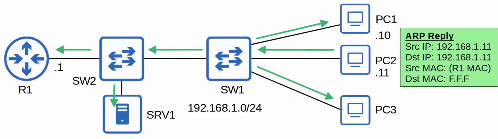
### Dynamic ARP Inspection
- DAI is a security feature of switches that's used to filter ARP messages received on *untrusted* ports
- DAI only filters ARP messages
- Non-ARP messages aren't affected
- All ports are *untrusted* by default
	- Typically, all ports connected to other network devices (switches, routers) should be configured as **trusted**, while interfaces connected to end hosts should remain **untrusted**
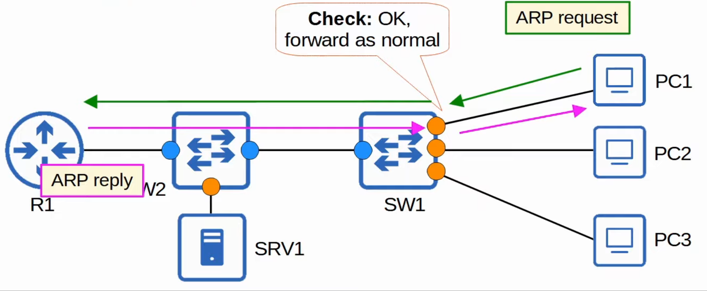
### ARP Poisoning (MITM)
- Similar to DHCP poisoning, ARP poisoning involves an attacker manipulating targets' ARP tables, so traffic is sent to the attacker
- To do this, the attacker can send gratuitous ARP messages using another device's IP address
- Other devices in the network will receive the GARP and update their ARP tables, causing them to send traffic to the attacker instead of the legit destination
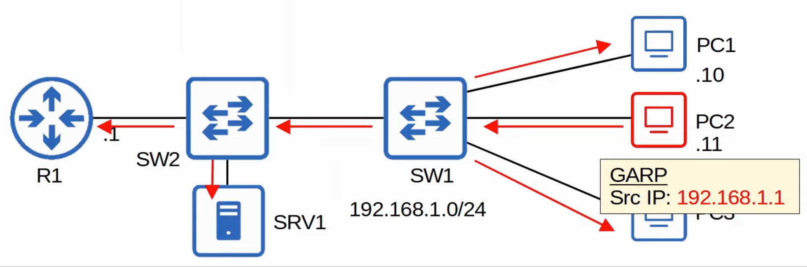
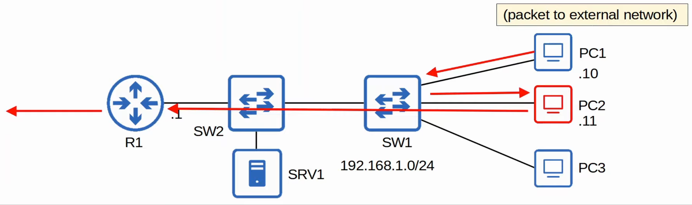
### Dynamic ARP Inspection Operations
- DAI inspects the **sender MAC** and **sender IP** fields of ARP messages received on **untrusted** ports and checks that there is a matching entry in the **DHCP snooping binding table**
	- If there is a matching entry, the ARP message is forwarded normally
	- If there isn't a matching entry, the ARP message is discarded
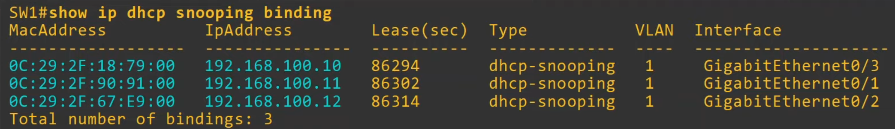
- DAI doesn't inspect messages received on **trusted** ports, they're forwarded as normal
- **ARP ACLs** can be manually configured to map IP addresses/MAC addresses for DAI to check
	- Useful for hosts that don't use DHCP
- DAI can be configured to perform more in-depth checks also, but these are optional
- LIke DHCP snooping, DAI also supports rate-limiting to prevent attackers from overwhelming the switch with ARP messages
	- DHCP snooping and DAI both require work from the switch's CPU
	- Even if the attacker's messages are blocked, they can overload the switch CPU with ARP messages
### DAI Configuration
- `SW1(config)#`
	- `ip arp inspection vlan (vlan-number)`: Enables DAI on a VLAN
- `SW1(config-if)#`
	- `ip arp inspection trust`: Configures the interface as a trusted port
- DHCP snooping requires two commands to enable it:
	- `ip dhcp snooping`
	- `ip dhcp snooping vlan (vlan-number)`
- DAI only requires one
### `show ip arp inspection interfaces`
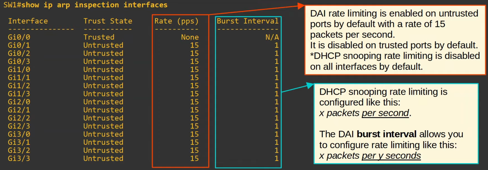
### DAI Rate Limiting
- `SW1(config-if)#`
	- `ip arp inspection limit rate (packets) burst interval (seconds)`: Set the rate limit in *x packets per y seconds*
		- The burst interval is optional
		- If you don't specify it, the default is 1 second
- If ARP messages are received faster than the specified rate, the interface will be err-disabled
- It can be re-enabled in two ways:
	1. `shutdown` and `no shutdown`
	2. `errdisable recovery cause arp-inspection`
### DAI Optional Checks
- `SW1(config)#`
	- `ip arp inspection valida {dst-mac | ip | src-mac}`
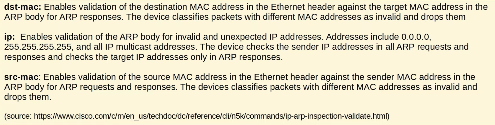
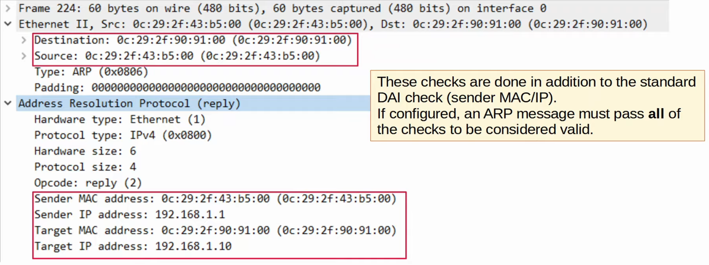
- To enable all three source checks, they must all be entered in a single command rather than three separate ones
	- Doing them separate will result in the last command overwriting the previous ones
	- You can specify one, two, or all three, the order doesn't matter
### ARP ACLs
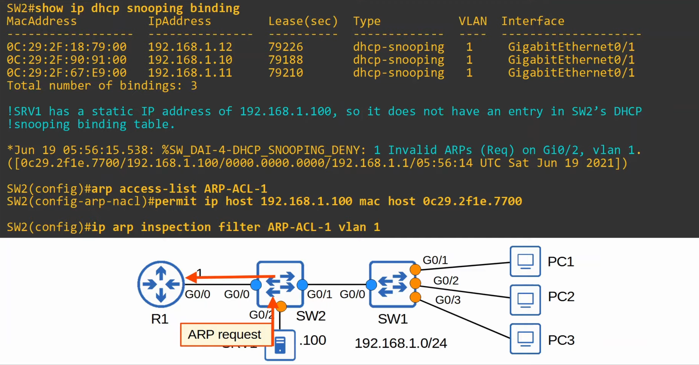
- `show ip arp inspection`: Gives a summary of the DAI configuration as well as stats about how many ARP messages have been forwarded/dropped 
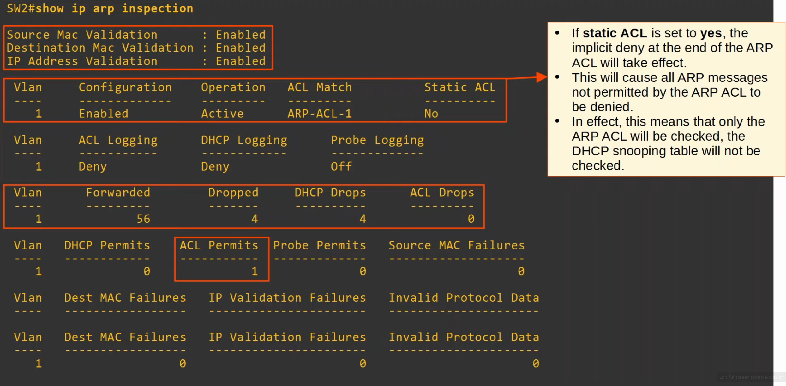
### Command Review
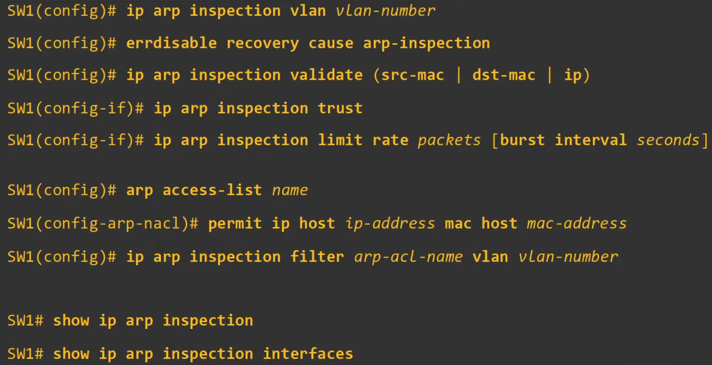