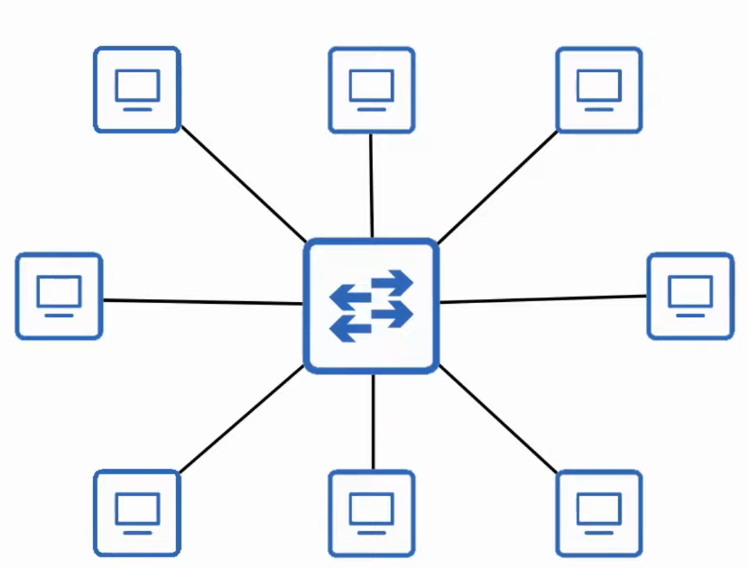
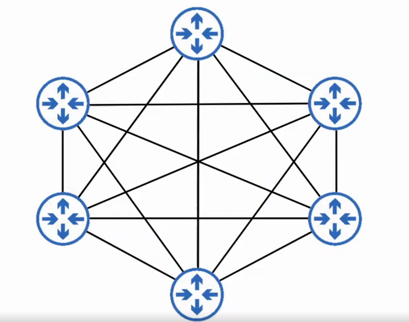
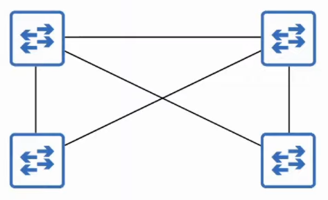
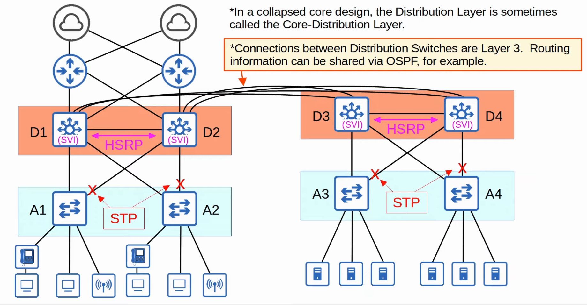
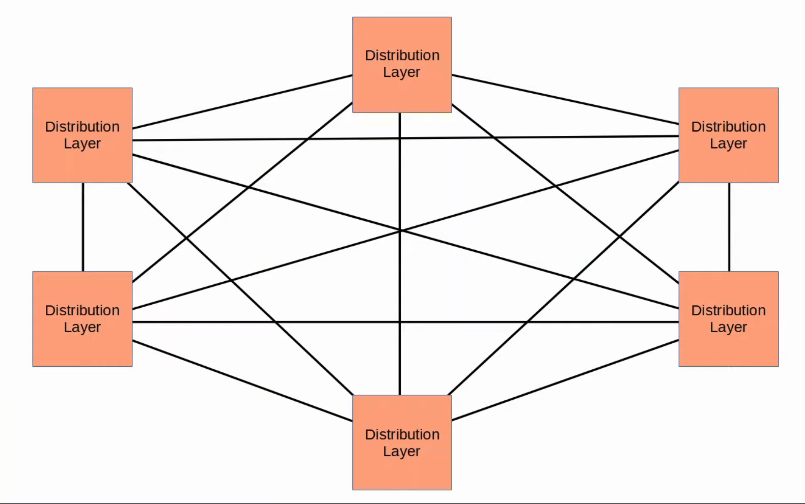
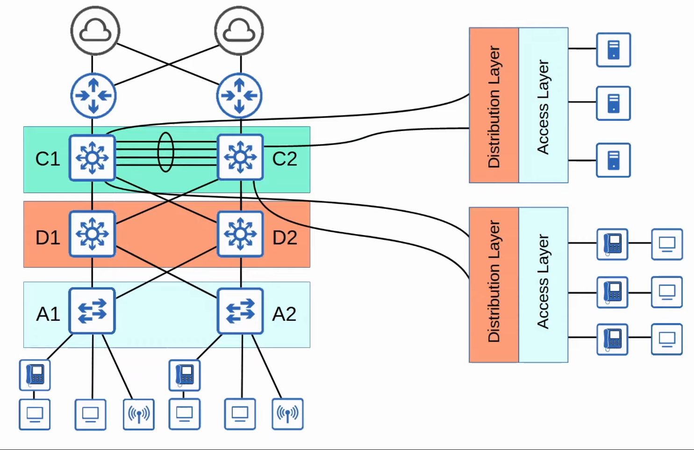
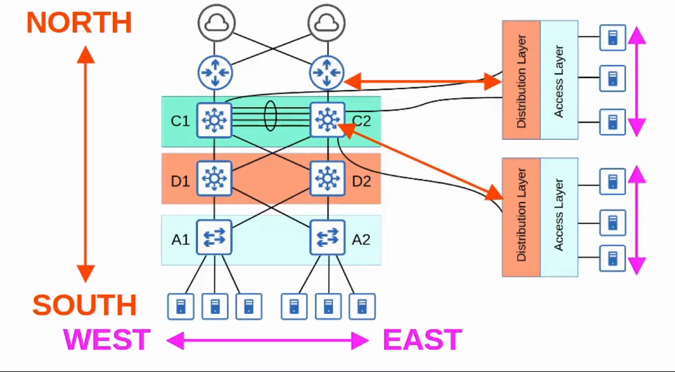
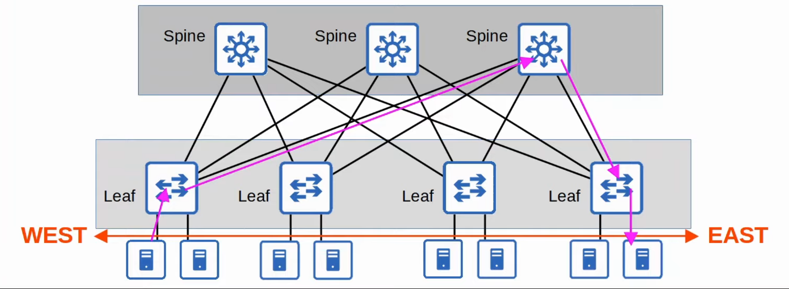

# LAN Architectures
### Things We'll Cover
- 2-tier and 3-tier LAN architecture
- Spine-Leaf Architecture (Data Center)
- SOHO (Small Office/Home Office)
### LAN Architectures
- There are standard 'best practices' for network design
	- However, there are few universal 'correct answers'
	- The answer to most general questions about network design is 'it depends'
### Common Terminologies - Star
- A **star** topology is when several devices all connect to one central device (i.e. switch) and can be drawn in a 'star' shape

### Full Mesh
- When each device is connected to each other device

### Partial Mesh
- When some devices are connected to each other, but not all

### Two-Tier Campus LAN Design
- Consists of two hierarchical layers:
	- **Access Layer**
	- **Distribution Layer**
- Also called a 'collapsed core' design because it omits a layer that is found in the Three Tier design: the **Core Layer**
- **Access Layer:**
	- The layer that ends hosts connect to (PCs, printers, cameras, etc.)
	- typically access layer switches have lots of ports for end hosts to connect to
	- QoS marking is usually done here
	- Security services like port security, DAI, etc. are typically performed here
	- switchports might be PoE-enabled for wireless APs, IP phones, etc.
- **Distribution Layer (or Aggregation Layer):**
	- aggregates connections from the Access Layer Switches
	- typically the border between layer 2 and layer 3 devices
	- connects to services such as Internet, WAN, etc.

- In large LAN networks w/many distribution layer switches (i.e. separate buildings), the number of connections required between switches grows rapidly
- To help scale large LAN networks, you can add a **Core Layer**
	- Cisco recommends adding a Core Layer if there are more than three Distribution Layers in a single location
### Three-Tier Campus LAN Design
- The three-tier LAN design consists of three hierarchical layers:
	 - **Access Layer**
	 - **Distribution Layer**
	 - **Core Layer**
- **Core Layer:***
	- Connects Distribution Layers together in large LAN networks
	- The focus is speed ('fast transport')
	- CPU-intensive operations such as security, QoS marking/classification, etc. should be avoided at this layer
	- Connections are all layer 3, no spanning-tree!
	- Should maintain connectivity throughout the LAN even if devices fail

### Spine-Leaf Architecture
- Traditional data center designs used a three-tier architecture (Access-Distribution-Core) like we just covered
- this worked well when most traffic the data center was North-South

- With the precedence of virtual servers, applications are often deployed in a distributed manner (across multiple physical servers), which increases the amount of East-West traffic in the data center
- The traditional three-tier architecture led to bottlenecks in bandwidth as well as variability in the server-to-server latency depending on the path the traffic takes
- To solve this, Spine-Leaf architecture (or Clos architecture) has become prominent in data centers
### Spine-Leaf Architecture
- Rules:
	- Every Leaf switch is connected to every Spine switch (and vice versa)
	- Leaf switches don't connect to other Leaf switches
	- Spine switches don't connect to other Spine switches
	- End hosts (servers, etc.) only connect to Leaf switches
- The path taken by traffic is randomly chosen to balance the traffic load among the Spine switches
- Each server is separated by the same number of 'hops' (except those connected to the same Leaf), providing consistent latency for East-West traffic

