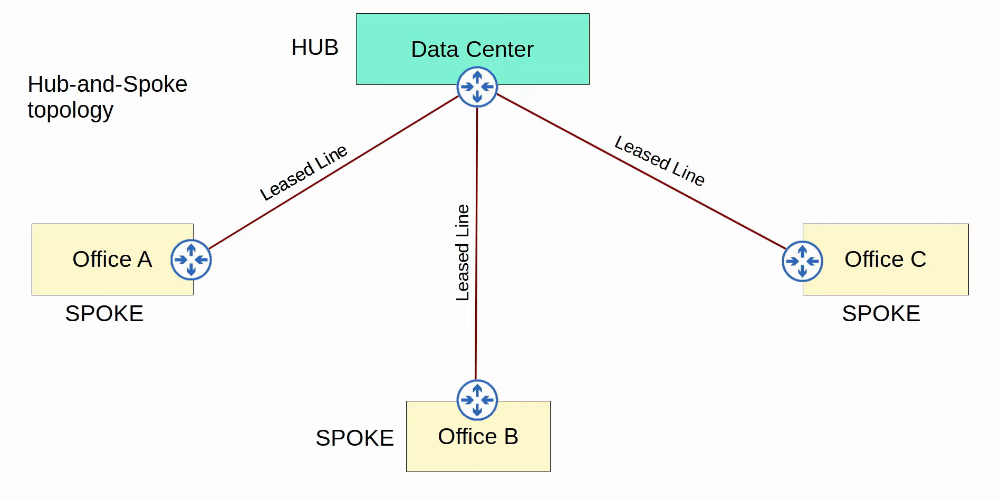
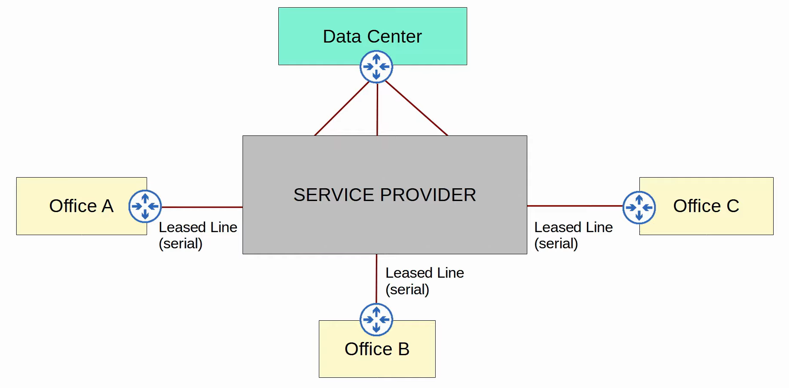
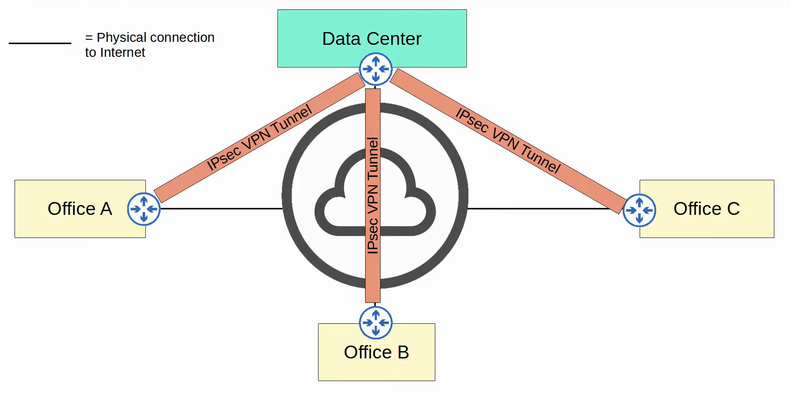
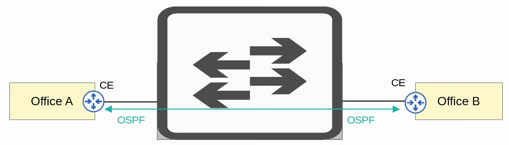
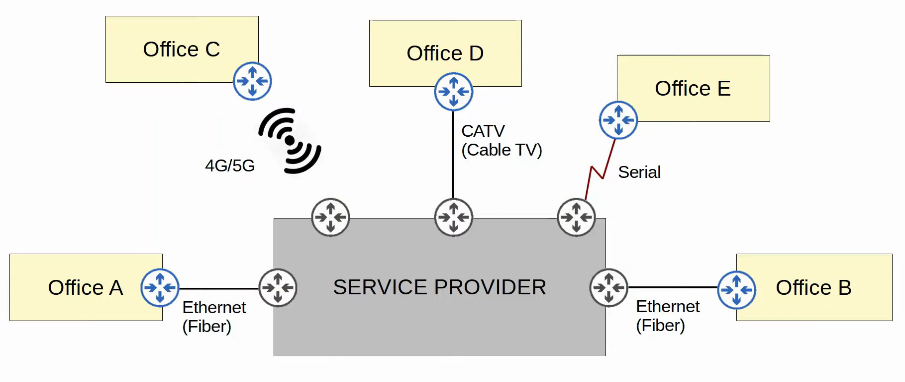
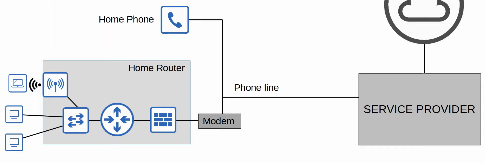
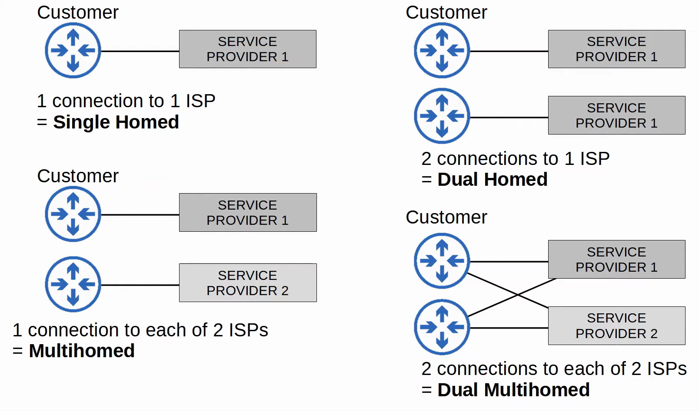
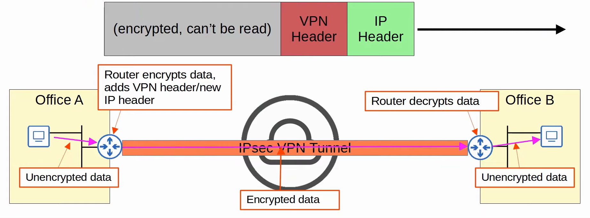
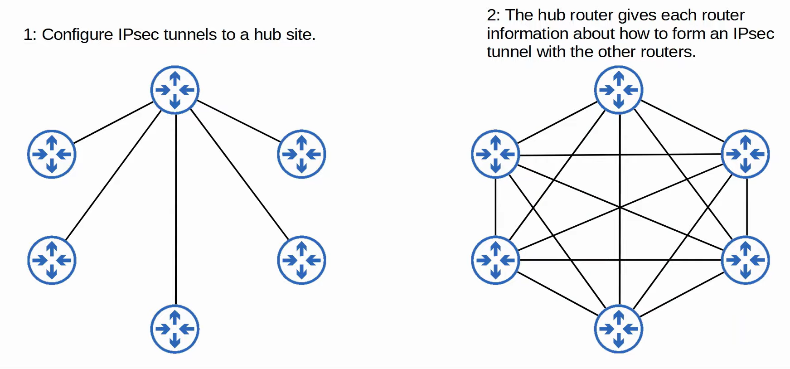

# WAN Architectures
### Things We'll Cover
- Intro to WANs
- Leased Lines
- MPLS VPNs
- Internet connectivity
- Internet VPNs
### Intro to WANs
- WANs are used to connect geographically separate LANs
- Although the Internet itself can be considered a WAN, the term is typically used to refer to an enterprise's private connections that connect their offices, data centers, and other sites together
- Over public/shared networks like the Internet, VPNs can be used to create private WAN connections
- There have been many different WAN technologies over the years
- Depending on the location, some will be available and some won't
- Technologies which are considered 'legacy' in one country might still be used in other countries
### WAN Over Dedicated Connection (Leaded Line)

- ^ isn't a very accurate representation of leased lines, below is:

### Internet VPN

### Leased Lines
- A dedicated physical link, typically connecting two sites
- Leased lines use serial connections (PPP or HDLC encapsulation)
- There are various standards that provide different speeds, and different standards are available in different countries
- Due to the higher cost, higher installation lead time, and slower speeds of leased lines, Ethernet WAN technologies are becoming more popular
### MPLS (Multi Protocol Label Switching)
- Similar to the Internet, service providers' MPLS networks are shared infrastructure because many customer enterprises connect to and share the same infrastructure to make WAN connections
- However, the *label switching* in the name of MPLS allows VPNs to be created over the MPLS infrastructure through the use of **labels**
- Some important terms:
	- **CE (Customer Edge) router**
	- **PE (Provider Edge) router**
	- **P (Provider core) router**
- When the PE routers receive frames from the CE routers, they add a label to the frame
- These labels are used to make forwarding decisions within the service provider network, **not the destination IP**

- The CE routers don't use MPLS, it's only used by the PE/P routers
- When using a *Layer 3 MPLS VPN*, the CE and PE routers peer using OSPF, for example, to share routing information
- For example, in the diagram below, Office A's CE will peer with one PE, and Office B's CE will peer with the other CE
- Office A's CE will learn about Office B's routers via this OSPF peering, and Office B's CE will learn about Office A's routers too

- When using a *Layer 2 MPLS VPN*, the CE and PE routers don't form peerings
- The service provider network is entirely *transparent* to the CE routers
- In effect, it's like two CE routers are directly connected
	- Their WAN interfaces will be in the same subnet
- If a routing protocol is used, the two CE routers will peer directly with each other

- Many different technologies can be used to connect to a service provider's MPLS network for WAN service

### Internet Connections
- There are countless ways for an enterprise to connect to the Internet
- For example, private WAN technologies such as leased lines and MPLS VPNs can be used to connect to a service provider's Internet infrastructure
- In addition, technologies such as CATV and DSL commonly used by consumers can also be used by an Enterprise
### DSL (Digital Subscriber Line)
- Provides internet connectivity to customers over phone lines, and can share the same phone line that is already installed in most homes
- A DSL modem (modulator-demodulator) is required to convert data into a format suitable to be sent over the phone lines

### Cable Internet
- Provides internet access via the same CATV (Cable Television) lines used for TV service
- Like DSL, a cable modem is required to convert data into a format suitable to be sent over the CATV cables
### Redundant Internet Connections

### Internet VPNs
- Private WAN services such as leased lines and MPLS provide security because each customer's traffic is separated by using dedicated physical connection (leased line) or by MPLS tags
- When using the Internet as a WAN to connect sites together, there's no built-in security by default
- To provide secure communications over the Internet, VPNs (Virtual Private Networks) are used
- We'll cover two kinds of Internet VPNs:
	1. Site-to-site VPNs using IPsec
	2. Remote-access VPNs using TLS
### Site-to-Site VPNs (IPsec)
- This is a VPN between two devices and is used to connect two sites together over the Internet
- A VPN 'tunnel' is created between two devices by encapsulating the original IP packet with a VPN header and a new IP header
	- When using IPsec, the original packet is encrypted before being encapsulated with the new header

- Summary of the process:
	1. The sending device combines the original packet and session key (encryption key) and runs them through an encryption formula
	2. The sending device encapsulates the encrypted packet with a VPN header and a new IP header
	3. The sending device sends the new packet to the device on the other side of the tunnel
	4. The receiving device decrypts the data to get the original packet, and then forward the original packet to its destination
- In a 'site-to-site' VPN, a tunnel is formed only between two tunnel endpoints (for example, the two routers connected to the Internet)
- All other devices in each site don't need to create a VPN for themselves
- They can send unencrypted data to their site's router, which will encrypt it and forward it in the tunnel as described above
- There are some limitations to standard IPsec:
	1. IPsec doesn't support broadcast and multicast traffic, only unicast. This means that routing protocols such as OSPF can't be used over the tunnels, because they rely on multicast traffic
		- This can be solved with 'GRE over IPsec'
	2. Configuring a full mesh of tunnels between many sites is a labor-intensive task
		- This can be solved with Cisco's DMVPN
### GRE over IPsec
- **GRE (Generic Routing Encapsulation)** creates tunnels like IPsec, however it does not encrypt the original packet, so it is not secure
- However, it has the advantage of being able to encapsulate a wide variety of Layer 3 protocols as well as broadcast and multicast messages
- To get the flexibility of GRE with the security of IPsec, 'GRE over IPsec' can be used
- The original packet will be encapsulated by a GRE header and a new IP header, and then the GRE packet will be encrypted and encapsulated within an IPsec VPN header and new IP header
### DMVPN (Dynamic Multipoint VPN)
- A Cisco-developed solution that allows routers to dynamically create a full mesh of IPsec tunnels without having to manually configure every single tunnel

- DMVPN provides the configuration simplicity of hub-and-spoke (each spoke router only needs one tunnel configured) and the efficiency of direct spoke-to-spoke communication (spoke routers can communicate directly without traffic passing through the hub)