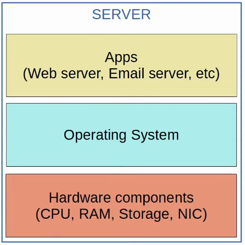
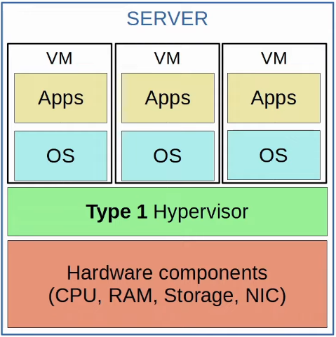
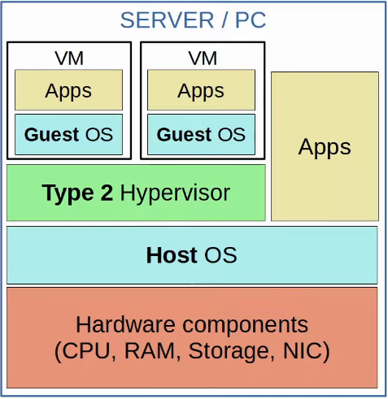
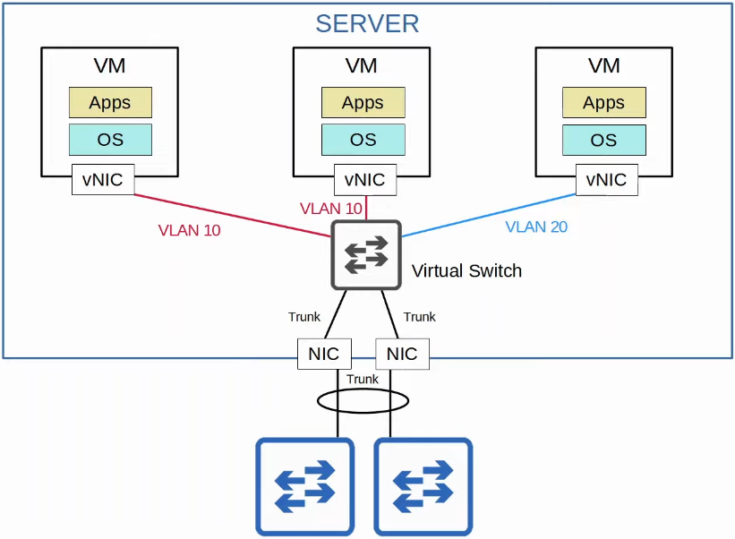
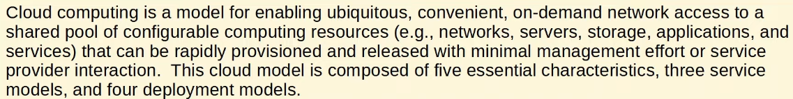
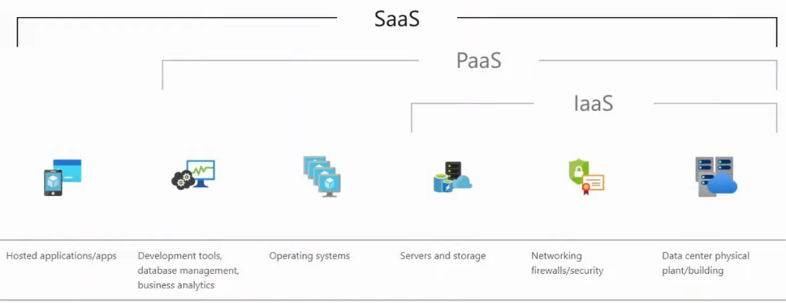
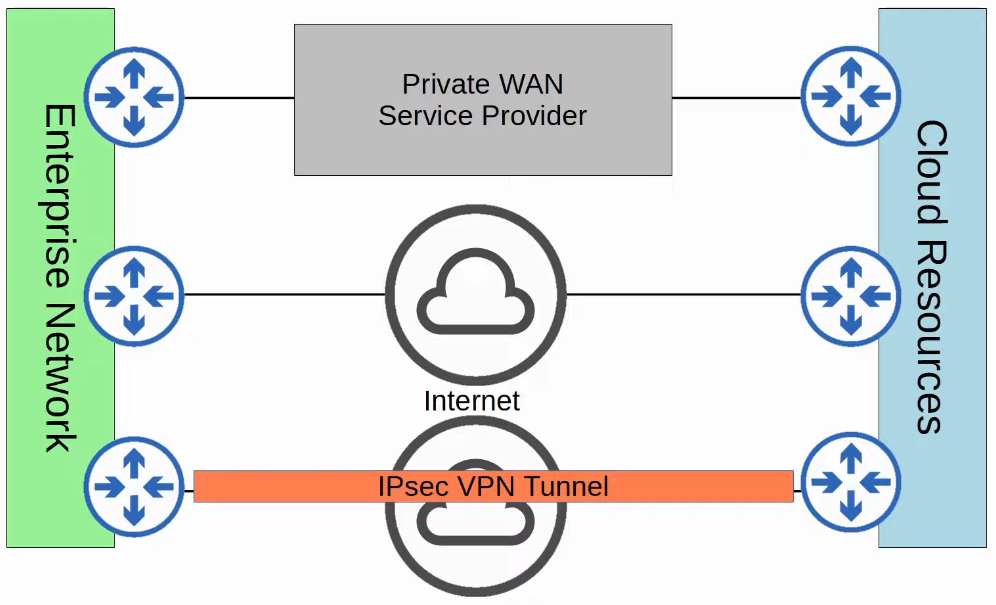

# Virtualization & Cloud
### Things We'll Cover
- Intro to Virtualization
	- Virtual servers/networks
- Intro to Cloud Computing
	- Essential characteristics
	- Service models
	- Deployment models
- Connecting to Public Clouds
### Server Hardware
- Cisco offers hardware servers such as UCS (Unified Computing System)
### Servers Before Virtualization
- Before virtualization, there was a one-to-one relationship between a physical server and an OS
- In that OS, apps providing services such as a web server, email server, etc. would run
- One physical server would be used for the web server, one for the email server, one for the database server, etc.
- This is inefficient for multiple reasons:
	- Each physical server is expensive and takes up space, power, etc.
	- The resources on each physical server (CPU, RAM, Storage, NIC) are typically under-used

### Virtualization (Type 1 Hypervisor)
- Virtualization allows us to break a one-to-one relationship of hardware to OS, allowing multiple OS's to run on a single physical server
- Each instance is called a VM
- A **hypervisor** is used to manage and allocate the hardware resources (CPU, RAM, etc.) to each VM
- Another name for a hypervisor is VMM (Virtual Machine Monitor)
- The type of hypervisor which runs directly on top of the hardware is called a **Type 1** hypervisor
	- i.e. VMware ESXi, Microsoft Hyper-V, etc.
- Type 1 hypervisors are also called *bare-metal hypervisors* because they run directly on the hardware (metal)
	- Another term is *native hypervisor*
- This is the type of hypervisor used in data center environments

### Virtualization (Type 2 Hypervisor)
- **Type 2** hypervisors run as a program on an OS like a regular computer program
	- i.e. VMware Workstation, Oracle VirtualBox, etc.
- The OS running directly on the hardware is called the **Host OS**, and the OS running in a VM is called a **Guest OS**
- Another name for a Type 2 hypervisor is *hosted hypervisor*
- Although Type 2 hypervisors are rarely used in data center environments, they're common on personal-use devices

### Why Virtualization?
- **Partitioning:**
	- Run multiple OS's on one physical machine
	- Divide system resources between VMs
- **Isolation:**
	- Provide fault and security isolation at the hardware level
	- Preserve performance with advanced resource controls
- **Encapsulation:**
	- Save the entire state of a VM to files
	- Move and copy VMs as easily as moving/copying files
- **Hardware Independence:**
	- Provision or migrate any VM to any physical server
### Connecting VMs to the Network
- VMs are connected to each other and the external network via a virtual switch running on the hypervisor
- Just like a regular physical switch, the vSwitch's interface can operate as access or trunk ports and use VLANs to separate the VMs at Layer 2
- Interfaces on the vSwitch connect to the physical NIC(s) of the server to communicate with the external network

### Cloud Services
- Traditional IT infrastructure deployments were some combination of the following:
- **On-Prem**:
	- All servers, network devices, and other infrastructure are located on company property
	- All equipment is purchased and owned by the company using it
	- The company is responsible for the necessary space, power, and cooling
- **Colocation:**
	- Data centers that rent out space for customers to put their infrastructure
	- The data center provides the space, electricity, and cooling
	- The servers, network devices, etc. are still the responsibility of the end customer, although they're not located on the customer's premises
- Cloud services provide an alternative
- Most people associate 'cloud' with public cloud providers such as AWS
	- Although this is the most common use of cloud services, it's not the only one
- NIST defined cloud computing in SP (Special Publication) 800-145
- It's free to read [here](https://csrc.nist.gov/publications/detail/sp/800-145/final)

- To understand what the cloud is, let's look at the following outlined in SP 800-145:
	- Five essential characteristics
	- Three service models
	- Four deployment models
### The Five Essential Characteristics of Cloud
- **On-demand self-service:**
	- The customer is able to use the service (or stop using it) freely (via a web portal) without direct communication to the service provider
- **Broad network access:**
	- The service is available through standard network connections (i.e. the Internet or private WAN connections), and can be accessed through many kinds of devices
- **Resource pooling:**
	- A pool of resources is provided by the service provider, and when a customer requests a service (for example creates a new VM), the resources to fulfill that request are allocated from the shared pool
- **Rapid elasticity:**
	- Customers can quickly expand the services they use in the cloud (i.e. add new VMs, expand storage, etc.) from a pool of resources that appears to be infinite
	- Likewise, they can quickly reduce their services when not needed
- **Measured service:**
	- The cloud service provider measures the customer's usage of cloud resources, and the customer can measure their own use as well
	- Customers are charged based on usage (i.e. X dollars per gigabyte of storage per day)
### The Three Service Models of Cloud
- In cloud computing, everything is provided on a 'service' model
- For example, rather than the end user buying a physical server, mounting it on a rack, installing the hypervisor, creating the VMs, etc., the service provider offers all of this as a service
- There are a variety of services referred to as '__ as a Service' or '_aaS'
- The three service models of cloud computing are:
	- **Software as a Service (SaaS)**
	- **Platform as a Service (PaaS)**
	- **Infrastructure as a Service (IaaS)**

### The Four Deployment Models of Cloud
- Most people assume that 'cloud' means public cloud providers such as AWS, Azure, and GCP
- Although 'Public cloud' is the most common deployment model, it's not the only one
- The four deployment models of cloud computing are:
	- **Private cloud**
		- Generally only used by large enterprises
		- Although the cloud is private, it may be owned by a third party
			- i.e. AWS provides cloud services for the DoD
		- Private clouds may be on/off-prem
			- Many people assume that 'cloud' and 'on-prem' are two different things, but that's not always the case
		- The same kinds of services offered are the same as in public clouds, but the infrastructure is reserved for a single organization
	- **Community cloud**
		- The least common cloud deployment
		- Similar to private cloud, but the infrastructure is reserved for use by only a specific group of organizations
	- **Public cloud**
		- The most common cloud deployment
	- **Hybrid cloud**
		- Any combination of the previous three deployment types
		- For example, a private cloud which can offload to a public cloud when necessary
### Benefits of Cloud computing
- **Cost**
	- CapEx (Capital Expenses) of buying hardware and software, setting up data centers, etc. are reduced or eliminated
- **Global Scale**
	- Cloud services can scale globally at a rapid pace
	- Services can be set up and offered to customers from a geographic location close to them
- **Speed/Agility**
	- Services are provided on demand, and vast amount of resources can be provisioned within minutes
- **Productivity**
	- Cloud services remove the need for many time-consuming tasks such as procuring physical servers, racking them, cabling, installing and updating operating systems, etc.
- **Reliability**
	- Backups in the cloud are very easy to perform
	- Data can be mirrored at multiple sites in different geographic locations to support disaster recovery
### Connecting to Cloud Resources

