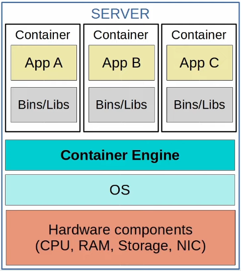

# Virtualization: Containers
### Containers
- Software packages that contain an app and all dependencies (*Bins/Libs* in the diagram) for the contained app to run
	- Multiple apps can be run in a single container, but this isn't how they're normally used
- They run on a **Container Engine** (i.e. Docker Engine)
	- The container engine is run on a host OS (usually Linux)
- They're lightweight (small in size) and include only the dependencies required to run the specific app
- A **Container Orchestrator** is a software platform for automating the deployment, management, scaling, etc. of containers
	- **Kubernetes** (originally designed by Google) is the most popular container orchestrator
	- **Docker Swarm** is Docker's container orchestration tool
- In small numbers, manual operation is possible, but large-scale systems (i.e. w/*Microservices*) can require thousands of containers
- **Microservice Architecture** is an approach to software architecture that divides a larger solution into smaller parts (microservices)
	- Those microservices all run in containers that can be orchestrated by Kubernetes (or another platform)

### VMs vs Containers
- **VMs**:
	- Can take minutes to boot up as each VM runs its own OS
	- Take up more disk space (gigabytes)
	- Use more CPU/RAM resources (each VM must run its own OS)
	- Are portable and can move between physical systems running the same hypervisor
	- Are more isolated because each VM runs its own OS
- **Containers**
	- Can boot up in milliseconds
	- Take up very little disk space (megabytes)
	- Use much fewer CPU/RAM resources (shared OS)
	- Are more portable; they're smaller, faster to boot up, and Docker containers can be run on nearly any container service
	- Are less isolated because they all run on the same OS; if the OS crashes all containers running on it are effected
- There is a major movement toward the use of containers, especially with the rise of microservices, automation, and DevOps (the combination of Software Development and IT Operations), but VMs are still widely used today