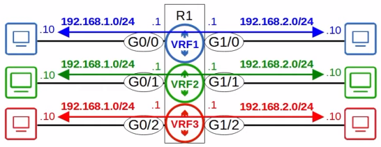
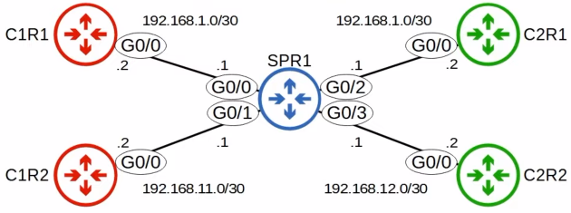
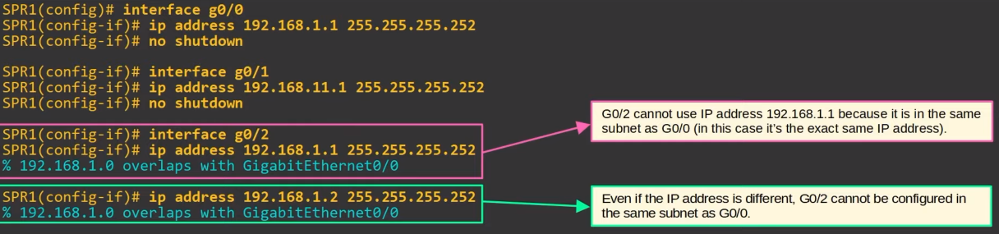
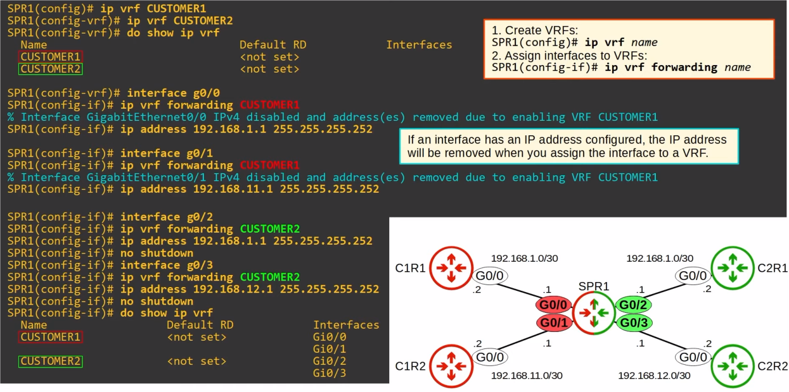

# Virtual Routing & Forwarding
### Things We'll Cover
- Intro to VRF
- VRF Configuration
### VRF
- **Virtual Routing & Forwarding** is used to divide a single router into multiple virtual routers
	- Similar to how VLANs are used to divide a single switch (LAN) into multiple virtual switches (VLANs)
- It does this by allowing a router to build multiple separate routing tables
	- Interfaces (Layer 3 only) & routes are configured to be in a specific **VRF** (aka *VRF Instance)
	- Router interfaces, SVIs & routed ports on multilayer switches can be configured in a VRF
- Traffic in one VRF cannot be forwarded out of an interface in another VRF
	- As an exception, *VRF Leaking* can be configured to allow traffic to pass between VRF's
- VRF is commonly used to facilitate MPLS
	- The kind of CRF we're talking about is **VRF-lite** (VRF w/o MPLS)
- VRF is commonly used by service providers (ISPs) to allow one device to carry traffic from multiple customers
	- Each customer's traffic is isolated from the others
	- Customer IP addresses can overlap without issues

### VRF Configuration

- Without the use of VRF, two interfaces on the same router cannot be in the same subnet

- `show ip route` displays the *global routing table*
	- All of SPR1's interfaces are configured in VRFs, so nothing displays here
	- You can have a mix of interfaces using and not using VRFs
- Instead, we must use the command `show ip route vrf (name)`
- In order to test connectivity, we can't use `ping (ip-address)` as no global routes have been configured
- Instead, we must use `ping vrf (name) (ip-address)`