# Wireless Fundamentals
### Things We'll Cover
- Radio Frequency (RF)
- Wi-Fi Standards
- Wireless LAN Fundamentals
### Wireless Networks
- The standards we use for wireless LANs are defined in IEEE 802.11
- The term **Wi-Fi** is a trademark of the **Wi-Fi Alliance**, not directly connected to the IEEE
- The Wi-Fi Alliance tests and certifies equipment for 802.11 standards, compliance and interoperability with other devices
- Wireless networks have some issues:
	1. All devices within range receive all frames, like devices connected to an Ethernet hub
		- Privacy of data within the LAN is a greater concern
		- **CSMA/CA (Carrier Sense Multiple Access w/Collision Avoidance)** is used to facilitate half-duplex communications
		- **CSMA/CD** is used in wired networks to detect and recover from collisions
		- **CSMA/CA** is used in wireless networks to avoid collisions
		- When using **CSMA/CA**, a device will wait for other devices to stop transmitting before it transmits data itself
			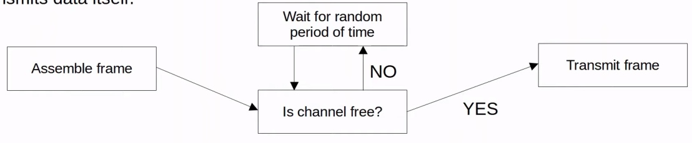
	2. Wireless communications are regulated by various international/national bodies
	3. Wireless signal coverage area must be considered
		- Signal range
		- Signal **absorption**, **reflection**, **refraction**, **diffraction**, and **scattering**
		- **Absorption** happens when a wireless signal passes through a material and is converted into heat, weakening the original signal
		- **Reflection** happens when a signal bounces off of a material (i.e. metal)
			- This is why Wi-Fi reception is usually poor in elevators as the signal bounces off the metal and very little penetrates into the elevator
		- **Refraction** happens when a wave is bent when entering a medium where the signal travels at a different speed
			- For example, glass and water can refract waves
		- **Diffraction** happens when a wave encounters an obstacle and travels around it
			- This can result in 'blind spots' behind the obstacle
			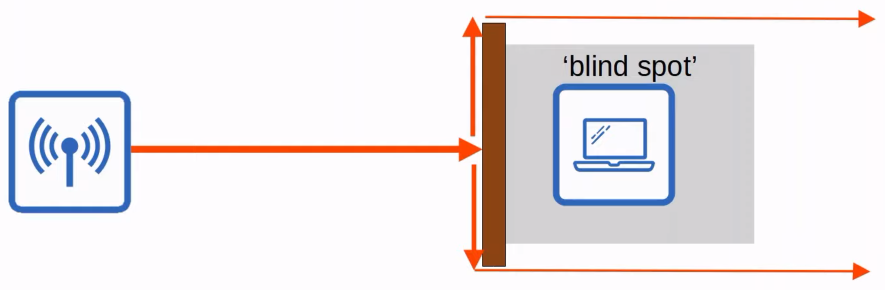
		- **Scattering** happens when a material causes a signal to scatter in all directions
			- Dust, smog, uneven surfaces, etc. can cause this
	4. Other devices using the same channels can cause interference
		- For example, a wireless LAN in your neighbor's house/apartment
### Radio Frequency
- To send wireless signals, the sender applies an alternating current to an antenna
	- This creates electromagnetic fields which propagate out as waves
- Electromagnetic waves can be measured in multiple ways (i.e. **amplitude** and **frequency**)
- **Amplitude** is the max strength of the electric and magnetic fields
- **Frequency** measures the number of up/down cycles per a given unit of time
- The most common measurement of frequency is **hertz**
	- Hz (Hertz) = cycles per second
	- kHz (Kilohertz) = 1,000 cycles per second
	- etc.
- Another important term is **period**, the amount of time of one cycle
	- If the **frequency** is 4 Hz, the **period** is 0.25 seconds
	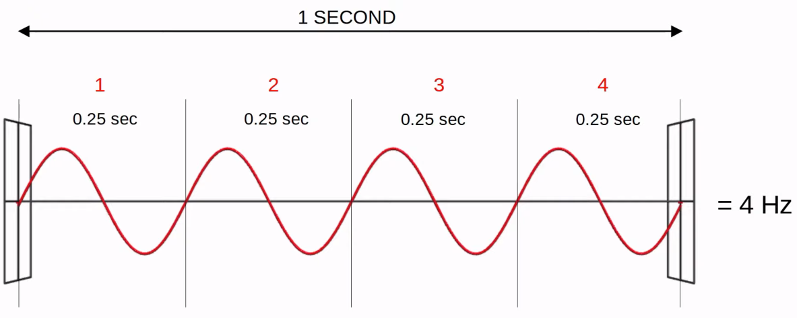
- The visible frequency range is about 400 THz to 790 THz
- The radio frequency range is from 30 Hz to 300 GHz and is used for many purposes
### Radio Frequency Bands
- Wi-Fi uses two main *bands* (frequency ranges)
	- **2.4GHz** and **5 GHz**
- The 2.4 GHz band typically provides further reach in open space and better penetration of obstacles such as walls
	- However, more devices tend to use the 2.4 GHz band, so interference can be a bigger problem compared to the 5 GHz band
- **Wi-Fi 6** (802.11ax) has expanded the spectrum range to include a band in the **6 GHz** range
### Channels
- Each band is divided up into multiple 'channels'
	- Devices are configured to transmit/receive traffic on one (or more) of these channels
- The 2.4 GHz band is divided into several channels, each with a 22 MHz range
- In a small wireless LAN with only a single AP (access point), you can use any channel
- However, in larger WLANs w/multiple APs, it's important that adjacent APs don't use overlapping channels
	- This helps avoid interference
- In the 2.4 GHz band, it's recommended to use channels **1, 6, and 11** as they don't interfere with each other
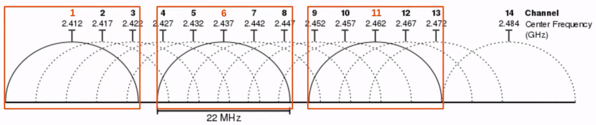
- Outside of North America, you could use other combinations
- For the CCNA exam, however, it's important to remember channels **1, 6, and 11**
- The 5 GHz band consists of non-overlapping channels, so it's much easier to avoid interference between adjacent APs
- Using channels 1, 6, and 11, you can place APs in a 'honeycomb' pattern to provide complete coverage of an area without interference between channels
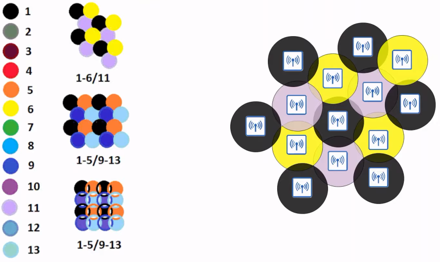
### 802.11 Standards
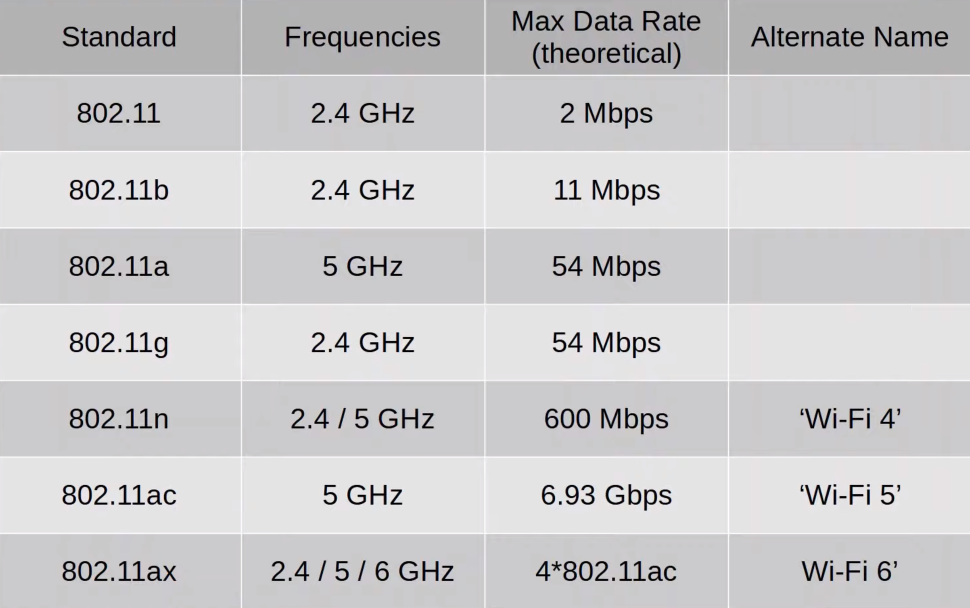
### Service Sets
- 802.11 defines different kinds of **service sets** which are groups of wireless network devices
- There are three main types:
	- Independent
	- Infrastructure
	- Mesh
- All devices in a service set share the same **SSID (service set identifier)**
- The SSID is a human-readable name which identifies the service set
- The SSID does **not** have to be unique
### Service Sets: IBSS
- An **IBSS (Independent Basic Service Set)** is a wireless network in which two or more wireless devices connect directly without using an **AP (Access Point)**
- Also called an **ad hoc** network
- Can be used for file transfer (i.e. AirDrop)
- Not scalable beyond a few devices
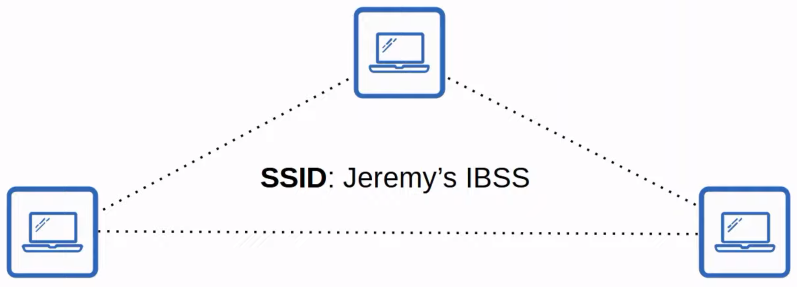
### Service Sets: BSS
- A **BSS (Basic Service Set)** is a kind of Infrastructure Service Set in which clients connect to each other via an **AP**, but not directly to each other
- A **BSSID (Basic Service Set ID)** is used to uniquely identify the AP
	- Other APs can use the same SSID, but not the same BSSID
	- The BSSID is the MAC address of the AP's radio
- Wireless devices request to *associate* with the BSS
- Wireless devices that have associated with the BSS are called 'clients' or 'stations'
- The area around an AP where its signal is usable is called a **BSA (Basic Service Area)**
- Clients must communicate via the AP, not directly with each other
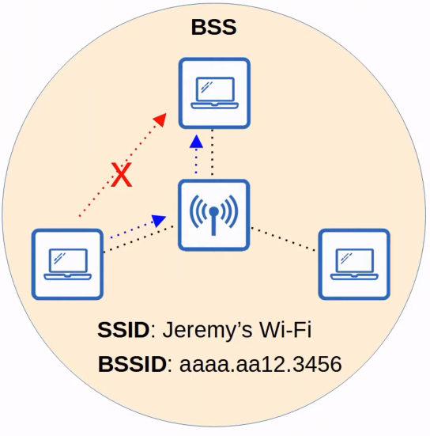
### Service Sets: ESS
- To create larger wireless LANs beyond the range of a single AP, we use an **ESS (Extended Service Set)**
- APs with their own BSSs are connected by a wired network
	- Each BSS uses the same SSID, has a unique BSSID, and uses a different channel to avoid interference
- Clients can pass between APs without having to reconnect, providing seamless Wi-Fi experience when moving between APs
	- This is called **roaming**
- The BSAs should overlap about 10-15%
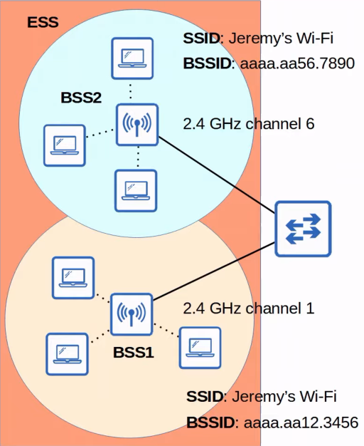
### Service Sets: MBSS
- An **MBSS (Mesh Basic Service Set)** can be used in situations where it's difficult to run an Ethernet connection to every AP
- Mesh APs use two radios: one to provide a BSS to wireless clients, and one to form a 'backhaul network' which is used to bridge traffic from AP to AP
- At least one AP is connected to the wired network, and it's called the **RAP (Root Access Point)**
- The other APs are called **MAPs (Mesh Access Points)**
- A protocol is used to determine the best path through the mesh (similar to how dynamic routing protocols are used to determine the best path to a destination)
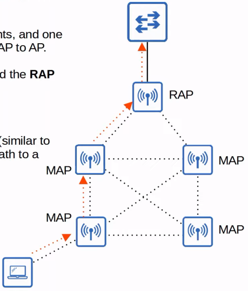
### Distribution System
- Most wireless networks aren't standalone networks
	- Rather, they're a way for clients to connect to the wired network infrastructure
- In 802.11, the upstream wired network is called the **DS (Distribution System)**
- Each wireless BSS or ESS is mapped to a VLAN in the wired network
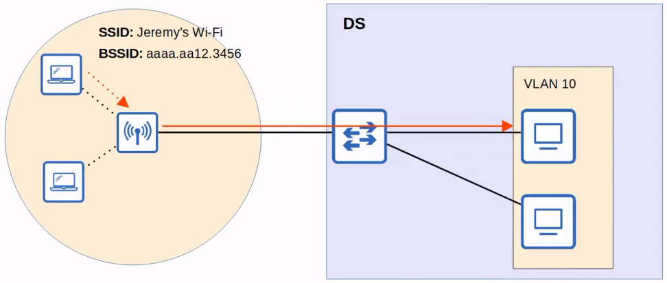
- It's possible for an AP to provide multiple wireless LANs, each with a unique SSID
- Each WLAN is mapped to a separate VLAN and connected to the wired network via a trunk
- Each WLAN uses a unique BSSID, usually by incrementing the last digit of the BSSID by one
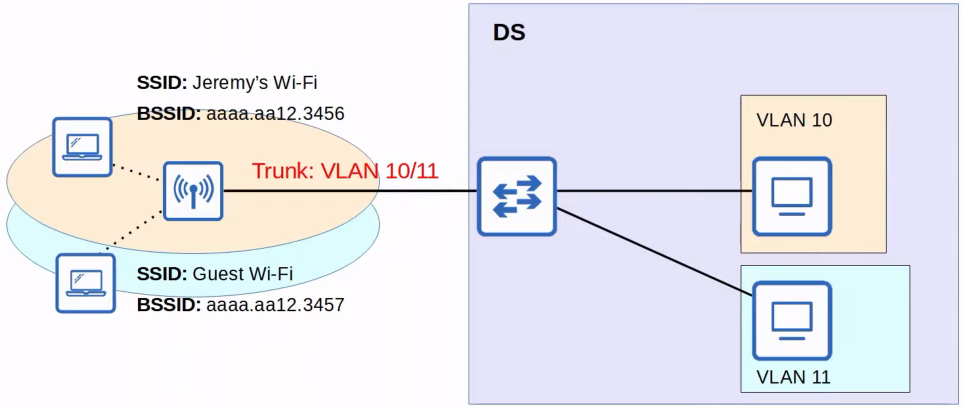
### Additional AP Operational Modes
- An AP in **repeater** mode can be used to extend the range of a BSS
- The repeater will simply retransmit any signal it receives from the AP
	- A repeater with a single radio must operate on the same channel as the AP, but this can drastically reduce the overall throughput on the channel
	- A repeater with two radios can receive on one channel, and then retransmit on another channel
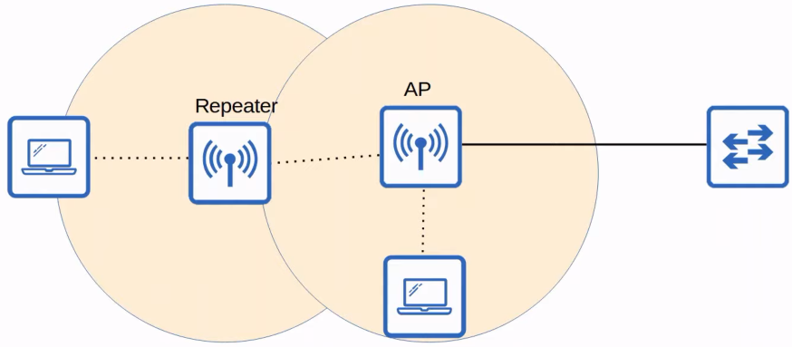
- A **workgroup bridge (WGB)** operates as a wireless client of another AP, and can be used to connect wired devices to the wireless network
- In the example below, PC1 doesn't have wireless capabilities, and also doesn't have access to a wired connection to SW1
- PC1 has a wired connection the WGP, which has a wireless connection to the AP
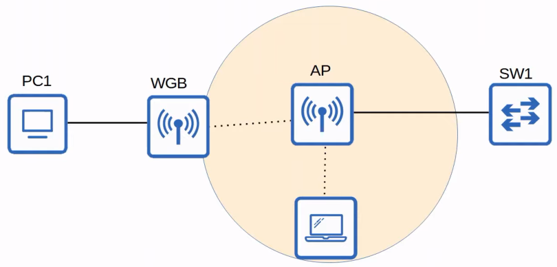
- There are two kinds of WGBs:
	- **Universal WGB (uWGB)** is an 802.11 standard that allows one device to be bridged to the wireless network
	- **WGB** is a Cisco-proprietary version of the 802.11 standard that allows multiple wired clients to be bridged to the wireless network
- An **outdoor bridge** can be used to connect networks over long distances without a physical cable connecting them
- The APs will use specialized antennas that focus most of the signal power in one direction, which allows the wireless connection to be made over longer distances than normally possible
- The connection can be point-to-point as in the diagram below, or point-to-multipoint in which multiple sites connect to one central site
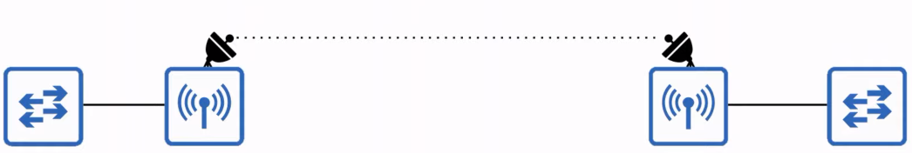
### Review
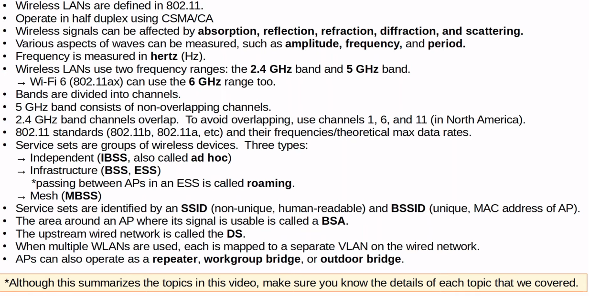