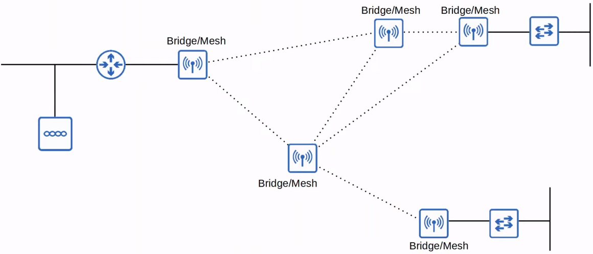

# Wireless Architectures
### Things We'll Cover
- 802.11 messages/frame format
- Autonomous, lightweight, and cloud-based APs
- Wireless LAN controller (WLC) deployments
### 802.11 Frame format

- Depending on the 802.11 version and message type, some of the fields might not be present in the frame
	- i.e. not all messages use all 4 address fields
- **Frame Control:** Provides information such as the message and subtype
- **Duration/ID:** Depending on the message type, this field can indicate:
	- The time (in microseconds) the channel will be dedicated for transmission of the frame
	- An identifier for the association (connection)
- **Addresses:** Up to four addresses can be present in an 802.11 frame. Which addresses are present, and their order, depends on the message type
	- Destination Address (DA): Final recipient of the frame
	- Source Address (SA): Original sender of the frame
	- Receiver Address (RA): Immediate recipient of the frame
	- Transmitter Address (TA): Immediate sender of the frame
- **Sequence Control:** Used to reassemble fragments and eliminate duplicate frames
- **QoS Control:** Used in QoS to prioritize certain traffic
- **HT (High Throughput) Control**: Added in 802.11n to enable High Throughput operations
	- 802.11n is also known as 'High Throughput (HT)' Wi-Fi
	- 802.11ac is also known as 'Very High Throughput' (VHT) Wi-Fi
- **FCS (Frame Check Sequence):** Same as in an Ethernet frame, used to check for errors
### 802.11 Association Process
- For a station to send traffic through the AP, it must be associated with the AP
- There are three 802.11 connection states:
	- Not authenticated, not associated
	- Authenticated, not associated
	- Authenticated and associated
- The station must be authenticated and associated with the AP to send traffic through it

- There are two ways a station can scan for a BSS:
	- **Active scanning:** The station sends probe requests and listens for a probe response from an AP
	- **Passive scanning:** The station listens for **beacon** messages from an AP
		- Beacon messages are sent periodically by APs to advertise the BSS
### 802.11 Message Types
- **Management:** Used to manage the BSS
	- Beacon
	- Probe request, probe response
	- Authentication
	- Association request, association response
- **Control:** Used to control access to the medium (radio frequency), assists with delivery of management and data frames
	- RTS (Request to Send)
	- CTS (Clear to Send)
	- ACK
- **Data:** Used to send actual data packets
### Autonomous APs
- There are three main wireless AP deployment methods:
	- Autonomous
	- Lightweight
	- Cloud-based
- **Autonomous APs** are self-contained systems that don't rely on a WLC
- Autonomous APs are configured individually
	- Can be configured by console cable (CLI), telnet/SSH (CLI), or HTTP/HTTPS web connection (GUI)
	- An IP address for remote management should be configured
	- The RF parameters must be manually configured (transmit power, channel, etc.)
	- Security policies are handled individually by each AP
	- QoS rules, etc. are configured individually on each AP
- There is no central monitoring or management of APs

- They connect to the wired network with a trunk link
- Data traffic from wireless clients has a very direct path to the wired network or to other wireless clients associated with the same AP
- Each VLAN has to stretch across the entire network, this is considered bad practice
	- Large broadcast domains
	- Spanning tree will disable links
	- Adding/deleting VLANs is very labor-intensive
- Autonomous APs can be used in small networks, but they're not viable in medium-large networks
	- Large networks can have thousands of APs
- They can also function in the modes covered in [Day 55 - Wireless Fundamentals](Day%2055%20-%20Wireless%20Fundamentals.md): Repeater, Outdoor Bridge, Workgroup Bridge
### Lightweight APs
- The functions of an AP can be split between the AP and a **Wireless LAN Controller (WLC)**
- **Lightweight APs** handle 'real-time' operations like transmitting/receiving RF traffic, encryption/decryption of traffic, sending out beacons/probes, etc.
- Other functions are carried out by a WLC, for example RF management, security/QoS management, client authentication, client association/roaming management, etc.
- This is called **split-MAC architecture**
- The WLC Is also used to centrally configure the lightweight APs
- It can be located in the same subnet/VLAN as the lightweight APs it manages, or in a different subnet/VLAN
- The WLC and the lightweight APs authenticate each other using digital certificates installed on each device (X.509 standard certificates)
	- This ensures that only authorized APs can join the network

- The WLC and lightweight APs use a protocol called CAPWAP (Control and Provisioning of Wireless Access Points) to communicate
	- Based on an older protocol called LWAPP (Lightweight Access Point Protocol)
- Two tunnels are created between each AP and the WLC:
	- **Control tunnel (UDP port 5246)**
		- This tunnel is used to configure the APs and control/manage the operations
		- All traffic in this tunnel is encrypted by default
	- **Data tunnel (UDP port 5247)**
		- All traffic from wireless clients is sent through this tunnel to the WLC
		- **It does not go directly to the wired network**
		- Traffic in this tunnel is not encrypted by default, but you can configure to be encrypted with DTLS (Datagram Transport Layer Security)
- Because all traffic from wireless clients is tunneled to the WLC with CAPWAP, APs connect to switch access ports, not trunk ports
### Lightweight APs / Autonomous APs

### Lightweight APs
- There are some key benefits to split-MAC architecture, here are a few:
	- **Scalability:** With a WLC (or multiple in very large networks) it's much simpler to build and support a network with thousands of APs
	- **Dynamic channel assignment:** The WLC can automatically select which channel each AP should use
	- **Transmit Power Optimization:** The WLC can automatically set the appropriate transmit power for each AP
	- **Self-healing wireless coverage:** When an AP stops functioning, the WLC can increase the transmit power for nearby APs to avoid coverage holes
	- **Seamless roaming:** Clients can roam between APs with no noticeable delay
	- **Client load balancing:** If a client is in range of two APs, the WLC can associate the client with the least-used AP, to balance the load among APs
	- **Security/QoS management:** Central management of security and QoS policies ensures consistency across the network
- Lightweight APs can be configured to operate in various modes:
	- **Local:** This is the default mode where the AP offers a BSS (or multiple BSSs) for clients to associate with
	- **FlexConnect:** Also offers one or more BSSs, however, it allows the AP to locally switch traffic between the wired and wireless networks if the tunnels to the WLC go down
		
	- The following four modes **do not** offer a BSS for clients
	- **Sniffer:**
		- It's dedicated to capturing 802.11 frames and sending them to a device running software such as Wireshark
	- **Monitor:**
		- It listens to traffic on the wired network only, but it receives a list of suspected rogue clients and AP MAC addresses from the WLC
		- By listening to ARP messages on the wired network and correlating it with the information it receives from the WLC, it can detect rogue devices
	- **Rogue Detector:**
		- The AP doesn't even use its radio
		- It listens to traffic on the wired network only, but it receives a list of suspected rogue clients and AP MAC addresses from the WLC
		- By listening to ARP messages on the wired network and correlating it with the information it receives from the WLC, it can detect rogue devices
	- **SE-Connect (Spectrum Expert Connect):**
		- It's dedicated to RF spectrum analysis on all channels
		- It can send information to software such as Cisco Spectrum Expert on a PC to collect and analyze the data
	- **Bridge/Mesh:**
		- Like the autonomous AP's *Outdoor Bridge* mode, the lightweight AP can be a dedicated bridge between sites, even over long distances
		- A mesh can be made between the access points
			
			
	- **Flex plus Bridge:**
		- Adds FlexConnect functionality to the Bridge/Mesh mode
		- Allows wireless access points to locally forward traffic even if connectivity to the WLC is lost
### Cloud-Based APs
- **Cloud-Based AP** architecture is in between autonomous AP and split-MAC architecture
	- Autonomous APs that are centrally managed in the cloud
- Cisco Meraki is a popular cloud-based Wi-Fi solution
- The Meraki dashboard can be used to configure APs, monitor the network, generate performance reports, etc.
	- Meraki also tells each AP which channel to use, what transmit power, etc.
- However, data traffic is not sent to the cloud, it's sent directly to the wired network like when using autonomous APs
	- Only management/control traffic is sent to the cloud

### WLC Deployments
- In a split-MAC architecture, there are four main WLC deployment models:
	- **Unified:** The WLC is a hardware appliance in a central location of the network
		- Supports up to 6000 APs
		
	- **Cloud-based:** The WLC is a VM running on a server, usually in a private cloud in a date center (**not the same as cloud-based AP architecture**)
		- Supports up to 3000 APs
		
	- **Embedded:** The WLC is integrated within a switch
		- Supports up to 200 APs
		
	- **Mobility Express:** The WLC is integrated within an AP
		- Supports up to 100 APs
		